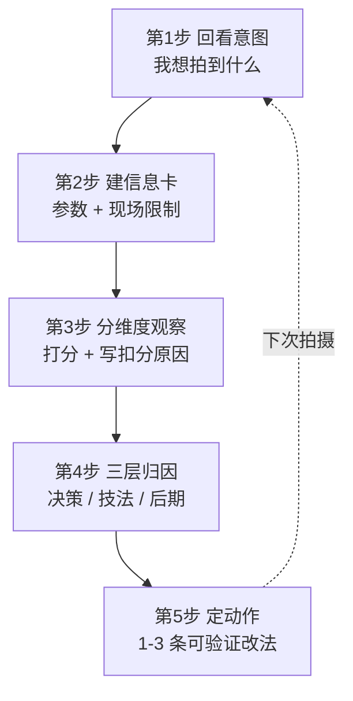
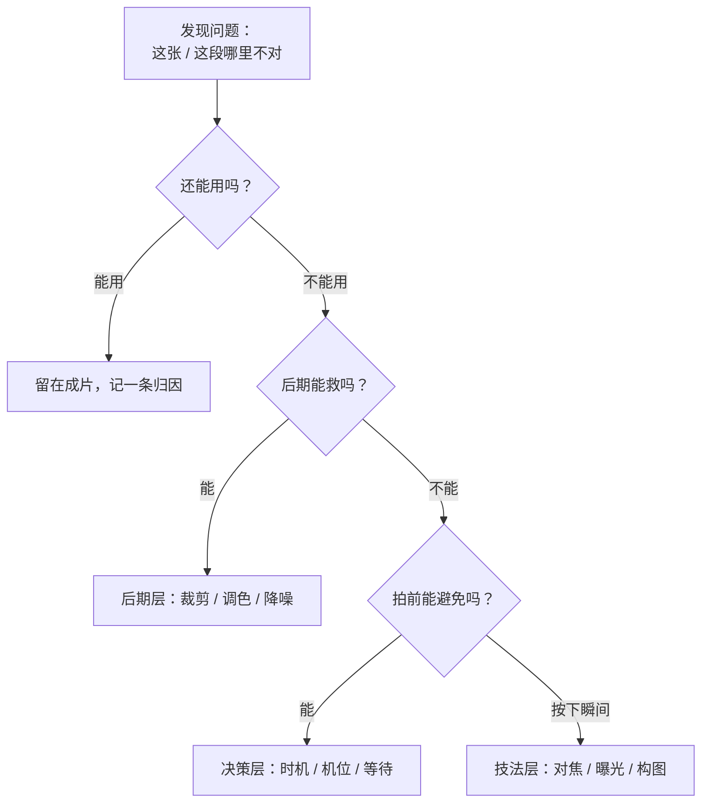

# 复盘方法论

> 复盘不是"挑毛病"，也不是"写日记"——它是一套把"这次哪里不行"变成"下次具体怎么改"的方法。本篇给框架（五步闭环 + 三层归因）和可复制模板，[摄影复盘](摄影复盘.md) / [视频复盘](视频复盘.md) 两篇负责把框架落到具体量表上。

> 一句话：**没有"回看意图"的复盘等于挑刺，没有"定动作"的复盘等于写日记。**

## 为什么复盘

很多人拍完看一眼就存硬盘，问题永远停在"感觉不太对"。复盘的价值是把这种模糊的不对，拆成可行动的三件事：哪层出的问题、具体机制是什么、下次怎么避免。它和教程是互补关系——教程教"应该怎么拍"，复盘检验"实际拍成了什么"。

## 五步闭环



| 步 | 做什么 | 产出 | 耗时 |
| --- | --- | --- | --- |
| 1 回看意图 | 我按下快门前想拍到什么 | 一句话意图 | ≤1 分钟 |
| 2 建信息卡 | 客观参数 + 现场限制 | 信息卡表 | ≤2 分钟 |
| 3 分维度观察 | 按量表打分并**写出扣分原因** | 评分 + 短评 | 3–5 分钟 |
| 4 三层归因 | 每个短板归到决策层/技法层/后期层 | 归因表 | 15–20 分钟 |
| 5 定动作 | 1–3 条**可验证**的下次动作 | 动作清单 | — |

> 第 1 步和第 5 步是很多人会跳过的：没有意图，你不知道"拍成了没有"；没有动作，复盘停在感慨。

## 三层归因

同一句"构图不好"，落到不同层，改法完全不同。本框架强制把结论拆到可行动层级：

| 层 | 发生在 | 典型归因 | 改法落点 |
| --- | --- | --- | --- |
| **决策层**（拍前） | 选题/时机/机位/等待/预判 | 来错时间、没走近、没等那朵云 | 只能下次重拍改 → 写进选题清单 |
| **技法层**（按下瞬间） | 构图/曝光/对焦/景深/白平衡/光位 | 对焦点跑了、快门不足 | 技法页可查 → 写进拍前自查 |
| **后期层**（出片） | 裁剪/调色/锐化/降噪/导出 | 对比不够、白平衡偏 | 可当场补救 |

**归因写作规则（坏 → 好）**：

| 无效结论 | 有效归因 |
| --- | --- |
| "构图不好" | "背景右侧路灯与主体头部重叠，拍前没做减法 → 决策层：下次先绕一圈看背景" |
| "曝光不准" | "点测光点在天空，人脸欠曝约 2 档 → 技法层：人像改用面部点测 + 锁曝" |
| "不够锐" | "1/60s 手持 85mm，安全快门不足 → 技法层：快门提到 1/125s 或开防抖" |
| "调色脏" | "直接套 LUT 跳过一级还原 → 后期层：先还原再风格" |

> 合格归因三要素：**指得出具体位置**（画面哪里 / 时间轴哪一秒）＋ **说得出机制** ＋ **归得到层级**。少一条都算没归因。



## 量表怎么打

- **扣分必须能写一句原因**，写不出原因的项不扣分——这是为了避免"凭感觉扣两分"。
- **分数只在"同一题材 + 同一时期"的自己作品之间可比**。横向比别人的分没意义，你是在追踪自己的进步。
- 具体维度与权重在摄影复盘 / 视频复盘两篇，本篇只给通用规则。

## 模板与归档

空模板（复制到你的笔记，按次填写）：

```
【拍摄意图】一句话：我想表达 / 想拍到什么
【信息卡】编号 / 日期时段 / 题材 / 器材 / 参数 / 光线 / 现场限制
【评分】按复盘页量表逐项打分，每项写一句扣分原因
【归因】每个短板 → 决策 / 技法 / 后期 哪层 + 机制
【唯一动作】下次最该改的 1 条（要可验证）
【验证】下次怎么确认这条改了
```

**存放两段式**：

- 现阶段（<3 篇）：在摄影复盘 / 视频复盘页尾 `## 我的复盘` 下按日期倒序追加。
- 攒够 3 篇后：新建 `作品复盘/复盘档案/`，每篇一个 `YYYY-MM-DD-题材.md`，配图放 `_media/作品复盘/`。

## 自查清单

- 自查：是否回了意图？是否每项都写了扣分原因？归因是否归到了层？动作是否可验证？
- 常见误区：只打分发感慨（缺第 5 步）；归因停在"构图不好"（没拆层）；拿自己跟别人比分数。
