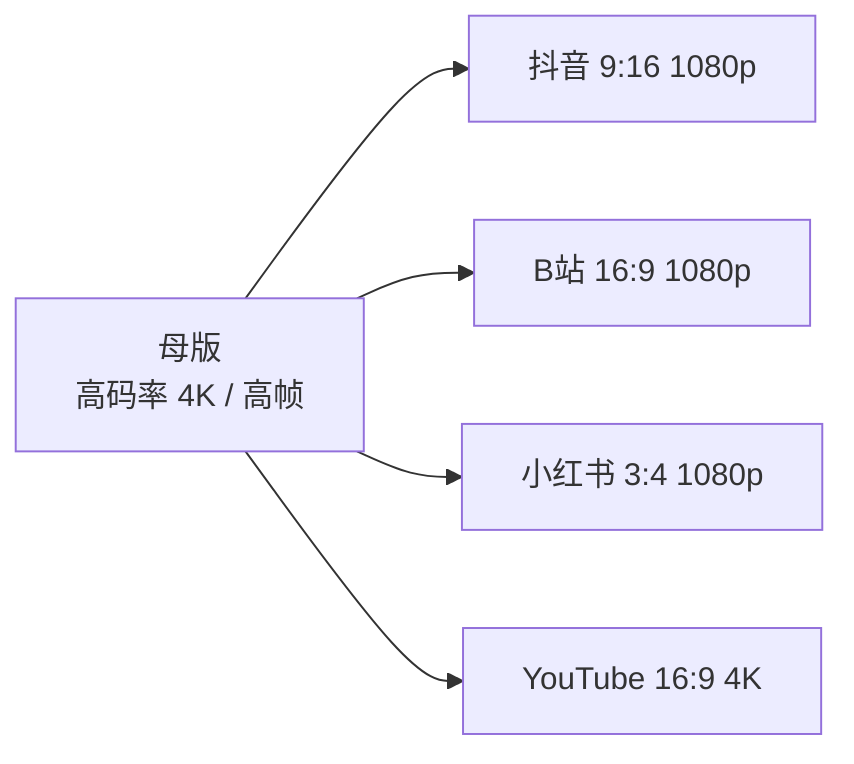

# 母版与交付规格

> 本篇讲"成片文件层面怎么定、怎么从一份母版派生各平台版本、交付前查什么"。**不讲**响度与编码原理（在 [声音设计](/contents/摄像/影视制作/声音设计.md)）、**不列**各平台具体参数（在 [平台规格速查](平台规格速查.md)）——这里是"查什么、怎么派生"的操作层。

## 参数怎么定

原则是**匹配源 + 留冗余**：以你的拍摄源为准，再给平台推荐区间的上沿留点余量（平台都会二次转码，给太低先糊）。

### 分辨率

匹配拍摄源，别硬升也别硬降。源是 1080p 就别硬上 4K（没有细节可补）；源是 4K 可下变换给要求 1080p 的平台，但**留 4K 母版**给 YouTube 这类吃分辨率的平台。

### 帧率

与源保持一致（24 / 25 / 30 / 60）。慢动作素材保持高帧率，导出时再决定要不要保留高帧（如 60 转 30 会丢流畅感）。

### 码率

匹配源 + 留冗余。给平台推荐区间的**上沿**，平台转码会再压一轮；码率过低会先出现块化/边缘糊。具体区间看平台规格速查。

### 编码与容器

- **H.264 + MP4**：最通用，兼容性最好，默认选它。
- **H.265 / HEVC**：同画质体积更小，但老旧设备解码吃力，非必要不首发。
- **WebM（VP9 / AV1）**：仅部分平台（如 YouTube）更友好，通用性差。
- 容器 **MP4** 兼容性优于 MOV / MKV，交付优先 MP4。

## 母版与派生

### 为什么先出高码率母版

平台都会二次转码，母版是"源"——后续所有版本都从它派生，**改一个平台不用重剪时间线**。母版宁大勿小：分辨率/码率取你能给的上限。

### 从母版派生各平台版本

按比例裁切 / 缩放、按平台码率重编码、加平台专属封面与标题。竖屏平台用 9:16 母版派生，横屏用 16:9——**构图时预留"安全中心区"**，方便后期裁切不丢主体。

### 命名与归档

- 母版：`YYYYMMDD-项目名-master-4K.mp4`
- 派生：`项目名-抖音-1080p.mp4` / `项目名-b站-1080p.mp4`
- 归档在本地 + 云盘，**母版不删**——它是你这份内容的唯一可靠源。

## 音频与响度

只给**判据**（原理与混音在声音设计）：

- 人声对白响度：**-14 ~ -16 LUFS**（短视频/播客常用 -14，长视频偏 -16）。
- 真峰 **≤ -1 dBTP**，防破音。
- 背景音乐别压过人声，人声是信息主线。

> 拿不准就先按 -14 LUFS 对白、-1 dBTP 封顶，上线后回 [数据分析](/contents/自媒体运营/数据分析.md) 看完播是否因听感问题下跌。

## 字幕与安全区

- **烧录 vs 外挂**：烧录（硬字幕）全平台兼容，但改字幕要重导；外挂（软字幕）灵活，部分平台不支持。竖屏平台多烧录。
- **字幕安全区**：字幕放在画面**下 1/3 内**，避开底部 UI 遮挡（竖屏底部约 270px、右侧约 120px 常被遮，详见 [封面标题与SEO](封面标题与SEO.md) 的安全区图）。
- **首帧与封面帧**：首帧别黑场 / Loading；封面帧从成片挑最有信息量的一帧，别用片头 Logo 帧。

## 交付前检查

- [ ] 比例 / 分辨率对目标平台
- [ ] 码率在上沿、无肉眼压缩痕
- [ ] 响度达标、人声清楚、无爆音
- [ ] 字幕在安全区、无错别字
- [ ] 首帧干净、封面帧已挑
- [ ] 文件名按命名规范
- [ ] 母版已归档、未误删

## 自查清单

- 自查：母版留了吗？派生是从母版还是重剪？响度查了吗？字幕在安全区吗？
- 常见误区：直接发时间线导出的"预览片"；竖屏字幕贴底被遮；只导一个版本硬套所有平台。
