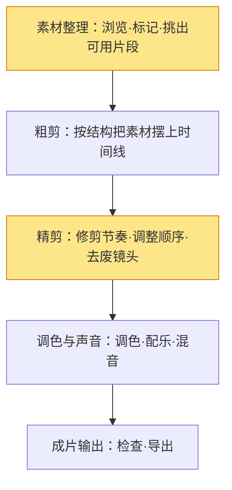

# 剪辑与调色

> 剪辑与调色是把「一堆素材」变成「一支成片」的环节。剪辑解决**结构**——讲什么、按什么顺序、什么节奏；调色解决**观感**——画面的明暗、色彩、氛围。两者是"先有骨头（结构），再有皮肉（观感）"的关系：**先剪出能看的故事，再调出想要的风格**。

> 如果说《拍摄》是"把素材拍回来"，这篇是"把素材用起来"。剪辑是最典型的"**做减法**"工作——拍回来的素材 10 倍于成片长度，你的核心能力是决定"留什么、删什么"。

## 剪辑认知

| 维度 | 解决什么 | 手段 |
| --- | --- | --- |
| 结构 | 故事怎么讲 | 叙事结构、场次排序 |
| 节奏 | 观众情绪的呼吸 | 剪辑点、镜头时长 |
| 连贯 | 不跳、不穿帮 | 匹配剪辑、动作衔接 |
| 观感 | 画面好不好看 | 调色、转场、特效 |

> 一句话：**剪辑是"重新拍一遍"**——用现有素材，在时间线上重新讲一个更好的故事。

#### 叙事结构：三幕与短视频

| 类型 | 结构 | 适用 |
| --- | --- | --- |
| 传统三幕 | 开端（建置）→ 中段（冲突）→ 结尾（解决） | 剧情、长视频 |
| 短视频钩子式 | 开头 3 秒钩子 → 中间递进 → 结尾记忆点 | 短视频、口播 |
| 说明文式 | 问题 → 方法 → 结果 | 教程、干货 |
| Vlog 流水式 | 时间线 + 情绪高点穿插 | 生活记录 |

> 提示：无论哪种结构，剪辑师都要回答同一个问题——**"观众为什么要继续看？"** 每个剪辑点都是对这个问题的回答。

#### 节奏：镜头的呼吸

| 节奏 | 镜头时长 | 情绪 |
| --- | --- | --- |
| 快（快剪） | 1-3 秒/镜头 | 紧张、兴奋、急促 |
| 中 | 3-6 秒/镜头 | 自然叙事 |
| 慢 | 6 秒+/镜头 | 抒情、沉重、留白 |

> 一句话：**节奏跟着情绪走**——高潮处快剪，抒情处留长。全程一个节奏 = 观众麻木。

## 剪辑与调色实操

标准流程分四步，别跳步：

> 一句话：**先粗后精，先画面后声音，最后才导出**。粗剪阶段别抠细节，先让故事"能跑起来"。

#### 素材整理

| 动作 | 做法 | 目的 |
| --- | --- | --- |
| 浏览 | 把素材全部过一遍 | 心里有数 |
| 标记 | 好的片段打标（星标/颜色） | 精剪时快速定位 |
| 分类 | 按场景/机位建文件夹 | 找素材不迷路 |

> 提示：**整理素材花的时间，会在精剪阶段加倍还回来**。偷懒不整理，精剪时反复翻素材才是真浪费时间。

#### 剪辑软件基础：时间线与轨道

剪辑软件（如剪映、Premiere、达芬奇）的操作核心是**时间线**——一条横轴，上面叠着若干「轨道」：

| 轨道类型 | 放什么 | 说明 |
| --- | --- | --- |
| 视频轨（V1/V2…） | 画面素材、转场 | 上下叠放可做画中画、叠加 |
| 音频轨（A1/A2…） | 对白、音乐、音效 | 声音分轨，混音用（见《声音设计》） |
| 字幕轨 | 文字、标题 | 独立轨道方便统一调整 |

> 提示：新手最常见的操作误区是**把视频和音频堆在同一条轨道上**——想单独调声音时无从下手。素材一进来，第一件事就是**把画面放视频轨、把声音放音频轨**。

#### 粗剪

- 按叙事结构，把挑好的素材**按顺序摆上时间线**；
- 先不管节奏细节，**只保证故事完整**：有开头、有结尾、能看懂；
- 标记明显的废镜头，删掉或放一边。

#### 精剪

粗剪确定"讲什么"，精剪确定"怎么讲好"：

- **修剪节奏**：每个镜头多留少删，找最舒服的剪辑点；
- **调整顺序**：如果某段不顺，大胆挪动、尝试换位置；
- **去废**：删掉重复、拖沓、无信息量的镜头；
- **衔接**：用匹配剪辑（上一个镜头的动作接下一个镜头的动作）、J/L 剪辑（声音先入/后出）让转场自然。

> 提示：精剪是剪辑里**最花时间、也最见功力**的一步。好剪辑师和普通剪辑师的差距，全在这一步。

##### 衔接技巧：J/L 剪辑与匹配剪辑

剪辑点是否"顺"，取决于你处理**声音和画面谁先谁后**：

| 技巧 | 做法 | 效果 |
| --- | --- | --- |
| J 剪辑 | 下一个镜头的声音**先入**，画面后切 | 对话衔接自然，像"话还没说完画面就换了" |
| L 剪辑 | 上一个镜头的声音**延续**，画面先切 | 情绪延续，常用在反应镜头 |
| 匹配剪辑 | 上一个镜头的动作/形状/构图，接下一个相似元素 | 转场"无痕"，高级感 |

> 一句话：**剪辑点别"声画同切"**——要么声音先走（J），要么声音留后（L），观众会感觉更连贯。这是新手最容易忽略、却能立刻提升观感的技巧。

##### 实战案例：一支 3 分钟 Vlog 的完整剪辑

| 步骤 | 做什么 | 产出 |
| --- | --- | --- |
| 1 整理 | 40 分钟素材过一遍，星标 8 个"情绪高点"片段 | 候选清单 |
| 2 搭结构 | 按"出发 → 到达 → 高潮 → 结尾"四段摆上时间线 | 粗剪 4 分钟 |
| 3 精剪 | 每段砍到最精，砍掉废话和重复，4 分钟 → 3 分钟 | 精剪 3 分钟 |
| 4 衔接 | 转场处用 J/L 剪辑，情绪段落用匹配剪辑 | 转场自然 |
| 5 调色 | 先一级还原（曝光/白平衡统一），再套一个"日系清新"倾向 | 风格统一 |
| 6 声音 | 环境声垫底、背景音乐压低、关键处加音效（详见《声音设计》） | 有层次 |
| 7 导出 | 响度 -14 LUFS、分辨率按平台、回看一遍再导出 | 成片 |

> 提示：**"砍掉 25%"是剪辑的及格线**——如果一支 40 分钟素材的片子剪完还是 40 分钟，说明你还没开始"做减法"。

调色分两层，别混为一谈：

| 层级 | 做什么 | 目的 |
| --- | --- | --- |
| 一级调色（还原） | 白平衡、曝光、对比、饱和度归位 | 让画面"正常"、统一 |
| 二级调色（风格） | 局部调色、色彩倾向、风格 LUT | 让画面"有味道" |

> 一句话：**先还原，再风格**。跳过还原直接套风格 LUT，画面会脏、肤色会假。

#### 常见调色风格

| 风格 | 特点 | 适合 |
| --- | --- | --- |
| 自然还原 | 接近现场、肤色自然 | 教程、记录、口播 |
| 电影感 | 低饱和、青橙色调、暗部微灰 | 剧情、情绪片 |
| 日系清新 | 高调、偏亮、低对比、微青 | 生活、治愈 |
| 纪实黑白 | 去色、强对比 | 纪实、艺术表达 |

> 提示：调色的依据是**情绪**，不是"流行"——先问"这个画面该是什么感觉"，再选风格。

## 转场

| 转场 | 用法 | 注意 |
| --- | --- | --- |
| 硬切 | 默认、干净 | 大多数镜头用硬切就够 |
| 叠化 | 时间流逝、回忆、抒情 | 别滥用，会拖节奏 |
| 匹配转场 | 动作/形状匹配接下一个镜头 | 高级、自然 |
| 特效转场（旋转/缩放等） | 风格化、娱乐向 | 短视频常用，慎用于严肃内容 |

> 一句话：**转场是"为什么切换"的答案**。没有理由的转场 = 炫技，观众看多了会腻。

## 自查与误区

- [ ] 结构：故事完整吗？有开头、有推进、有结尾？
- [ ] 开头：前 3 秒能否抓住观众？
- [ ] 节奏：情绪高潮处是否快剪？抒情处是否留长？
- [ ] 去废：有没有可删的重复/拖沓镜头？
- [ ] 衔接：转场是否自然？有没有跳接/穿帮？
- [ ] 声音：配乐音量合适吗？对白清楚吗？
- [ ] 调色：先还原后风格？肤色自然吗？统一吗？

- **误区一：素材不整理直接剪。** 找素材的时间比剪辑还长。
- **误区二：粗剪就抠细节。** 故事还没立起来就磨节奏，返工。
- **误区三：调色直接套 LUT。** 跳过还原套风格，画面脏、肤色假。
- **误区四：转场花里胡哨。** 没有理由的转场 = 炫技，硬切最稳。
- **误区五：舍不得删。** 拍的都想要，结果节奏拖沓——剪辑的核心是删。

> 调色的审美依据从哪来：方法论 [色彩理论](/contents/自媒体运营/方法论/色彩理论.md)
