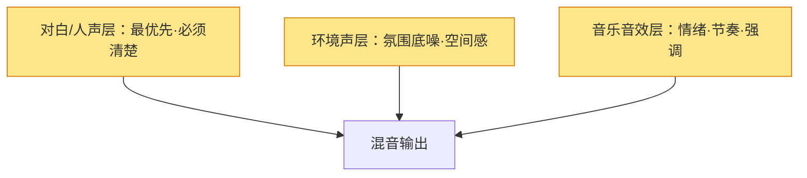
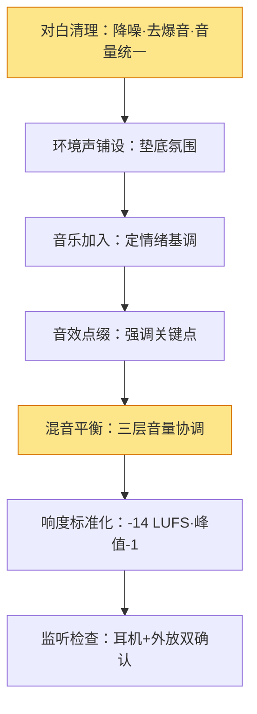

# 声音设计

> 声音设计是视频制作里**最被低估、却最能拉开质感差距**的一环。观众可以忍受一般的画面，但无法忍受糟糕的声音——刺耳的底噪、忽大忽小的音量、爆音，会瞬间劝退。声音设计解决三件事：**录清楚（前端）、混平衡（中端）、做出氛围（后端）**。

> 如果说《拍摄》里的"收音"是"把声音录下来"，这篇是"把声音做成作品"——它包含混音（音量平衡）、响度（标准音量）、音效与音乐（情绪层）。**画面是骨架，声音是血肉**。

## 基础与结构
### 声音在解决什么

| 层 | 解决什么 | 手段 |
| --- | --- | --- |
| 清晰 | 对白/人声清楚、不爆音 | 收音质量（见《拍摄》） |
| 平衡 | 各声音音量协调 | 混音：对白/环境/音乐分层 |
| 标准 | 全平台音量统一 | 响度标准化 |
| 氛围 | 情绪、空间感 | 音乐、音效、环境声 |

> 一句话：**声音设计 = 让观众"听得清、听得舒服、听得进去"**。三层递进，缺一不可。

### 声音的三层结构

一条合格的声音轨道，通常由三层组成：

> 一句话：**人声是主角，环境是配角，音乐是情绪**。混音就是给这三层排好"谁大谁小"。

| 层 | 作用 | 常见问题 |
| --- | --- | --- |
| 对白 | 信息主体，必须最清晰 | 音量不够、底噪大 |
| 环境声 | 空间感、真实感 | 被完全删掉，画面"发干" |
| 音乐/音效 | 情绪、节奏 | 音量压过人声 |

## 混音与响度
### 混音：三层怎么平衡

#### 音量参考（听感判断）

| 层 | 相对人声 | 说明 |
| --- | --- | --- |
| 对白 | 0 dB（基准） | 永远最清楚 |
| 环境声 | -20 ~ -30 dB | 隐约可闻，不抢戏 |
| 音乐 | -15 ~ -25 dB | 说话时压低，停顿处可起 |
| 音效 | 依场景 | 强调时短促清晰 |

> 提示：混音的通用口诀——**"人声优先，环境垫底，音乐让路"**。拿不准时，先把人声调到舒服，再加别的。

#### 常见混音问题与解法

| 问题 | 原因 | 解法 |
| --- | --- | --- |
| 人声太小 | 收音远/增益低 | 提高人声增益，或补录音 |
| 底噪明显 | 环境噪音/增益过高 | 降噪插件（但别削过头，会"水声"） |
| 爆音 | 录的时候增益过大 | 无解，只能重录（所以监听很重要） |
| 音乐盖人声 | 音乐音量过高 | 压低音乐，或人声处做"闪避"（ducking） |
| 忽大忽小 | 音量没统一 | 音量自动匹配/手动包络 |

#### 对白清理实操（三步）

对白是声音的"主角"，混音前先把对白轨道清理干净：

| 步骤 | 做什么 | 注意 |
| --- | --- | --- |
| 1 降噪 | 选中纯底噪片段采样，降噪插件去底噪 | 降噪强度别超过 60-70%，过头出"水声" |
| 2 去爆音 | 找到爆音点，压低或削掉 | 小爆音可修，大爆音只能重录 |
| 3 音量统一 | 用"音量自动匹配"把每句话拉齐 | 忽大忽小最劝退，比底噪还明显 |

> 一句话：**先采样降噪 → 再查爆音 → 最后统一音量**。三步做完，对白基本就"能听"了——剩下的是和音乐、环境的平衡。

### 响度：全平台统一的音量标准

不同平台（B 站/抖音/YouTube）的播放音量标准不同，但统一做法是**响度标准化**：

| 标准 | 目标值 | 说明 |
| --- | --- | --- |
| 在线视频（LUFS） | -14 ~ -16 LUFS | 短视频/长视频通用 |
| 电视/广播 | -23 LUFS（EBU R128） | 广电标准 |
| 峰值 | ≤ -1 dBTP | 防止爆音 |

> 提示：剪辑软件的"响度标准化"功能（如 "Normalize to -14 LUFS"）一键搞定，**导出前必做**——否则在手机外放和耳机里音量差异巨大。

## 音乐、音效与流程
### 音乐与音效：情绪层

| 类型 | 作用 | 来源注意 |
| --- | --- | --- |
| 背景音乐 | 情绪基调、节奏 | 用免版权曲库（见《常用工具链接》） |
| 音效（SFX） | 强调动作/转场 | 轻点鼠标声、风声等，别乱堆 |
| 环境声 | 空间真实感 | 城市/室内/户外各一段备用 |

> 提示：**音乐是双刃剑**——配好了是情绪放大器，配不好是"廉价感制造机"。新手原则：**宁少勿多，宁低勿高**。

#### 音乐怎么选：先定情绪，再找曲子

别"试听"几十首凭感觉挑，先定情绪再筛选，效率翻倍：

| 想要的氛围 | 音乐特征 | 适合 |
| --- | --- | --- |
| 温馨治愈 | 原声吉他/钢琴、中速、小调 | Vlog、日常 |
| 紧张悬念 | 低音持续、鼓点渐密 | 剧情铺垫 |
| 轻快节奏 | 律动强、BPM 100+ | 快剪、运动、美食 |
| 史诗宏大 | 弦乐、渐强推进 | 风光、开场 |
| 安静留白 | 极简、几乎无旋律 | 情感段落、收尾 |

> 一句话：**先回答"这段要什么情绪"，再搜"对应情绪的曲风"**——比"好听就放"靠谱得多。放完记得问一句：这段音乐是在"托情绪"还是在"抢戏"？

### 声音设计流程

把声音做到成片里，按固定顺序：

> 一句话：**先清人声，再铺环境，后加音乐音效，最后统一音量**。顺序别反——先做加法再做平衡，容易白调。

#### 实战案例：一段 60 秒口播的完整混音

| 步骤 | 做什么 | 音量参考 |
| --- | --- | --- |
| 1 对白清理 | 采样底噪降噪、去爆音、音量自动匹配 | 人声基准 0 dB |
| 2 铺环境声 | 加一段极轻的室内环境声（原声轨道） | -25 dB 左右 |
| 3 加音乐 | 选"轻快节奏"曲风，从开头铺到结尾 | -20 dB 起步 |
| 4 闪避 | 音乐轨加"闪避"：人声说话时自动压到 -28 dB | 说话时让路 |
| 5 音效点缀 | 关键转场/强调处加 2-3 个轻音效 | 短促清晰 |
| 6 响度标准化 | 整条导出前 Normalize 到 -14 LUFS | 全平台一致 |
| 7 双端监听 | 耳机 + 手机外放各听一遍 | 无爆音、人声清楚 |

> 提示：注意第 4 步「闪避」——它是"音乐不压人声"的自动化解法：人声一响音乐自动退，人声一停音乐回来，全程不用手动调音量。

## 自查清单
### 声音设计自查清单

- [ ] 对白清楚吗？无爆音、无过重底噪？
- [ ] 人声是全场最清晰的层吗？
- [ ] 环境声还在吗（没被删干）？音量合适吗？
- [ ] 音乐音量压人声了吗？说话处是否自动压低？
- [ ] 响度是否标准化（-14 LUFS 左右）？峰值不超 -1 dBTP？
- [ ] 耳机和外放各听一遍，音量一致、无爆音？

### 常见误区

- **误区一：环境声是噪音，删掉。** 环境声是空间感来源，删光画面"发干"。
- **误区二：音乐越大越有氛围。** 音乐盖人声 = 观众听不清在说什么，先保人声。
- **误区三：忽略响度标准化。** 导出的片子手机外放小得听不清，观众划走。
- **误区四：降噪拉到满。** 削过头出现"水声/金属声"，比底噪更难受。
- **误区五：音效乱堆。** 每个转场都配"嗖嗖"声，廉价感拉满——音效是点缀不是装饰。

> 麦克风类型、指向性与选型：[麦克风与收音设备](/contents/设备/选型方法/麦克风与收音设备.md)
