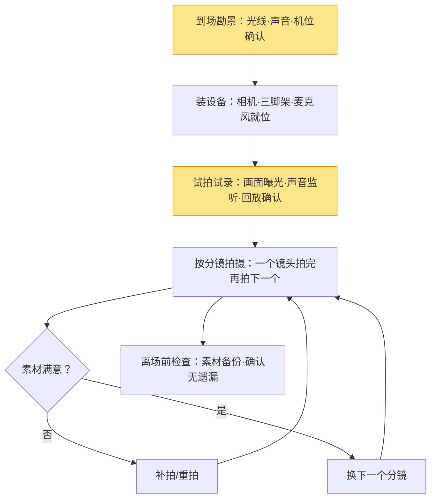

# 拍摄

> 拍摄是把「分镜表」变成「真实素材」的现场执行环节。它解决两件事：**把画面拍对（曝光、对焦、构图）** 和 **把声音录好（收音）**。它大量复用摄影板块的知识——构图、用光、对焦、曝光三要素在这里全部适用，只是多了「时间」这个维度：镜头会动、人会在画面里表演、声音必须同期录。

> 如果说《前期策划》是"画图纸"，这篇是"施工"。**现场唯一的敌人是混乱**——本文给你一套"到现场先做什么、按什么顺序拍"的固定流程。

## 一、拍摄在解决什么

| 维度 | 解决什么 | 对应知识 |
| --- | --- | --- |
| 画面 | 曝光正确、对焦清晰、构图成立 | 摄影板块（构图/用光/对焦/曝光） |
| 参数 | 帧率、快门、码率等视频特有设置 | 本文"视频参数"节 |
| 运动 | 机位怎么动、镜头怎么运动 | 本文"镜头运动"节 |
| 声音 | 同期声录清楚、不爆音 | 本文"收音"节 + 《声音设计》 |
| 流程 | 现场不慌、不遗漏 | 本文"现场流程"节 |

> 一句话：**拍摄 = 画面 × 参数 × 声音 × 流程**。四条腿缺一条，后期都会很痛苦。

## 二、画面基础：复用摄影知识

拍摄的「单帧画面」和拍照本质相同，三条铁律直接沿用：

- **曝光**：先看直方图，优先保主体（人脸/产品）不过曝不欠曝（《曝光三要素》）。
- **对焦**：拍人锁眼睛，拍物锁关键面；运动镜头优先用连续对焦（《对焦与景深》）。
- **构图**：三分法、引导线、留白，全部适用；但视频构图还要留「运动空间」——人物行走方向前方要留空（《构图》）。

> 提示：视频和照片最大的构图区别是**「视线空间」和「运动空间」**——人物面向/走向的方向必须留出余量，否则观感"撞墙"。

## 三、视频参数：帧率、快门与码率

视频比照片多了三个"时间维度"的参数，设置错了后期很难救：

### 帧率：每秒多少帧

| 帧率 | 观感 | 适合 |
| --- | --- | --- |
| 24fps | 电影感、自然 | 剧情、记录、有叙事感的片子 |
| 30fps | 电视感、流畅 | 口播、教程、日常 Vlog |
| 60fps+ | 丝滑、可慢放 | 运动、升格慢动作 |

> 一句话：**默认 30fps，拍叙事用 24fps，要慢放才用 60fps**。后期想慢放但前期没拍高帧率，画面就会"卡帧"——这是最容易忽视的前期决策。

### 快门：180° 法则

视频快门有个经典法则——**快门速度 = 1/（帧率 × 2）**，即"180° 快门角"：

| 帧率 | 快门应设 | 效果 |
| --- | --- | --- |
| 24fps | 1/50s | 运动模糊自然，符合人眼 |
| 30fps | 1/60s | 同上 |
| 60fps | 1/120s | 同上 |

> 提示：快门设太快（如 1/1000s）视频会有"果冻感/抽帧感"，运动不连贯；这是新手最常犯的参数错误。**曝光不够就加光/开大光圈/提 ISO，别用快门硬扛**（快门被 180° 法则锁住了）。

### 码率与格式

- **码率**：越高画质越好、文件越大。手机/电脑观看 4K 用 50-100Mbps 足够。
- **格式**：拍 LOG 灰片（如 S-Log、C-Log）动态范围更大，但必须后期调色（见《剪辑与调色》）；不想调色就拍直出风格。
- **帧率一致性**：同一支片子**不要混用 24 和 60fps**，转场会不连贯。

## 四、镜头语言：景别与机位

视频叙事靠「镜头语言」：不同景别、不同机位，传达不同信息。

### 景别：用"距离"讲故事

| 景别 | 拍到什么 | 传达什么 |
| --- | --- | --- |
| 远景 | 环境 + 小人 | 交代地点、氛围 |
| 全景 | 全身 + 环境 | 交代人物与环境关系 |
| 中景 | 腰部以上 | 叙事主力，说话/动作 |
| 近景 | 胸部以上 | 情绪、表情 |
| 特写 | 脸/局部 | 强烈情绪、关键细节 |

> 一句话：**景别越近，情绪越强，信息越窄**。剪辑时"远景开场 → 近景推进"是最常用的情绪递进。

### 机位角度

| 角度 | 效果 | 典型用法 |
| --- | --- | --- |
| 平视 | 客观、平等 | 采访、日常 |
| 仰拍 | 高大、压迫感 | 英雄、建筑 |
| 俯拍 | 渺小、掌控感 | 孤独、命运 |
| 过肩 | 带关系、带现场 | 对话场景 |

## 五、镜头运动

静止画面加上运动，叙事力立刻不同：

| 运动 | 怎么做 | 效果 |
| --- | --- | --- |
| 推（zoom in / dolly in） | 焦距拉近或机位前移 | 聚焦、强调、逼近 |
| 拉（zoom out / dolly out） | 焦距拉远或机位后退 | 揭示环境、拉开距离 |
| 摇（pan） | 机身水平转动 | 扫视环境、跟随运动 |
| 移（tilt） | 机身垂直转动 | 从下到上/从上到下揭示 |
| 跟（tracking） | 机位跟随主体移动 | 沉浸感、代入感 |
| 手持（handheld） | 轻微晃动 | 纪实感、紧张感 |

> 提示：新手最容易翻车的是**"为了动而动"**——每个镜头都想推拉摇移，结果观众晕。**一个镜头只表达一个意思**，运动要"有理由"。

### 稳定器与三脚架怎么选

| 场景 | 用什么 | 为什么 |
| --- | --- | --- |
| 固定镜头/采访 | 三脚架 | 稳、省力、可长时间 |
| 跟拍/移动 | 稳定器 | 平滑跟拍 |
| 纪实/快速切换 | 手持 | 灵活、真实感（适当晃动可接受） |
| 长镜头/延时 | 三脚架 | 必须固定 |

## 六、给画面打光：视频版三点布光

视频打光和摄影同源（原理见《用光》），但有个额外约束——**视频是连续画面，光必须稳定**（照片可以用 1/200s 凝固瞬间，视频的光一抖观众就看得出）。

### 视频打光入门三灯

| 灯位 | 作用 | 视频里的注意 |
| --- | --- | --- |
| 主光 | 定基调、照亮主体 | 45° 侧前方，灯位要固定 |
| 补光/反光板 | 填暗部、降反差 | 用反光板免费，比再开一盏灯省事 |
| 轮廓光 | 勾边、分离背景 | 逆光位，注意别打穿（镜头炫光） |

> 一句话：**视频布光先求"稳"再求"美"**——光的位置、色温定了就别动，中途挪灯会导致同场景两段画面颜色不一致。

### 常见补光设备怎么选

| 设备 | 适合 | 注意 |
| --- | --- | --- |
| LED 常亮灯 | 口播、Vlog | 可调色温的最实用 |
| 环形灯 | 美妆、近景 | 眼神光好看，但拍正面会很平 |
| 反光板 | 自然光补光 | 免费、轻便，户外神器 |
| 窗光+纱帘 | 居家 | 免费柔光箱，白天够用 |

## 七、收音：拍摄现场的隐藏主角

画面再好，声音废了，成片就废了。现场收音三大原则：

1. **能录同期声就不后期补**：后期配音/拟音既费时又不自然。
2. **离声源越近越好**：麦克风距离是音质第一变量——领夹麦贴人，机头麦靠近说话者。
3. **录之前先监听**：戴耳机听 10 秒，确认没有爆音、底噪、电流声，再正式拍。

> 提示：**爆音（clipping）是现场唯一救不回来的声音问题**——画面曝光过了后期能拉回，声音爆了就是废的。监听耳机是拍摄现场的必需品。

| 收音方式 | 适合 | 注意 |
| --- | --- | --- |
| 机头麦 | 自拍、Vlog | 距离远音质差，尽量靠近 |
| 领夹麦 | 采访、口播 | 注意衣服摩擦声 |
| 枪式麦（挑杆） | 对话、剧情 | 需要专人举杆 |
| 外接录音机 | 高要求 | 记得开录、对时码 |

### 双机位收音的小技巧

拍摄对话/采访，最好**一人一个领夹麦、分别录到两轨**，后期混音时两轨独立调节——比单麦录两个人清楚得多（混音见《声音设计》）。

## 八、现场流程

按固定顺序执行，避免手忙脚乱：

> 一句话：**先试后拍，按镜推进，离场备份**。试拍试录花 10 分钟，能省后期 10 小时。

### 实战案例：一次口播视频拍摄

| 阶段 | 做法 | 检查点 |
| --- | --- | --- |
| 1 布景 | 人物坐窗边，窗在侧前方（主光），反光板放暗侧 | 光比柔和、眼神光可见 |
| 2 设参 | 30fps、快门 1/60s、ISO 自动 | 180° 法则成立 |
| 3 收音 | 领夹麦别领口，离嘴 15-20cm | 耳机监听无爆音无底噪 |
| 4 构图 | 中景+视线空间，头顶留白 | 上方不顶、前方有余量 |
| 5 试拍 | 说一段开场白，回放检查 | 曝光/声音/焦点都确认 |
| 6 正式拍 | 分段录（一段 30-60s 为一镜），每段录 2 条 | 有备用，剪辑不慌 |

> 提示：口播**分段录比一口气录完稳**——说错一句不用整段重来，一段 30-60s、每段 2 条，剪辑时拼接自然。

### 现场检查清单（每次开拍前）

- [ ] 曝光：主体不欠曝不过曝，直方图在右侧但不溢出？
- [ ] 对焦：主体眼睛/关键面清晰？
- [ ] 构图：运动空间/视线空间留够了吗？
- [ ] 参数：帧率 30fps？快门符合 180° 法则？
- [ ] 声音：耳机监听 10 秒，无爆音、无底噪？
- [ ] 存储：卡空间够吗？电池有备用吗？
- [ ] 分镜：当前要拍的镜头，和分镜表对上了吗？

## 九、常见误区

- **误区一：不试拍直接开录。** 拍完才发现曝光/收音有问题，整场重来。
- **误区二：快门设得飞快。** 1/1000s 拍视频 = 运动抽帧、画面"果冻"，快门要遵循 180° 法则。
- **误区三：所有镜头都要动。** 乱运镜让观众晕，固定镜头 + 偶尔运动更专业。
- **误区四：忽略声音。** 画面完美、声音爆音，成片照样劝退。
- **误区五：一个镜头录一遍就过。** 现场多录 1-2 条备用，剪辑时才不慌。
- **误区六：离场不备份。** 存储卡出问题，一天的素材全没。

## 延伸

- [前期策划](前期策划.md) —— 分镜表从哪来
- [剪辑与调色](剪辑与调色.md) —— 素材如何变成故事
- [声音设计](声音设计.md) —— 收音之后的混音与设计
- [构图](../../摄影/拍摄技术/构图.md) —— 视频构图的空间意识来源
- [用光](../../摄影/拍摄技术/用光.md) —— 现场判断光的方向与质感
- [曝光三要素](../../摄影/器材/曝光三要素.md) —— 直方图与曝光的底层逻辑
- [麦克风与收音设备](../../设备与工具/设备/选型方法/麦克风与收音设备.md) —— 收音设备怎么选
