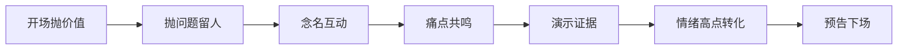

# 直播互动与话术

> 本分组属于 [摄像 · 总览](../README.md)。

> 设备跑通了，接下来拼的是「人」：怎么让进来的人留下、怎么让他们愿意说话、怎么在合适的时候引导关注和下单。直播的核心指标不是完播，是**在线、互动、转化**。本文讲留人节奏、互动动作、转化话术，配合 [直播筹备与现场执行](直播筹备与现场执行.md) 一起用。

## 一、先懂一个事实：前 30 秒定生死

观众划进直播间，平均停留只有几秒。前 30 秒没抓住，后面再精彩也白搭。

| 阶段 | 观众心理 | 你要做的 |
| --- | --- | --- |
| 0–3 秒（划过） | 「这是啥」 | 画面/标题一眼看懂在播什么 |
| 3–30 秒（停留） | 「值不值得看」 | 一句话说清「你能得到什么」 |
| 30 秒–3 分（决策） | 「留还是走」 | 抛钩子、抛问题、给期待 |
| 3 分以后 | 「沉浸/参与」 | 持续互动、推进主线 |

> 提示：**开场别啰嗦寒暄**。「大家好我是 XX 今天聊聊……」观众早划走了。上来直接给价值：「今天教你三招，手机也能拍出电影感，先点关注别错过最后一招」。

## 二、留人节奏：别让冷场超过 10 秒

直播里「沉默」=「观众在走」。靠节奏把人钉住：

| 节奏动作 | 怎么做 | 频率 |
| --- | --- | --- |
| 抛问题 | 「你们平时拍视频最头疼啥？评论区告诉我」 | 每 2–3 分钟一次 |
| 念名字 | 念弹幕 ID 回复，让人有被看见感 | 持续 |
| 给期待 | 「再讲五分钟有个大招/福利」 | 节点前预告 |
| 设节点 | 整点福袋、半场抽奖 | 按场次设计 |
| 重复核心 | 每过一阵重述「今天主题」 | 新进来的人需要 |

> 提示：**新观众是陆续进来的，不是一次性到齐**。你五分钟前讲过的重点，对刚进来的人是从零开始。每隔一会儿用一句话把主题「重播」一遍，新人不丢、老人不烦。

## 三、互动动作：让观众「动手」

互动率高的直播间，算法更愿意推。把观众从「看」变成「做」：

| 互动类型 | 话术示例 | 目的 |
| --- | --- | --- |
| 选择题 | 「选 A 还是 B？打在公屏上」 | 低成本参与 |
| 打卡 | 「想要的扣 1，我看看有多少人」 | 量化热度 |
| 提问 | 「你遇到过 XXX 吗？说说」 | 引发共鸣 |
| 任务 | 「帮我把屏幕分享给一个朋友」 | 拉新 |
| 福利 | 「左上角福袋领一下，马上开」 | 留人+转化 |

> 提示：**别问开放大题**。「你怎么看」没人回；「选 A 还是 B」一秒能答。互动门槛越低，参与越多。

## 四、转化话术：在情绪高点开口

带货、加粉丝团、引导关注，都不是随便插一句，而是挑「情绪起来」的节点：

| 转化类型 | 时机 | 话术结构 |
| --- | --- | --- |
| 关注 | 讲完一个干货点 | 「觉得有用点个关注，下期更干」 |
| 加团 | 福利/专属感节点 | 「进粉丝团，下次开播第一时间通知你」 |
| 下单 | 演示完效果/痛点被戳中 | 「刚才说的痛点，这个就能解决，链接在左下」 |
| 预约 | 收尾 | 「下场周X，点预约别错过」 |

转化话术一个通用结构：**痛点 → 方案 → 证据 → 行动**。

- 痛点：「拍视频脸总是暗的吧？」
- 方案：「这盏灯就是专门补脸的」
- 证据：「你们看现在脸上这个光，立体不？」
- 行动：「想要的左下小黄车，今天有直播价」

## 五、话术别硬背：自然才有信任

脚本给骨架，语气靠自己。两类话术最好提前写、反复练：

| 必须准备的话术 | 为什么 |
| --- | --- |
| 开场 30 秒 | 最容易被卡壳，写熟 |
| 转化主话术 | 一天可能说十遍，练到顺 |
| 突发救场 | 「稍等」「网络有点卡马上好」 |
| 下播预告 | 留人回来的钩子 |

> 提示：**别照念稿子像念课文**。观众能听出来。把话术记成「要点」而不是「逐字稿」，用自己的语气说出来，信任感强得多。提词器放关键词即可，详见 [短视频脚本与钩子结构](../短视频/短视频脚本与钩子结构.md) 的脚本思路。

## 六、避坑：这些动作赶人

| 赶人行为 | 观众感受 | 改法 |
| --- | --- | --- |
| 长时间不说话 | 「是不是卡了」→ 走 | 自言自语也别停 |
| 只念不回 | 「主播不理人」 | 点名、接话 |
| 硬广狂轰 | 「又是卖货的」 | 价值在前，广告在后 |
| 情绪激动怼人 | 「没必要」 | 禁言拉黑，不吵 |
| 频繁要关注 | 「烦不烦」 | 节点要，不在每句 |

> 提示：**互动是「双向」不是「单向喊」**。你抛问题就要真的看、真的回。观众发现你念了他的 ID、接了他的话，下次更愿意参与——这是算法推流最想要的信号。

## 七、两小时直播的互动节奏时间轴

节奏不是靠「感觉」找的，是可以排到分钟的。把 120 分钟切成 12 个 10 分钟段，每段写死「必须发生什么」，播的时候瞄一眼时钟就知道下一步该做啥，不用临场硬想。下面这份骨架适用于「知识 + 轻带货」的两小时场次；纯带货场把转化窗口加密成每 20 分钟一次，纯聊天场把转化窗口换成话题切换点。

| 时段 | 阶段定位 | 必做动作 | 互动次数 | 转化动作 |
| --- | --- | --- | --- | --- |
| 0–10 分 | 爆量开场 | 一句话讲清主题 + 抛今天三个看点 | 3 次 | 只要关注，不卖货 |
| 10–20 分 | 第一轮留人 | 讲干货点 1，念 5 个进场 ID | 4 次 | 关注 + 加粉丝团 |
| 20–30 分 | 首个高点 | 现场演示对比，制造「哇」的一刻 | 3 次 | 第一次转化窗口 |
| 30–40 分 | 换气缓冲 | 回答积压提问，节奏主动放缓 | 4 次 | 只做预告不催 |
| 40–50 分 | 重播主题 | 把主题和看点完整重讲给新人 | 3 次 | 关注 |
| 50–60 分 | 半场福利 | 福袋或抽奖，把在线人数拉起来 | 5 次 | 福利留人 |
| 60–70 分 | 干货点 2 | 上难度，讲进阶内容 | 3 次 | 加粉丝团 |
| 70–80 分 | 第二个高点 | 讲案例复盘或踩坑故事 | 3 次 | 第二次转化窗口 |
| 80–90 分 | 密集答疑 | 连续回 8–10 条弹幕 | 5 次 | 顺带提一次链接 |
| 90–100 分 | 冲刺预热 | 「最后 20 分钟有个压轴」 | 4 次 | 制造紧迫感 |
| 100–110 分 | 压轴内容 | 最干的那一招放这里 | 3 次 | 第三次转化窗口 |
| 110–120 分 | 收尾 | 总结三句 + 下场预告 | 3 次 | 预约 + 关注 |

#### 互动密度的三个档位

| 档位 | 抛问题间隔 | 念 ID 频率 | 适用场景 |
| --- | --- | --- | --- |
| 高密度 | 60–90 秒一次 | 每分钟至少 1 个 | 冷启动、在线不足 50 人、纯聊天场 |
| 中密度 | 2–3 分钟一次 | 每 2 分钟 1 个 | 常规知识场、带货讲解段 |
| 低密度 | 4–5 分钟一次 | 遇到就念 | 深度演示段、发布会、多人对谈 |

按中密度算一场两小时直播的总量：120 分钟 ÷ 2.5 分钟 ≈ 48 次互动触发，其中抛问题约 24 次、念 ID 约 16 次、福利与任务约 8 次。这 24 个问题不该现场想——开播前写成一张「问题清单」贴在屏幕边上，冷场时随手抓一条读出来，反应速度比硬想快十倍。

> 提示：**冷场救援有个「三层顺序」**：先抛最省事的选择题（选 A 还是 B），不行就念一个 ID 主动搭话，还不行就直接自曝一个小故事。三层里总有一层能把气氛拽回来，最忌讳的是沉默着等观众先开口。

## 八、三类直播的话术骨架对照

带货、知识、聊天三类直播，观众进来的期待完全不同，话术骨架不能通用。带货场观众要的是「便宜和证据」，知识场要的是「真学到东西」，聊天场要的是「陪伴和情绪」。同一句「点个关注」，在三类场里该放的位置也不一样。

| 环节 | 带货直播 | 知识直播 | 聊天直播 |
| --- | --- | --- | --- |
| 开场 30 秒 | 「今天只讲三个品，第一个直播价比日常低 40」 | 「今天教你三招，最后一招大部分人不知道」 | 「今天不带货，聊聊我上周踩的那个大坑」 |
| 留人钩子 | 「压轴那个品数量不多，别提前走」 | 「第三招在最后二十分钟，先留个关注免得刷不到」 | 「等下讲一件我一直没敢说的事」 |
| 主线推进 | 一品一循环：痛点—演示—价格—催单 | 一点一段：现象—原理—做法—演示 | 一话题一段：抛话题—看弹幕—接话—延展 |
| 情绪高点 | 演示出效果差别的那一刻 | 弹幕开始刷「原来是这样」 | 观众开始讲自己的故事 |
| 转化落点 | 高点后 10 秒内报链接位置 | 讲完整段干货后要一次关注 | 只在收尾要一次预约 |
| 收尾预告 | 「下场周四同一时间，还有两个新品」 | 「下场讲进阶版，点个预约」 | 「明天同一时间，接着聊」 |

#### 三类直播的指标侧重

| 类型 | 首要指标 | 次要指标 | 可以先不看 |
| --- | --- | --- | --- |
| 带货 | 千次观看成交额、下单转化率 | 平均停留 | 弹幕条数 |
| 知识 | 平均停留、关注转化率 | 互动率 | 成交额 |
| 聊天 | 互动率、粉丝团新增 | 在线人数曲线 | 转化率 |

> 提示：**别把带货话术搬到知识场**。知识场频繁催单，观众会立刻觉得「原来是来卖货的」，停留会断崖式下跌。三类骨架里唯一能通用的是开场那 30 秒的「先给价值」逻辑，其余都要按类型换。口播语感的打磨见 [口播脚本与镜头感](../视频/口播脚本与镜头感.md)。

## 九、完整案例：一盏补光灯从痛点到下单的逐句话术

下面是一段 4 分钟的完整转化段落，按 9 步拆开，每步给出「说什么」和「为什么这么说」。产品换成任何解决具体痛点的东西，这个结构都能照搬。

| 步 | 时长 | 逐句话术 | 为什么这么说 |
| --- | --- | --- | --- |
| 1 唤痛 | 20 秒 | 「你们自拍的时候，是不是脸上一半亮一半暗？」 | 用观众自己身上的现象开头，先不提产品 |
| 2 放大 | 25 秒 | 「这种光拍出来显脸大、显法令纹，滤镜都救不回来」 | 把小麻烦推到「后果」层面 |
| 3 共鸣 | 20 秒 | 「有同感的扣个 1，我看看是不是就我一个人这样」 | 低门槛互动，把观众从看变成动 |
| 4 归因 | 30 秒 | 「不是你不会拍，是屋里只有一个顶灯，光从头顶砸下来」 | 把责任从观众身上挪走，建立信任 |
| 5 引方案 | 20 秒 | 「解决办法特别简单，脸的正前方补一盏光就行」 | 先给方法，还不急着给商品 |
| 6 视觉证据 | 45 秒 | 「我现在关掉——你们看这个阴影；打开——看这个立体感」 | 现场开关对比，是最强的证据 |
| 7 数据证据 | 30 秒 | 「色温 2700 到 6500 可调，显色 95 以上，肤色不发绿」 | 补一个可核对的硬参数 |
| 8 行动 | 30 秒 | 「想要的左下小黄车第一个，直播间价比日常低 30，链接已上」 | 位置、价差、已上架，三件事一次说全 |
| 9 追单 | 30 秒 | 「刚下单的报个数；还在犹豫的问一句，明天你还想再纠结一次吗」 | 用已下单的人做从众证明 |

#### 这段话术里的三个量化控制点

| 控制点 | 数值 | 说明 |
| --- | --- | --- |
| 痛点到方案的间隔 | ≤ 45 秒 | 超过观众会觉得你在绕圈子 |
| 证据段的数量 | 至少 2 个 | 一个视觉对比 + 一个可核对参数 |
| 行动指令的重复次数 | 3 次 | 链接位置说 3 遍，陆续进来的人才听得到 |

整段 4 分钟里，真正讲产品的只有第 6–8 步大约 105 秒，前面 115 秒全在讲观众自己的问题。这个比例大致是 1:1——讲产品的时间不要超过讲痛点的时间。一旦超了，观感立刻从「他在帮我」滑向「他在卖我」，前面积累的信任会瞬间清零。

> 提示：**第 6 步的开关对比是整段的命门**。能现场演示的产品，一定要留出至少 40 秒做「关掉—打开」的来回切换，观众亲眼看到差别，后面的价格几乎不用多解释。演示时的机位和布光手法见 [影视制作 · 拍摄](../影视制作/拍摄.md)。

## 十、互动数据指标：算法看什么，达标线在哪

平台推流看的是「同时段、同量级的直播间里，你的表现是否更好」。下面这些数字是通用参考，不同赛道会有浮动，但方向一致：低于及格线时别急着抱怨没流量，先改内容。

| 指标 | 计算方式 | 及格线 | 优秀线 | 不达标先改什么 |
| --- | --- | --- | --- | --- |
| 互动率 | 互动人数 ÷ 场观 | ≥ 5% | ≥ 10% | 加抛问题密度，开放题换成选择题 |
| 平均停留 | 总观看时长 ÷ 场观 | ≥ 60 秒 | ≥ 120 秒 | 重写开场 30 秒，中段补钩子 |
| 关注转化率 | 新增关注 ÷ 场观 | ≥ 1.5% | ≥ 4% | 每个干货点讲完立刻要关注 |
| 粉丝团新增率 | 新增团员 ÷ 新增关注 | ≥ 10% | ≥ 25% | 把专属福利讲清楚讲具体 |
| 发言人数占比 | 发言人数 ÷ 场观 | ≥ 3% | ≥ 8% | 念 ID、点名接话 |
| 千次观看成交 | 成交额 ÷ 场观 × 1000 | 按品类定 | 按品类定 | 查转化是否落在情绪高点 |

#### 一场直播的数据算例

假设某场知识直播场观 8000，互动人数 640，总观看时长 96000 秒，新增关注 240 人，其中入团 30 人：

| 项 | 计算 | 结果 | 判断 |
| --- | --- | --- | --- |
| 互动率 | 640 ÷ 8000 | 8% | 及格偏优，节奏本身没问题 |
| 平均停留 | 96000 ÷ 8000 | 12 秒 | 严重不及格，开场留不住人 |
| 关注转化率 | 240 ÷ 8000 | 3% | 及格，靠干货硬撑住了 |
| 入团率 | 30 ÷ 240 | 12.5% | 及格，但福利没说透 |

这组数据的结论很明确：**问题不在互动，在开场**。8% 的互动率说明愿意说话的人不少，但 12 秒的平均停留意味着绝大多数人进来就走，他们连一次互动机会都没等到。这种情况下加福袋、加抽奖都是白费力气，真正要改的是前 3 秒的画面信息量和前 30 秒的价值句。反过来，如果停留有 90 秒而互动率只有 2%，那就是「你一直在讲，没人被叫起来动手」，该补的是选择题和打卡。

> 提示：**看数据要成对看，单看一个必然误判**。停留低 + 互动高 = 开场问题；停留高 + 互动低 = 互动动作太少；两个都低 = 选题或人群不对，先别改话术，回去改选题。数据口径和完整复盘表格式见 [直播筹备与现场执行](直播筹备与现场执行.md)。

## 自查清单

- [ ] 开场 30 秒直接给价值，没寒暄？
- [ ] 每 2–3 分钟有一次抛问题/互动？
- [ ] 新进来的观众能靠「重播主题」接上？
- [ ] 转化放在情绪高点，不是硬插？
- [ ] 话术记要点不照念，自然有信任？
- [ ] 突发救场话术（稍等/卡了）准备了吗？
- [ ] 下播有预告钩子，给人回来的理由？

## 常见误区

- **开场寒暄**：观众早划走。上来给价值。
- **冷场不救**：沉默超 10 秒人就在走。自言自语也别停。
- **硬广前置**：先价值后广告，信任才立得住。
- **照念稿子**：像读课文，没信任。记要点自然说。
- **只播不互动**：单向喊没人理。双向才有推流。

## 延伸

- 筹备与设备 → [直播筹备与现场执行](直播筹备与现场执行.md)
- 短视频脚本钩子 → [短视频脚本与钩子结构](../短视频/短视频脚本与钩子结构.md)
- 口播镜头感 → [口播脚本与镜头感](../视频/口播脚本与镜头感.md)
- 收音与响度 → [影视制作 · 声音设计](../影视制作/声音设计.md)
- 设备选型 → [设备](../../设备/)
