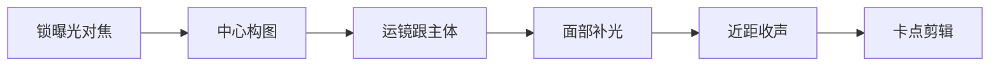

# 竖屏拍摄与画面

> 竖屏是短视频的「原生画幅」——9:16，上下长、左右窄。它和横屏拍摄（见 [影视制作 · 拍摄](../影视制作/拍摄.md)）的构图逻辑完全不同：横屏讲「场面」，竖屏讲「人」和「细节」。本文讲竖屏怎么构图、怎么运镜、参数怎么设、脸怎么打光，让手机也能拍出有质感的短视频。

## 构图与机位
### 竖屏构图：把人放在中间

竖屏画面窄，最稳的构图是「中心构图」——主体放中间，上下留天地。

| 构图 | 怎么用 | 适合 |
| --- | --- | --- |
| 中心构图 | 人/主体居中，头顶留 1/3 | 口播、探店、人像 |
| 三分构图 | 主体偏左或偏右 1/3 线 | 风景、产品、留白 |
| 留天留地 | 上留天/下留地，不顶满 | 氛围、环境 |

> 提示：**竖屏别把主体放太边**。横屏放边上好看，竖屏放边上显得空、散。窄画幅里，「居中 + 留白」最稳。

### 机位高度与俯仰对照

手机举多高、朝上还是朝下，直接决定观感：

| 机位 | 怎么举 | 效果 | 适合 |
| --- | --- | --- | --- |
| 眼平 | 镜头与眼睛齐 | 平视、自然、对话感 | 口播、人像 |
| 略高 | 高半头俯 10° | 显脸小、亲切 | 自拍、美妆 |
| 俯拍 | 高举向下 | 交代桌面/全身 | 美食、开箱、穿搭 |
| 低角度 | 放地上仰拍 | 显高、有气势 | 建筑、鞋、产品 |

### 九种常见竖屏构图失败与修正

| 失败 | 表现 | 修正 |
| --- | --- | --- |
| 顶天立地 | 主体贴满上下边 | 上下各留 1/3 |
| 主体太小 | 人只占中间一竖条 | 靠近或放大 |
| 歪斜 | 地平线斜 | 开网格线对齐 |
| 背景乱 | 杂物入镜 | 换角度 / 虚化 |
| 太满 | 没呼吸空间 | 留白 |
| 逆光黑脸 | 背对窗光 | 转面朝光或补光 |
| 切关节 | 构图线压颈/腰 | 避开关节切 |
| 双下巴 | 机位过低仰拍 | 机位提到眼平 |
| 畸变 | 太近广角变形 | 退后一点 |

## 运镜与防抖
### 运镜： handheld 也能稳

| 运镜 | 做法 | 效果 |
| --- | --- | --- |
| 推 | 向前走/焦距拉长 | 聚焦、强调 |
| 拉 | 向后退 | 交代环境 |
| 摇 | 左右转 | 展示空间 |
| 移 | 平行走 | 跟随、带入 |
| 跟 | 跟着主体走 | 记录、沉浸 |

手持拍竖屏，**手臂夹紧身体当稳定器**，走「内八字」小步，比端着胳膊稳得多。要更稳上手机稳定器。参数和持机参考 [摄影 · 拍摄技术](../../摄影/拍摄技术/) 的对焦与构图。

### 不同题材的运镜组合

运镜不是瞎晃，是按题材配「组合拳」。给几套可直接套的：

| 题材 | 运镜序列 | 节奏 |
| --- | --- | --- |
| 口播 | 固定 → 轻微推近强调 | 稳，几乎不动 |
| 探店 | 推门（移）→ 摇环境 → 俯拍菜品（固定） | 中速 |
| 产品 | 固定特写 → 慢拉展示全貌 | 慢 |
| 卡点舞 | 跟拍 → 切镜卡点 → 甩镜转场 | 快 |
| 风景 | 缓慢上摇/横移 | 极慢 |

> 提示：**一条短视频里运镜别超过 2 种**。又是推又是摇又是跟，观众看着晕。选定一种主运镜，其余用固定，反而高级。

### 手持防抖的实操细节

持机姿势对了，比上稳定器还重要：

- **手臂夹身体**，肘贴肋骨，当人体云台；
- **走内八字小步**，重心低、晃动小；
- **呼气时运镜 / 按快门**，憋气反而抖；
- **不悬空端胳膊**，靠墙、靠桌、靠栏杆借力。

真要更稳再上手机稳定器；预算低用八爪鱼三脚架固定机位，留出双手做动作。运镜底层逻辑参考 [影视制作 · 拍摄](../影视制作/拍摄.md) 的镜头运动。

## 参数与设置
### 参数：竖屏该设多少

| 参数 | 建议 | 说明 |
| --- | --- | --- |
| 分辨率 | 1080p 起步，4K 可选 | 1080p 够清晰且体积小；4K 方便放大裁切 |
| 帧率 | 30（日常）/ 60（慢动作） | 60 帧可后期降速做慢动作 |
| 快门 | 1/60（30 帧）/ 1/120（60 帧） | 遵循 180° 法则，运动不糊 |
| 曝光 | 稍欠不过曝 | 手机宽容度低，过曝救不回 |

> 提示：**手机拍视频优先锁曝光和对焦**（长按屏幕锁定），不然画面会忽明忽暗「呼吸」。锁完再构图。

### 参数速查与慢动作算例

不同场景一套参数，照着设不踩坑：

| 场景 | 分辨率 | 帧率 | 快门 | 用途 |
| --- | --- | --- | --- | --- |
| 口播/探店 | 1080p | 30 | 1/60 | 日常清晰、体积小 |
| 产品特写 | 4K | 30 | 1/60 | 方便放大裁切 |
| 运动/舞蹈 | 1080p | 60 | 1/120 | 后期降速做慢动作 |
| 夜景/光轨 | 1080p | 30 | 1/60 | 提亮、稳 |

慢动作算例：拍一段 60 帧素材，后期降到 30 帧播放，时间拉长 2 倍——水滴、跳跃、倒水这类瞬间，降速后才有「电影感」。参数与曝光底层逻辑参考 [摄影 · 拍摄技术](../../摄影/拍摄技术/) 的快门与帧率。

### 手机拍摄设置清单

开拍前逐项确认，省得拍完发现废了：

- 分辨率：1080p（日常）/ 4K（要裁切）；
- 帧率：30（日常）/ 60（慢动作素材）；
- 开网格线：构图对齐用；
- 长按锁曝光 + 对焦：防呼吸；
- 格式：高效（HEVC）省空间，或兼容（H.264）防剪辑软件不认；
- 关「自动美颜/滤镜」：后期再调更可控。

### 自拍监看：看不见自己怎么拍

竖屏常一个人拍，看不见构图最头疼。三招：

- **手机用前置或镜像监看**：支架上支手机，自己看屏幕构图；
- **稳定器配 APP 预览**：手机夹稳定器，用厂商 APP 实时看画面；
- **八爪鱼缠栏杆/桌沿**：固定机位，留出双手做动作。

收音细节（离嘴距离、防风、底噪）参考 [影视制作 · 声音设计](../影视制作/声音设计.md) 的口播收音。

## 灯光与布光
### 灯光：脸亮比画面亮重要

短视频大多对着脸讲，面部打光是第一位：

| 光源 | 怎么打 | 作用 |
| --- | --- | --- |
| 主光 | 正前稍侧，照脸 | 主体亮、立体 |
| 补光 | 另一侧弱光 | 减阴影、不阴阳脸 |
| 轮廓光 | 后方打头发/肩 | 把人和背景分开 |
| 环境 | 避免顶光 | 顶光显眼袋、显油 |

布光原理参考 [影视制作 · 拍摄](../影视制作/拍摄.md) 的三点布光与 [摄影 · 用光](../../摄影/拍摄技术/用光.md)；手机灯光可用环形灯、LED 补光灯、甚至白纸反光。

### 不同脸型布光微调

| 脸型 | 光位 | 效果 |
| --- | --- | --- |
| 圆脸 | 侧光 + 瘦脸阴影 | 显立体、收窄 |
| 长脸 | 正面柔光、弱顶光 | 视觉缩短 |
| 方脸 | 大柔光、去硬边 | 轮廓柔和 |
| 棱角脸 | 主光稍侧 + 补光 | 保留骨相不显凶 |

布光原理参考 [影视制作 · 拍摄](../影视制作/拍摄.md) 的三点布光与 [摄影 · 用光](../../摄影/拍摄技术/用光.md)。

### 不同场景的光位速查

| 场景 | 光位 | 注意 |
| --- | --- | --- |
| 室内口播 | 正前侧主光 | 避顶光 |
| 窗边逆光 | 脸补光 | 别拍成黑脸 |
| 美食 | 侧 45° + 补光 | 避油光 |
| 户外正午 | 找阴影 / 柔光 | 避硬光死白 |

用光原理参考 [摄影 · 用光](../../摄影/拍摄技术/用光.md) 的硬光柔光对比。

## 收音、剪辑与设备
### 收音别忘

竖屏画面再好，声音糊了也完。手机离嘴 30–50cm，风大加毛绒防风罩，室内关空调。声音细节参考 [影视制作 · 声音设计](../影视制作/声音设计.md)。

### 剪辑时的竖屏注意

- **横素材竖用**：放大裁切，或加背景虚化/模糊填两边；
- **字幕放中下**：别被平台底部 UI 遮住；
- **封面裁 9:16 中间**：选最有信息量的一帧；
- **比例别错**：发抖音/小红书必须是 9:16，否则上下黑边。

剪辑卡点参考 [影视制作 · 剪辑与调色](../影视制作/剪辑与调色.md)。

### 不同预算的设备组合

| 预算 | 组合 | 够拍啥 |
| --- | --- | --- |
| 0 元 | 手机 + 自然光 | 口播、生活记录 |
| 200 元 | 手机 + 环形灯 + 领夹麦 | 画质 / 收音提升 |
| 1000 元 | 加稳定器 + 补光棒 | 走播、探店、产品 |
| 3000+ | 微单 + 大光圈 + 灯光组 | 专业感、虚化 |

设备选型细节见 [设备](../../设备/)；灯光原理见 [影视制作 · 拍摄](../影视制作/拍摄.md)。

## 入门、自查与延伸
### 竖屏是「手机创作」的入口

很多人卡在「设备不够好」，其实竖屏短视频是手机最擅长的形态——9:16 就是手机的原生画幅，你手里这台机器本身就是生产工具。先把构图、运镜、光、声这四件事用手机练熟，再谈升级。等你知道「想要但手机给不了」的那天，买设备才有明确目标，不会瞎花钱。反过来，设备堆了一堆却没练好基本功，拍出来照样像随手录。

### 练习清单：21 天竖屏入门

第 1 周：每天拍一条 15 秒固定机位口播，练锁曝光对焦和中心构图；第 2 周：加一种运镜（推或移），练稳定；第 3 周：加补光和收音，练脸亮声清。21 天下来，你会明显感觉「拍出来不像随手录了」。关键不在天数，在每天那条都带着一个小目标去拍，而不是无脑重复。

### 竖屏常见 QA

| 问题 | 原因 | 改法 |
| --- | --- | --- |
| 画面暗 | 没锁曝光 / 没补光 | 锁曝光 + 加灯 |
| 抖 | 手持悬空 | 夹身体 / 上稳定器 |
| 糊 | 没对焦 / 太近 | 锁对焦、退后一点 |
| 畸变 | 广角太近 | 退后、别贴脸 |

### 自查清单

- [ ] 主体居中或三分，没顶满画面？
- [ ] 锁了曝光和对焦？
- [ ] 帧率/快门匹配（30/1-60，60/1-120）？
- [ ] 脸有主光+补光，没顶光显油？
- [ ] 收音清晰、无风噪？
- [ ] 运镜手臂夹身体，不抖？

### 常见误区

- **主体放边**：竖屏窄画幅放边显空。居中更稳。
- **不锁曝光**：画面呼吸、忽明忽暗。长按锁定。
- **顶光拍脸**：眼袋油光全出来。侧前打光。
- **只管画面不管声**：手机收音差是通病，近距+防风才救得了。

### 延伸

- 脚本钩子 → [短视频脚本与钩子结构](短视频脚本与钩子结构.md)
- 横屏拍摄与机位 → [影视制作 · 拍摄](../影视制作/拍摄.md)
- 用光原理 → [摄影 · 用光](../../摄影/拍摄技术/用光.md)
- 收音与混音 → [影视制作 · 声音设计](../影视制作/声音设计.md)
- 设备选型 → [设备](../../设备/)

