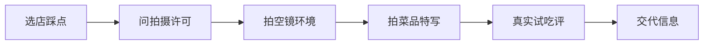

# 探店

> 探店 = 去一家店（吃/喝/玩），拍下来并真实点评。它介于 [Vlog](Vlog从选题到发布.md) 和 [开箱评测](开箱评测流程.md) 之间：有记录感，也有「值不值」的结论。观众看探店的核心诉求是「这家店我要不要去」——所以**真实 + 信息交代清楚**比画面华丽重要。本文讲从踩点到发出的完整做法。

## 前期：选题与踩点
### 选题与踩点：别盲去

| 步骤 | 做什么 | 目的 |
| --- | --- | --- |
| 选店 | 新店/有争议/有特色 | 有话题才有看头 |
| 踩点 | 提前去一次，看光线、空间、动线 | 知道机位怎么架 |
| 错峰 | 选人少的时段拍空镜 | 画面干净、不扰客 |

> 提示：**先当顾客再去拍**。踩点时自己吃一遍，才知道哪道菜值得拍、什么价位、坑在哪——这些真实体验才是点评的底气。

### 拍摄许可：别省这一步

商用拍摄（尤其带脸、带店招）最好先问。两种方式：

- **提前私信/电话**店家说明来意，多数小店欢迎；
- **现场问店员**「我拍点素材发网上可以吗」，得到口头同意也行。

不告而拍，轻则被赶，重则侵权。**礼貌换来的是从容拍摄**。

### 踩点当天检查表

正式拍之前，自己以顾客身份去一次，按表打勾：

| 检查项 | 看什么 | 决定啥 |
| --- | --- | --- |
| 光线时段 | 几点自然光好、几点要补光 | 拍摄档期 |
| 动线 | 从进门到落座怎么走 | 跟拍路线 |
| 停车/交通 | 方不方便、贵不贵 | 信息卡写啥 |
| 高峰 | 几点人爆满 | 错峰拍空镜 |
| 许可 | 店家态度、能否拍 | 要不要提前约 |

### 拍摄许可话术模板

别临场卡壳，两套话术背熟：

- **提前私信**：「您好，我是做美食内容的，想来拍条视频发网上，方便吗？到店请客一杯。」
- **现场问店员**：「店员你好，我拍点素材发网上，不打扰客人吧？没问题我就架机器了。」

注意事项：带脸拍顾客要先打码或征得同意；拍店招和菜品一般没问题；连锁品牌走官方授权更稳。礼貌换来的，是能从容拍完。

## 拍摄与真实点评
### 美食与空间拍摄

| 拍什么 | 怎么拍 | 注意 |
| --- | --- | --- |
| 菜品特写 | 侧 45°、近距、自然光或补光 | 别顶光拍出油光 |
| 上菜瞬间 | 提前架机位等 | 抓「冒热气/淋酱」 |
| 空间环境 | 广角、横移 | 交代店多大、什么调性 |
| 人物互动 | 老板介绍、朋友试吃 | 增加真实感 |

灯光参考 [影视制作 · 拍摄](../影视制作/拍摄.md) 的三点布光；美食用光参考 [摄影 · 用光](../../摄影/拍摄技术/用光.md) 的硬光柔光对比。

### 真实点评：结论要具体

探店最忌「都挺好」。观众要的是「我该不该去」。

| 维度 | 给什么 | 例子 |
| --- | --- | --- |
| 味道 | 具体形容 | 「汤底鲜但不咸，牛肉嫩」 |
| 性价比 | 人均 + 值不值 | 「人均 80，分量够两人」 |
| 环境 | 适合什么场景 | 「安静适合聊天，不适合带娃闹」 |
| 槽点 | 真实不便 | 「车位少、周末排队久」 |

> 提示：**说「适合谁」比说「好不好」有用**。一家贵但精致的店，对约会的人是好店，对学生党不是——把人群说清，观众自己能对号入座。

### 不同价位店的点评侧重点

观众关心啥，随人均变。点评重点跟着调，才对得上预期：

| 人均 | 观众最关心 | 点评侧重 |
| --- | --- | --- |
| < 50 元 | 性价比、坑不坑 | 分量、踩雷、平替 |
| 50–150 元 | 值不值、有啥特色 | 必点、体验、适合场景 |
| > 150 元 | 体验、适不适合我 | 环境、服务、约会/聚会属性 |

> 提示：**贵店更要说「适合谁」**。人均 300 的店对约会是好店，对学生党不是——把人群说清，比夸「高端」有用。

### 探店的「可信度」细节

观众信不信，看细节：

- **展示价目表 / 小票**：比嘴说「人均 45」可信十倍；
- **拍上菜 / 制作过程**：证明你真吃过、真见过；
- **说槽点**：敢讲不好，好评才站得住；
- **不滤镜过度**：颜色太假，观众怀疑是广告。

> 提示：**可信度是探店账号的资产**。一条「我没忍住吐槽」的视频，比十条全夸更有记忆点。

## 信息交代与脚本
### 信息交代：让人能找到

结尾把「实用信息」交代全，观众才用得上：

- 店名 + 大致位置（街区/地铁站）；
- 人均消费；
- 营业时间；
- 必点 / 避坑。

### 信息交代完整清单

结尾把「实用信息」交代全，观众才用得上。两版都准备：

**口播稿（结尾说一遍）：**
「店名 XX，在 XX 地铁站出来走 5 分钟；人均大概 XX；必点的是 XX，避坑的是 XX；营业到晚上 XX 点。」

**文字信息卡（视频结尾贴 3–5 秒）：**

| 字段 | 示例 |
| --- | --- |
| 店名 | 老陈家牛肉面 |
| 位置 | 朝阳区 XX 路，地铁 6 号线 A 口 |
| 人均 | 45 元 |
| 必点 | 红烧牛肉面、卤蛋 |
| 避坑 | 周末 12 点排队，建议错峰 |
| 营业 | 10:00–22:00 |

### 不同店型的拍摄脚本模板

店型不同，机位和镜头序列完全两样。开拍前按店型套模板，现场不抓瞎：

| 店型 | 机位 | 镜头序列 | 重点 |
| --- | --- | --- | --- |
| 美食馆 | 俯拍 + 45°侧拍 | 门头 → 落座环境 → 上菜特写 → 试吃反应 → 招牌菜 | 热气、摆盘、表情 |
| 咖啡/甜品 | 平视 + 微距 | 门面调性 → 手冲过程 → 拉花特写 → 安静角落 | 质感、氛围、慢 |
| 景点/场馆 | 广角横移 + 全景 | 外观 → 排队/入场 → 亮点空镜 → 体验镜头 | 交代「有多大/值不值」 |
| 夜市/小吃 | 手持跟拍 | 摊位全景 → 制作特写 → 试吃 → 人流氛围 | 烟火气、热闹 |

> 提示：**先拍「交代环境的空镜」，再拍「食物特写」，最后拍「人」**。顺序对了，观众跟着你走进店；反过来先怼脸吃，观众不知道你在哪。

### 不同平台的探店标题写法

| 平台 | 标题风格 | 例子 |
| --- | --- | --- |
| 抖音 | 钩子 + 地点 | 「北京这家人均 45，我连吃 3 碗」 |
| 小红书 | 种草 + 数字 | 「周末探的 5 家咖啡，第 3 家绝了」 |
| B站 | 信息量 + 诚实 | 「一个人吃遍老街，第 2 家踩雷」 |

标题别只写店名，要带「人群 / 数字 / 结论」，观众才知道「这跟我有关系吗」。

### 一条探店成片结构速查

开场钩子 → 环境空镜 → 菜品特写 → 试吃点评 → 信息卡 → 结尾关注。每个环节对应一个镜头，按 [短视频脚本与钩子结构](../短视频/短视频脚本与钩子结构.md) 的钩子逻辑，前 3 秒就抛「这家店值不值得来」。

## 流程与长期价值
### 一条探店从踩点到发出

1. 踩点：当顾客吃一遍，记真实体验；
2. 约拍：问许可、定拍摄时段；
3. 拍摄：空镜 → 特写 → 互动，按模板走；
4. 试吃点评：边吃边记具体感受（味道/性价比/槽点）；
5. 剪辑：钩子开场 → 环境 → 菜品 → 点评 → 信息卡；
6. 发布：封面用最有食欲的一帧，标题带店名+人群。

### 一条探店的时间成本

别低估耗时，安排好再开工：

| 环节 | 耗时 | 说明 |
| --- | --- | --- |
| 踩点 | 1–2 小时 | 含自己吃一顿 |
| 拍摄 | 1–2 小时 | 错峰、含等上菜 |
| 剪辑 | 2–4 小时 | 钩子 + 点评 + 信息卡 |
| 发布 | 30 分钟 | 封面、标题、平台 |

### 探店也能做成系列

单条探店流量有限，做成系列才有复利。比如「一个人吃的 30 家」「周末不踩雷咖啡地图」「公司附近 15 元午餐」。系列的好处很明显：观众知道你持续在更，会订阅等更新，而不是刷到一条就划走；你也能复用踩点经验，第二条比第一条快一倍，第三条更快。起名用统一格式（如「XX 第 N 家」），观众一眼认得是同一个栏目，也会主动催更。当系列攒到 5 条以上，平台的搜索和推荐都会开始给你推同类观众，账号也更容易被记作「某某领域的探店号」，后续接广和涨粉都顺。

### 探店的长期价值

一条爆款会过时，但「这个人说的真话」会沉淀成信任。信任带来复看、带来私信问「你推荐的那家还在吗」、带来商家主动寄样。把探店当长期关系经营，而不是一次流量生意，账号才走得远。短期靠夸张能骗一波播放，长期靠诚实留住人——这是探店账号唯一的护城河。

## 避坑与合规
### 避坑：探店的法律与道德

- **不虚构体验**：没吃过的别写吃了，观众能闻出来；
- **不收钱改结论**：恰饭要标明，否则一次掉信任；
- **不拍未成年人正脸**：涉及小孩打码或避开；
- **不泄露他人隐私**：路人入镜尽量虚化或征得同意。

> 提示：**真实是探店的唯一护城河**。短期靠夸张涨粉，长期靠「他说的是真话」留住人。

## 自查与延伸
### 一条探店速记 checklist

选题 → 踩点 → 约拍 → 空镜 → 特写 → 试吃点评 → 信息卡 → 发布。卡在哪一步，回头补哪一步，别等全拍完才发现漏了人均。

### 自查清单

- [ ] 提前踩点、知道机位和光线？
- [ ] 拍前问了拍摄许可？
- [ ] 拍了菜品特写 + 空间环境 + 互动？
- [ ] 点评具体到味道/性价比/槽点？
- [ ] 说了「适合谁」而不是只说好坏？
- [ ] 结尾交代了店名/人均/营业时间？

### 常见误区

- **不告而拍**：被赶、侵权，白跑一趟。先问。
- **只拍好看的**：避坑信息才是探店价值，光好看没人信。
- **不说人均**：观众没法判断去不去，等于白讲。
- **顶光拍菜**：油光满面、没食欲。侧光/补光更诱人。

### 延伸

- 拍生活感 → [Vlog 从选题到发布](Vlog从选题到发布.md)
- 结构化点评 → [开箱评测流程](开箱评测流程.md)
- 布光与机位 → [影视制作 · 拍摄](../影视制作/拍摄.md)
- 美食用光 → [摄影 · 用光](../../摄影/拍摄技术/用光.md)

