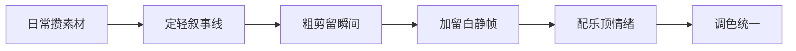

# 生活记录

> 生活记录是视频形态里最「轻」的一种：没有强叙事、没有知识密度，靠的是**把日常碎片剪成有味道的片子**。它和 [Vlog](Vlog从选题到发布.md) 的区别在于——Vlog 通常有「我干了啥」的主线，生活记录更像是「这几天的一些瞬间」，叙事弱、氛围强。本文讲怎么把看似平淡的日常，剪出让人想看完的感觉。

## 素材与叙事
### 素材化：把日常变成可剪的库存

生活记录最大的问题不是「不会剪」，是「没素材」。解决靠一个习惯：**看见有意思的瞬间就拍一段**，别等「有空了再专门拍」。

| 该拍的瞬间 | 为什么值钱 |
| --- | --- |
| 晨光打在桌上的 3 秒 | 氛围感、不刻意 |
| 做饭的一个动作 | 生活气、代入感 |
| 窗外天气变化 | 时间感、转场用 |
| 一只猫/一个路人 | 意外、俏皮 |

> 提示：**生活记录靠库存厚度**。平时攒 200 段 5–10 秒的小素材，剪的时候才有得挑。别指望现拍现剪。

### 叙事线：弱，但要有

完全没线的生活记录容易变成「流水账」。给一个极轻的叙事锚点就够了：

- **一天**：早起 → 白天 → 晚上，用时间串；
- **一件事**：买菜 → 做饭 → 吃，用动作串；
- **一种情绪**：丧 → 被治愈，用状态串。

不用写脚本，拍的时候心里有这根线，素材就不会散。

### 三种叙事线的素材清单

不同叙事线，要攒的素材不一样。开拍前按线列清单，剪的时候才不会「想要个转场没拍到」。

| 叙事线 | 核心素材 | 单段时长 | 建议库存 |
| --- | --- | --- | --- |
| 一天线 | 早起光、三餐、通勤、睡前 | 3–8 秒 | 8–12 段/天 |
| 一事线 | 准备、关键动作、结果、反应 | 5–15 秒 | 6–10 段/事 |
| 一情绪线 | 触发情绪的瞬间、空镜、特写 | 2–6 秒 | 10+ 段/主题 |

> 提示：**库存按「主题」建文件夹**，别全堆一个相册。剪的时候按主题捞，比翻几百段快得多。平时攒够 200 段 5–10 秒的小素材，才谈得上「有得挑」。

### 把生活记录当「素材库」经营

很多人拍几天就断，是因为把每条都当「作品」压自己。换个心态：日常拍的素材是给未来剪辑攒的库存。今天一段光影、明天一段猫、后天一段雨，攒够一周，周末挑一条线串起来就是一条片。断更不可怕，库存一直在——这样心态轻松，反而更容易坚持下来，也比「憋大招」产出稳定得多。等素材库厚了，你会发现「没什么可拍」的日子越来越少，因为生活里到处都是能剪的瞬间。

## 节奏、配乐与调色
### 节奏与留白：别填满

生活记录的美感在「留白」——画面安静下来的那半秒，比信息密集更打动人。

| 手法 | 做法 | 效果 |
| --- | --- | --- |
| 长镜头 | 一个动作不切，放完整 | 真实、沉浸 |
| 静帧 | 美好瞬间停 1–2 秒 | 让人看进去 |
| 环境声 | 保留锅铲声、雨声 | 身临其境 |
| 慢动作 | 关键瞬间降速 | 仪式感 |

剪辑节奏参考 [影视制作 · 剪辑与调色](../影视制作/剪辑与调色.md) 的 Vlog 案例：**信息变了才切，没变就让它待着**。

### 配乐：情绪的一半

生活记录的配乐比 Vlog 更重——画面平淡，靠音乐把情绪顶上来。

- **选曲匹配情绪**：慵懒配轻爵士，治愈配钢琴，活力配 city pop；
- **音量压住人声/环境声但别盖过**：人声听不清就减音乐；
- **起止自然**：音乐淡入淡出，别硬切。

音乐版权与情绪对应参考 [影视制作 · 声音设计](../影视制作/声音设计.md)。

### 配乐情绪对照

| 情绪 | 曲风 | 适合片段 |
| --- | --- | --- |
| 慵懒 | 轻爵士、lo-fi | 周末、咖啡、发呆 |
| 治愈 | 钢琴、弦乐 | 落日、宠物、慢镜头 |
| 活力 | city pop、funk | 出门、运动、探店 |
| 伤感 | 低频、慢板 | 独处、雨夜、离别 |

音乐版权与情绪对应参考 [影视制作 · 声音设计](../影视制作/声音设计.md)；音量压到人声/环境声之下，淡入淡出别硬切，别让音乐盖过锅铲声这类「生活气」。

### 调色统一：别让素材各说各话

日常攒的素材光线不一，直接拼会忽明忽暗。统一三步：

| 步骤 | 做法 | 目的 |
| --- | --- | --- |
| 定基调 | 选一条最满意的当基准 | 全片跟着它走 |
| 匹配亮度 | 各段拉到接近的曝光 | 不忽明忽暗 |
| 套预设 | 同一 LUT/滤镜批量应用 | 色调一致 |

调色细节参考 [影视制作 · 剪辑与调色](../影视制作/剪辑与调色.md) 的一级调色；基础曝光与白平衡参考 [摄影 · 拍摄技术](../../摄影/拍摄技术/)。

## 拍摄与剪辑
### 常见题材抓拍点

| 题材 | 值得抓的瞬间 | 备注 |
| --- | --- | --- |
| 做饭 | 下锅冒烟、出锅摆盘、尝一口反应 | 热气、油光是食欲点 |
| 宠物 | 睡姿、追玩具、看镜头 | 抓「不经意」比摆拍可爱 |
| 通勤 | 站台人流、车窗光影、哼歌 | 用环境声带情绪 |
| 周末 | 市场、咖啡、散步、落日 | 一组慢镜头就够治愈 |

### 剪辑节奏时间轴（60 秒案例）

把一条 60 秒生活记录拆成时间轴，每个时段定好「画面 + 音乐 + 环境声」，节奏就不乱：

| 时段 | 画面 | 音乐 | 环境声 |
| --- | --- | --- | --- |
| 0–5s | 晨光空镜，静帧 2 秒 | 起音淡入 | 无 |
| 5–20s | 做饭动作快剪 | 主旋律起 | 锅铲声保留 |
| 20–35s | 吃饭特写 + 慢动作 | 高潮段 | 碗筷轻响 |
| 35–50s | 窗外/整理，留白长镜头 | 渐弱 | 雨声/风声 |
| 50–60s | 结尾静帧 + 字幕 | 尾音淡出 | 无 |

剪辑节奏参考 [影视制作 · 剪辑与调色](../影视制作/剪辑与调色.md)：信息变了才切，留白处不硬切，别用花哨转场硬接情绪。

### 用空镜转场串起碎片

生活记录没有强叙事，靠「空镜」当胶水把碎片黏起来。常备这几类转场素材，剪的时候直接捞：

| 空镜 | 怎么拍 | 用在哪 |
| --- | --- | --- |
| 光影变化 | 同一扇窗，早中晚各拍 3 秒 | 标记时间跳切 |
| 门 / 窗 | 推门、拉窗帘 | 场景转换 |
| 手的动作 | 倒水、翻书、收拾 | 衔接两个段落 |
| 脚步 / 路 | 走路、站台 | 转场 + 情绪 |
| 天空 / 植物 | 云、树、花 | 情绪留白 |

> 提示：**转场空镜少则 2–3 秒，多则 5 秒**，别太长抢戏。它负责「告诉观众时间过了」，不是主角。

### 手机拍出质感的小技巧

不买设备也能提升观感，几个随手能做的：

- **窗边柔光**：脸朝窗，自然光打过来最柔，比顶灯好看；
- **逆光剪影**：人背对强光，主体成黑轮廓，氛围感拉满；
- **锁 24/25 帧**：比 30 帧更接近电影质感，运动更「顺」；
- **慢动作降速**：跳跃、倒水、眨眼这类瞬间，降速后才有戏。

> 提示：**质感来自光，不是来自机器**。同一部手机，窗边拍和顶灯拍是两种片。先找光，再谈设备升级。

## 生产流程与发布
### 一条生活记录的生产流程

从拍到发，给个完整时间轴，新手照着走：

1. 平时：看见有意思就拍 5–10 秒，进对应主题文件夹；
2. 周末：翻库存，挑一条叙事线，定 60 秒左右的成片目标；
3. 粗剪：按时间轴把素材排上，删掉晃的、空的；
4. 精剪：加留白静帧、慢动作，调节奏；
5. 配乐：选匹配情绪的曲子，压到人声/环境声之下；
6. 调色：套统一预设，亮度拉平；
7. 导出发布：封面选最好看的一帧，标题带情绪不写「今天」。

### 设备极简清单

生活记录不需要贵设备，够用就行：

| 设备 | 作用 | 入门档 |
| --- | --- | --- |
| 手机 | 主拍 | 近三年任何机型 |
| 八爪鱼三脚架 | 固定机位 | 20 元左右 |
| 补光 | 脸/食物亮 | 环形灯 / LED 补光灯 |
| 领夹麦 | 收声 | 几十元无线麦 |

设备选型细节见 [设备](../../设备/)。

### 导出与发布

| 平台 | 画幅 | 时长建议 | 封面 |
| --- | --- | --- | --- |
| 抖音 | 9:16 | 15–60 秒 | 强对比、大脸 |
| 小红书 | 9:16 | 30–90 秒 | 精致、暖调 |
| B站 | 9:16 或 16:9 | 1–3 分钟 | 高清、有字 |

导出选 1080p 起步，码率别太低——手机发平台会被二次压缩，原片稍高才保清晰。发布运营参考 [Vlog 从选题到发布](Vlog从选题到发布.md) 的平台对照；调色与导出参数参考 [影视制作 · 剪辑与调色](../影视制作/剪辑与调色.md)。

### 新手最容易卡的三步

- **攒素材**：从「今天拍一段」开始，别等「大项目」才有动力；
- **定叙事线**：剪之前先想清楚走一天 / 一事 / 一情绪，不然素材散；
- **敢删**：粗剪删掉一半以上很正常，舍不得删才显得水。

> 提示：**生活记录是「做减法」的手艺**。素材越攒越多，成片越剪越短，最后留下的才是味道。别怕删，删完不够再补拍。

## 自查与延伸
### 「没味道」自查

剪出来干巴巴，多半是这几条，对着改：

| 症状 | 原因 | 改法 |
| --- | --- | --- |
| 像流水账 | 没叙事线 | 定一条线再剪 |
| 看不下去 | 没留白 | 加静帧、慢动作 |
| 忽明忽暗 | 没调色 | 套统一预设 |
| 听不清人声 | 音乐太响 | 压音乐、提人声 |

### 自查清单

- [ ] 平时有在攒 5–10 秒小素材？
- [ ] 有一条极轻的叙事线（一天/一事/一情绪）？
- [ ] 有留白和静帧，没填满？
- [ ] 配乐匹配情绪、没盖人声？
- [ ] 调色统一、有氛围？

### 常见误区

- **现拍现剪**：没库存，剪出来干巴巴。改成日常攒素材。
- **全程快切**：信息密集反而没味道，生活记录要「慢得下来」。
- **配乐太响**：盖过环境声，失去沉浸感。
- **没调色**：素材明暗不一，看着乱。统一色调就有质感。

### 延伸

- 想有叙事主线 → [Vlog 从选题到发布](Vlog从选题到发布.md)
- 剪辑节奏与留白 → [影视制作 · 剪辑与调色](../影视制作/剪辑与调色.md)
- 配乐与混音 → [影视制作 · 声音设计](../影视制作/声音设计.md)
- 基础摄影 → [摄影](../../摄影/)

