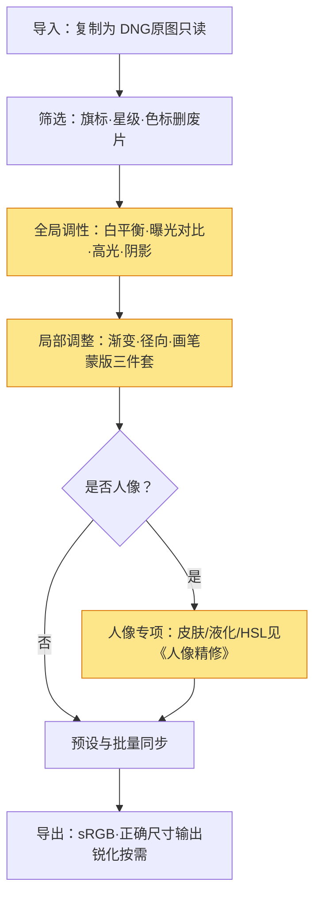
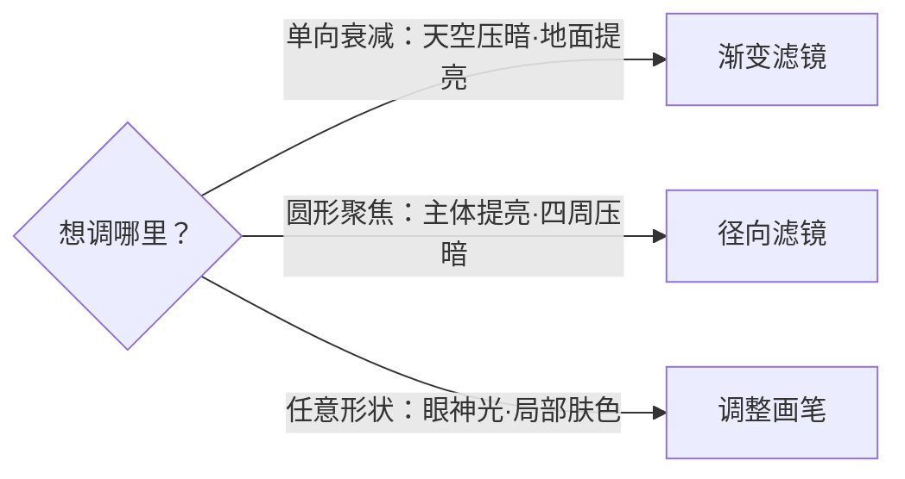

# Lightroom 工作流

> Lightroom（特指 Lightroom Classic 的「图库 + 修改照片」模块，或移动端的「修改照片」）解决的是**海量照片怎么高效、可逆地出片**。它的内核就两条：**非破坏性**（所有调整都是"指令"，原图只读）+ **模块化固定顺序**（导入 → 筛选 → 全局调性 → 局部 → 导出）。本文把这套标准流程讲清楚，让你拍完回来知道先点哪里、别在废片上浪费生命。

如果说《修图基础》教的是"修图在修什么"、《人像精修》教的是"人像具体怎么局部雕"，那这篇教的是"在 Lightroom 里按什么顺序把这些事做完"——它是把前两篇知识落到一个真实软件里的流水线。

## 一、Lightroom 到底解决什么问题

它不是"修图软件"这么简单，而是一个**照片管理系统 + 非破坏性编辑器**的合体：

| 能力 | 解决什么 | 关键动作 |
| --- | --- | --- |
| 批量管理 | 几百上千张 raw 统一浏览、评级、归类 | 图库模块、旗标/星级/色标 |
| 非破坏性 | 怎么改都不碰原图，随时能"一键回到原片" | 调整存为元数据/ sidecar，原文件只读 |
| 固定流程 | 避免一张张凭感觉来回返工 | 导入→筛选→调性→局部→导出 |

> 提示：和 Photoshop 的区别要分清——PS 是"单张精修工坊"（适合人像精修那种深度局部雕刻），Lightroom 是"批量流水线"（适合先把整批照片调到 80 分）。两者互补，不是替代。

## 二、标准流程总览

把全流程串成一条线，每一步对应前面哪篇知识都标好了：

> 一句话：**先筛选、后调整；先全局、后局部**。顺序反了，要么在废片上白做，要么局部蒙版被全局改动顶掉。

## 三、导入与筛选：别在废片上花时间

这是 Lightroom 最被低估的一步，却最能省时间。

- **导入**：选「复制为 DNG」或「添加」（不移动原图），保证原文件只读、不被破坏。
- **筛选**：用旗标（拾弃/留用）、星级（1–5 星）、色标（红/黄/绿分类）快速分流。
- **铁律**：先筛选、再修图。一张明显失焦、构图歪掉的废片，调半小时调不出花来——初筛阶段直接删。

> 提示：筛选时的判断标准就一个——**这张有没有"能用的底"**。曝光差点可以救，失焦、抖動、主体切一半的，基本没救，别舍不得。

## 四、全局调性：Develop 模块的第一步

进入「修改照片」，先动全局，顺序有讲究（详见《修图基础》的"全局调性"）。推荐的滑块顺序：

| 顺序 | 滑块 | 作用 | 常见坑 |
| --- | --- | --- | --- |
| 1 | 白平衡 | 定整体色温色调 | 没校白平衡就调饱和，颜色越调越偏 |
| 2 | 曝光 | 整体亮度归位 | 曝光没回正就拉对比，高光先炸 |
| 3 | 对比度 | 明暗反差 | 过度对比丢灰阶 |
| 4 | 高光 / 阴影 | 救回过曝/死黑细节 | 拉太狠出现灰雾 |
| 5 | 白色 / 黑色色阶 | 定黑白场端点 | 端点不齐画面发灰 |
| 6 | 偏好 / 饱和度 / HSL | 微调色彩倾向 | 饱和拉满变"塑料" |

> 提示：每张图都从「白平衡」开始，这是地基。很多"照片发黄/发绿"的问题，一张白平衡吸管点准中性灰就解决了，根本轮不到后面那些滑块。

## 五、局部调整：蒙版是核心

全局调完，再用蒙版做局部。Lightroom 提供三种蒙版工具，对应三种空间关系：

- **渐变滤镜**：沿一条线单向衰减——最典型是压暗天空、提亮地面。
- **径向滤镜**：以圆心向外衰减——最典型是聚焦主体、压暗四周（暗角反转）。
- **调整画笔**：手绘笔刷圈选任意形状——最典型是提亮眼神光、单独压暗肤色过亮处。

三种工具怎么选，看你要调的区域形状：

> 提示：这里的"蒙版"思路和《人像精修》完全一致——**先选区域，再调参数**。区别只是 Lightroom 的蒙版是调整图层式的，选完直接拖滑块，不用像 PS 那样先建独立蒙版层。

## 六、人像专项（可选）

如果这批是人像，全局+局部做完后，跳到《人像精修》做专项：皮肤蒙版+磨皮、液化结构、HSL 调肤色。这一步放在 Lightroom 局部之后，是因为磨皮会轻微改变皮肤亮度，先统一全局光影再精修更稳（见《人像精修》"标准精修顺序"）。

## 七、预设与批量同步

调好一张"标准照"后，把它的调整封装成**预设**，或把设置**同步**到同批其它照片：

- **预设**：把一组调性方案存成可复用的"滤镜"，适合统一风格。
- **同步设置**：选中多张 → 同步白平衡/曝光/对比等，秒出同批成片。
- **铁律**：批量同步只适合**同场景、同光线**的照片。阴天和晴天各拍的一张强行同步，颜色全错。

> 提示：预设是"起点"不是"终点"。套完预设一定要逐张过一眼，特别是人脸和天空——预设不会知道你这张脸偏黄还是偏红。

## 八、导出

最后一公里，参数错了前面白调：

- **色彩空间**：发网页/社交平台用 **sRGB**（AdobeRGB 在多数浏览器会发灰）；印刷才用 AdobeRGB/ProPhoto。
- **尺寸与分辨率**：屏幕观看 2000px 长边足够；打印才需要 300dpi 原尺寸。
- **输出锐化**：按"屏幕/打印/ matte 纸"选对应档，Lightroom 会在导出时补一道针对性锐化。
- **导出预设**：把上述组合存成预设，以后一键导出。

## 九、标准工作流自查清单

- [ ] 导入时原图是否只读（未覆盖原文件）？
- [ ] 是否**先筛选、再修图**，没在废片上花时间？
- [ ] 顺序是 全局在前、局部在后？
- [ ] 局部蒙版边缘是否干净（没把背景一起改了）？
- [ ] 批量同步的照片是否同场景同光线？
- [ ] 导出是否用了 sRGB + 正确尺寸 + 输出锐化？

## 十、常见误区

- **误区一：在废片上精修。** 失焦、抖动、构图废的片子先删，别拿它们练手。
- **误区二：先局部后全局。** 局部蒙版做好后发现全局曝光要重调，蒙版全错位，白做。
- **误区三：批量同步忽略光线差异。** 同预设强同步阴天/晴天照片，肤色和天空全翻车。
- **误区四：导出用 AdobeRGB 发网页。** 浏览器不认，照片整体发灰发闷，还以为是自己没调好。

## 延伸

- [修图基础](修图基础.md) —— 本文"全局调性 / 蒙版 / 非破坏性"的前置知识
- [人像精修](人像精修.md) —— 本文第六步「人像专项」的详细做法
- [用光](../拍摄技术/用光.md) —— 前期打光好，后期全局压力小一半
- [对焦与景深](../拍摄技术/对焦与景深.md) —— 前期景深决定背景干净度，筛选时就能判断
- [构图](../拍摄技术/构图.md) —— 构图决定"第一眼舒服"，废片多在构图阶段就能筛掉
