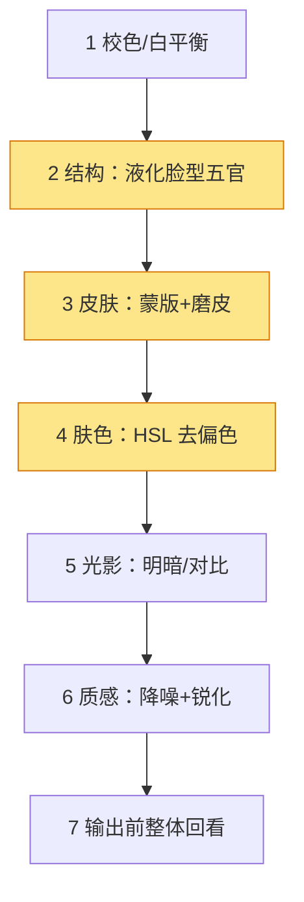

# 人像精修

> 人像精修不是"把人磨平"，而是在《修图基础》的"全局调性"之上，做三件局部的事：**先结构（脸型五官），后皮肤（干净但不塑料），再质感（保留毛孔与光影）**。本文把"蒙版+磨皮"和"肤色校正"两个最常被问的操作讲透。

如果说《修图基础》教的是"修图在修什么"，这篇教的是"人像具体怎么修"——它的核心差异是 **分块**：把一张脸拆成结构、皮肤、肤色、质感几块，各自用不同的局部工具处理，而不是用同一个滑块抹平整张脸。

## 一、精修在流程里的位置

它处在"全局调性之后、导出之前"的**局部阶段**。标准顺序见《Lightroom 工作流》，这里只给一张定位图：

> 一句话：**先让整张图"正确"，再让人"好看"**。没调好曝光就去磨皮，等于在歪的地基上装修。

## 二、心法：结构>皮肤>质感

| 维度 | 解决什么 | 常用工具 | 常见翻车 |
| --- | --- | --- | --- |
| 结构 | 脸型、五官比例、对称 | 液化、变换 | 推太狠变"换头" |
| 皮肤 | 斑、痘、暗沉、均匀度 | 蒙版+磨皮、修复画笔 | 磨成塑料 |
| 肤色 | 偏黄/偏红/偏绿 | HSL、色彩平衡 | 肤色和背景"脱节" |
| 质感 | 毛孔、发丝、衣物纹理 | 锐化、降噪、高频层 | 锐化出白边 / 降噪变糊 |

心法顺序不能反：**结构先定，皮肤次之，质感最后**。先液化脸型，再处理皮肤，最后才做锐化——否则磨完皮发现脸歪了，前面白做。

## 三、皮肤：蒙版 + 磨皮

皮肤处理的第一原则：**只磨皮肤，不磨眼睛、眉毛、嘴唇、头发**。所以步骤一定是"先选皮肤（蒙版），再磨（模糊）"。

> 提示：**选区比强度更重要**。皮肤蒙版没圈准（比如把眼睛也磨了），再小的强度也会让眼神发虚。真实软件里这一步叫"蒙版边缘优化"，目的就是让磨皮只落在皮肤上。

## 四、肤色：用 HSL 校正偏色

人像肤色最常出的问题是 **偏黄（亚洲人像通病）** 或 **偏红（酒后/灯光）**。它不是"加饱和"能解决的，而是要在 HSL 里**单独动橙/黄/红通道的色相与饱和**。

> 提示：真实修图里你**不会动整张脸的 HSL**，而是只对"橙色/黄色/红色"三个通道单独降饱和、调色相——这样背景的绿树红花不会被你一起改掉。

## 五、频率分离

磨皮之所以容易"塑料"，是因为它把**光影（低频）**和**纹理（高频）**一起模糊了。频率分离的做法是先把两者拆开理解：

> 一句话：**低频层只调光影（不改纹理），高频层只修瑕疵（不动光影）**，合并后皮肤干净却仍有毛孔——这就是"高级感磨皮"的本质，也是第三节"只磨皮肤、保留五官"的背后原理。

## 六、结构：液化与五官

结构问题是"脸型、下颌、鼻翼、眼距"。工具是液化（推、拉、旋转），原则是 **结构优先于皮肤**：

- 先定脸型对称、下颌线、鼻梁挺直度，再去做皮肤；
- 液化幅度要小，**参考中线对称**，避免"换头感"；
- 眼睛大小、嘴角上扬这类"表情结构"改动最显假，宁可不动。

> 提示：结构和皮肤的顺序一旦搞反，后果是——你磨完皮、调完肤色，发现脸是歪的，于是又去液化，结果刚才的蒙版全错位，只能重来。

## 七、质感：锐化与降噪

质感分两头：**降噪**去颗粒、**锐化**提纹理。它们的边界是"别过头"。

> 一句话：**降噪别把皮肤磨成瓷，锐化别把毛孔变成砂纸**。质感的目标是"有细节但不脏"。

## 八、标准精修顺序

把上面几块串成固定顺序，避免来回返工：

> 提示：第 5 步"光影"放在皮肤之后，是因为磨皮会轻微改变皮肤亮度，最后再统一光影更稳。

## 九、自查清单

- [ ] 结构：脸型对称、五官比例自然，没有"换头感"？
- [ ] 皮肤：磨皮只落在皮肤上，眼睛/眉毛/嘴唇/头发依然清晰？
- [ ] 肤色：和脖子、手臂连贯，没有"面具感"？背景没被一起改色？
- [ ] 质感：放大看毛孔还在，没有塑料/砂纸感？
- [ ] 整体：缩成小图看，是不是"自然好看"而不是"一看就修过"？

## 十、常见误区

- **误区一：磨皮=模糊整张脸。** 错。磨皮必须配蒙版，只作用皮肤，五官靠"不被选中"保留清晰。
- **误区二：肤色靠加饱和。** 偏黄加饱和只会更黄。要动 HSL 里橙/黄/红通道的**色相**与**饱和**。
- **误区三：锐化提质感。** 锐化是"描边"，不是"补细节"。先有纹理再轻锐，别用锐化掩盖磨皮过度。
- **误区四：结构和皮肤顺序无所谓。** 顺序反了，液化会顶掉已有的皮肤蒙版，白做。

## 延伸

- [修图基础](修图基础.md) —— 本文的"全局调性 / 蒙版 / 直方图"前置知识
- [Lightroom 工作流](Lightroom工作流.md) —— 把本文的局部精修放进标准流程
- [用光](../拍摄技术/用光.md) —— 前期打光好，后期皮肤压力小一半
- [对焦与景深](../拍摄技术/对焦与景深.md) —— 前期景深决定背景干净度
- [构图](../拍摄技术/构图.md) —— 结构和构图共同决定"第一眼舒服"
