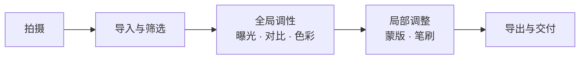
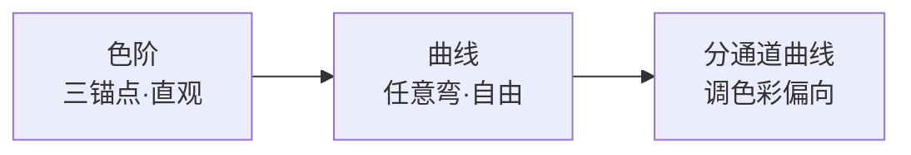

# 修图基础

> 本文为个人知识整理。修图的概念与流程跨软件通用（Lightroom / Photoshop / 手机 app 思路一致）；具体按钮位置因软件而异，建议按"思路"而非"菜单"来学。

拍完一张照片只是开始。修图不是"把图磨美"，而是**把你脑子里想要的画面，用后期手段还原或强化出来**——压暗过亮的天空、提亮欠曝的主体、把偏色的白平衡拉回来。本文先把"修图到底在修什么"讲清楚，再给你两个可拖着玩的互动：调性台和蒙版笔刷。

| 修图回答的问题 | 对应手段 |
| --- | --- |
| 亮不亮、明暗分布对不对 | 曝光、曲线、直方图 |
| 颜色对不对、好不好看 | 白平衡、色温、HSL、饱和度 |
| 哪里清楚、哪里干净 | 锐化、降噪、去瑕疵 |
| 只改画面某一块 | 蒙版、笔刷、局部调整 |
| 构图还能不能再好 | 裁剪、透视校正、旋转 |

> 一句话：**修图是"二次创作"，不是"一键变美"——先想清楚要什么，再动手。**

## 修图在创作链里的位置

修图不是最后一道"美颜"，而是拍摄意图的延续。理解这个顺序，才知道每一步该不该做、先做哪一步：

| 阶段 | 在做什么 | 常见工具 |
| --- | --- | --- |
| 导入与筛选 | 挑出值得修的，删掉废片 | 照片管理软件、星标/旗标 |
| 全局调性 | 先定整张的影调与色温 | 曝光、白平衡、对比、饱和度 |
| 局部调整 | 再修补"整体调好但某一块还差"的地方 | 蒙版、渐变、笔刷 |
| 导出 | 按用途定尺寸、锐化、格式 | 导出面板、预设 |

> 提示：**顺序别反**——先全局后局部。整张的曝光/色温没定，局部怎么修都对不齐；反过来先抠细节再调全局，等于白修。

## 核心心法：非破坏性编辑

新手最容易踩的坑，是直接在原图上涂涂抹抹。专业流程的核心是**非破坏性编辑**：原图像素永远不动，所有修改都"挂"在它上面，随时能关掉、调回、重来。

> 图：非破坏性编辑 —— 原始 RAW 始终只读，调整图层叠加在其上，关掉任一调整即还原。

<svg viewBox="0 0 760 300" width="100%" style="max-width:760px;height:auto" font-family="system-ui,-apple-system,'Segoe UI','PingFang SC','Microsoft YaHei',sans-serif"> <defs><marker id="nd_arr" viewBox="0 0 10 10" refX="8" refY="5" markerWidth="7" markerHeight="7" orient="auto"><path d="M0,0 L10,5 L0,10 z" fill="var(--svg-muted)"/></marker></defs> <rect x="0" y="0" width="760" height="300" rx="14" fill="var(--svg-bg)" stroke="var(--svg-border)"/> <text x="380" y="28" font-size="15" font-weight="700" fill="var(--svg-fg)" text-anchor="middle">非破坏性编辑：原始像素始终不动</text> <g font-size="12" fill="var(--svg-fg)"> <rect x="60" y="60" width="370" height="34" rx="8" fill="var(--svg-fg)" opacity="0.10"/> <rect x="76" y="68" width="18" height="18" rx="4" fill="var(--svg-accent-2)"/> <text x="104" y="82">调整图层③ · 局部笔刷（压暗天空）</text> <rect x="60" y="106" width="370" height="34" rx="8" fill="var(--svg-fg)" opacity="0.10"/> <rect x="76" y="114" width="18" height="18" rx="4" fill="var(--svg-accent)"/> <text x="104" y="128">调整图层② · 白平衡 / 色温</text> <rect x="60" y="152" width="370" height="34" rx="8" fill="var(--svg-fg)" opacity="0.10"/> <rect x="76" y="160" width="18" height="18" rx="4" fill="var(--svg-accent)"/> <text x="104" y="174">调整图层① · 曝光 +0.5</text> <rect x="60" y="198" width="370" height="34" rx="8" fill="var(--svg-fg)" opacity="0.06" stroke="var(--svg-border)" stroke-dasharray="4,3"/> <rect x="76" y="206" width="18" height="18" rx="4" fill="var(--svg-muted)" opacity="0.5"/> <text x="104" y="220" fill="var(--svg-muted)">原始 RAW（只读 · 像素不动）</text> </g> <line x1="200" y1="77" x2="200" y2="215" stroke="var(--svg-grid)" stroke-width="1.5" marker-start="url(#nd_arr)" marker-end="url(#nd_arr)"/> <line x1="430" y1="150" x2="540" y2="150" stroke="var(--svg-accent)" stroke-width="2" marker-end="url(#nd_arr)"/> <g font-size="12" fill="var(--svg-fg)"> <rect x="548" y="120" width="160" height="60" rx="8" fill="var(--svg-accent)" opacity="0.14"/> <text x="628" y="145" text-anchor="middle" font-weight="700">导出成品</text> <text x="628" y="165" text-anchor="middle" font-size="11" fill="var(--svg-muted)">关掉任一调整即还原</text> </g> <text x="380" y="278" font-size="11" fill="var(--svg-muted)" text-anchor="middle">RAW 是无损底片；JPEG 已压缩，后期空间小、易损画质——能拍 RAW 尽量拍 RAW。</text> </svg>

#### 全局调整 vs 局部调整

同一个"改亮一点"，有两种做法，理解差别才不会乱：

| 维度 | 全局调整 | 局部调整 |
| --- | --- | --- |
| 作用范围 | 整张图一起变 | 只改蒙版/笔刷圈定的区域 |
| 典型工具 | 曝光、对比、色温、饱和度 | 蒙版、渐变滤镜、调整笔刷 |
| 适用 | 整体影调、整体色温 | 提亮人脸、压暗天空、单独调色 |
| 风险 | 一处改好别处跟着错 | 边缘生硬、_mask 没擦干净 |

> 图：全局 vs 局部 —— 左边整张统一变化，右边只有圈选区域变化，其余保持原样。

<svg viewBox="0 0 760 280" width="100%" style="max-width:760px;height:auto" font-family="system-ui,-apple-system,'Segoe UI','PingFang SC','Microsoft YaHei',sans-serif"> <defs><linearGradient id="gv_sky" x1="0" y1="0" x2="0" y2="1"><stop offset="0%" stop-color="#9ec5ff"/><stop offset="100%" stop-color="#dcebff"/></linearGradient><clipPath id="gv_c"><rect x="40" y="40" width="320" height="180" rx="10"/></clipPath></defs> <rect x="0" y="0" width="760" height="280" rx="14" fill="var(--svg-bg)" stroke="var(--svg-border)"/> <text x="200" y="26" font-size="14" font-weight="700" fill="var(--svg-fg)" text-anchor="middle">全局调整</text> <text x="560" y="26" font-size="14" font-weight="700" fill="var(--svg-fg)" text-anchor="middle">局部调整</text> <g clip-path="url(#gv_c)"> <rect x="40" y="40" width="320" height="180" fill="url(#gv_sky)"/> <rect x="40" y="40" width="320" height="180" fill="#2b6cff" opacity="0.22"/> <circle cx="120" cy="90" r="26" fill="#ffd54a"/> <polygon points="60,220 150,120 230,180 360,90 360,220" fill="#5b6b8c"/> <rect x="40" y="200" width="320" height="20" fill="#6b8e4e"/> </g> <rect x="40" y="40" width="320" height="180" rx="10" fill="none" stroke="var(--svg-border)"/> <text x="200" y="252" font-size="11" fill="var(--svg-muted)" text-anchor="middle">整张统一加蓝调 · 天空地面一起变</text> <g clip-path="url(#gv_c)"> <rect x="400" y="40" width="320" height="180" fill="url(#gv_sky)"/> <circle cx="480" cy="90" r="26" fill="#ffd54a"/> <polygon points="420,220 510,120 590,180 720,90 720,220" fill="#5b6b8c"/> <rect x="400" y="200" width="320" height="20" fill="#6b8e4e"/> <circle cx="600" cy="150" r="60" fill="#2b6cff" opacity="0.28"/> </g> <rect x="400" y="40" width="320" height="180" rx="10" fill="none" stroke="var(--svg-border)"/> <circle cx="600" cy="150" r="60" fill="none" stroke="var(--svg-accent-2)" stroke-width="2" stroke-dasharray="4,3"/> <text x="560" y="252" font-size="11" fill="var(--svg-muted)" text-anchor="middle">只圈选一处加蓝调 · 其余保持原样</text> </svg>

## 全局调性：曝光 / 对比 / 饱和度

这是修图最常用、也最该先懂的三个旋钮。它们都作用在"整张图"上，互相独立又互相影响。

| 旋钮 | 调的是什么 | 拉高 / 拉低的效果 | 注意 |
| --- | --- | --- | --- |
| 曝光 | 整体明暗 | 高=更亮，低=更暗 | 拉太高会"高光裁切"（死白），拉太低"阴影裁切"（死黑） |
| 对比 | 明暗差距 | 高=更"硬"更通透，低=更"灰"更柔 | 过高会丢中间调细节 |
| 饱和度 | 颜色浓淡 | 高=更鲜艳，低=更素；-100=黑白 | 过高显"塑料感"，风景/美食易过头 |

三者关系：**曝光定"亮不亮"，对比定"反差大不大"，饱和度定"颜色艳不艳"**。很多"废片"只是曝光偏暗 + 对比偏低，拉两下就活了。

> 图：调性台（可互动）—— 拖动三颗滑块，看同一场景的亮度、反差、艳度如何实时变化；底部直方图会随曝光左右移动，撞到边缘即"裁切"。

<svg viewBox="0 0 760 470" width="100%" style="max-width:760px;height:auto;touch-action:none" font-family="system-ui,-apple-system,'Segoe UI','PingFang SC','Microsoft YaHei',sans-serif"> <defs> <linearGradient id="tl_sky" x1="0" y1="0" x2="0" y2="1"><stop offset="0%" stop-color="#7fb2ff"/><stop offset="100%" stop-color="#cfe3ff"/></linearGradient> <clipPath id="tl_scene"><rect x="40" y="46" width="680" height="320" rx="10"/></clipPath> </defs> <rect x="0" y="0" width="760" height="470" rx="14" fill="var(--svg-bg)" stroke="var(--svg-border)"/> <text x="380" y="28" font-size="15" font-weight="700" fill="var(--svg-fg)" text-anchor="middle">调性台：曝光 · 对比 · 饱和度</text> <g clip-path="url(#tl_scene)"> <g class="wb-photo"> <rect x="40" y="46" width="680" height="320" fill="url(#tl_sky)"/> <circle cx="630" cy="108" r="30" fill="#ffd54a"/> <circle cx="630" cy="108" r="46" fill="#ffd54a" opacity="0.25"/> <polygon points="40,250 180,150 300,220 420,140 560,210 720,150 720,366 40,366" fill="#5b6b8c"/> <rect x="40" y="300" width="680" height="66" fill="#6b8e4e"/> <rect x="150" y="250" width="14" height="60" fill="#6b4a2b"/> <circle cx="157" cy="244" r="34" fill="#3f7d3a"/> <circle cx="120" cy="252" r="22" fill="#3f7d3a"/> <circle cx="194" cy="252" r="22" fill="#3f7d3a"/> <circle cx="400" cy="330" r="16" fill="#e2473d"/> <circle cx="400" cy="318" r="9" fill="#ef7d6b"/> <rect x="470" y="278" width="26" height="58" fill="#caa46a"/> <rect x="466" y="296" width="34" height="22" fill="#b5835a"/> </g> </g> <line x1="60" y1="350" x2="700" y2="350" stroke="var(--svg-grid)"/> <g class="wb-hist"></g> <rect class="wb-clip-left" x="60" y="300" width="14" height="50" fill="#e2483d" opacity="0"/> <rect class="wb-clip-right" x="686" y="300" width="14" height="50" fill="#e2483d" opacity="0"/> <text x="60" y="370" font-size="11" fill="var(--svg-muted)">亮度分布（示意）</text> <rect class="wb-ev-track" x="60" y="390" width="200" height="10" rx="5" fill="var(--svg-grid)" style="cursor:pointer"/> <rect class="wb-co-track" x="290" y="390" width="200" height="10" rx="5" fill="var(--svg-grid)" style="cursor:pointer"/> <rect class="wb-sa-track" x="520" y="390" width="200" height="10" rx="5" fill="var(--svg-grid)" style="cursor:pointer"/> <text x="160" y="384" font-size="11" fill="var(--svg-fg)" text-anchor="middle">曝光 EV</text> <text x="390" y="384" font-size="11" fill="var(--svg-fg)" text-anchor="middle">对比</text> <text x="620" y="384" font-size="11" fill="var(--svg-fg)" text-anchor="middle">饱和度</text> <g class="wb-ev-handle" transform="translate(160,395)" style="cursor:grab;touch-action:none"><line x1="0" y1="-12" x2="0" y2="12" stroke="var(--svg-fg)" stroke-width="3"/><circle cx="0" cy="0" r="7" fill="var(--svg-accent)"/></g> <g class="wb-co-handle" transform="translate(390,395)" style="cursor:grab;touch-action:none"><line x1="0" y1="-12" x2="0" y2="12" stroke="var(--svg-fg)" stroke-width="3"/><circle cx="0" cy="0" r="7" fill="var(--svg-accent)"/></g> <g class="wb-sa-handle" transform="translate(620,395)" style="cursor:grab;touch-action:none"><line x1="0" y1="-12" x2="0" y2="12" stroke="var(--svg-fg)" stroke-width="3"/><circle cx="0" cy="0" r="7" fill="var(--svg-accent)"/></g> <text class="wb-tl-readout" x="380" y="438" font-size="13" font-weight="700" fill="var(--svg-accent)" text-anchor="middle">曝光 +0.0EV · 对比 0 · 饱和 0</text> </svg>

#### 三个常见误操作

- **曝光拉满想"救暗"**：宁可前期拍亮一点（RAW 留高光），后期只微调；硬拉曝光，噪点和高光一起炸。
- **饱和度当"美颜"狂加**：风光、美食容易过艳发假；更专业的做法是分颜色调（HSL：只提橙色的夕阳、只降绿色的杂草）。
- **对比一刀切**：人像、胶片风常要"低对比+保留中间调"，把对比拉爆反而丢了皮肤层次。

## 读图：直方图

直方图是修图的"仪表盘"——横轴是亮度（左暗右亮），纵轴是"这个亮度的像素有多少"。**学会读它，比盯着缩略图准得多**，因为屏幕会骗你（亮度、环境光都影响判断）。

> 图：直方图形态对照 —— 四种典型形状，各自对应一种拍摄/修图状态。

<svg viewBox="0 0 760 300" width="100%" style="max-width:760px;height:auto" font-family="system-ui,-apple-system,'Segoe UI','PingFang SC','Microsoft YaHei',sans-serif"> <defs></defs> <rect x="0" y="0" width="760" height="300" rx="14" fill="var(--svg-bg)" stroke="var(--svg-border)"/> <text x="380" y="26" font-size="15" font-weight="700" fill="var(--svg-fg)" text-anchor="middle">直方图形态对照</text> <g font-size="11" fill="var(--svg-muted)"> <rect x="40" y="40" width="150" height="120" rx="8" fill="none" stroke="var(--svg-border)"/> <text x="115" y="56" fill="var(--svg-fg)" font-size="12" font-weight="700" text-anchor="middle">正常</text> <polygon points="46,148 66,128 86,100 106,84 121,80 136,84 156,100 176,128 186,148" fill="var(--svg-accent)" opacity="0.7"/> <line x1="40" y1="148" x2="190" y2="148" stroke="var(--svg-grid)"/> <text x="115" y="185" text-anchor="middle">分布居中 · 细节全</text> <rect x="210" y="40" width="150" height="120" rx="8" fill="none" stroke="var(--svg-border)"/> <text x="285" y="56" fill="var(--svg-fg)" font-size="12" font-weight="700" text-anchor="middle">欠曝</text> <polygon points="216,148 236,126 256,138 276,158 296,174 316,184 336,190 356,192 360,190" fill="var(--svg-accent)" opacity="0.7"/> <line x1="210" y1="148" x2="360" y2="148" stroke="var(--svg-grid)"/> <text x="285" y="185" text-anchor="middle">堆在左边 · 偏暗</text> <rect x="380" y="40" width="150" height="120" rx="8" fill="none" stroke="var(--svg-border)"/> <text x="455" y="56" fill="var(--svg-fg)" font-size="12" font-weight="700" text-anchor="middle">过曝</text> <polygon points="386,188 406,186 426,180 446,170 466,150 486,126 506,110 521,110 536,110" fill="var(--svg-accent)" opacity="0.7"/> <line x1="380" y1="148" x2="530" y2="148" stroke="var(--svg-grid)"/> <text x="455" y="185" text-anchor="middle">堆右边+撞墙 · 死白</text> <rect x="550" y="40" width="150" height="120" rx="8" fill="none" stroke="var(--svg-border)"/> <text x="625" y="56" fill="var(--svg-fg)" font-size="12" font-weight="700" text-anchor="middle">低对比</text> <polygon points="556,144 576,132 596,124 616,120 636,120 656,120 676,124 696,132 706,144" fill="var(--svg-accent)" opacity="0.7"/> <line x1="550" y1="148" x2="700" y2="148" stroke="var(--svg-grid)"/> <text x="625" y="185" text-anchor="middle">矮胖铺开 · 发灰</text> </g> <text x="380" y="280" font-size="11" fill="var(--svg-muted)" text-anchor="middle">"撞墙"（贴着左右边缘且堆成竖墙）= 该端像素被裁切、细节永久丢失。</text> </svg>

| 形状 | 含义 | 修图动作 |
| --- | --- | --- |
| 正常（居中钟形） | 明暗分布合理，细节都在 | 基本不用动 |
| 欠曝（堆左侧） | 整体偏暗，暗部可能死黑 | 提曝光 / 拉亮阴影 |
| 过曝（堆右侧撞墙） | 高光溢出，天空/白墙死白 | 降曝光 / 压高光（已溢出的救不回） |
| 低对比（矮胖） | 灰蒙蒙，反差不足 | 加对比 / 加清晰度 |

> 提示：**直方图没有"标准答案"**——夜景本来就堆左边，雪景本来就堆右边，这是正常的。看它，是为了发现"不该有的裁切"和"该有的反差丢了"。

## 白平衡与色温

白平衡解决"白色是不是白的"。同一张白纸，在暖光下偏黄、在冷光下偏蓝——相机需要你告诉它"现场光是几 K"，才能把白纸还原成白。这部分原理在 [用光](../拍摄技术/用光.md) 里讲得更细，这里只强调修图侧的两点：

- **RAW 后期调白平衡无损**：RAW 存的是传感器原始数据，白平衡只是"元数据"，随便改不损画质；JPEG 的白平衡已经"烤进"像素，再改会损。
- **白平衡是创作工具，不止还原**：刻意设冷让雪景清冽、设暖让灯光暖融，都是常见玩法。

> 提示：修图软件里的"白平衡偏移 / 色调"轴（蓝-琥珀、绿-洋红）能微调肤色——人像里拉一点绿-洋红常比拉饱和度更自然。

## 局部修图：蒙版与笔刷

当"整体调好了，但就这一块还差"时，就要局部调整。它的本质就三步：**选区域（蒙版）→ 选工具（笔刷/渐变）→ 调参数**。蒙版决定"改哪里"，参数决定"改成什么样"，两者解耦，所以能反复擦改而不伤原图。

> 图：蒙版笔刷（可互动）—— 在过亮的天空上拖动笔刷，蒙版被涂抹的区域会压暗；想重来点"清空"。

<svg viewBox="0 0 760 470" width="100%" style="max-width:760px;height:auto;touch-action:none" font-family="system-ui,-apple-system,'Segoe UI','PingFang SC','Microsoft YaHei',sans-serif"> <defs> <linearGradient id="mb_sky" x1="0" y1="0" x2="0" y2="1"><stop offset="0%" stop-color="#eef4ff"/><stop offset="100%" stop-color="#cfe0ff"/></linearGradient> <clipPath id="mb_skyclip"><rect x="40" y="46" width="680" height="210" rx="6"/></clipPath> </defs> <rect x="0" y="0" width="760" height="470" rx="14" fill="var(--svg-bg)" stroke="var(--svg-border)"/> <text x="380" y="28" font-size="15" font-weight="700" fill="var(--svg-fg)" text-anchor="middle">蒙版笔刷：只压暗过亮的天空</text> <g clip-path="url(#mb_skyclip)"> <rect x="40" y="46" width="680" height="210" fill="url(#mb_sky)"/> <circle cx="600" cy="100" r="26" fill="#fff3c4"/> <circle cx="600" cy="100" r="40" fill="#fff3c4" opacity="0.5"/> </g> <polygon points="40,256 180,176 300,230 430,168 560,222 720,176 720,366 40,366" fill="#5b6b8c"/> <rect x="40" y="320" width="680" height="46" fill="#6b8e4e"/> <g fill="#caa46a"><rect x="300" y="300" width="22" height="40"/><rect x="296" y="312" width="30" height="16"/></g> <g fill="#caa46a"><rect x="470" y="300" width="22" height="40"/><rect x="466" y="312" width="30" height="16"/></g> <g class="wb-sky-mask" clip-path="url(#mb_skyclip)"></g> <rect class="wb-sky-hit" x="40" y="46" width="680" height="210" fill="transparent" style="cursor:crosshair"/> <text x="380" y="402" font-size="12" fill="var(--svg-muted)" text-anchor="middle">在上方天空区域按住拖动，把过亮处一笔笔压暗</text> <g class="wb-brush-reset" transform="translate(610,420)" style="cursor:pointer"><rect x="-34" y="-16" width="68" height="28" rx="14" fill="var(--svg-fg)" opacity="0.08" stroke="var(--svg-border)"/><text x="0" y="4" font-size="12" fill="var(--svg-fg)" text-anchor="middle">清空</text></g> <text class="wb-mb-readout" x="200" y="426" font-size="13" font-weight="700" fill="var(--svg-accent)" text-anchor="middle">已涂抹 0 笔</text> </svg>

#### 蒙版的三种常见形态

| 形态 | 怎么来的 | 适合 |
| --- | --- | --- |
| 笔刷涂抹 | 手动刷出任意形状 | 人物皮肤、局部提亮、擦除杂物 |
| 渐变滤镜 | 拉一道线，沿方向递减 | 压暗天空、提亮地面、地平线补光 |
| 亮度/颜色蒙版 | 按"多亮/什么色"自动选区 | 只调高光、只调天空蓝、只调肤色 |

> 提示：**蒙版是"灰度"的**——刷得越浓改得越多，半透明的笔刷=改一半。所以笔刷硬度、流量决定了边缘生不生动，别一上来用 100% 硬边。

## 锐化与降噪

传感器和镜头天然会"软"和"脏"，这两步是画质的收尾：

| 操作 | 解决什么 | 拉过高的后果 | 建议 |
| --- | --- | --- | --- |
| 锐化 | 边缘对比不足、发软 | 白边、噪点被放大、皮肤起屑 | 数值宁低勿高，配合"蒙版"只锐边缘 |
| 降噪 | 高 ISO 的彩色/亮度噪点 | 抹掉细节、塑料感、丢了纹理 | 只降需要的量，亮度噪点优先 |

> 提示：**锐化和降噪是"互搏"的**——降噪会糊，锐化会显噪。顺序一般是先降噪（去脏）再锐化（收边），且二者都放在**导出前最后一步**，因为导出会重新采样，锐化要按输出尺寸重做。

## 曲线与色阶（进阶）

曝光、对比只是"曲线"的两个特例。**曲线（Curves）** 是把"输入亮度 → 输出亮度"画成一条线，你随便弯它：

- 往左上提 = 提亮，往右下压 = 压暗（等价曝光）；
- 拉成 S 形 = 加对比，拉成反 S = 降对比；
- 分 RGB 通道分别拉 = 调色彩（比如只压蓝色高光让天空更暖）。

色阶（Levels）是曲线的"简化版"，用黑/灰/白三个滑块定暗部、中间调、高光三个锚点，更直观但不如曲线自由。

> 提示：新手先用色阶定"黑白场"（把直方图左右拉到刚好不裁切），再用曲线微调反差，是最稳的入门路径。

## 推荐工作流顺序

一套不出错的标准流程，照着走就行：

1. **筛选**：先删废片，只修值得修的。
2. **镜头校正**：去畸变、去暗角（RAW 软件自动）。
3. **裁剪与旋转**：先定构图，免得后面白修。
4. **白平衡**：定整体色温，让白是白。
5. **曝光 / 对比**：定整体影调，看直方图别裁切。
6. **高光 / 阴影**：找回两端细节。
7. **HSL / 饱和度**：分颜色调，别整体狂加。
8. **局部调整**：蒙版笔刷补该补的地方。
9. **降噪 → 锐化**：画质收尾，放最后。
10. **导出**：按用途定尺寸、格式、色彩空间。

> 提示：第 4–7 步就是上面"调性台"那一套；流程里**先全局后局部、先影调后颜色、降噪锐化放最后**，顺序错了会返工。

## 新手自查清单

修完一张，对照过一遍：

- [ ] 直方图有没有"撞墙"的死白/死黑？高光、阴影细节还在吗？
- [ ] 白平衡对吗？白色看起来是白的吗？（别只信屏幕）
- [ ] 主体够不够突出？需不需要局部提亮/压暗？
- [ ] 饱和度是不是过了？有没有"塑料感"？
- [ ] 锐化边缘有没有白边、皮肤有没有起屑？
- [ ] 裁剪后构图还成立吗？有没有歪？

## 常见误区

- **"修图 = 磨皮美白"** —— 那是美颜 app 的思路；真正的修图先解决影调、色彩、构图，皮肤只是其中一小步。
- **"原图越暗越好，后期拉回来"** —— 暗部拉回来的是噪点，不是细节；前期拍亮（留高光）比后期救暗稳得多。
- **"饱和度拉满是'更鲜艳'"** —— 过饱和会发假、丢过渡，分颜色（HSL）调才高级。
- **"锐化越狠越清楚"** —— 锐化只加边缘对比，不补细节；拉过反而出白边、显噪点。
- **"JPEG 也能随便调"** —— JPEG 已压缩，白平衡、曝光余地都很小且损画质；能拍 RAW 就拍 RAW。
- **"局部调整随便刷"** —— 100% 硬边笔刷刷出的边缘很假；用软边、低流量、再擦回，过渡才自然。
- **"看屏幕觉得对了就行"** —— 屏幕亮度、环境光都会骗你；**直方图才是客观依据**。

> **延伸**
> - 光线与色温原理：[用光](../拍摄技术/用光.md)（含可互动色温条）
> - 决定"清楚多少"的前期手段：[对焦与景深](../拍摄技术/对焦与景深.md)
> - 决定"亮不亮"的参数：[曝光三要素](../器材/曝光三要素.md)
> - 把画面安排好：[构图](../拍摄技术/构图.md)
> - 人像专项的局部精修：[人像精修](人像精修.md)
> - 落到软件的标准流程：[Lightroom 工作流](Lightroom工作流.md)
> - 色彩的情绪语言：方法论 [色彩理论](../../自媒体运营/方法论/色彩理论.md)
