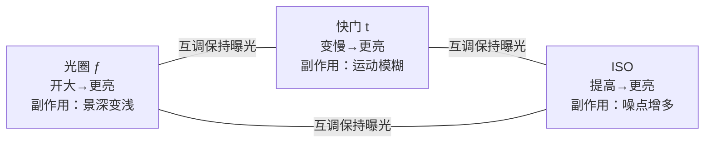
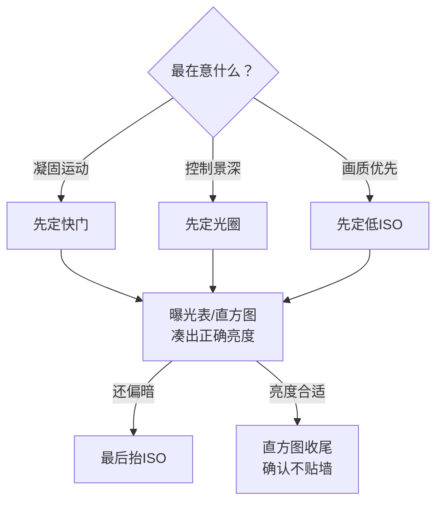

# 曝光三要素

> 本文为个人知识整理。核心原理与各相机厂商的曝光说明一致；文中的数值为通用经验值，具体以你的器材为准。

曝光由三个参数共同决定——**光圈、快门、ISO**。它们都影响"照片亮不亮"，但各自还附带一种"副作用"：光圈牵动景深、快门牵动运动模糊、ISO 牵动噪点。理解这组 trade-off，是摄影最底层的内功。

| 要素 | 控制什么 | 调大（更亮）时… | 主要副作用 | 典型调节手段 |
| --- | --- | --- | --- | --- |
| 光圈 ƒ | 进光面积（镜头开口） | 进光↑、景深↓ | 景深变浅、背景虚化 | 镜头光圈环 / 机身拨盘 |
| 快门 t | 进光时间（帘幕开合） | 进光↑、易糊 | 运动模糊 / 手抖 | 快门优先模式、拨盘 |
| ISO | 传感器增益（放大信号） | 亮度↑ | 噪点增多 | 自动 ISO 或手动设定 |

## 曝光三角：三者如何互相牵制

要维持同一亮度，三个参数此消彼长：开大一级光圈多进的光，必须靠调快一级快门、或降一级 ISO 来"还回去"。



> 一句话：**亮度由三者共同决定，观感由你"先妥协哪一个"决定。**

## 档位语言：一档 = 进光翻倍 / 减半

#### 为什么曝光要用"档"来计量

"档"（stop）是曝光的基本计量单位。**每增加 1 档，进光量翻倍；每减少 1 档，进光量减半。** 光圈、快门、ISO 都有各自的整档序列，相邻档位之间正好差一档——这就是"互调保持曝光"能成立的原因：一个参数升一档，另一个参数降一档，总亮度不变。

#### 三要素的整档序列对照

| 要素 | 整档序列（每往右一档，进光减半） | 记忆要点 |
| --- | --- | --- |
| 光圈 | ƒ/1.4 → 2 → 2.8 → 4 → 5.6 → 8 → 11 → 16 → 22 | 数值越大开口越小，序列按 √2≈1.4 倍增 |
| 快门 | 1/1000 → 1/500 → 1/250 → 1/125 → 1/60 → 1/30 → 1/15 → 1/8 → 1/4 → 1/2 → 1s | 往右一格 = 曝光时间翻倍 |
| ISO | 100 → 200 → 400 → 800 → 1600 → 3200 → 6400 | 数值直接翻倍，最直观 |

#### 用"档"思考等效曝光

举例：ƒ/4 · 1/250s · ISO 100 曝光正确，想保持亮度不变，下面三种组合都等效：

- 开大两档光圈 → **ƒ/2** · 1/250s · ISO 100（景深变浅）
- 放慢一档快门 + 降一档 ISO → ƒ/4 · **1/125s** · **ISO 50**（更稳、画质更好，若相机支持）
- 提两档 ISO → ƒ/4 · 1/250s · **ISO 400**（暗光保快门，噪点上升）

> 提示：相机上"三分之一档"的步进（如 ISO 100→125→160）只是把整档细分，方便微调，逻辑相同。

## 光圈（Aperture）

#### 是什么

光圈是镜头里可变大变小的开口，用 **ƒ 值**（如 ƒ/2.8）表示。注意 ƒ 值越小开口越大：ƒ/1.4 比 ƒ/16 进光多很多。相邻整档近似每档翻倍/减半进光量：ƒ/1.4 → 2 → 2.8 → 4 → 5.6 → 8 → 11 → 16 → 22。

#### 对画面的影响：景深

开口越大（ƒ 值越小），景深越浅——焦平面外的背景越虚化；开口越小，前后越清晰。这是人像"奶油虚化"和风光"全清晰"的分水岭。同时注意镜头在中间档位（通常 ƒ/5.6–8）画质最锐，叫"最佳光圈"。

#### 怎么选：典型取值与场景

| 场景 | 推荐 ƒ | 目的 |
| --- | --- | --- |
| 人像特写 | ƒ/1.4–2.8 | 虚化背景、突出主体 |
| 日常 / 纪实 | ƒ/4–8 | 兼顾清晰与景深 |
| 风光 / 建筑 | ƒ/8–11 | 前后都清晰（最佳光圈附近） |
| 夜景（需景深） | ƒ/11–16 | 整体清晰，靠慢门补光 |

## 快门（Shutter）

#### 是什么

快门控制传感器"见光"的时长，用秒或分数表示：1/1000s 极短，1s、30s 较长。时间越长进光越多，但也越容易记录"运动"。**安全快门**≈ 1/焦距（如 50mm 镜头手持底线约 1/50s），有防抖可放宽 2–4 档。

#### 对画面的影响：运动模糊

高速快门凝固动作；慢速快门把运动拉成轨迹（流水丝绢、车灯拉线）。手持时快门过慢还会把"手抖"也拍进去——手抖和运动模糊不同：手抖是全画面糊，运动模糊是主体拖影。

#### 怎么选：典型取值与场景

| 场景 | 推荐速度 | 目的 |
| --- | --- | --- |
| 运动 / 飞鸟 | 1/1000s 以上 | 凝固瞬间 |
| 手持通用 | ≈ 1/焦距（如 50mm→1/50s） | 防手抖底线 |
| 流水丝绢 | 1/4s–数秒（三脚架） | 柔化水流 |
| 星轨 / 光绘 | 数秒–30s | 长曝光创作 |

## 感光度 ISO

#### 是什么

ISO 是传感器对光信号的放大倍数。它不是"多捕光"，而是把已有信号放大——所以放大得越狠，原本微弱的信号和噪点一起被放大。

#### 对画面的影响：噪点

ISO 越低画质越干净（常用原生最低 100）；越高越亮但颗粒/彩噪越明显。现代相机在 1600–3200 通常仍可用；**原生 ISO**（如 100）画质最佳，扩展 ISO（如 50/6400+）多为软件处理，尽量避开。

#### 怎么选：典型取值与场景

| 场景 | 推荐 ISO | 目的 |
| --- | --- | --- |
| 晴天户外 | 100–200 | 最佳画质 |
| 阴天 / 室内窗边 | 400–800 | 补偿光线 |
| 夜景手持 | 1600–3200 | 提亮（噪点可接受） |
| 极限弱光 | 6400+ | 保快门，噪点为代价 |

## 曝光补偿（EV±）与直方图

#### 什么是曝光补偿

相机测光会"自作主张"把画面判成中灰色（18% 灰）。遇到大面积白色（雪景、白墙）或强烈逆光，自动曝光会偏暗或偏灰——这时用 **±EV 拨盘**在自动曝光基础上整体加亮/减暗：`+1EV` = 提亮一档，`-1EV` = 压暗一档。

| 场景 | 常见补偿 | 原因 |
| --- | --- | --- |
| 雪景 / 白墙 | +1 左右 | 大片白色骗过测光，需手动提亮 |
| 逆光剪影 | -1 左右 | 想压暗背景突出轮廓 |
| 舞台 / 追光 | +0.3–0.7 | 亮部占比小，自动测光偏保守 |

#### 直方图怎么读

直方图是**唯一客观的曝光判读工具**——屏幕亮度会骗你，直方图不会。横轴是亮度（左暗右亮），纵轴是像素数量。

```text
|■■■■■■■■■□□□□□□□□□□□□|  欠曝：山峰偏左贴墙 → 暗部死黑
|■■□□□□□□□□□□□□□□□□■■|  正常：山峰居中、两端不贴墙
|□□□□□□□□□□□□□□■■■■■■■|  过曝：山峰偏右贴墙 → 高光死白
```

| 直方图形状 | 含义 | 处理 |
| --- | --- | --- |
| 山峰居中、两端不贴墙 | 曝光正常，明暗细节都在 | 不用动 |
| 山峰偏左、左端贴墙 | 欠曝，暗部压死 | +EV 提亮，或补光 |
| 山峰偏右、右端贴墙 | 过曝，高光溢出 | -EV 压暗，或减光 |

> 提示：**死白（高光溢出）后期救不回来，死黑（暗部压死）还能从 RAW 里拉回一部分**——所以拿不准时宁可略欠曝。

## 测光模式

相机测光决定"它认为多亮才算正确"。选错模式，同一场景拍出来会忽明忽暗。

| 模式 | 测光范围 | 适合场景 | 注意 |
| --- | --- | --- | --- |
| 评价 / 矩阵测光 | 全画面加权平均 | 日常、风光、大多数场景 | 默认首选 |
| 中央重点测光 | 中央区域为主 | 主体居中的肖像 | 边缘过亮/过暗会干扰 |
| 点测光 | 极小区域（约 3–5%） | 逆光人像、舞台追光 | 对准主体亮部或暗部，误差大 |

> 提示：如果同一场景测光结果忽明忽暗，多半是**对焦点位置变了**——点测光跟随对焦点，对到亮处就压暗、对到暗处就提亮。

## 过曝 vs 欠曝：动态范围怎么用

#### 动态范围是什么

传感器能记录的明暗跨度叫动态范围。超出这个跨度，亮部死白、暗部死黑，细节就丢了。RAW 文件的动态范围通常比 JPEG 大 2 档左右，这也是"宁欠勿过"说法的来源。

#### 向左曝光还是向右曝光

- **保守派（向左曝光）**：刻意略欠曝，保护高光。暗部噪点后期能压，高光死白拉不回。
- **进阶派（向右曝光 / ETTR）**：在不过曝死白的前提下尽量拍亮，最大化记录信息，后期压暗后噪点更少。需要直方图配合，初学者慎用。
- **中间派**：日常直接相信直方图"山峰不贴墙"，简单可靠。

> 一句话：**高光细节是一次性的，暗部噪点是可挽回的。** 新手优先"宁欠勿过"，进阶再练 ETTR。

## 实战：先定哪一个？

不是"三个一起调"，而是**先锁定最在意的那个约束**，再用另外两个去凑正确曝光：



> 原则：**先保创意（快门/光圈），再保画质（ISO 能不升就不升），最后看直方图收尾。**

## 典型场景参数速查

把上面的单要素表合成一张"抄作业"表——记住方向，数值按你的器材微调：

| 场景 | 光圈 | 快门 | ISO | 备注 |
| --- | --- | --- | --- | --- |
| 白天人像（虚化） | ƒ/1.8–2.8 | 1/500s+ | 100 | 大光圈 + 高速快门 |
| 阴天街拍 | ƒ/4 | 1/125s | 400 | 均衡三件套 |
| 夜景手持人像 | ƒ/1.8 | 1/60s | 1600–3200 | 快门贴近安全线 |
| 风光（三脚架） | ƒ/8–11 | 1/4–1/30s | 100 | 低 ISO 长曝 |
| 流水丝绢 | ƒ/11 | 1/2–2s | 100 | 常需 ND 滤镜 |
| 星空 | ƒ/2.8 | 15–25s | 3200–6400 | 500 法则防拖线 |
| 运动 / 飞鸟 | ƒ/4–5.6 | 1/1000s+ | 800–1600 | 连拍 + 追焦 |

> 500 法则：最长快门 ≈ 500 ÷ 焦距（全画幅）。如 24mm 镜头最多约 20s，超过会出现星轨拖线。

## 完整推算示例：阴天街拍人像

走一遍完整推理链，看"先创意、后画质"怎么落地：

1. **场景判断**：阴天光线一般，想虚化背景突出人物。
2. **先定光圈**：ƒ/2.8——兼顾虚化和进光。
3. **再定快门**：50mm 镜头，安全线 1/50s，取 1/125s 留出防抖余量。
4. **看曝光表**：ƒ/2.8 · 1/125s 在阴天明显偏暗。
5. **最后抬 ISO**：从 100 逐档抬到 800，取景器预览亮度合适。
6. **直方图收尾**：山峰居中略偏右、不贴墙——高光没死，暗部有细节。
7. **出片**：ƒ/2.8 · 1/125s · ISO 800。

> 换一种拍法：同样的光线，想拍流水丝绢 → 上三脚架、ƒ/11、ISO 100，快门放到 1s，就是完全不同的画面。**参数只是手段，你想表达什么才是起点。**

## 常见误区

- **"ISO 越大越亮，所以暗处直接拉满"** —— ISO 不捕光，只放大；拉满是以噪点换亮度，应优先开光圈、稳快门、补光。
- **"ƒ 值越大光圈越大"** —— 相反：ƒ/2.8 比 ƒ/16 开口大、更亮、更虚。
- **"曝光正确就行，三个随便组合"** —— 同样亮度下，ƒ/2.8·1/1000·ISO100 与 ƒ/16·1/30·ISO6400 观感天差地别（虚化、模糊、噪点完全不同）。
- **"直方图看着差不多就行"** —— 只要山峰贴墙就是死白/死黑，后期救不回，必须当场处理。
- **"雪景拍出来灰蒙蒙是相机坏了"** —— 是测光被大片白色骗了，按 +1EV 补偿即可。

> **延伸**
> - 景深与对焦：[对焦与景深](../拍摄技术/对焦与景深.md)
> - 构图与光线：[构图](../拍摄技术/构图.md)、[用光](../拍摄技术/用光.md)
> - 后期思路：[Lightroom 工作流](../后期处理/Lightroom工作流.md)、[修图基础](../后期处理/修图基础.md)
