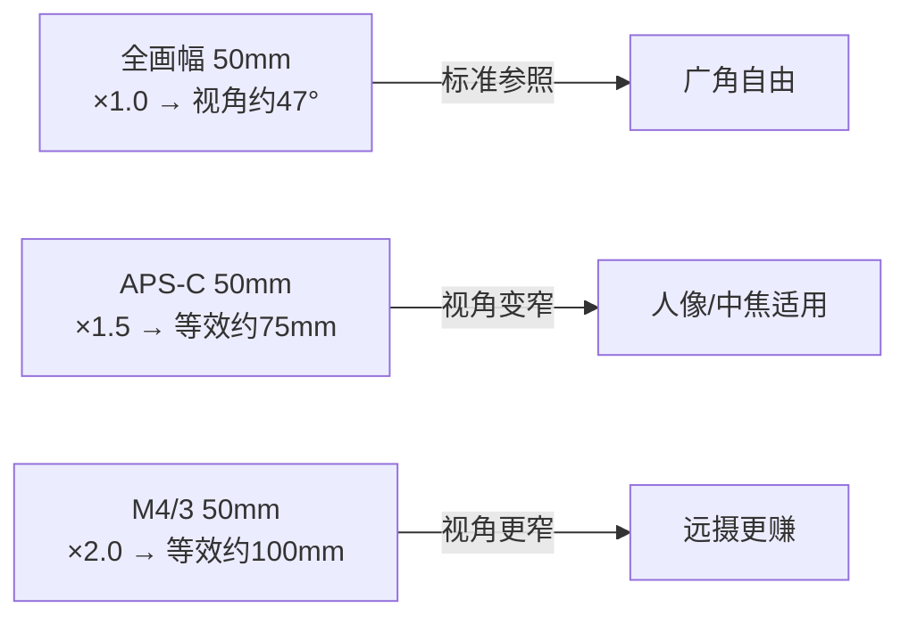
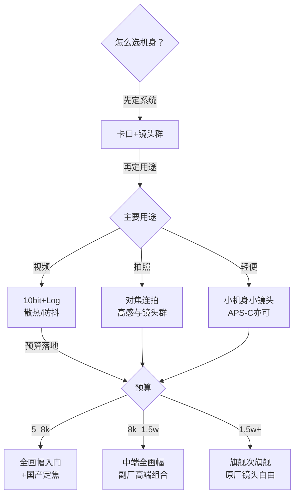

# 相机机身

> 本文为个人知识整理，用于理解"怎么选机身"。核心原理与各厂商说明一致；文中不写死具体型号参数，价格与规格随新款更新，选购时请按需核对最新市售信息。

机身是相机的"心脏"——它决定你用什么画幅、能拍多快、对焦多准、镜头配什么卡口。选机身本质上是选**系统**：一旦定了卡口，镜头群就被绑定，换机身的成本远低于换系统。所以先理解参数背后的 trade-off，再谈型号。

| 维度 | 机身决定什么 | 换机身的成本 |
| --- | --- | --- |
| 画幅 | 画质上限、高感、景深、体积价格 | 中等（机身易换） |
| 卡口 | 能用哪些镜头、转接空间 | **最高（系统锁定）** |
| 对焦/连拍 | 能不能拍到"决定性瞬间" | 中等 |
| 视频能力 | 能不能当生产力工具 | 中等 |
| 防抖/操控 | 手持可用性、使用体验 | 低 |

> 一句话：**先选系统（卡口），再挑机身，镜头预算至少留一半。**

## 画幅：机身的第一分水岭

#### 画幅是什么

画幅指传感器尺寸。从大到小大致是：中画幅 > 全画幅 > APS-C > M4/3 > 1 英寸。画幅越大，单个像素"收光"的面积越大，同等条件下信噪比越高——这是画质差异的物理根源。

| 画幅 | 传感器尺寸（约） | 常见定位 | 优点 | 代价 |
| --- | --- | --- | --- | --- |
| 中画幅 | 44×33mm | 商业/风光 | 画质天花板、高感细腻 | 体积大、镜头贵、连拍弱 |
| 全画幅 | 36×24mm | 专业/进阶 | 均衡上限高、镜头生态全 | 机身与镜头都贵 |
| APS-C | 约 24×16mm | 入门/轻便 | 性价比高、机身小巧 | 高感略弱、等效焦距换算 |
| M4/3 | 17.3×13mm | 便携/视频 | 轻量、防抖强、长焦等效赚 | 画质上限低、暗光吃力 |
| 1 英寸 | 13.2×8.8mm | 卡片/无人机 | 极轻 | 画质与可换镜头有差距 |

#### 等效焦距：镜头数字要乘系数

传感器越小，同一支镜头拍到的视角越窄。全画幅为标准 1.0，APS-C 约 ×1.5（佳能 ×1.6），M4/3 约 ×2.0。意思是 50mm 镜头在 APS-C 机身上视角接近全画幅的 75mm——**拍人像更"赚"长焦，拍广角更"吃亏"**。

> 一句话：**等效系数只影响视角，不影响曝光与景深计算**（后者另受画幅影响，先记视角换算即可）。

#### 怎么选画幅

| 需求 | 推荐画幅 | 理由 |
| --- | --- | --- |
| 预算有限 / 轻便随身 | APS-C 或 M4/3 | 画质够用、机身镜头都便宜 |
| 人像 / 风光 / 暗光进阶 | 全画幅 | 高感与虚化上限高 |
| 商业棚拍 / 极致画质 | 中画幅 | 色彩深度与细节优先 |
| 视频为主 + 轻量 | M4/3 或全画幅视频机 | 散热、编码、防抖权衡 |

## 微单还是单反？

反光镜结构（单反）已被电子取景（微单）全面取代。新购**直接选微单**，单反只在二手预算有限时考虑。

| 对比项 | 微单（无反） | 单反 |
| --- | --- | --- |
| 取景 | 电子取景器（所见即所得） | 光学取景器（所见即实景） |
| 对焦 | 传感器相位+反差混合 | 独立对焦模块（部分机型） |
| 体积 | 更小（无五棱镜） | 更大更重 |
| 视频 | 对焦平滑、无黑屏 | 落后 |
| 镜头群 | 新卡口在扩，旧镜头可转接 | 存量庞大但新机停产 |

> 提示：**单反的"光学取景"在长曝光/夜景时不如电子取景直观**（后者能实时预览曝光与直方图）。这也是微单更易上手的原因之一。

## 像素：高像素 ≠ 高画质

#### 像素决定什么

像素（如 2400 万、4500 万）决定照片的**分辨率**：裁切空间、输出尺寸、数毛能力。但"高像素"同时带来**文件更大、缓存更浅、高感噪点更明显**的代价。

#### 高像素的适用者

| 需求 | 推荐像素 | 理由 |
| --- | --- | --- |
| 商业/风光大幅输出 | 4000 万+ | 裁切与输出空间大 |
| 人像/活动/日常 | 2400–3300 万 | 均衡、文件好处理 |
| 体育/高感优先 | 2000–2600 万 | 大像素点、暗光更干净 |

> 一句话：**动态范围、噪点、色彩科学才是画质，像素只是分辨率。** 别被"像素越高越好"带节奏。

## 对焦：机身性能的核心差异

#### 对焦系统

现代微单普遍用传感器混合对焦（相位+反差）：相位负责快，反差负责精。入门与旗舰的差距主要在**覆盖范围、暗光对焦、追焦算法**。

#### 眼控追焦

人脸/人眼/动物眼识别已经是主流标配。**拍娃、拍宠物、拍活动的刚需**——半按快门锁住眼睛，构图自由。是否支持"实时追踪 + 自定义主体（鸟/车/飞机）"是区分档位的重要指标。

| 档位 | 对焦表现 | 适合 |
| --- | --- | --- |
| 入门 | 单点/区域可用，追焦一般 | 静态人像、日常 |
| 中端 | 人眼追踪稳定、弱光可用 | 人像、活动、宠物 |
| 旗舰 | 全屏覆盖 + 复杂追焦 + 高速连拍 | 体育、野生动物 |

## 连拍与缓存

连拍速度（张/秒）决定抓拍上限，但**缓存深度**更关键——高速连拍时能持续多久不卡。看参数要两个一起看。

| 用途 | 连拍需求 | 缓存要点 |
| --- | --- | --- |
| 人像/日常 | 5–10 张/秒够用 | 一般够 |
| 活动/纪实 | 10 张/秒+ | 越长越好（别拍到一半写卡） |
| 体育/飞鸟 | 15–30 张/秒（电子快门） | 必须深缓存 + 高速卡 |

> 提示：**高速连拍下 SD 卡会成瓶颈**，配 V60/V90 或 CFexpress 卡，不然缓存浅的机身照样卡顿。

## 视频能力

#### 分辨率与帧率

4K 已经是主流，**4K60 以上**和 **1080p120 慢动作**是分水岭。要不要拍视频，先想清楚。

#### 编码与色彩

10bit 色深 + Log 曲线（如 S-Log、C-Log、N-Log）是"能当生产力"的标志——后期调色空间大。只发手机的朋友链，8bit 也够。

| 定位 | 视频配置 | 适合 |
| --- | --- | --- |
| 纯拍照 | 4K30 够用即可 | 照片为主 |
| 混合创作 | 4K60 + 10bit + Log | 自媒体/短片 |
| 视频为主 | 4K120 + 内录高码率 + 散热 | 专业视频 |

> 一句话：**视频需求是"0 或 1"——不拍就省一大笔，要拍就认准 10bit + Log。**

## 机身防抖 vs 镜头防抖

机身防抖让**所有镜头**都享受稳定；镜头防抖（如部分长焦/微距）与机身协同可叠加效果。手持慢门能压到 1/4s 甚至更慢。

| 方案 | 优点 | 注意 |
| --- | --- | --- |
| 机身防抖（IBIS） | 全镜头受益、视频也稳 | 部分机型配长焦才显威力 |
| 镜头防抖 | 轻量、取景即时稳定 | 只对该镜头有效 |
| 协同防抖 | 双重抵消、效果最佳 | 需同品牌镜头 |

## 操控与手感

#### 拨盘与按键

**双拨盘**（光圈/快门各一）+ 可自定义按键是舒适底线；菜单逻辑、触屏响应也影响使用频率——**参数再好，天天用不顺手也难受**。

#### 取景器与屏幕

EVF 的分辨率/刷新率影响拍摄体验；**侧翻屏（多角度视频自拍）vs 翻折屏（更薄）**按使用场景选。

> 提示：**重量和握持是隐形参数**——相机是背着出门的，800g 和 1.5kg 的长期体验差别很大，最好线下摸真机。

## 卡口与镜头群

#### 卡口是什么

卡口 = 镜头与机身的物理+通信接口。主流系统：索尼 E（全幅/APS-C 共用）、佳能 RF、尼康 Z、富士 X（APS-C）/GFX（中画幅）、M4/3（松下/奥之心）。**同一品牌不同画幅卡口可能不同**，买前确认。

| 系统 | 画幅 | 特点 |
| --- | --- | --- |
| 索尼 E | 全幅 + APS-C | 镜头群最全、副厂+国产支持最强（适马/腾龙/唯卓仕/美科） |
| 佳能 RF | 全幅 | 原生镜头素质高、副厂较少 |
| 尼康 Z | 全幅 + APS-C | 光学口碑好、Z 卡口大 |
| 富士 X | APS-C | 复古操控、直出色彩好 |
| M4/3 | M4/3 | 轻量、长焦等效赚、视频防抖强 |

#### 镜头群与转接

**镜头群规模**决定你能成长多久：副厂支持（适马/腾龙/唯卓仕/美科）能让系统更实惠——**国产副厂（唯卓仕、美科、铭匠等）尤其拉低了定焦门槛**。单反镜头可通过官方转接环继续用（佳能 EF→RF、尼康 F→Z 等），**转接会损失一定对焦速度，但画质大多可用**。

> 一句话：**机身三年一换代，镜头用十年。系统选错，全盘重来——这是选机身最该谨慎的一步。**

## 电池、双卡槽与细节

| 细节 | 为什么重要 |
| --- | --- |
| 续航（张/块） | 出游一天带几块电池 |
| 双卡槽 | 干活刚需：主卡写、备份卡备份 |
| USB-C 充电/供电 | 移动电源续命 |
| 防尘防滴 | 户外/雨天的安心感 |
| 蓝牙/Wi-Fi 传图 | 手机发圈效率 |

## 选购决策：预算分层

#### 先认清现状：价格门槛已经大幅下探

- **全画幅机身**：入门级（如 A7C 这一档）在促销与二手市场已到 **6k–7k** 价位，其他品牌同级机型也差不多。**"预算不够上全画幅"的旧话术基本失效**。
- **镜头**：国产副厂崛起（唯卓仕、美科、铭匠等），已覆盖**高端（大光圈 Pro 档）/ 中端（F1.4 自动对焦）/ 入门（F1.8 或手动）**多档定焦系列，素质高、价格只有原厂的几分之一。
- 结论：现在选机的核心不再是"买不买得起全画幅"，而是**系统选择 + 镜头组合规划**。

#### 预算分层参考（行情随新款/市场波动，按需核对）

| 预算（机身+镜头） | 推荐组合思路 | 适合 | 注意 |
| --- | --- | --- | --- |
| 5k–8k | 入门全画幅（A7C 档，含二手）+ 1–2 支国产定焦（F1.4/F1.8） | 人像/日常/进阶起步 | 老款机身高感够用，连拍/视频别期待 |
| 8k–1.5w | 中端全画幅 + 国产高端定焦（F1.2 Pro 档）+ 1 支变焦 | 均衡创作 | 变焦原厂仍贵，预算要留给它 |
| 1.5w+ | 旗舰/次旗舰 + 原厂/高端副厂镜头自由组合 | 专业/极致画质 | 别全砸机身，镜头才是成像主力 |

#### 镜头预算怎么分

- **定焦**：国产副厂性价比极高（自动对焦 F1.4 多在 1–2k 级），优先国产定焦起步；
- **变焦 / 超广角**：原厂仍占优且贵，按需逐支补；
- **二手**：老款全画幅机身二手价很香，是预算有限上全画幅的捷径。

> 一句话：**先定系统、再定用途、最后按预算落地；机身可以老一点，镜头与系统别选错。**

## 常见误区

- **"像素越高画质越好"** —— 分辨率 ≠ 画质，动态范围/噪点才是；高像素还带来文件与缓存压力。
- **"单反比微单专业"** —— 结构已换代，微单对焦/视频/所见即所得全面胜出，新购直接微单。
- **"画幅越大就一定越好"** —— 越大越贵越重，M4/3/APS-C 在轻便、长焦等效上反而有优势。
- **"机身决定一切，镜头随便配"** —— 恰恰相反，镜头群和镜头素质对成片影响更大，机身是"载体"。
- **"防抖有了就能手持长曝"** —— 防抖抵消的是手抖，静止主体可以，运动主体照样糊。

> **延伸**
> - 镜头怎么选：[镜头](../器材/镜头.md)
> - 曝光三要素与机身参数的关系：[曝光三要素](../器材/曝光三要素.md)
> - 对焦与景深实战：[对焦与景深](../拍摄技术/对焦与景深.md)
> - 器材附件（三脚架/存储卡）：[附件](../器材/附件.md)
