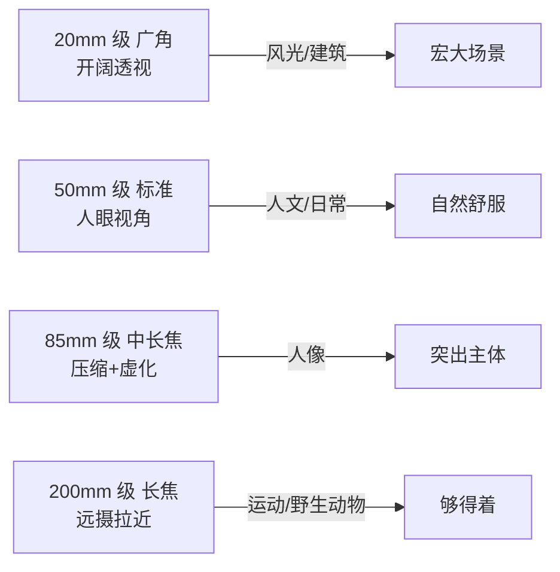
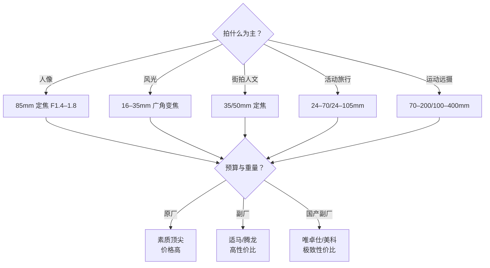

# 镜头

> 本文为个人知识整理。镜头原理与各厂商说明一致；文中不写死具体型号与价格，焦距、光圈档位、品牌生态为通用现状，具体规格以最新市售为准。

机身决定"怎么拍"，镜头决定"拍什么、拍得多好"——**焦距定视角、最大光圈定虚化与进光、素质定画质上限**。机身三年一换代，镜头用十年，选镜头的优先级值得高于机身。

| 维度 | 镜头决定 | 机身无法替代 |
| --- | --- | --- |
| 焦距 | 视角（广/中/长） | 裁切只损失像素，镜头才真正改变视角 |
| 最大光圈 | 虚化上限 + 进光量 | 机身只能提 ISO，光圈是硬件 |
| 素质 | 锐度 / 色散 / 畸变 | 物理缺陷后期救不回 |
| 对焦马达 | 跟焦速度与安静度 | 影响抓拍与视频跟焦 |

> 一句话：**机身是载体，镜头是成像主力——预算分配向镜头倾斜，比追机身参数划算。**

## 焦距：镜头第一属性

#### 视角与焦段

焦距（mm）决定视角：数字越小视野越宽。不同焦段各有"性格"，题材适配是选镜头的起点。

| 焦段 | 常见范围 | 视角特点 | 典型题材 |
| --- | --- | --- | --- |
| 超广角 | 12–20mm | 视野极宽、透视夸张 | 建筑、星空、环境人像 |
| 广角 | 20–35mm | 开阔、近大远小 | 风光、街拍、室内 |
| 标准 | 40–55mm | 接近人眼单眼视角 | 人文、日常、全题材 |
| 中长焦 | 70–135mm | 压缩感、浅景深 | 人像、特写 |
| 长焦 | 135–300mm | 拉近远处、空间压缩 | 运动、舞台、野生动物 |
| 超长焦 | 300mm+ | 极致拉近 | 鸟类、赛车 |

#### 等效焦距

传感器画幅不同，同一支镜头视角也不同：APS-C 约 ×1.5（佳能 ×1.6）、M4/3 约 ×2.0。**广角端吃亏、长焦端占便宜**——APS-C 机身想拍广角要买更广的镜头，想拍远反而省钱。换算细节见 [相机机身](../器材/相机机身.md) 的"等效焦距"节。

> 一句话：**先想清楚"拍什么题材"，焦距就定了一半；剩下再谈光圈和画质。**

## 定焦 vs 变焦

| 对比 | 定焦 | 变焦 |
| --- | --- | --- |
| 画质 | 同价位上限更高 | 一般略逊（高端例外） |
| 最大光圈 | 可做大（F1.2–1.8） | 恒定 F2.8 已是顶级 |
| 体积重量 | 更小更轻 | 更大更重 |
| 构图方式 | 靠脚步移动 | 转动变焦环 |
| 适合 | 人像/人文/题材明确 | 旅行/活动/什么都拍 |

> 提示：**定焦逼你思考构图，变焦保你不错过瞬间**。新手建议先一镜变焦覆盖常用焦段，再补 1–2 支定焦。

## 最大光圈：虚化与进光

#### 光圈档位与含义

光圈数字越小开口越大：F1.2 比 F1.8 进光多近一档多，虚化也更强。档位序列见 [曝光三要素](../器材/曝光三要素.md) 的"档位语言"节。

| 光圈 | 定位 | 特点 |
| --- | --- | --- |
| F1.2 | 顶级大光圈 | 极致虚化、弱光强，贵且重 |
| F1.4 | 高端定焦 | 虚化+进光均衡，**国产副厂已普及** |
| F1.8–F2 | 亲民定焦 | 轻、便宜，性价比首选 |
| F2.8 恒定 | 顶级变焦 | 大三元标准，重且贵 |
| F4 恒定 | 轻量变焦 | 轻便旅行，暗光略吃力 |

#### 恒定 vs 浮动光圈

变焦镜头长焦端最大光圈可能缩水：**恒定光圈**（如全焦段 F2.8）价格高、进光稳定；**浮动光圈**（如 F3.5–5.6）是入门变焦的常见缩水点，暗光长焦端偏暗。

> 提示：国产副厂（唯卓仕、美科、铭匠等）把自动对焦 F1.4 定焦拉到了 1–2k 档——**大光圈不再只是原厂专属**，这是当前最值得利用的行情。

## 画质：如何评价素质

#### 解析力（锐度）

中心到边缘的清晰度，是镜头的核心硬件指标，后期救不回。通常收缩 1–2 档光圈达到最佳（最佳光圈），全开与边缘会有衰减。

#### 色散与紫边

高反差边缘（逆光树枝、金属反光）出现紫/绿色镶边，大光圈下更明显。部分可后期去除，严重时会"脏"。

#### 畸变与暗角

广角易桶形畸变（直线外凸）、四角变暗。现代机身多有机内校正，RAW 后期也能修，**不必过度焦虑**。

| 画质项 | 怎么判断 | 后期可救？ |
| --- | --- | --- |
| 锐度 | 放大看细节 / 看评测 | 不可救，硬件决定 |
| 紫边色散 | 高反差边缘看镶边 | 部分可去 |
| 畸变 | 拍直线看弯曲 | 可机内/后期校正 |
| 暗角 | 看四角亮度 | 可校正，有时是有意氛围 |

> 一句话：**锐度是"选不选"的关键，畸变暗角是"修不修"的小事。**

## 镜头防抖 vs 机身防抖

| 方案 | 适用 | 说明 |
| --- | --- | --- |
| 镜头防抖（IS/VR/OS） | 长焦、微距多配 | 取景时即时稳定 |
| 机身防抖（IBIS） | 所有镜头受益 | 无防抖镜头也稳 |
| 协同防抖 | 同品牌机身+镜头 | 双重抵消、效果最佳 |

> 提示：**机身有 IBIS 的话，无防抖定焦也能手持**；但长焦没有镜头防抖、机身又无 IBIS，手持长曝基本糊。选长焦时防抖优先级很高。

## 对焦马达：快、静、准

| 马达类型 | 特点 | 适合 |
| --- | --- | --- |
| 步进马达（STM 类） | 安静平滑 | 视频跟焦、日常 |
| 超声波马达（USM/SWM） | 快、准 | 抓拍、体育 |
| 线性马达（VCM 类） | 快而静、成本高 | 旗舰镜头 |
| 老式 DC 马达 | 慢、有声音 | 二手老镜头 |

> 提示：拍视频选镜头，**"跟焦是否平顺"比参数重要**——看评测里的追焦测试，比读规格表有用。

## 卡口与镜头群

镜头必须匹配机身卡口（见 [相机机身](../器材/相机机身.md) 的"卡口与镜头群"节）。同一系统内按梯队选：

| 梯队 | 代表 | 特点 |
| --- | --- | --- |
| 原厂 | 索尼/佳能/尼康 | 素质顶尖、对焦协同最好、价格高 |
| 副厂 | 适马/腾龙 | 性价比强、素质接近原厂 |
| 国产副厂 | 唯卓仕/美科/铭匠/永诺 | 定焦覆盖广、F1.4 普及、价格极低 |
| 手动老镜头 | 各家 | 便宜、有味道、无自动对焦 |

> 一句话：**机身定系统，镜头定钱包。国产副厂把"镜头贵"这道坎基本拆了——预算紧张优先看它们。**

## 特殊镜头

| 类型 | 特点 | 用途 |
| --- | --- | --- |
| 微距 | 1:1 放大、最近对焦近 | 静物、昆虫、产品细节 |
| 移轴 | 可移可倾 | 建筑透视校正、小场景 |
| 鱼眼 | 极广 + 桶形畸变 | 创意、球幕 |
| 电影镜头 | 无级光圈、齿环跟焦 | 视频创作 |

> 提示：特殊镜头按需购买，**多数人 1 支变焦 + 1–2 支定焦就覆盖 90% 场景**。

## 选购决策：先焦距后档位

#### 镜头配置思路（经典起步）

| 方案 | 组合 | 适合 |
| --- | --- | --- |
| 一镜走天下 | 24–105mm F4 或 24–200mm | 旅行、新手 |
| 变焦 + 定焦 | 24–70mm + 50/85mm F1.8 | 进阶标配 |
| 双定焦 | 35mm + 85mm | 街拍 + 人像 |
| 长焦补位 | 70–200mm / 100–400mm | 体育、野生动物 |

> 一句话：**先买覆盖常用焦段的，再补"你真正想要的效果"——别一开始就追顶级。**

## 二手镜头怎么挑

二手是省钱正路，但要会看：

| 检查项 | 看什么 |
| --- | --- |
| 镜片 | 霉斑、雾化、划痕（中心最致命） |
| 对焦 | 自动对焦是否干脆、有无异响 |
| 光圈 | 叶片是否粘连、收缩是否正常 |
| 镜身 | 磕碰、变焦环阻尼、卡口触点氧化 |
| 型号代差 | 老款马达慢/镀膜差，查评测再下手 |

> 提示：**"功能正常 + 无霉无雾"是底线；轻微使用痕迹不影响成像，别为完美成色多付溢价。**

## 常见误区

- **"50mm 都一样"** —— 同焦段不同光圈差的是进光与虚化上限，F1.4 和 F1.8 观感差一档。
- **"变焦比定焦专业"** —— 同价位定焦画质更好、光圈更大；变焦胜在灵活，不是画质。
- **"只买原厂"** —— 国产/副厂 F1.4 素质已够用，省下的钱能再买一支镜头。
- **"参数越顶越好"** —— 大光圈长焦又重又贵，天天带出门才算实用。
- **"防抖无所谓"** —— 无 IBIS 机身 + 无防抖长焦 = 手持易糊，这个组合别踩。

> **延伸**
> - 机身与卡口生态：[相机机身](../器材/相机机身.md)
> - 光圈与曝光档位：[曝光三要素](../器材/曝光三要素.md)
> - 对焦与景深实战：[对焦与景深](../拍摄技术/对焦与景深.md)
> - 器材附件（三脚架/滤镜/存储卡）：[附件](../器材/附件.md)
