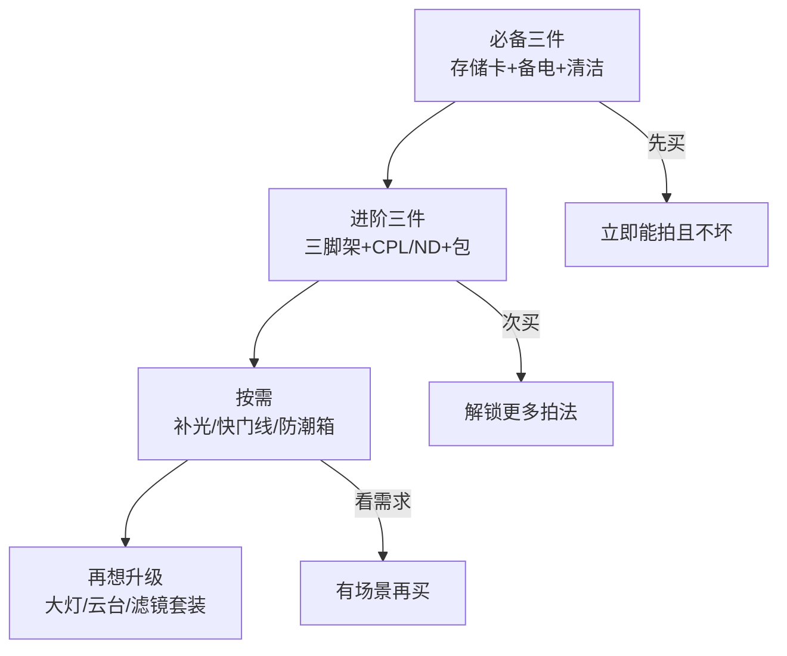

# 附件

> 本文为个人知识整理。附件品类与选购要点为通用现状，品牌与价格随新款更新，以最新市售为准；优先讲"要不要买、怎么买对"，不罗列具体型号。

机身和镜头决定画质，**附件决定"你能否稳定输出"**——三脚架稳住长曝光、存储卡接住连拍、滤镜解锁长曝与偏振。但附件坑也多：一半是刚需，一半是消费主义。这篇按优先级讲清楚。

| 附件 | 必要性 | 核心用途 | 一句话判断 |
| --- | --- | --- | --- |
| 存储卡 | 必备 | 接住连拍与视频 | 速度等级不够会卡顿 |
| 备用电池 | 必备 | 续航 | 出行至少 1 备 |
| 清洁工具 | 必备 | 养护镜头 | 气吹 + 镜头笔即可 |
| 三脚架 | 建议 | 长曝光/夜景/自拍 | 需要夜景/延时再上 |
| 滤镜 | 按需 | CPL/ND 特定效果 | 不是人人要 |
| 补光设备 | 按需 | 控制光线 | 人像/产品才需要 |
| 防潮箱 | 按需 | 南方防霉 | 潮湿地区必备 |

> 一句话：**先保证"拍得到、存得下、不损坏"，再谈"拍得更有风格"。**

## 三脚架与云台

#### 材质与承重

| 材质 | 重量 | 稳定性 | 价格 | 适合 |
| --- | --- | --- | --- | --- |
| 铝合金 | 重 | 稳定 | 便宜 | 预算有限、自驾 |
| 碳纤维 | 轻 | 稳定 | 贵 | 徒步、长距离背负 |

承重看"机身+镜头+云台"总重，**留 30% 余量**——标称承重 5kg 的架子，建议实际载荷 3.5kg 以内最稳。

#### 云台类型

| 云台 | 特点 | 适合 |
| --- | --- | --- |
| 球形云台 | 松一旋钮全向转动，快 | 风光、日常 |
| 三维云台 | 各轴独立锁紧，精准 | 建筑、接片 |
| 液压云台 | 顺滑承重大 | 长焦、视频 |

#### 脚管节数、中轴与快装板

| 要素 | 影响 | 怎么选 |
| --- | --- | --- |
| 脚管节数（3/4/5 节） | 节数越多收纳越短，但展开更慢、稳定性略降 | 徒步看收纳长度，自驾优先稳定性 |
| 中轴 | 升中轴提机位但牺牲稳定性 | 能不开就不开，靠脚管高度 |
| 快装板标准 | Arca-Swiss 通用 vs 厂商专用 | 优先通用型，换云台不用重买板 |

> 提示：**低海拔轻装出行，碳纤维+球台是主流**；拍视频考虑液压云台。别买"又轻又能承重"的便宜货——那是商家话术，稳不住。

## 滤镜：UV / CPL / ND / GND

#### 滤镜各自干什么

| 滤镜 | 全称/作用 | 场景 | 值得买吗 |
| --- | --- | --- | --- |
| UV | 防紫外线（数码时代意义≈保护镜） | 风沙/海边等恶劣环境 | 廉价 UV 毁画质，不如不装 |
| CPL | 偏振镜：去反光、压蓝天 | 水面、玻璃、天空 | 拍风光/橱窗有用 |
| ND | 减光镜：降低进光 | 长曝流水、大光圈强光 | 长曝创作刚需 |
| GND | 渐变减光：压天空 | 大光比风光 | 可用包围曝光替代 |

#### ND 档位怎么选

| ND 强度 | 减光量 | 典型用法 |
| --- | --- | --- |
| ND8 | 3 档 | 白天大光圈浅景深 |
| ND64 | 6 档 | 流水丝绢（1s 级） |
| ND1000 | 10 档 | 白天 30s+ 长曝 |

> 提示：**CPL 和 ND 优先买可调口径？不——固定口径更稳**。可变 ND 方便但易偏色，画质优先选固定档。

> 关于 UV：**廉价 UV 的抗眩光/透光率差，逆光容易出鬼影、降对比度，还不如不装**。镜头前组本身有多层镀膜，正常使用没那么容易划伤；日常防护用遮光罩（hood）就够，风沙/海边等恶劣环境才临时装一片**多层镀膜的光学级 UV**。

#### 口径怎么认

滤镜口径 = 镜头前端标的口径（如 52mm/67mm/77mm），**同一口径的镜头可以共用一片滤镜**。买前先看镜头盖内侧的数字；不同口径想共用需转接环，但广角端可能出暗角。

| 口径 | 常见镜头 |
| --- | --- |
| 49–52mm | 小定焦、入门变焦 |
| 67–72mm | 中焦变焦、F1.8 定焦 |
| 77–82mm | 大光圈变焦、长焦 |

> 一句话：**先按你最常用的镜头口径买滤镜，别一上来凑齐全口径。**

> 提示：**部分机型自带机内 ND（视频向机型常见）**——有此功能，ND8/ND64 这类低档位就不用买，买前先翻相机菜单。

## 存储卡：速度与容量

#### 速度等级

| 标识 | 最低写入 | 用途 |
| --- | --- | --- |
| V30 / U3 | 30MB/s | 4K 视频、普通连拍 |
| V60 | 60MB/s | 高码率 4K、中速连拍 |
| V90 | 90MB/s | 高码率 4K120、高速连拍 |

> 关键：看**写入速度**，不是读取。高速连拍卡顿、视频中断，多是写入不够。

#### 容量怎么选

| 用途 | 建议容量 | 备注 |
| --- | --- | --- |
| 纯拍照 JPEG/RAW | 64–128GB | 够一次旅行 |
| 混合视频 | 128–256GB | 4K 一小时约 30–60GB |
| 双卡槽 | 主卡写+备卡备份 | 干活刚需 |

#### 卡的种类

| 卡类型 | 特点 | 用于 |
| --- | --- | --- |
| SD 卡 | 通用、便宜、有 V 速度等级 | 大多数相机 |
| CFexpress | 快、贵 | 旗舰机身高速连拍 / 高码率视频 |
| microSD | 小巧 | 部分相机、无人机 |

> 提示：**别把所有照片放在一张卡里**——多带一两张小卡，卡坏损失小，也方便分类归档。CFexpress 机身的卡贵，买前算好预算。

## 电池与充电

#### 耗电真相：拍照省、视频费

| 拍摄内容 | 单块电池参考续航 | 说明 |
| --- | --- | --- |
| 静态照片（EVF 取景） | 约 300–600 张 | CIPA 标准续航，实际混拍波动大 |
| 静态照片（屏幕取景） | 视机型，与 EVF 相当或更省 | 部分机型屏幕反而更省电 |
| 4K 视频连续录制 | 约 1–1.5 小时 | 码率/帧率越高越费电 |
| 长曝光 / 延时 | 按"小时"算，数小时起步 | 传感器持续工作，且期间不宜断电换电 |

> 关键：**拍照用户问"能拍几张"，视频/延时用户问"能拍几小时"**——估算单位不同，备电逻辑就不同。

#### 怎么算要带几块

按"出行时长 × 每日拍摄量"反推，别一刀切：

| 场景 | 参考方案 |
| --- | --- |
| 城市一日随手拍（<200 张） | 机内 1 块就够，顶多加 1 备 |
| 全天高强度（活动/扫街 500+ 张） | 2–3 块 |
| 半天视频（2–3 小时 4K） | 2–3 块 |
| 星空 / 延时通宵 | 3–4 块，或边充边拍 / 外接电源 |
| 冬季低温拍摄 | 续航实际打折 30–50%，多备更稳 |

#### 充电与省电

- **原厂 vs 副厂**：原厂稳、副厂便宜；副厂注意电压兼容，杂牌别碰。
- **边充边拍**：支持 USB-C 直充/假电池供电的机身，充电宝+假电池是长曝、延时的最优解，比堆电池划算。
- **省电技巧**：EVF/屏幕待机时间调短、关闭 Wi-Fi/蓝牙、背屏亮度调低；低温贴身保温再拍摄。

> 一句话：**电池不是越多越好，按"拍摄内容 × 时长"反推；拍照省、视频费、延时按小时算。**

## 相机包与背负

| 类型 | 特点 | 适合 |
| --- | --- | --- |
| 单肩包 | 取机快、轻 | 城市扫街、轻装 |
| 双肩包 | 容量大、护腰 | 徒步、多镜头 |
| 内胆包 | 塞进普通背包 | 已有背包的省钱方案 |

> 提示：**背负系统比外观重要**——徒步选带腰带的双肩包，重量转移到髋部；"看起来像相机包"的往往成了小偷目标，低调的普通背包+内胆更实用。

## 清洁与养护

| 工具 | 用途 | 注意 |
| --- | --- | --- |
| 气吹 | 吹浮尘 | 先从大到小吹，别直接吹传感器 |
| 镜头笔/清洁布 | 擦镜片 | 干擦为主，别用纸巾 |
| 清洁液 | 顽固污渍 | 滴布不滴镜 |
| 传感器清洁棒 | 换镜头进灰时 | 有风险，先气吹+机身自带清洁 |

> 提示：**传感器吹不掉再上清洁棒，别一上来就动它**——多数"传感器脏"其实是镜头或机身反光板上的灰。

> 清洁顺序：**气吹 → 镜头笔轻扫 → 清洁液湿擦（顽固）→ 传感器最后（先试机身自带清洁）**。从外到内、从干到湿，别跳步。

## 补光设备

| 方案 | 特点 | 适合 |
| --- | --- | --- |
| 闪光灯 | 轻、瞬间强光 | 人像、活动、压光 |
| 常亮灯 | 所见即所得 | 视频、新手、静物 |
| 反光板 | 零成本补光 | 户外人像、逆光 |

> 一句话：**户外人像先买反光板（几十块）；室内拍产品/视频买常亮灯；要压太阳再上闪光灯。** 别一上来就买大灯。

> 提示：**裸灯是"硬光"——影子又黑又硬；套上柔光附件（柔光箱/反光伞/白纸）才是"柔光"**。拍人像、产品，柔光比灯本身更重要，几十块的柔光附件提升远超换灯。

## 快门线与遥控

长曝光（慢门、延时、星空）触发快门，避免手按机身震动。三种方案：

| 方案 | 特点 |
| --- | --- |
| 有线快门线 | 便宜可靠 |
| 无线遥控 | 方便自拍 |
| 手机 App | 零成本，功能全（延时、间隔） |

> 提示：**多数相机官方 App 已支持远程快门与延时**，新手先别买硬件，手机就够。

## 防潮与长期存放

| 环境 | 风险 | 对策 |
| --- | --- | --- |
| 南方梅雨/沿海 | 镜片发霉（致命） | 防潮箱 + 电子防潮卡 |
| 干燥北方 | 没那么急 | 密封袋 + 干燥剂即可 |
| 长期不用 | 电池鼓包 | 电量 50% 存放、定期充放 |

> 一句话：**镜头发霉是"报废级"损伤，防潮优先级高于一切"提升效果"的附件。**

#### 防潮方案对比

| 方案 | 优点 | 缺点 |
| --- | --- | --- |
| 电子防潮箱 | 恒湿可控、容量大 | 占地方、费电 |
| 干燥剂 + 密封箱 | 便宜、省地 | 需定期换干燥剂 |
| 密封袋 + 干燥剂 | 最简单 | 只适合少量器材 |

> 提示：**湿度稳定在 40–50% 最佳**——太干（<30%）会伤橡胶/油封，太湿（>60%）易发霉。

## 数据备份：拍完的第一步

#### 读卡器怎么选

| 方案 | 特点 |
| --- | --- |
| USB-C 读卡器 | 快、通用，支持多卡种优先 |
| 相机直连电脑 | 零配件，但速度一般 |
| 高速读卡器 | 匹配 V60/V90 卡才值得 |

> 提示：**读卡器速度要匹配卡的速度**——V90 卡配慢读卡器，一样慢。

#### 备份习惯（3-2-1 原则）

- **3 份数据**：相机卡（临时）+ 电脑（主）+ 移动硬盘/云盘（备）；
- **2 种介质**：别只存在一种设备上；
- **1 份异地**：硬盘放别处，或至少云盘一份。

> 一句话：**卡满了就导、导完再格式化；别等"丢一次"才补备份习惯——丢照片没有后悔药。**

## 选购决策：按优先级买

| 优先级 | 清单 | 预算参考（区间） |
| --- | --- | --- |
| 必备 | 高速存储卡、备用电池、气吹+镜头笔 | 几百 |
| 建议 | 三脚架、CPL/ND 滤镜、相机包 | 千元级 |
| 按需 | 补光灯、快门线、防潮箱 | 看场景 |

> 一句话：**附件按"没它拍不了/拍不好"排序，别按"看着专业"排序。**

## 常见误区

- **"装片 UV 镜保护镜头总没错"** —— 廉价 UV 抗眩光差、降低通透度，逆光出鬼影，**劣质 UV 不如不装**；要保护优先用遮光罩，恶劣环境才临时上多层镀膜 UV。
- **"存储卡看读取速度"** —— 拍摄卡顿看**写入**，读取再快写不进去照样卡。
- **"可变 ND 万能"** —— 方便但易偏色/十字纹，画质优先用固定档。
- **"三脚架越轻越好"** —— 轻=稳不住，重量和承重是硬指标，徒步才牺牲稳定性。
- **"电池多带几块总没错"** —— 按"拍摄内容 × 时长"算：拍照一天 1–2 块够，视频/延时才按小时备；多带是负重，不是安心。
- **"防潮是北方的云淡风轻"** —— 梅雨季任何地区都可能发霉，防潮箱是保险不是装饰。

> **延伸**
> - 长曝光用 ND 与快门线的原理：[曝光三要素](../器材/曝光三要素.md)
> - 三脚架对应风光/夜景实战：[风光](../题材实战/风光.md)
> - 补光对应人像实战：[人像](../题材实战/人像.md)
> - 存储卡对应机身连拍：[相机机身](../器材/相机机身.md)
