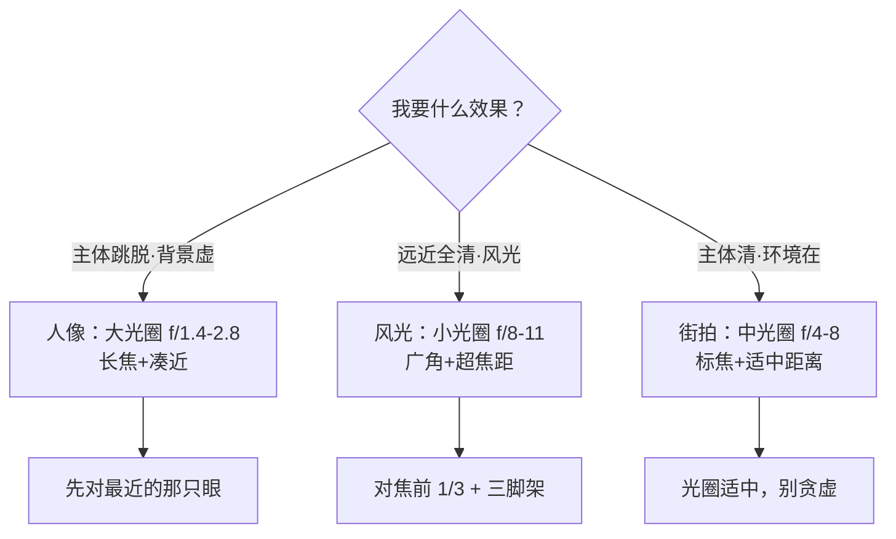

# 对焦与景深

> 本文为个人知识整理。对焦与景深是跨器材、跨厂商的通用光学规律；景深数值为经验参考，具体以你的镜头、机身与现场为准。模糊不是"没对上焦"，而是可以主动控制的表现手段。

曝光三要素回答"**照片亮不亮**"，对焦与景深回答"**哪里清楚、清楚多少**"。同一场景，光圈从 f/1.4 收到 f/16，画面里清楚的范围能差出几十倍——前景的花、中间的人、背后的山，谁虚谁实，全在你手里。所以摄影圈常把"会控制景深"当作从"随手拍"到"有意图地拍"的分水岭。

| 维度 | 解决什么问题 | 主要控制手段 |
| --- | --- | --- |
| 对焦 | 让"哪一层"绝对清晰 | 对焦点选择、对焦模式、手动对焦 |
| 景深 | 清晰的范围有多"厚" | 光圈、焦距、拍摄距离、传感器尺寸 |
| 焦外 | 虚化长什么样、美不美 | 光圈形状、镜头光学设计、前后景距离 |

> 一句话：**曝光决定能不能看见，对焦与景深决定看见的是谁、以及周围是烘托还是干扰。**

## 对焦：让哪里清楚

#### 合焦平面：一张照片只有一个面绝对清晰

相机对焦的结果不是"一个点清楚"，而是**一个平面清楚**——焦平面（合焦面）上的所有点都锐利，离开这个平面的地方开始逐渐变模糊。离得越远，模糊越重。所以"对上焦"的准确说法是"把焦平面放在了我想清楚的那一层"。

> 图：合焦平面探索（可互动）—— 拖动焦点，看前景 / 中景 / 背景哪一层最清楚，其余两层实时虚化。

<svg viewBox="0 0 760 430" width="100%" style="max-width:760px;height:auto;touch-action:none" font-family="system-ui,-apple-system,'Segoe UI','PingFang SC','Microsoft YaHei',sans-serif">  <defs>    <filter id="fpf_near" x="-50%" y="-50%" width="200%" height="200%"><feGaussianBlur stdDeviation="0"/></filter>    <filter id="fpf_mid" x="-50%" y="-50%" width="200%" height="200%"><feGaussianBlur stdDeviation="0"/></filter>    <filter id="fpf_far" x="-50%" y="-50%" width="200%" height="200%"><feGaussianBlur stdDeviation="0"/></filter>  </defs>  <rect x="0" y="0" width="760" height="430" rx="14" fill="var(--svg-bg)" stroke="var(--svg-border)"/>  <text x="380" y="28" font-size="15" font-weight="700" fill="var(--svg-fg)" text-anchor="middle">合焦平面探索：拖动焦点，看哪一层最清楚</text>  <rect x="0" y="300" width="760" height="130" fill="var(--svg-fg)" opacity="0.07"/>  <line x1="380" y1="300" x2="380" y2="430" stroke="var(--svg-grid)" stroke-width="1" stroke-dasharray="4,4" opacity="0.6"/>  <g class="wb-fp-far" filter="url(#fpf_far)">    <circle cx="560" cy="232" r="9" fill="var(--svg-fg)"/>    <path d="M551,242 Q560,236 569,242 L571,262 L549,262 Z" fill="var(--svg-fg)"/>    <ellipse cx="560" cy="266" rx="14" ry="4" fill="#000000" opacity="0.18"/>    <text x="560" y="284" font-size="11" fill="var(--svg-muted)" text-anchor="middle">背景</text>  </g>  <g class="wb-fp-mid" filter="url(#fpf_mid)">    <circle cx="400" cy="270" r="14" fill="var(--svg-fg)"/>    <path d="M384,286 Q400,278 416,286 L420,320 L380,320 Z" fill="var(--svg-fg)"/>    <ellipse cx="400" cy="324" rx="22" ry="5" fill="#000000" opacity="0.18"/>    <text x="400" y="342" font-size="11" fill="var(--svg-accent)" text-anchor="middle">中景（主体）</text>  </g>  <g class="wb-fp-near" filter="url(#fpf_near)">    <circle cx="210" cy="332" r="20" fill="var(--svg-fg)"/>    <path d="M186,356 Q210,344 234,356 L240,408 L180,408 Z" fill="var(--svg-fg)"/>    <ellipse cx="210" cy="412" rx="34" ry="7" fill="#000000" opacity="0.18"/>    <text x="210" y="428" font-size="11" fill="var(--svg-muted)" text-anchor="middle">前景</text>  </g>  <line x1="90" y1="400" x2="670" y2="400" stroke="var(--svg-border)" stroke-width="2"/>  <g stroke="var(--svg-muted)" stroke-width="1">    <line x1="90" y1="394" x2="90" y2="406"/>    <line x1="380" y1="394" x2="380" y2="406"/>    <line x1="670" y1="394" x2="670" y2="406"/>  </g>  <text x="90" y="420" font-size="11" fill="var(--svg-muted)" text-anchor="middle">近</text>  <text x="380" y="420" font-size="11" fill="var(--svg-muted)" text-anchor="middle">中</text>  <text x="670" y="420" font-size="11" fill="var(--svg-muted)" text-anchor="middle">远</text>  <g class="wb-focus-handle" style="cursor:grab;touch-action:none">    <path d="M0,-16 L11,-2 L-11,-2 Z" fill="var(--svg-accent)"/>    <circle cx="0" cy="-2" r="4" fill="var(--svg-accent)"/>  </g>  <text class="wb-focus-label" x="380" y="54" font-size="13" font-weight="700" fill="var(--svg-accent)" text-anchor="middle">当前合焦：中景（主体）</text></svg>

#### 对焦方式：AF-S / AF-C / DMF / MF

| 模式 | 含义 | 适合 | 注意 |
| --- | --- | --- | --- |
| AF-S（单次） | 半按快门对一次，锁定后拍 | 静物、风光、摆拍人像 | 主体动了就对不上，需重新半按 |
| AF-C（连续/伺服） | 持续追焦，快门按住就一直跟 | 运动、儿童、动物、街拍 | 配合"广域/跟踪"区域更好用 |
| AF-A（自动） | 相机判断静/动切换 AF-S/C | 抓拍、不确定题材 | 关键瞬间可能犹豫，重要场合别全信 |
| DMF（直接手动） | 自动对焦后，可手动微调 | 微距、星空、精准合焦 | 需镜头支持，转环轻推即接管 |
| MF（纯手动） | 完全手拧对焦环 | 弱光、无反 EVF 放大、视频 | 靠峰值对焦/放大辅助，别裸眼猜 |

> 提示：**拍运动的默认开 AF-C + 跟踪区域**，拍静物默认 AF-S；别让相机在关键瞬间替你"犹豫"。

#### 对焦区域：单点 / 区 / 广域 / 跟踪

- **单点（小）**：精度最高，适合明确主体（人眼、一朵花）。缺点：主体不在点上就跑焦。
- **区 / 扩展点**：以单点为中心一小片，容错更高，主体小幅移动仍锁得住。
- **广域 / 人脸眼识别**：相机自己挑"像脸"的区域优先——人像神器，**让人眼永远最清**。
- **跟踪（subject tracking）**：锁定主体后持续跟随，运动题材首选。

| 场景 | 推荐区域 | 理由 |
| --- | --- | --- |
| 人像 | 眼控 AF / 单点对准眼 | 眼睛是人像的"焦平面命门" |
| 风光 | 单点 + 手动选景深中段 | 精度优先，配合景深合成 |
| 运动 | 广域 / 跟踪 | 主体乱跑也要跟得住 |
| 微距 | 单点 + 放大手动 | 景深极浅，差 1mm 就糊 |

#### 为什么会对不上焦（跑焦、拉风箱）

- **拉风箱**：镜头来回找不到合焦位置。常见于低对比、纯色、弱光、隔着玻璃/网格。→ 改对附近高对比边缘，或切 MF。
- **焦点偏移（跑焦）**：对脸却实了后脑勺。多是"对焦点没压在主体上"或"前景有遮挡"。→ 确认对焦点真的落在主体，别让镜头/栏杆抢走焦点。
- **前后抖**：手持时你也在前后移动，焦平面跟着飘。→ 端稳、提高快门、或用三脚架。
- **太近超过最近对焦距离**：镜头有"最近对焦距离"，贴太近直接对不上。→ 退后一点，或换微距镜头。

> 提示：**人像永远对人眼对焦**——脸清楚眼睛糊，观感就是"没对上"。很多相机有"眼控 AF"，开它就是。

## 景深：清楚的范围有多厚

#### 定义：焦平面前后的一段"清晰厚度"

景深（Depth of Field, DoF）= **焦平面前后，看起来仍然清楚的距离范围**。它不是一个点，而是一段厚度。这段厚度里不是"绝对锐利"，而是"模糊小到人眼分辨不出"——这就引出了关键概念：**弥散圆**。

#### 弥散圆：为什么"一段距离"看起来都清楚

物点经过镜头会汇聚成一个点（绝对清晰），但在汇聚点前后，它在传感器上投影成一个小圆，叫**弥散圆（Circle of Confusion, CoC）**。只要这个圆小于人眼的分辨极限，我们就觉得"清楚"。正是这个"容差"，让焦平面前后产生了一段可接受的清晰带——这就是景深的本质。

> 图：弥散圆 —— 传感器放在合焦面之后，物点的像摊成一个圆；圆够小就被视为清晰。

<svg viewBox="0 0 760 300" width="100%" style="max-width:760px;height:auto" font-family="system-ui,-apple-system,'Segoe UI','PingFang SC','Microsoft YaHei',sans-serif">  <rect x="0" y="0" width="760" height="300" rx="14" fill="var(--svg-bg)" stroke="var(--svg-border)"/>  <text x="380" y="26" font-size="15" font-weight="700" fill="var(--svg-fg)" text-anchor="middle">弥散圆：为什么"一段距离"看起来都清楚</text>  <circle cx="70" cy="150" r="6" fill="var(--svg-fg)"/>  <text x="70" y="174" font-size="11" fill="var(--svg-muted)" text-anchor="middle">物点</text>  <path d="M300,110 Q332,150 300,190 Q268,150 300,110 Z" fill="var(--svg-accent)" opacity="0.5" stroke="var(--svg-accent)" stroke-width="1.5"/>  <text x="300" y="212" font-size="11" fill="var(--svg-muted)" text-anchor="middle">透镜</text>  <g stroke="var(--svg-accent-2)" stroke-width="1.5" opacity="0.85" fill="none">    <path d="M76,148 L298,114 L520,150 L600,128"/>    <path d="M76,152 L298,186 L520,150 L600,172"/>  </g>  <line x1="520" y1="92" x2="520" y2="208" stroke="var(--svg-fg)" stroke-width="1.5" stroke-dasharray="4,4"/>  <circle cx="520" cy="150" r="3" fill="var(--svg-fg)"/>  <text x="520" y="84" font-size="11" fill="var(--svg-fg)" text-anchor="middle">合焦面（绝对清晰）</text>  <line x1="600" y1="92" x2="600" y2="208" stroke="var(--svg-muted)" stroke-width="2"/>  <ellipse cx="600" cy="150" rx="6" ry="22" fill="none" stroke="var(--svg-accent)" stroke-width="2"/>  <text x="600" y="84" font-size="11" fill="var(--svg-muted)" text-anchor="middle">传感器</text>  <text x="600" y="232" font-size="11" font-weight="700" fill="var(--svg-accent)" text-anchor="middle">弥散圆</text>  <text x="688" y="144" font-size="11" fill="var(--svg-muted)">弥散圆足够小</text>  <text x="688" y="162" font-size="11" fill="var(--svg-muted)">→ 人眼视为清楚</text></svg>

#### 景深四大决定因素

记住四件事，景深就完全可预测——**光圈、焦距、拍摄距离、传感器尺寸**，方向全都固定：

| 因素 | 怎么变 → 景深变浅（更虚） | 怎么变 → 景深变深（更清） | 记忆口诀 |
| --- | --- | --- | --- |
| 光圈 | 开大（f 值小，如 f/1.4） | 收小（f 值大，如 f/16） | **大光圈 = 浅景深** |
| 焦距 | 长焦（如 200mm） | 广角（如 16mm） | **长焦压扁 + 更虚** |
| 拍摄距离 | 离主体近 | 离主体远 | **越近越虚** |
| 传感器 | 全画幅 / 中画幅 | 手机小底 / 高裁切系数 | **底大一级压死人** |

> 一句话：**想虚化背景，先开大光圈；光圈不够，再走近一点、或换长焦。** 这三招是景深控制的三板斧。

#### 光圈是第一杠杆

光圈对景深的影响最直接、最常用。开大光圈（小 f 值），清晰带急剧变薄，背景瞬间虚化；收小光圈（大 f 值），前后都清楚。

> 图：光圈是景深第一杠杆 —— 开大=虚，收小=清（左 f/1.4，右 f/16）。

<svg viewBox="0 0 760 280" width="100%" style="max-width:760px;height:auto" font-family="system-ui,-apple-system,'Segoe UI','PingFang SC','Microsoft YaHei',sans-serif">  <defs>    <filter id="dof_b2" x="-50%" y="-50%" width="200%" height="200%"><feGaussianBlur stdDeviation="4"/></filter>  </defs>  <rect x="0" y="0" width="760" height="280" rx="14" fill="var(--svg-bg)" stroke="var(--svg-border)"/>  <text x="380" y="26" font-size="15" font-weight="700" fill="var(--svg-fg)" text-anchor="middle">光圈是景深第一杠杆：开大=虚，收小=清</text>  <line x1="380" y1="44" x2="380" y2="250" stroke="var(--svg-border)" stroke-width="1" stroke-dasharray="3,4"/>  <text x="190" y="54" font-size="13" font-weight="700" fill="var(--svg-fg)" text-anchor="middle">f/1.4（大光圈）</text>  <rect x="50" y="70" width="280" height="150" rx="8" fill="var(--svg-sky)" stroke="var(--svg-border)"/>  <g filter="url(#dof_b2)">    <path d="M50,220 L120,120 L190,220 Z" fill="var(--svg-fg)" opacity="0.4"/>    <path d="M150,220 L220,140 L290,220 Z" fill="var(--svg-fg)" opacity="0.4"/>    <circle cx="320" cy="130" r="16" fill="var(--svg-accent-2)" opacity="0.7"/>  </g>  <circle cx="190" cy="150" r="22" fill="var(--svg-fg)"/>  <circle cx="190" cy="150" r="30" fill="none" stroke="var(--svg-accent)" stroke-width="2.5"/>  <text x="190" y="244" font-size="11" font-weight="700" fill="var(--svg-accent)" text-anchor="middle">背景虚化 · 主体跳脱</text>  <text x="570" y="54" font-size="13" font-weight="700" fill="var(--svg-fg)" text-anchor="middle">f/16（小光圈）</text>  <rect x="430" y="70" width="280" height="150" rx="8" fill="var(--svg-sky)" stroke="var(--svg-border)"/>  <path d="M430,220 L500,120 L570,220 Z" fill="var(--svg-fg)" opacity="0.4"/>  <path d="M530,220 L600,140 L670,220 Z" fill="var(--svg-fg)" opacity="0.4"/>  <circle cx="700" cy="130" r="16" fill="var(--svg-accent-2)" opacity="0.7"/>  <circle cx="570" cy="150" r="22" fill="var(--svg-fg)"/>  <circle cx="570" cy="150" r="30" fill="none" stroke="var(--svg-accent)" stroke-width="2.5"/>  <text x="570" y="244" font-size="11" font-weight="700" fill="var(--svg-muted)" text-anchor="middle">前后皆清 · 全景清晰</text></svg>

#### 焦距与距离：被忽视的两块

- **长焦更虚**：同样光圈下，200mm 比 35mm 景深更浅，且把前后景"压缩"到一起，虚化更明显。这也是为什么人像头多是 85/135mm。
- **越近越虚**：同样镜头同样光圈，**凑近拍**景深骤减。微距摄影景深薄到以毫米计，正是这个距离因素主导。
- 三者可以叠加：大光圈 + 长焦 + 凑近 = 极浅景深（奶油般虚化）；反过来小光圈 + 广角 + 远拍 = 全景深（风光必备）。

#### 传感器尺寸：等效光圈与等效焦距的坑

这是新手最容易算错的地方。**小传感器要把镜头焦距 × 裁切系数才是"等效全画幅焦距"，光圈也要 × 裁切系数才是"等效景深"**。结果：手机那颗 f/1.8 的镜头，乘上约 5–10 倍的裁切系数，等效全画幅约是 f/9–f/18——景深其实很深，所以手机很难拍出单反那样的背景虚化（厂商用算法"人像模式"模拟虚化，是算出来的，不是光学真的浅）。

| 机身 | 裁切系数（约） | 等效换算举例 | 景深含义 |
| --- | --- | --- | --- |
| 全画幅 | 1.0 | 85mm f/1.8 = 85mm f/1.8 | 基准，虚化最强 |
| APS-C | 1.5 | 56mm f/1.8 ≈ 85mm f/2.7 | 略浅于手机，弱于全幅 |
| M4/3 | 2.0 | 42mm f/1.8 ≈ 85mm f/3.6 | 再深一档 |
| 手机 1/2.5" | ~9–10 | 26mm f/1.8 ≈ 250mm f/17 | 景深很深，"虚化"靠算法 |

> 提示：**想真·光学虚化，要么大底，要么大光圈，要么凑近**——手机人像模式的虚化是 AI 抠图，边缘翻车时常暴露"假"。

## 景深预览：看见真实清晰带

很多相机有"景深预览"按钮：取景器里平时是大光圈（亮、看着都清楚），按下它收小光圈，你能直接看到最终成像的清晰范围。新手常忽略这个键——**回放时才发现背景虚得不够或前景糊了，就晚了**。

> 图：景深预览（可互动）—— 拖动光圈滑块，看背景与前景的虚化如何随 f 值变化。

<svg viewBox="0 0 760 430" width="100%" style="max-width:760px;height:auto;touch-action:none" font-family="system-ui,-apple-system,'Segoe UI','PingFang SC','Microsoft YaHei',sans-serif">  <defs>    <filter id="dof_bg" x="-50%" y="-50%" width="200%" height="200%"><feGaussianBlur stdDeviation="0.4"/></filter>    <filter id="dof_fg" x="-50%" y="-50%" width="200%" height="200%"><feGaussianBlur stdDeviation="0.4"/></filter>  </defs>  <rect x="0" y="0" width="760" height="430" rx="14" fill="var(--svg-bg)" stroke="var(--svg-border)"/>  <text x="380" y="28" font-size="15" font-weight="700" fill="var(--svg-fg)" text-anchor="middle">景深预览：拖动光圈，看背景虚化如何变化</text>  <rect x="0" y="300" width="760" height="130" fill="var(--svg-fg)" opacity="0.07"/>  <g id="dof_bg" filter="url(#dof_bg)">    <path d="M430,300 L500,180 L560,300 Z" fill="var(--svg-fg)" opacity="0.35"/>    <path d="M520,300 L600,150 L690,300 Z" fill="var(--svg-fg)" opacity="0.5"/>    <path d="M470,300 L540,210 L600,300 Z" fill="var(--svg-fg)" opacity="0.28"/>    <circle cx="660" cy="120" r="22" fill="var(--svg-accent-2)" opacity="0.85"/>    <rect x="560" y="180" width="10" height="120" fill="var(--svg-fg)" opacity="0.6"/>    <circle cx="565" cy="170" r="34" fill="var(--svg-fg)" opacity="0.55"/>  </g>  <g>    <circle cx="250" cy="232" r="20" fill="var(--svg-fg)"/>    <path d="M222,256 Q250,244 278,256 L286,320 L214,320 Z" fill="var(--svg-fg)"/>    <circle cx="250" cy="232" r="30" fill="none" stroke="var(--svg-accent)" stroke-width="2.5"/>    <text x="250" y="342" font-size="11" font-weight="700" fill="var(--svg-accent)" text-anchor="middle">主体（合焦）</text>  </g>  <g id="dof_fg" filter="url(#dof_fg)">    <ellipse cx="120" cy="170" rx="46" ry="26" fill="var(--svg-fg)" opacity="0.7" transform="rotate(-25 120 170)"/>    <path d="M120,170 L150,120" stroke="var(--svg-fg)" stroke-width="3" opacity="0.7"/>    <text x="120" y="210" font-size="11" fill="var(--svg-muted)" text-anchor="middle">前景</text>  </g>  <rect class="wb-dof-track" x="60" y="366" width="640" height="14" rx="7" fill="var(--svg-grid)" style="cursor:pointer"/>  <g stroke="var(--svg-muted)" stroke-width="1">    <line x1="60" y1="384" x2="60" y2="392"/>    <line x1="220" y1="384" x2="220" y2="392"/>    <line x1="380" y1="384" x2="380" y2="392"/>    <line x1="540" y1="384" x2="540" y2="392"/>    <line x1="700" y1="384" x2="700" y2="392"/>  </g>  <g font-size="10" fill="var(--svg-muted)" text-anchor="middle">    <text x="60" y="404">f/1.4</text>    <text x="220" y="404">f/2.8</text>    <text x="380" y="404">f/5.6</text>    <text x="540" y="404">f/11</text>    <text x="700" y="404">f/22</text>  </g>  <g class="wb-dof-handle" transform="translate(60,373)" style="cursor:grab;touch-action:none">    <line x1="0" y1="-12" x2="0" y2="14" stroke="var(--svg-fg)" stroke-width="2.5"/>    <path d="M-7,-12 L7,-12 L0,-2 Z" fill="var(--svg-fg)"/>  </g>  <text class="wb-dof-label" x="380" y="54" font-size="13" font-weight="700" fill="var(--svg-accent)" text-anchor="middle">光圈 f/1.4 · 浅景深 · 强虚化</text></svg>

## 实战：三种景深用法

#### 人像：大光圈虚化背景

- **目标**：主体跳脱、背景干净。
- **参数**：光圈开到最大可用（f/1.4–f/2.8），焦距 85mm 上下，与主体保持 1–3 米。
- **要点**：对焦点压在离你最近的眼睛；背景离主体越远，虚化越明显。
- **注意**：超大光圈景深极浅，别让"后脑勺清、鼻尖糊"——半身人像确保面部同处一个焦平面。

#### 风光：小光圈全清晰

- **目标**：前景花、中景山、背景天，全部清楚。
- **参数**：f/8–f/11（主流风光甜区；再小到 f/16+ 要防衍射软化），广角，对焦放在场景前 1/3 处。
- **要点**：用"超焦距"思路——对焦在"最近清晰距离约 1/2 处"，让远近同时落进景深。
- **注意**：小光圈 + 低光要上三脚架，否则快门太慢糊片。

#### 街拍 / 纪实：中等光圈平衡

- **目标**：主体清、环境交代、又不至于全虚失去现场感。
- **参数**：f/4–f/8，焦距 35/50mm，距离适中。
- **要点**：光圈别太大（否则路人虚掉失去"街"），也别太小（否则杂乱背景抢戏）。

## 对焦与景深自查清单

开拍前快速过一遍：

- [ ] 我想让谁清楚？对焦点真的压在那一层了吗？
- [ ] 拍运动的开 AF-C + 跟踪了吗？拍静物用 AF-S 了吗？
- [ ] 想要的景深是浅还是深？光圈、焦距、距离三板斧调对了吗？
- [ ] 人像有没有对到眼睛？风光有没有用超焦距 / 小光圈？
- [ ] 小传感器机身别指望光学大虚化，必要时上三脚架或换思路。

> 一句话：**先想清楚"谁清楚、周围虚不虚"，再按三板斧调，比事后救图省事十倍。**

## 常见误区

- **"虚化越强越好"** —— 虚化是手段不是目的；背景全糊成一团也丢信息，环境人像、纪实常常要"半虚"。
- **"对焦=对中间"** —— 对焦点要手动压在主体（尤其眼睛），别信相机总替你选对。
- **"光圈越小越清楚"** —— f/16 以后衍射会让画质软化，风光甜区多在 f/8–f/11，不是越小越锐。
- **"手机 f/1.8 能拍出单反虚化"** —— 那是裁切系数后的等效 f/17 左右，光学景深很深，人像模式的虚化是算法抠图。
- **"景深只由光圈决定"** —— 焦距、距离、传感器尺寸同样关键；同光圈下长焦 + 凑近，虚化远胜广角远拍。
- **"跑焦都是相机坏"** —— 多半是对焦点没压主体、前景遮挡、或太近超出最近对焦距离；先查操作再疑硬件。
- **"微距要对整个主体"** —— 微距景深以毫米计，整只虫都清几乎不可能，选"最想表达的部位"合焦即可。

> **延伸**
> - 参数与亮度的取舍：[曝光三要素](/contents/摄影/器材/曝光三要素.md)
> - 焦段如何改变透视与景深观感：[镜头](/contents/摄影/器材/镜头.md)
> - 让主体跳出来的画面安排：[构图](构图.md)
> - 光的方向与质感：[用光](用光.md)
> - 焦外美化与二次构图：[修图基础](/contents/摄影/后期处理/修图基础.md)
> - 人像脸部光影处理：[人像精修](/contents/摄影/后期处理/人像精修.md)
