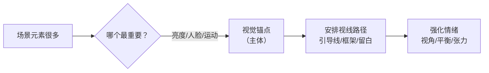
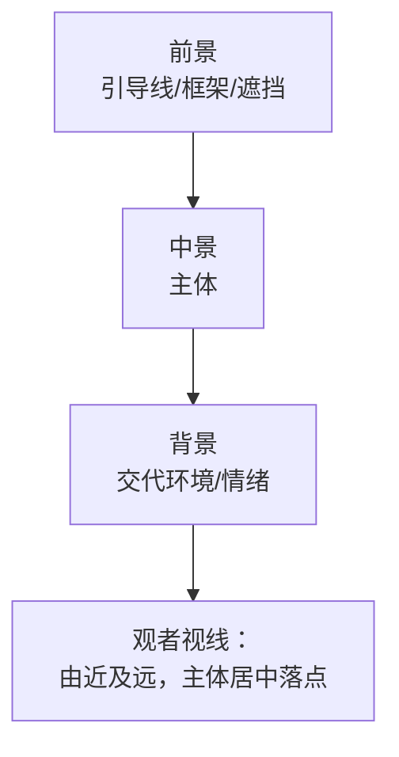
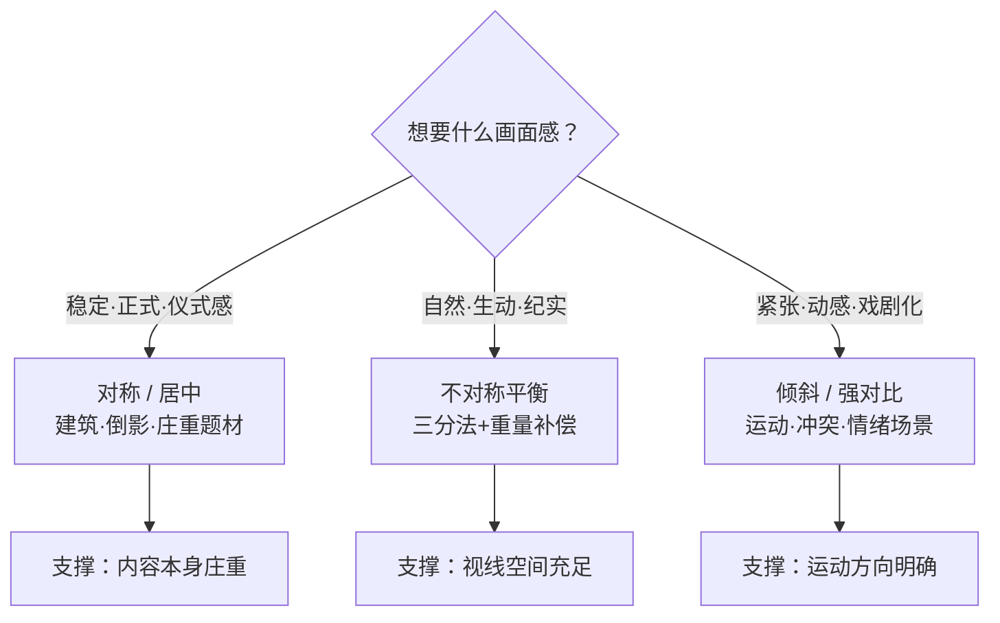

# 构图

> 本文为个人知识整理。构图规律是跨厂商、跨器材的通用原则，不依赖具体设备；"法则"是高效路径而非教条，打破它之前请先掌握它。

构图解决的核心问题只有一个：**观者的注意力放在哪**。曝光决定"照片亮不亮"，构图决定"照片讲什么"——画面里元素越多，观者越不知道看哪，构图就是替观者做选择：先看哪、再看哪、最后落在哪。所以构图的第一步从来不是套公式，而是**做减法**。

| 维度 | 构图解决什么 | 常见手段 |
| --- | --- | --- |
| 主体突出 | 让视线第一时间落在主体 | 对比、留白、对焦 |
| 视线引导 | 让视线沿你设计的路径移动 | 引导线、框架、节奏 |
| 画面平衡 | 让画面稳定或有张力 | 对称、视觉重量分配 |
| 情绪氛围 | 让观者产生特定感受 | 视角、画幅、留白 |

> 一句话：**曝光是技术，构图是表达。** 同样的场景，构图不同，讲的故事就不同。

## 注意力与减法
### 注意力管理：先做减法

#### 人眼会先看什么

观者扫视画面时，大脑有一套固定的"优先抓取"顺序。理解它，就知道该把主体安排在什么位置、用什么手段突出：

| 优先抓取 | 原因 | 构图应用 |
| --- | --- | --- |
| 高亮度 / 高对比 | 视觉上"最响"的元素 | 亮部放主体，暗部压干扰 |
| 人脸 / 眼睛 | 进化本能：读表情 | 人像主体永远优先 |
| 文字 / 符号 | 大脑强制解码 | 街拍中招牌会抢戏，慎用 |
| 运动 / 明显线条 | 视线沿线条滑行 | 引导线终点放主体 |
| 画面中心附近 | 天然视觉重心 | 主体偏离中心=制造张力 |

#### 减法的三个层次

- **元素减**：取景器里每一个与主题无关的物体都在稀释主体。拍前问一句"这个要不要？"
- **信息减**：背景杂乱（电线、路人、杂物）比物体本身更致命——它们是"视觉噪音"。
- **色彩减**：色块多=注意力分散。单色背景或统一色调，主体自动跳出来。

> 提示：拿不准时，先按"只有主体+一个陪衬"来拍。**少即是多**，一张照片只讲一件事。

### 经典构图法则速查

法则不是目的，是**被反复验证过的高效路径**。以下按"能直接上手"的程度排序：

| 法则 | 核心原理 | 适用场景 | 注意 |
| --- | --- | --- | --- |
| 三分法 | 主体放 1/3 分割线的交点 | 几乎所有题材 | 只是起点，不是标准答案 |
| 中心构图 | 主体居中，绝对突出 | 对称场景、证件照、单主体 | 两侧需均衡，否则呆板 |
| 对称构图 | 左右/上下镜像，稳定庄重 | 建筑、倒影、仪式感题材 | 一点不对称就"破功" |
| 引导线 | 线条把视线引向主体 | 道路、桥梁、眼神方向 | 终点必须有个"落点" |
| 框架构图 | 框中框，聚焦+纵深 | 门窗、树丛、拱形 | 框架别比主体还抢眼 |
| 对角线 | 斜线带来动感与不稳定 | 运动、街拍、产品 | 配合运动方向用 |
| 留白 / 负空间 | 空出大片区域突出主体 | 极简、人像、广告 | 留白要"有意"，不是没东西拍 |
| 重复与图案 | 规律排列形成节奏 | 建筑立面、阵列 | 用一两个"破格元素"点睛 |

> 一句话：**三分法管"放哪"，引导线管"怎么走"，留白管"喘不喘气"。**

## 经典法则与线
### 三分法与黄金比例

#### 黄金分割的"舒服感"

人类对 **1:1.618** 的黄金比例有天然的审美偏好（从希腊建筑到手机屏幕都在用）——这句话是流传很广的经验说法，但审美研究对其"天然性"仍有争议，**把它当经验法则即可**。三分法把黄金比例简化成 1:1:1，便于记忆和取景。把主体放在分割线或交点上，画面产生一种**舒适的不对称**——既不死板居中，又不会失去重心。

#### 四个交点，四种常见经验

下表是流传较广的**经验说法**（隐含"从左到右"的阅读习惯），会随题材与文化习惯而变——当参考，别当定律：

| 交点 | 常见经验 | 典型用法 |
| --- | --- | --- |
| 左上 | 安全感、权威、起点 | 人像眼神落点、主体起始位 |
| 右上 | 开放、未来、呼吸感 | 给运动/视线留出前进空间 |
| 左下 | 低调、落地、重量感 | 前景、地面主体 |
| 右下 | 稳定、收尾、归位 | 视线终点、构图"落款" |

> 提示：人像拍侧脸时，**往人物视线方向留白**（脸朝右，人就放左 1/3），画面立刻"透气"。

#### 横竖幅怎么选

- **横幅**：横向运动（跑步、车流）、辽阔风光、多人场景。
- **竖幅**：竖直主体（人像、建筑、树木）、纵向运动、竖屏内容（社交平台）。
- **方幅**：居中构图、极简风格，天生稳重。

> **三分法九宫格图**：主图是 4:3 取景框被 2 横 2 竖分成九格，4 个圆点是视线天然落点，主体（蓝色圆环）落在右上交点即"透气"；下方两张小图对比"居中"与"交点"的差异。

<svg viewBox="0 0 480 400" width="100%" role="img" aria-label="三分法九宫格" xmlns="http://www.w3.org/2000/svg" style="max-width:480px;height:auto" font-family="system-ui,-apple-system,Segoe UI,PingFang SC,Microsoft YaHei,sans-serif">
  <rect x="0" y="0" width="480" height="400" rx="14" fill="var(--svg-bg)" stroke="var(--svg-border)"/>
  <text x="240" y="28" font-size="15" font-weight="700" fill="var(--svg-fg)" text-anchor="middle">三分法：把主体放在 1/3 分割线的交点上</text>
  <rect x="50" y="60" width="380" height="285" rx="8" fill="var(--svg-sky)"/>
  <path d="M50,345 L120,240 L170,280 L230,215 L295,270 L360,235 L430,280 L430,345 Z" fill="var(--svg-fg)" opacity="0.30"/>
  <path d="M50,345 L100,280 L160,310 L210,265 L270,300 L330,275 L380,310 L430,300 L430,345 Z" fill="var(--svg-fg)" opacity="0.55"/>
  <circle cx="110" cy="115" r="20" fill="var(--svg-accent-2)" opacity="0.95"/>
  <circle cx="110" cy="115" r="28" fill="none" stroke="var(--svg-accent-2)" stroke-width="1" opacity="0.35"/>
  <path d="M380,310 L388,250 L396,310 Z" fill="var(--svg-fg)" opacity="0.85"/>
  <path d="M405,310 L413,240 L421,310 Z" fill="var(--svg-fg)" opacity="0.85"/>
  <g stroke="var(--svg-fg)" stroke-width="1.5" stroke-linecap="round" opacity="0.7">
    <line x1="65" y1="338" x2="62" y2="325"/>
    <line x1="78" y1="338" x2="80" y2="326"/>
    <line x1="92" y1="338" x2="89" y2="323"/>
    <line x1="135" y1="338" x2="138" y2="328"/>
    <line x1="148" y1="338" x2="145" y2="325"/>
    <line x1="240" y1="338" x2="237" y2="326"/>
    <line x1="255" y1="338" x2="258" y2="329"/>
  </g>
  <g stroke="var(--svg-fg)" stroke-width="1" stroke-dasharray="4,4" opacity="0.45">
    <line x1="50" y1="155" x2="430" y2="155"/>
    <line x1="50" y1="250" x2="430" y2="250"/>
    <line x1="176.7" y1="60" x2="176.7" y2="345"/>
    <line x1="303.3" y1="60" x2="303.3" y2="345"/>
  </g>
  <g fill="var(--svg-fg)" opacity="0.4">
    <circle cx="176.7" cy="155" r="3.5"/>
    <circle cx="303.3" cy="155" r="3.5"/>
    <circle cx="176.7" cy="250" r="3.5"/>
    <circle cx="303.3" cy="250" r="3.5"/>
  </g>
  <circle cx="303.3" cy="140" r="8" fill="var(--svg-fg)"/>
  <path d="M287,160 Q303.3,148 319.6,160 L321,180 L285,180 Z" fill="var(--svg-fg)"/>
  <circle cx="303.3" cy="146" r="22" fill="none" stroke="var(--svg-accent)" stroke-width="2.5"/>
  <text x="303.3" y="202" font-size="12" font-weight="700" fill="var(--svg-accent)" text-anchor="middle">主体</text>
  <rect x="50" y="60" width="380" height="285" rx="8" fill="none" stroke="var(--svg-fg)" stroke-width="2"/>
  <text x="240" y="372" font-size="12" fill="var(--svg-muted)" text-anchor="middle">主体落在右上交点 → 画面"透气"</text>
</svg>

<svg viewBox="0 0 260 110" width="100%" role="img" aria-label="居中构图" xmlns="http://www.w3.org/2000/svg" style="max-width:260px;height:auto" font-family="system-ui,-apple-system,Segoe UI,PingFang SC,Microsoft YaHei,sans-serif">
  <rect x="0" y="0" width="260" height="110" rx="10" fill="var(--svg-bg)" stroke="var(--svg-border)"/>
  <rect x="6" y="6" width="248" height="80" rx="6" fill="var(--svg-sky)"/>
  <path d="M6,86 L40,55 L75,68 L115,45 L160,62 L205,48 L254,72 L254,86 Z" fill="var(--svg-fg)" opacity="0.55"/>
  <circle cx="130" cy="60" r="11" fill="var(--svg-fg)"/>
  <path d="M120,70 Q130,64 140,70 L140,86 L120,86 Z" fill="var(--svg-fg)"/>
  <text x="130" y="105" font-size="11" fill="var(--svg-muted)" text-anchor="middle">居中 — 视觉对称但易呆板</text>
</svg>
<svg viewBox="0 0 260 110" width="100%" role="img" aria-label="交点构图" xmlns="http://www.w3.org/2000/svg" style="max-width:260px;height:auto" font-family="system-ui,-apple-system,Segoe UI,PingFang SC,Microsoft YaHei,sans-serif">
  <rect x="0" y="0" width="260" height="110" rx="10" fill="var(--svg-bg)" stroke="var(--svg-border)"/>
  <rect x="6" y="6" width="248" height="80" rx="6" fill="var(--svg-sky)"/>
  <path d="M6,86 L50,68 L90,80 L130,62 L175,76 L220,60 L254,80 L254,86 Z" fill="var(--svg-fg)" opacity="0.55"/>
  <circle cx="195" cy="48" r="8" fill="var(--svg-fg)"/>
  <path d="M186,56 Q195,50 204,56 L204,72 L186,72 Z" fill="var(--svg-fg)"/>
  <circle cx="195" cy="52" r="16" fill="none" stroke="var(--svg-accent)" stroke-width="2"/>
  <text x="130" y="105" font-size="11" fill="var(--svg-accent)" text-anchor="middle">交点 — 视线有落点，更生动</text>
</svg>

### 引导线与纵深

#### 线的类型

| 线型 | 来源 | 效果 |
| --- | --- | --- |
| 直线 | 道路、栏杆、墙面 | 直接、有力、指向明确 |
| 曲线 | 河流、山路、S 弯 | 柔和、优雅、更有"逛"的感觉 |
| 隐含线 | 人物眼神、手指方向、排列趋势 | 含蓄、叙事感强 |

#### 三层纵深：前景 → 中景 → 背景

单层画面是"贴纸"，三层画面才有"走进来"的立体感：

> 提示：风光片"前景树枝 + 中景主体 + 背景山"就是最经典的纵深组合。拍不到前景时，蹲低或借一株草，画面立刻分层次。

> **引导线视线汇聚图**：前景两条会聚的线（路/栏杆/眼神方向）指向消失点，箭头把视线"推"向位于消失点处的主体；线越明确，引导越强。

<svg viewBox="0 0 800 380" width="100%" role="img" aria-label="引导线视线汇聚" xmlns="http://www.w3.org/2000/svg" style="max-width:800px;height:auto" font-family="system-ui,-apple-system,Segoe UI,PingFang SC,Microsoft YaHei,sans-serif">
  <defs>
    <marker id="leadArr" viewBox="0 0 10 10" refX="9" refY="5" markerWidth="7" markerHeight="7" orient="auto">
      <path d="M0,0 L10,5 L0,10 z" fill="var(--svg-accent-2)"/>
    </marker>
  </defs>
  <rect x="0" y="0" width="800" height="380" rx="14" fill="var(--svg-bg)" stroke="var(--svg-border)"/>
  <text x="400" y="30" font-size="15" font-weight="700" fill="var(--svg-fg)" text-anchor="middle">引导线：把视线推向消失点处的主体</text>

  <g>
    <rect x="40" y="55" width="720" height="280" rx="8" fill="var(--svg-sky)"/>
    <path d="M40,200 L130,140 L220,170 L330,130 L440,160 L560,125 L680,160 L760,140 L760,210 L40,210 Z" fill="var(--svg-fg)" opacity="0.30"/>
    <path d="M40,230 L150,190 L260,210 L380,185 L500,205 L620,180 L760,205 L760,240 L40,240 Z" fill="var(--svg-fg)" opacity="0.45"/>
    <path d="M40,335 L760,335 L760,235 L580,225 L480,222 L400,221 L320,222 L220,225 L40,235 Z" fill="var(--svg-fg)" opacity="0.85"/>
    <path d="M340,335 L460,335 L444,235 L356,235 Z" fill="var(--svg-sky)"/>
    <g stroke="var(--svg-fg)" stroke-width="2.5" stroke-dasharray="8,8" opacity="0.55">
      <line x1="400" y1="335" x2="400" y2="230"/>
    </g>
    <g fill="var(--svg-fg)">
      <circle cx="100" cy="305" r="16" opacity="0.9"/>
      <rect x="96" y="312" width="8" height="23" opacity="0.9"/>
      <circle cx="170" cy="278" r="12" opacity="0.9"/>
      <rect x="167" y="284" width="6" height="18" opacity="0.9"/>
      <circle cx="230" cy="255" r="9" opacity="0.9"/>
      <rect x="228" y="259" width="4" height="13" opacity="0.9"/>
      <circle cx="278" cy="240" r="7" opacity="0.9"/>
      <rect x="276" y="243" width="3" height="9" opacity="0.9"/>
    </g>
    <g fill="var(--svg-fg)">
      <circle cx="700" cy="305" r="16" opacity="0.9"/>
      <rect x="696" y="312" width="8" height="23" opacity="0.9"/>
      <circle cx="630" cy="278" r="12" opacity="0.9"/>
      <rect x="627" y="284" width="6" height="18" opacity="0.9"/>
      <circle cx="570" cy="255" r="9" opacity="0.9"/>
      <rect x="568" y="259" width="4" height="13" opacity="0.9"/>
      <circle cx="522" cy="240" r="7" opacity="0.9"/>
      <rect x="520" y="243" width="3" height="9" opacity="0.9"/>
    </g>
    <g>
      <circle cx="400" cy="212" r="6" fill="var(--svg-fg)"/>
      <path d="M389,224 Q400,217 411,224 L412,232 L388,232 Z" fill="var(--svg-fg)"/>
      <circle cx="400" cy="218" r="18" fill="none" stroke="var(--svg-accent)" stroke-width="2.5"/>
    </g>
    <text x="400" y="252" font-size="11" font-weight="700" fill="var(--svg-accent)" text-anchor="middle">主体（消失点）</text>
    <g fill="none" stroke="var(--svg-accent-2)" stroke-width="2" marker-end="url(#leadArr)" opacity="0.85">
      <path d="M180,320 Q280,275 380,232"/>
      <path d="M620,320 Q520,275 420,232"/>
    </g>
    <text x="160" y="290" font-size="11" fill="var(--svg-muted)">树列/路缘</text>
    <text x="640" y="290" font-size="11" fill="var(--svg-muted)" text-anchor="end">树列/路缘</text>
    <text x="200" y="358" font-size="10" fill="var(--svg-muted)" opacity="0.8">引导线</text>
    <text x="600" y="358" font-size="10" fill="var(--svg-muted)" text-anchor="end" opacity="0.8">引导线</text>
    <rect x="40" y="55" width="720" height="280" rx="8" fill="none" stroke="var(--svg-fg)" stroke-width="2"/>
  </g>
  <text x="400" y="370" font-size="13" font-weight="700" fill="var(--svg-fg)" text-anchor="middle">线越明确 → 视线越被"推"向主体</text>
</svg>

### 框架构图：框中框

用画面里的**现成框架**（门窗、拱门、树丛缝隙）把主体圈起来：

- **聚焦**：框架天然形成边界，主体再小也醒目。
- **纵深**：框架在前、主体在中，层次感立现。
- **叙事**：框即"窥视"——隔着窗看人，故事感拉满。

注意：框架的光线、颜色如果比主体更亮更艳，就喧宾夺主了。**框架负责"藏"，主体负责"亮"。**

## 留白、平衡与视角
### 留白与负空间：敢空才高级

负空间指主体之外"没内容"的区域。它不是拍不到东西的妥协，而是**有意识地空**：

| 用途 | 做法 | 效果 |
| --- | --- | --- |
| 呼吸感 | 主体偏一角，其余全空 | 画面不闷、显高级 |
| 方向感 | 脸朝/移动方向留白 | 视线有去处，不撞墙 |
| 极简风 | 单一背景+小主体 | 主体被"真空"凸显 |
| 文字位 | 广告/封面预留空白区 | 后期可加字不压主体 |

> 一句话：**留白是"让主体自己呼吸"，不是"没内容可拍"。**

### 平衡与张力

#### 视觉重量

画面元素有"重量"：**大 > 小、亮 > 暗、艳 > 素、前景 > 背景、人脸 > 静物**。构图就是分配这些重量，让它要么**平衡**（稳定舒服），要么**失衡**（紧张刺激）。

| 手段 | 机制 | 效果 |
| --- | --- | --- |
| 对称 | 两侧等重 | 稳定、正式、仪式感 |
| 不对称平衡 | 大而远配小而近（天平原理） | 自然、生动、不呆板 |
| 倾斜 | 地平线/主体倾斜 | 动感、不安、戏剧化 |
| 强对比 | 大小/明暗悬殊 | 张力、冲突 |

> 提示：不对称平衡的"天平"技巧——画面左侧一个**大而暗**的物体，右侧用一个**小而亮**的物体压住，视觉上就稳了。

> **视觉重量天平图**：左侧"大而暗"的物体天然偏重，右侧用"小而亮 + 人脸"补偿——不对称平衡靠"天平原理"达成稳定而不呆板。

<svg viewBox="0 0 800 360" width="100%" role="img" aria-label="视觉重量场景对比" xmlns="http://www.w3.org/2000/svg" style="max-width:800px;height:auto" font-family="system-ui,-apple-system,Segoe UI,PingFang SC,Microsoft YaHei,sans-serif">
  <rect x="0" y="0" width="800" height="360" rx="14" fill="var(--svg-bg)" stroke="var(--svg-border)"/>
  <text x="400" y="30" font-size="15" font-weight="700" fill="var(--svg-fg)" text-anchor="middle">视觉重量：大而暗 = 小而亮 + 人脸</text>

  <g>
    <rect x="50" y="60" width="320" height="240" rx="8" fill="var(--svg-sky)"/>
    <path d="M50,260 L130,170 L200,220 L290,160 L370,210 L370,300 L50,300 Z" fill="var(--svg-fg)" opacity="0.4"/>
    <path d="M50,300 L100,200 L160,250 L240,170 L320,230 L370,210 L370,300 Z" fill="var(--svg-fg)" opacity="0.9"/>
    <g fill="var(--svg-fg)" opacity="0.95">
      <ellipse cx="90" cy="270" rx="22" ry="26"/>
      <rect x="86" y="282" width="8" height="20"/>
      <ellipse cx="305" cy="255" rx="18" ry="22"/>
      <rect x="302" y="266" width="6" height="18"/>
    </g>
    <rect x="50" y="60" width="320" height="240" rx="8" fill="none" stroke="var(--svg-fg)" stroke-width="2"/>
    <text x="210" y="320" font-size="13" font-weight="700" fill="var(--svg-fg)" text-anchor="middle">大 + 暗 + 前景</text>
    <text x="210" y="338" font-size="12" fill="var(--svg-muted)" text-anchor="middle">视觉上"重"</text>
  </g>

  <g>
    <line x1="385" y1="160" x2="415" y2="160" stroke="var(--svg-fg)" stroke-width="4" stroke-linecap="round"/>
    <line x1="385" y1="190" x2="415" y2="190" stroke="var(--svg-fg)" stroke-width="4" stroke-linecap="round"/>
    <text x="400" y="225" font-size="12" font-weight="700" fill="var(--svg-muted)" text-anchor="middle">视觉等重</text>
  </g>

  <g>
    <rect x="440" y="60" width="320" height="240" rx="8" fill="var(--svg-sky)"/>
    <circle cx="700" cy="120" r="22" fill="var(--svg-accent-2)" opacity="0.95"/>
    <circle cx="700" cy="120" r="30" fill="none" stroke="var(--svg-accent-2)" stroke-width="1" opacity="0.35"/>
    <path d="M440,260 L520,210 L600,235 L680,205 L760,235 L760,300 L440,300 Z" fill="var(--svg-fg)" opacity="0.3"/>
    <g>
      <circle cx="580" cy="200" r="14" fill="var(--svg-fg)"/>
      <path d="M558,225 Q580,212 602,225 L605,270 L555,270 Z" fill="var(--svg-fg)"/>
      <circle cx="580" cy="200" r="22" fill="none" stroke="var(--svg-accent)" stroke-width="2.5"/>
    </g>
    <rect x="440" y="60" width="320" height="240" rx="8" fill="none" stroke="var(--svg-fg)" stroke-width="2"/>
    <text x="600" y="320" font-size="13" font-weight="700" fill="var(--svg-fg)" text-anchor="middle">小 + 亮 + 人脸</text>
    <text x="600" y="338" font-size="12" fill="var(--svg-accent)" text-anchor="middle">同样"重"</text>
  </g>
</svg>

### 视角、机位与画幅

#### 机位高度决定心理距离

| 机位 | 视角效果 | 典型场景 |
| --- | --- | --- |
| 平视 | 平等、亲切、纪实 | 街头、人像（与被摄者平齐） |
| 俯视 | 掌控、弱化主体、俯瞰全貌 | 美食、产品、城市俯拍 |
| 仰视 | 高大、压迫、崇敬 | 建筑、人物仰拍、树林 |

#### 距离与焦段的"关系感"

- **近 + 广角**：亲密、夸张、环境感强（与被摄者"在场"）。
- **远 + 长焦**：疏离、压缩、旁观感（"偷窥"视角）。
- 同一个主体，焦段变了，**情感基调**就变了——这不是后期能补的。

> 一句话：**改变构图，最廉价的手段是"挪动你的脚"。** 先走位，再调焦段。

## 二次构图与自查
### 二次构图：拍错了，剪回来

前期构图永远是第一位的，但**裁剪也是创作工具**，不是补救手段：

- **去干扰**：裁掉边缘的路人、电线、杂物。
- **改比例**：横幅裁成竖幅，适配平台或强调纵深。
- **改主体**：裁掉多余信息，让次要主体"转正"。
- **校正**：旋转画面，拉平地平线。

> 提示：裁剪会损失像素，**连拍时留足余量**（主体别贴边），后期才有裁的余地。裁剪思路见 [修图基础](/contents/摄影/后期处理/修图基础.md) 与 [Lightroom 工作流](/contents/摄影/后期处理/Lightroom工作流.md)。

### 拍前 10 秒自查清单

把全文法则压缩成开拍前的一遍快速检查——**每拍一张，心里过一遍**：

- [ ] 主体是谁？画面里还有几个"抢戏"的？
- [ ] 背景干净吗？有没有杂物、电线从主体头上穿过？
- [ ] 主体放在哪？交点、中心、还是刻意偏离制造张力？
- [ ] 视线往哪走？引导线、框架、留白给了吗？
- [ ] 横竖幅对了吗？留白够呼吸吗？

> 一句话：**先做减法，再谈法则。** 这五问过完，按下快门时构图已经完成了七成。

### 常见误区

- **"构图就是套三分法"** —— 三分法是起点不是终点；对称、留白、框架都能构成好照片，先理解再选择。
- **"主体一定要放交点上"** —— 单一主体的极简构图、对称构图同样成立，交点只是"最保险"。
- **"留白=画面空=没拍好"** —— 留白是刻意的呼吸空间，恰恰是高级感的来源。
- **"裁切能救一切"** —— 裁切损失像素、改变叙事；前期构图失误，后期只能"补救"不能"创作"。
- **"画面越满越值"** —— 元素越多注意力越散，**一张照片只讲一件事**。
- **"规则必须遵守"** —— 规则是拐杖：先会走，再扔掉。打破规则的前提是知道自己在打破什么。

> 色彩与情绪：方法论 [色彩理论](/contents/自媒体运营/方法论/色彩理论.md)
