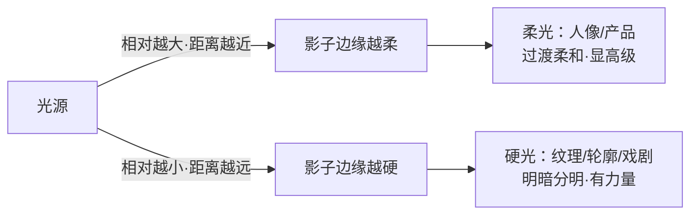
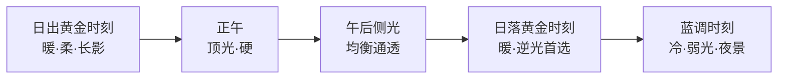

# 用光

> 本文为个人知识整理。光线原理是跨器材通用的物理规律；色温数值、灯位与时段建议为通用经验值，具体以你的器材和现场为准。

曝光三要素回答"**照片亮不亮**"，用光回答"**光从哪里来、什么质感、什么颜色**"。同样是拍一个人，顺光平实、侧光立体、逆光戏剧——参数可能完全一样，画面却判若两片。所以摄影圈有句话：**摄影是用光的艺术，不只是"把图拍亮"**。

| 光的维度 | 回答什么问题 | 控制手段 |
| --- | --- | --- |
| 方向 | 光从哪来 | 灯位、机位、被摄体朝向 |
| 质感 | 影子边缘是锐利还是柔和 | 光源相对大小、距离、漫射 |
| 颜色 | 画面偏暖还是偏冷 | 白平衡、滤镜、后期 |
| 强度 | 明暗对比多剧烈 | 距离（平方反比）、灯功率 |

> 一句话：**曝光决定"能不能看见"，用光决定"看见的是什么情绪"。**

## 光的方向与质感
### 光的方向：五种基本光位

#### 光位决定立体感

把被摄体想象成一个球：光从不同方向来，球面上的明暗分布完全不同。这是用光最基础、也最出效果的一课。

| 光位 | 效果 | 典型场景 | 注意 |
| --- | --- | --- | --- |
| 顺光 | 平、亮、无影，立体感弱 | 证件照、商品白底、旅游纪念照 | 最"安全"也最平，慎当默认 |
| 前侧光（45°） | 立体、通透、有层次 | 人像通用、日常记录 | **新手最容易出效果的光位** |
| 侧光（90°） | 明暗对半，质感强烈 | 纹理、建筑、戏剧化人像 | 半边脸全黑，注意补光 |
| 侧逆光 | 轮廓发亮，主体与背景分离 | 人像发丝光、午后街头 | 测光要对亮边，否则过曝 |
| 逆光 | 剪影、氛围、神圣感 | 日出日落、剪影人像 | 测光选暗部=剪影，选亮部=轮廓 |
| 顶光 / 底光 | 顶光压眼窝显老，底光恐怖 | 顶光可做舞台感，底光少用 | 正午顶光拍人像要找人脸补光 |

#### 每种光位怎么用

- **顺光**：光从相机后方来，被摄体正面全亮、几乎无影。适合证件照、商品白底、记录性拍摄；缺点是立体感弱，画面"平"。想救活顺光：后期加对比，或前期加入前景与色彩层次。
- **前侧光（45°）**：光从相机左右 45° 方向来，形成"亮面—过渡—暗面"的经典三面关系，立体感最强。**人像最稳妥的光位**，拍不出大错，也容易出彩。
- **侧光（90°）**：明暗对半，像"阴阳脸"。最适合拍质感：砖墙、皮革、肌肉线条；拍人像时要用反光板补暗部，否则情绪偏硬。
- **侧逆光（约 135°）**：光从主体背后斜侧来，勾勒出轮廓亮边（发丝光、边缘光），主体与背景自然分离。测光对准亮边或人脸，别让整体过曝。
- **逆光（180°）**：光从主体正后方来。**测光决定成品**：按天空测光 = 剪影，按人脸测光 = 高调轮廓（吃宽容度）。黄金时刻逆光拍人像，发丝是金色的。
- **顶光 / 底光**：顶光在正午最常见——眼窝阴影重，一般要避开或补光；刻意用时出舞台感。底光反常态，多用于恐怖氛围或商品底部照明，日常慎用。

> 提示：**先转圈看光**——举着相机不动，绕被摄体走半圈，看哪个方向的光最符合你要的情绪，再按下快门。
> 图：光位探索（可互动）—— 拖动太阳，观察球体明暗与投影如何随光位变化。

<svg viewBox="0 0 760 460" width="100%" style="max-width:760px;height:auto;touch-action:none" font-family="system-ui,-apple-system,'Segoe UI','PingFang SC','Microsoft YaHei',sans-serif"> <defs> <radialGradient id="le_hi" cx="50%" cy="50%" r="50%"> <stop offset="0%" stop-color="#ffffff" stop-opacity="0.85"/> <stop offset="100%" stop-color="#ffffff" stop-opacity="0"/> </radialGradient> <radialGradient id="le_sh" cx="50%" cy="50%" r="50%"> <stop offset="0%" stop-color="#000000" stop-opacity="0.6"/> <stop offset="100%" stop-color="#000000" stop-opacity="0"/> </radialGradient> <radialGradient id="le_sun" cx="50%" cy="50%" r="50%"> <stop offset="0%" stop-color="var(--svg-accent-2)"/> <stop offset="60%" stop-color="var(--svg-accent-2)" stop-opacity="0.35"/> <stop offset="100%" stop-color="var(--svg-accent-2)" stop-opacity="0"/> </radialGradient> <filter id="le_blur" x="-50%" y="-50%" width="200%" height="200%"> <feGaussianBlur stdDeviation="7"/> </filter> <marker id="le_arr" viewBox="0 0 10 10" refX="8" refY="5" markerWidth="7" markerHeight="7" orient="auto"> <path d="M0,0 L10,5 L0,10 z" fill="var(--svg-muted)"/> </marker> </defs> <rect x="0" y="0" width="760" height="460" rx="14" fill="var(--svg-bg)" stroke="var(--svg-border)"/> <text x="380" y="30" font-size="15" font-weight="700" fill="var(--svg-fg)" text-anchor="middle">光位探索：拖动太阳，看球体明暗与投影如何变化</text>  <line x1="40" y1="338" x2="720" y2="338" stroke="var(--svg-grid)" stroke-width="1.5"/> <g transform="translate(70,300)"> <rect x="-26" y="-18" width="52" height="36" rx="6" fill="var(--svg-fg)" opacity="0.85"/> <circle cx="0" cy="0" r="11" fill="var(--svg-bg)" stroke="var(--svg-muted)" stroke-width="2"/> <text x="0" y="34" font-size="12" fill="var(--svg-muted)" text-anchor="middle">相机</text> </g>  <circle class="wb-subj" cx="330" cy="250" r="64" fill="var(--svg-fg)"/> <ellipse class="wb-sh-on" cx="300" cy="250" rx="58" ry="58" fill="url(#le_sh)"/> <ellipse class="wb-hi" cx="360" cy="250" rx="58" ry="58" fill="url(#le_hi)"/> <ellipse class="wb-sh-ground" cx="280" cy="340" rx="60" ry="12" fill="#000000" opacity="0.28" filter="url(#le_blur)"/>  <line class="wb-dir" x1="330" y1="250" x2="520" y2="120" stroke="var(--svg-muted)" stroke-width="1.5" stroke-dasharray="5,4" marker-end="url(#le_arr)"/>  <g class="wb-light" transform="translate(520,120)" style="cursor:grab;touch-action:none"> <circle r="40" fill="url(#le_sun)"/> <circle r="17" fill="var(--svg-accent-2)"/> <g stroke="var(--svg-accent-2)" stroke-width="2.5" stroke-linecap="round"> <line x1="-26" y1="0" x2="-20" y2="0"/> <line x1="26" y1="0" x2="20" y2="0"/> <line x1="0" y1="-26" x2="0" y2="-20"/> <line x1="0" y1="26" x2="0" y2="20"/> </g> </g>  <text class="wb-readout" x="380" y="430" font-size="14" font-weight="700" fill="var(--svg-accent)" text-anchor="middle">光位：拖动太阳查看</text> </svg>

### 硬光 vs 柔光：看影子的边缘

#### 什么决定硬柔

"硬"和"柔"看的是**影子边缘**：边缘锐利=硬光，边缘模糊=柔光。决定因素只有一个核心——**光源相对被摄体的大小**：

太阳本身很大，但离地球太远，所以正午阳光下影子是硬的；窗口光因为"窗"相对人物够大，就成了天然的柔光箱。**把光源变大（漫射）或拉近，硬光就会变柔。**

| 对比 | 硬光 | 柔光 |
| --- | --- | --- |
| 影子边缘 | 锐利清晰 | 模糊过渡 |
| 情绪 | 戏剧、硬朗、纪实 | 温柔、干净、商业 |
| 适用 | 街头、男性肖像、纹理 | 人像、儿童、产品、美食 |
| 获得方式 | 晴天真阳、裸灯、束光筒 | 阴天、窗口光、柔光箱/反光板 |

#### 三个控制点：变大、拉近、漫射

| 控制手段 | 做法 | 效果 |
| --- | --- | --- |
| 变大 | 换大号柔光箱、让光源贴得更近 | 光源相对尺寸↑ → 更柔 |
| 拉近 | 灯往主体挪 | 相对尺寸↑ → 更柔（同时光比变大） |
| 漫射 | 加柔光布/硫酸纸、打向白墙反弹 | 光线打散 → 更柔 |

| 柔化手段 | 柔度 | 光效特点 | 适用 |
| --- | --- | --- | --- |
| 裸灯 | 硬 | 影子锐利、方向性强 | 戏剧、纹理、舞台 |
| 柔光箱 | 中柔 | 柔和均匀、影子渐隐 | 人像、静物、视频 |
| 反光伞 | 偏柔 | 光面大、略散 | 快速布光、活动拍摄 |
| 白墙/天花板跳闪 | 很柔 | 大面积漫反射、几乎无方向感 | 室内活动、纪实 |
| 窗口自然光 | 中柔 | 单向、有明暗过渡 | 人像、静物（免费柔光箱） |
> 图：硬光 vs 柔光 —— 同一球体，仅光源"相对大小"不同，影子边缘天差地别。

<svg viewBox="0 0 760 360" width="100%" style="max-width:760px;height:auto" font-family="system-ui,-apple-system,'Segoe UI','PingFang SC','Microsoft YaHei',sans-serif"> <defs> <radialGradient id="hs_hi" cx="50%" cy="50%" r="50%"> <stop offset="0%" stop-color="#ffffff" stop-opacity="0.8"/> <stop offset="100%" stop-color="#ffffff" stop-opacity="0"/> </radialGradient> <radialGradient id="hs_sh" cx="50%" cy="50%" r="50%"> <stop offset="0%" stop-color="#000000" stop-opacity="0.55"/> <stop offset="100%" stop-color="#000000" stop-opacity="0"/> </radialGradient> <filter id="hs_blur" x="-50%" y="-50%" y2="150%" width="200%" height="200%"><feGaussianBlur stdDeviation="6"/></filter> </defs> <rect x="0" y="0" width="760" height="360" rx="14" fill="var(--svg-bg)" stroke="var(--svg-border)"/> <text x="380" y="28" font-size="15" font-weight="700" fill="var(--svg-fg)" text-anchor="middle">硬光 vs 柔光：看影子的边缘</text> <line x1="380" y1="50" x2="380" y2="330" stroke="var(--svg-border)" stroke-width="1.5" stroke-dasharray="3,4"/>  <text x="190" y="62" font-size="13" font-weight="700" fill="var(--svg-fg)" text-anchor="middle">硬光</text> <text x="190" y="82" font-size="11" fill="var(--svg-muted)" text-anchor="middle">影子边缘锐利</text> <circle cx="120" cy="120" r="10" fill="var(--svg-accent-2)"/> <g stroke="var(--svg-accent-2)" stroke-width="2" stroke-linecap="round"> <line x1="103" y1="120" x2="97" y2="120"/><line x1="137" y1="120" x2="143" y2="120"/> <line x1="120" y1="103" x2="120" y2="97"/><line x1="120" y1="137" x2="120" y2="143"/> </g> <circle cx="190" cy="210" r="50" fill="var(--svg-fg)"/> <ellipse cx="165" cy="200" rx="40" ry="40" fill="url(#hs_hi)"/> <ellipse cx="220" cy="220" rx="42" ry="42" fill="url(#hs_sh)"/> <ellipse cx="250" cy="280" rx="34" ry="9" fill="#000000" opacity="0.45"/> <text x="190" y="320" font-size="11" fill="var(--svg-muted)" text-anchor="middle">晴天真阳 · 裸灯 · 束光筒</text>  <text x="570" y="62" font-size="13" font-weight="700" fill="var(--svg-fg)" text-anchor="middle">柔光</text> <text x="570" y="82" font-size="11" fill="var(--svg-muted)" text-anchor="middle">影子边缘柔和</text> <circle cx="500" cy="120" r="26" fill="var(--svg-accent-2)" opacity="0.9"/> <circle cx="500" cy="120" r="36" fill="var(--svg-accent-2)" opacity="0.25"/> <circle cx="570" cy="210" r="50" fill="var(--svg-fg)"/> <ellipse cx="548" cy="200" rx="44" ry="44" fill="url(#hs_hi)"/> <ellipse cx="595" cy="220" rx="46" ry="46" fill="url(#hs_sh)"/> <ellipse cx="608" cy="280" rx="40" ry="11" fill="#000000" opacity="0.35" filter="url(#hs_blur)"/> <text x="570" y="320" font-size="11" fill="var(--svg-muted)" text-anchor="middle">阴天 · 窗口光 · 柔光箱</text> </svg>

> 提示：**阴天不是"没光"，是天然的巨型柔光箱**——色温偏冷但光质极佳，拍人像肤色过渡非常舒服。

## 色温、强度与光比
### 色温与白平衡

#### 开尔文色温

光源的"颜色"用开尔文（K）计量：**数值越低越暖（橙红），越高越冷（蓝）**。这不是"感觉"，是物理上的黑体辐射温度。

| 光源 | 色温参考 |
| --- | --- |
| 烛光 / 篝火 | ≈ 1800K |
| 家用白炽灯 | ≈ 2700K |
| 日出日落（黄金时刻） | ≈ 3000–3500K |
| 晴天正午直射光 | ≈ 5500K |
| 阴天 / 多云 | ≈ 6000–7000K |
| 阴影处（蓝天反射） | ≈ 7000K+ |
> 图：开尔文色温谱 —— 数值越低越暖（橙），越高越冷（蓝）。

<svg viewBox="0 0 760 130" width="100%" style="max-width:760px;height:auto" font-family="system-ui,-apple-system,'Segoe UI','PingFang SC','Microsoft YaHei',sans-serif"> <defs> <linearGradient id="ct_bar" x1="0%" y1="0%" x2="100%" y2="0%"> <stop offset="0%" stop-color="#ff8a3d"/> <stop offset="22%" stop-color="#ffd29a"/> <stop offset="45%" stop-color="#fff3e0"/> <stop offset="58%" stop-color="#ffffff"/> <stop offset="75%" stop-color="#cfe3ff"/> <stop offset="100%" stop-color="#5b8def"/> </linearGradient> </defs> <rect x="0" y="0" width="760" height="130" rx="14" fill="var(--svg-bg)" stroke="var(--svg-border)"/> <rect x="40" y="30" width="680" height="34" rx="8" fill="url(#ct_bar)" stroke="var(--svg-border)"/> <g font-size="10" fill="var(--svg-muted)" text-anchor="middle"> <line x1="40" y1="70" x2="40" y2="78" stroke="var(--svg-muted)"/><text x="40" y="94">1800K</text><text x="40" y="110">烛光</text> <line x1="170" y1="70" x2="170" y2="78" stroke="var(--svg-muted)"/><text x="170" y="94">2700K</text><text x="170" y="110">白炽灯</text> <line x1="310" y1="70" x2="310" y2="78" stroke="var(--svg-muted)"/><text x="310" y="94">3000-3500K</text><text x="310" y="110">黄金时刻</text> <line x1="442" y1="70" x2="442" y2="78" stroke="var(--svg-muted)"/><text x="442" y="94">5500K</text><text x="442" y="110">日光</text> <line x1="612" y1="70" x2="612" y2="78" stroke="var(--svg-muted)"/><text x="612" y="94">6500K</text><text x="612" y="110">阴天</text> <line x1="720" y1="70" x2="720" y2="78" stroke="var(--svg-muted)"/><text x="720" y="94">7000K+</text><text x="720" y="110">阴影</text> </g> </svg>

> 图：色温互动（可互动）—— 拖动或点击底部光谱条，看同一张白卡与肤色在不同色温光下的颜色。

<svg viewBox="0 0 760 340" width="100%" style="max-width:760px;height:auto" font-family="system-ui,-apple-system,'Segoe UI','PingFang SC','Microsoft YaHei',sans-serif" id="wb-temp-svg"><defs><linearGradient id="ts_bar" x1="0%" y1="0%" x2="100%" y2="0%"><stop offset="0%" stop-color="#ff8a3d"/><stop offset="22%" stop-color="#ffd29a"/><stop offset="45%" stop-color="#fff3e0"/><stop offset="58%" stop-color="#ffffff"/><stop offset="75%" stop-color="#cfe3ff"/><stop offset="100%" stop-color="#5b8def"/></linearGradient></defs><rect x="0" y="0" width="760" height="340" rx="14" fill="var(--svg-bg)" stroke="var(--svg-border)"/><text x="380" y="26" font-size="14" font-weight="700" fill="var(--svg-fg)" text-anchor="middle">同一场景，不同色温的光照</text><rect x="90" y="70" width="150" height="110" rx="8" fill="#f4f6fb" stroke="var(--svg-border)"/><rect x="305" y="70" width="150" height="110" rx="8" fill="#e7b48f" stroke="var(--svg-border)"/><circle cx="585" cy="125" r="55" fill="#cfd6e0" stroke="var(--svg-border)"/><rect class="wb-tint" x="60" y="55" width="640" height="160" rx="10" fill="#fff6ec" opacity="0.12"/><text x="165" y="200" font-size="11" fill="var(--svg-muted)" text-anchor="middle">白卡</text><text x="380" y="200" font-size="11" fill="var(--svg-muted)" text-anchor="middle">肤色</text><text x="585" y="200" font-size="11" fill="var(--svg-muted)" text-anchor="middle">中性灰</text><text class="wb-temp-label" x="380" y="252" font-size="15" font-weight="700" fill="var(--svg-accent)" text-anchor="middle">5500K · 日光（中性）</text><text x="380" y="277" font-size="11" fill="var(--svg-muted)" text-anchor="middle">白平衡的作用，就是把这个"光的颜色"还原成白色</text><rect class="wb-temp-track" x="60" y="300" width="640" height="16" rx="8" fill="url(#ts_bar)" style="cursor:pointer"/><g class="wb-temp-handle" transform="translate(349,308)" style="cursor:grab;touch-action:none"><line x1="0" y1="-12" x2="0" y2="14" stroke="var(--svg-fg)" stroke-width="2.5"/><path d="M-6,-12 L6,-12 L0,-22 Z" fill="var(--svg-fg)"/><circle cx="0" cy="8" r="4" fill="var(--svg-bg)" stroke="var(--svg-fg)" stroke-width="2"/></g></svg>

#### 白平衡：把"白色"还原成白色

相机自动白平衡（AWB）会尽量把画面里最亮的部分还原成白色。**白平衡的数值 = 告诉相机"现场的光是几 K"**：手动设对，白色就是白的；设错，整张偏蓝或偏黄。

> 提示：白平衡不只是"还原"，更是创作工具——**刻意设冷让雪景更清冽、设暖让灯光氛围更浓**，都是常见玩法。后期也能调，但 JPEG 调白平衡会损失画质，RAW 无损。

#### 三种设白平衡的方式

| 方式 | 操作 | 适用 |
| --- | --- | --- |
| 自动 AWB | 相机自己判断 | 混合光源、抓拍、随手记录 |
| 预设 | 选"日光 / 阴天 / 白炽灯 / 荧光灯" | 单一场合、光线稳定 |
| 自定义 / 开尔文 | 手动输入色温 K 值，或拍一张白卡取样 | 光源固定、要求准确（商品、人像） |

> 提示：相机还有个**白平衡偏移**轴——B-A 是蓝/琥珀（冷暖微调），G-M 是绿/洋红（荧光灯偏绿用它拉回，人像微调 G-M 能让肤色更自然）。这是很多新手忽略的"隐藏按钮"。

### 光的强度：平方反比定律

#### 距离翻倍，光强只剩四分之一

光强随距离衰减遵循**平方反比定律**：距离翻一倍，照到被摄体的光变为 1/4。这带来一个实用推论：

- **离光源越近，明暗变化越剧烈**——把灯贴近主体，主体亮、背景迅速暗下去，天然"压背景"。
- **离光源越远，明暗越平**——户外太阳下顺光几乎没有衰减，所以正午顺光"平"。

| 应用 | 做法 | 原理 |
| --- | --- | --- |
| 突出主体 | 灯贴近主体，背景自然压暗 | 距离越近衰减越快 |
| 背景提亮 | 灯远离、或给背景补一盏 | 远距离衰减平缓 |
| 控制光比 | 用距离（而不是功率）调明暗比例 | 功率只改全局，距离改"梯度" |

> 一句话：**想让背景暗下来，别只想着调参数——把灯往主体挪近半米，比降曝光更有效。**
> 图：平方反比定律 —— 同一盏灯，距离翻倍亮度只剩 1/4。

<svg viewBox="0 0 760 380" width="100%" style="max-width:760px;height:auto" font-family="system-ui,-apple-system,'Segoe UI','PingFang SC','Microsoft YaHei',sans-serif"> <defs> <radialGradient id="is_glow" cx="50%" cy="50%" r="50%"> <stop offset="0%" stop-color="var(--svg-accent-2)"/> <stop offset="100%" stop-color="var(--svg-accent-2)" stop-opacity="0"/> </radialGradient> </defs> <rect x="0" y="0" width="760" height="380" rx="14" fill="var(--svg-bg)" stroke="var(--svg-border)"/> <text x="380" y="28" font-size="15" font-weight="700" fill="var(--svg-fg)" text-anchor="middle">平方反比：距离翻倍，亮度变 1/4</text>  <circle cx="80" cy="200" r="46" fill="url(#is_glow)"/> <circle cx="80" cy="200" r="18" fill="var(--svg-accent-2)"/> <text x="80" y="290" font-size="11" fill="var(--svg-muted)" text-anchor="middle">光源</text>  <g> <line x1="80" y1="200" x2="250" y2="200" stroke="var(--svg-grid)" stroke-width="1" stroke-dasharray="4,4"/> <circle cx="250" cy="200" r="40" fill="var(--svg-fg)"/> <ellipse cx="238" cy="190" rx="30" ry="30" fill="#ffffff" opacity="0.18"/> <text x="250" y="272" font-size="12" font-weight="700" fill="var(--svg-fg)" text-anchor="middle">距 d</text> <text x="250" y="292" font-size="11" fill="var(--svg-accent)" text-anchor="middle">亮度 100%</text> </g> <g> <line x1="80" y1="200" x2="460" y2="200" stroke="var(--svg-grid)" stroke-width="1" stroke-dasharray="4,4"/> <circle cx="460" cy="200" r="40" fill="var(--svg-fg)"/> <rect x="420" y="160" width="80" height="80" rx="40" fill="#000000" opacity="0.35"/> <text x="460" y="272" font-size="12" font-weight="700" fill="var(--svg-fg)" text-anchor="middle">距 2d</text> <text x="460" y="292" font-size="11" fill="var(--svg-accent)" text-anchor="middle">亮度 25%</text> </g> <g> <line x1="80" y1="200" x2="670" y2="200" stroke="var(--svg-grid)" stroke-width="1" stroke-dasharray="4,4"/> <circle cx="670" cy="200" r="40" fill="var(--svg-fg)"/> <rect x="630" y="160" width="80" height="80" rx="40" fill="#000000" opacity="0.62"/> <text x="670" y="272" font-size="12" font-weight="700" fill="var(--svg-fg)" text-anchor="middle">距 3d</text> <text x="670" y="292" font-size="11" fill="var(--svg-accent)" text-anchor="middle">亮度 11%</text> </g> <text x="380" y="345" font-size="11" fill="var(--svg-muted)" text-anchor="middle">越近 → 明暗梯度越陡（背景迅速变暗）；越远 → 越平</text> </svg>

### 光比：用光的量化语言

#### 光比是什么

光比 = **亮部与暗部的曝光差**，用"档"计量：差 1 档 = 亮部进光是暗部的 2 倍，记为 1:2；差 2 档 = 1:4；差 N 档 = 1:2^N。它是"明暗对比有多强"的量化表达——比"感觉上对比强烈"精确得多，也是布光时判断"要不要补光"的客观依据。

#### 怎么测光比

1. 相机设**点测光**（或用手持测光表）。
2. 分别对**亮部**和**暗部**测光，记下两个曝光值。
3. 档差 N → 光比 = 1:2^N。例如亮部 ƒ/5.6、暗部 ƒ/2.8，差 2 档 → 光比 1:4。

| 题材 | 常见光比 | 效果 |
| --- | --- | --- |
| 甜美 / 日系人像 | 1:2 – 1:3 | 过渡柔和、清新 |
| 标准人像 | 1:4 | 立体、有层次（经典） |
| 男性 / 硬朗人像 | 1:6 – 1:8 | 轮廓分明、有力量 |
| 戏剧 / 舞台 | 1:8+ | 强烈明暗、情绪拉满 |

> 一句话：**想调"感觉"，先调"光比"**——反光板或辅灯把暗部提上来，光比就小；撤掉补光、或把灯拉近，光比就大。

## 自然光与人造光
### 自然光实战：一天中的光

不同时段的光质是"免费"的摄影课，记住这张表就能选对出门时间：

| 时段 | 光质 | 适合题材 | 注意 |
| --- | --- | --- | --- |
| 日出后 1 小时（黄金时刻） | 低角度暖光、长影 | 风光、逆光人像、剪影 | 光线变化快，提前踩点 |
| 上午 / 下午 | 侧向光，光质均衡 | 街拍、日常、人像 | 全天最"通勤"的光 |
| 正午 | 顶光、硬、光比大 | 建筑线条、抽象、强对比创作 | 人像需找阴影或补光 |
| 阴天 | 大柔光箱、色温偏冷 | 人像、静物、肤色 | 白平衡调 6000K 上下 |
| 日落前 1 小时（黄金时刻） | 暖、低角度、发丝光 | 人像、剪影、情侣照 | 逆光测光要快 |
| 蓝调时刻（日落后 20–30 分钟） | 冷调、弱光、天空深蓝 | 城市夜景、氛围片 | 快门要慢，上三脚架 |

> 提示：**黄金时刻不是"只能拍剪影"**——顺光拍暖调人像、侧光拍立体建筑、逆光拍发丝光，同一小时三种拍法。

#### 阴影与反射：免费的控光

- **树荫 / 建筑阴影**：正午救星——阴影里光线均匀柔和，等于自带柔光箱，避开顶光直射。
- **白墙 / 水面反光**：反射光自带方向，可当免费"反光板"：白墙前拍人像，肤色能提亮一档。
- **阴影边缘**：站在阴影与阳光的交界处，等于同时拥有柔光（阴影侧）与硬光（阳光侧），可玩双重光质。

### 人造光入门：灯光与控光

#### 常亮灯 vs 闪光灯：先选哪一类

| 对比 | 常亮灯（LED） | 闪光灯 |
| --- | --- | --- |
| 所见即所得 | ✅ 直接看到光影 | ❌ 拍完才看到（有造型灯可部分解决） |
| 功率 | 弱，户外压不过太阳 | 强，可压环境光 |
| 体积重量 | 可做口袋灯 | 机身+灯头+电池较重 |
| 学习曲线 | 平缓，适合入门 | 陡峭，需要练习"预判光影" |
| 典型用途 | 室内人像、静物、补光 | 人像、压光、运动凝固 |

> 推荐路径：**先用常亮灯入门**，理解光位和软硬之后，再决定要不要上闪光灯——光的知识是通用的，灯只是工具。

#### 控光附件：光质由附件决定

| 附件 | 作用 | 效果 |
| --- | --- | --- |
| 柔光箱 / 反光伞 | 把点光源变成大光源 | 硬光→柔光 |
| 反光板 | 给暗部补光（白/银/金面） | 降低光比，不用加灯 |
| 挡光板 / 蜂巢 | 限制光的扩散 | 光更集中、更定向 |
| 束光筒 | 收成一小束 | 局部点亮、舞台感 |
| 色片 | 改变光色 | 氛围色、冷暖对比 |

#### 单灯起步：一盏灯 + 一块反光板

新手最稳的布光组合——**45° 前侧光 + 对面反光板**：

1. 主灯放在被摄体 **45° 方向、略高于视线**，照出立体感。
2. 反光板放在**另一侧**，把亮部光线反弹进暗部，光比从"硬"变"舒服"。
3. 想要更柔：给灯加柔光箱，或把灯拉近、用更大漫射面。

> 提示：**反光板是最被低估的器材**——白墙、白纸、锡纸都能当反光板。先把"一盏灯 + 随手反光"玩熟，再谈多灯布光。

#### 进阶：从一盏到三盏

| 灯位 | 作用 | 说明 |
| --- | --- | --- |
| 主灯 | 定义整体光效 | 决定光位、光比基准 |
| 辅灯 / 反光板 | 控制光比 | 提亮暗部，功率约为主灯的 1/2–1/4 |
| 轮廓灯 | 勾勒边缘 | 逆光位，把主体从背景"撕"出来 |
| 背景灯 | 照亮背景 | 控制背景明暗，拉开主体对比 |

#### 两个实用技巧

- **跳闪**：闪光灯朝白墙/天花板打，反射光变成大面积柔光——室内活动的万能招，比机顶直闪柔和得多。
- **压光（闪光灯压太阳）**：相机先对天空测光（让背景正常或略暗），再用闪光灯给主体补光——白天也能拍出"夜景感"人像。核心是**闪光灯功率要够**，入门灯在正午常力不从心。

## 实战案例与自查
### 实战：三个用光案例

#### 案例一：室内窗光人像

1. **场景**：客厅窗边，白天。窗 = 天然柔光箱，方向固定。
2. **光位**：人物侧对窗（前侧光），脸部 3/4 受光。
3. **光比**：窗光 1:4 左右，暗部略沉 → 对面放反光板（白面），光比压到 1:2–1:3。
4. **白平衡**：窗外蓝天会让光偏冷，设 5500–6000K，肤色更自然。
5. **出片**：柔和立体的人像，几乎零器材成本。

#### 案例二：阴天街头

1. **场景**：多云午后，云层把阳光漫射成巨型柔光箱。
2. **光位**：找街角建筑阴影 + 开阔方向，让光从侧前方来。
3. **光比**：阴天本身约 1:2–1:3，无需补光。
4. **白平衡**：阴天色温 6000–7000K，相机设"阴天"或 AWB，画面偏冷可后期微调。
5. **出片**：肤色过渡柔和、细节丰富，最"通勤"的光线。

#### 案例三：日落逆光剪影

1. **场景**：日落前 20 分钟，太阳在人物正后方。
2. **测光**：**点测光对准天空亮部**，让天空曝光正常 → 人物自然变剪影。
3. **光位**：纯逆光 180°，要的就是轮廓。
4. **白平衡**：想保留暖橙氛围，白平衡设 5500K 以上（别用"日光"把氛围拉回白色）。
5. **出片**：金色天空 + 纯黑剪影，轮廓故事感拉满。

### 用光自查清单

开拍前快速过一遍，**比调参数更先动"光"**：

- [ ] 光从哪个方向来？这个方向符合主题吗？
- [ ] 影子边缘想硬还是柔？用距离/漫射/反光实现了吗？
- [ ] 光比几档？暗部是"层次"还是"死黑"，要不要补光？
- [ ] 现场色温大概多少 K？白平衡设对了吗？
- [ ] 有没有免费的控光工具可用（窗、阴影、白墙、反光板）？

> 一句话：**先找光，再调参数。** 光对了，参数只是顺水推舟。

### 常见误区

- **"光越亮越好"** —— 摄影要的是**光比合适**，不是越亮越好。过强的顺光让画面平白，光比过大暗部死黑，都在"用光不当"。
- **"顺光最保险，所以永远顺光"** —— 顺光没有阴影也失去立体感；前侧光、侧逆光更出片，先学会转圈看光。
- **"阴天没光，不适合拍照"** —— 阴天是巨型柔光箱，人像、静物反而更友好；只是色温偏冷，调好白平衡即可。
- **"白平衡后期随便调"** —— JPEG 后期调白平衡有损画质；RAW 才无损。拍前设对，后期才自由。
- **"闪光灯 = 机顶直闪"** —— 机顶直闪是硬光+红眼的重灾区；**离机 + 柔光附件**才是闪光灯的用法。
- **"人造光很贵"** —— 反光板、白墙、窗帘漫射都是控光工具；先学会控制自然光，再考虑买灯。
- **"光比越大越有冲击力"** —— 大光比确实戏剧化，但暗部死黑同样丢细节；**光比服务主题**：甜美风 1:3、硬朗风 1:8，没有"越大越好"。
- **"闪光灯只用于晚上"** —— 白天配合压光、跳闪反而是最进阶的用法；夜景直闪才是新手最容易翻车的场景。

> 色彩的情绪语言：方法论 [色彩理论](/contents/自媒体运营/方法论/色彩理论.md)
