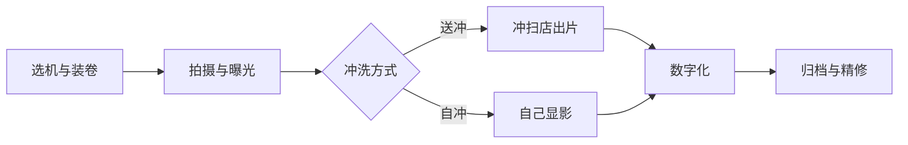

# 胶片 · 总览

> 「胶片」是摄影栏的第五个分组，覆盖**选机 → 选卷 → 拍摄 → 冲洗 → 数字化**的完整链路。胶片的门槛不在某一项技术多难，而在于**环节多、反馈慢、出错难归因**——拍完看不到结果，问题可能几周后才暴露。所以本组的组织方式是：一条能照着走完的主线教程 + 各环节的深入文章 + 一份出错后的归因手册。价格随时波动，涉及行情处均标注**信息核对时点**。

## 链路总览

| 链路节点 | 对应文章 | 解决的问题 |
| --- | --- | --- |
| 选机型 | [胶片机身怎么选](胶片机身怎么选.md) | 单反/傻瓜机/一次性/拍立得六大类的取舍 |
| 选具体机器 | [单品档案 · 尼康 F801](/contents/设备/单品档案/相机/NIKON-F801.md) / [美能达 α7700i](/contents/设备/单品档案/相机/MINOLTA-a7700i.md) | 具体型号规格、行情与逐项验机 |
| 选胶卷 | [胶片种类与选择](胶片种类与选择.md) | 彩负/反转/黑白、感光度、在产型号怎么挑 |
| 装卷与第一卷 | [新手第一卷指南](新手第一卷指南.md) | 端到端主线：从购买到看到成片 |
| 拍摄与曝光 | [曝光与拍摄逻辑](曝光与拍摄逻辑.md) | 宽容度法则、估光兜底、倒易律失效 |
| 冲洗 | [冲洗：送冲与自冲](冲洗送冲与自冲.md) | 送冲不踩坑、黑白自冲全流程 |
| 数字化 | [数字化：扫描与翻拍](数字化扫描与翻拍.md) | 扫描/翻拍路线、反色校正、归档 |
| 出问题之后 | [常见故障诊断](常见故障诊断.md) | 症状 → 归因四方 → 对策 |

## 学习路径

| 读者画像 | 推荐路径 |
| --- | --- |
| 还没买机器 | 先读胶片机身怎么选定类型 → 再进新手第一卷指南照做 |
| 已有机器想开张 | 新手第一卷指南从头读到尾 → 拍完回来读冲洗的送冲节 → 出问题查故障诊断 |
| 有机有卷、没冲过 | 第一卷指南后半段（送冲下单起）+ 冲洗篇全文 |
| 全流程走过、想深入 | 种类选择 → 曝光逻辑 → 数字化，按兴趣补自冲 |

四条路径的共同原则：**主线文章照着做，知识文章按需查**。不建议把七篇当书从第一页读到最后一页再动手——胶片学习的正反馈来自"拍完一卷看到结果"，越早走完第一个闭环越好。

## 成本全景

> 信息核对时点：2026-08。以下为参考区间，行情波动大，下单前以实时价格为准。

| 层级 | 项目 | 参考区间 |
| --- | --- | --- |
| 一次性投入 | 二手胶片机身 + 定焦镜头 | 数百元至千元级 |
| 一次性投入 | 黑白自冲套装 / 微距翻拍架 | 各约数百元（可后置） |
| 每卷变动成本 | 在产彩色负片 | 约 45–90 元/卷（型号差异） |
| 每卷变动成本 | C-41 冲扫套餐 | 约 18–40 元/卷 |
| 折算 | **单张成本** | 约 **2–4 元/张** |

换算成月预算更直观：每月两卷彩负 + 冲扫 ≈ **130–260 元/月**——这是普通玩家最真实的持有成本；每月四卷以上再考虑自冲摊薄；拍立得另算（单张 5–20 元，见机身篇）。

省钱杠杆按效果排序：①过期货与促销卷（打六到八折，风险见过期胶片）；②黑白银卷自冲（变动成本压到每卷十元内）；③微距翻拍代替底扫店精扫（设备一次投入后近乎零边际成本）。若预算极度有限，半格机与一次性机是另外两条低门槛起步线。

## 与其他分组的关系

本组是摄影栏里的**平行工作流**，与既有分组有三条清晰的接口：

- **原理同源**：曝光三要素、构图、用光的底层知识与数码完全一致，本组只讲胶片特有的差异部分（宽容度方向、倒易律、估光），原理回链[器材](/contents/摄影/器材/相机机身.md)与[拍摄技术](/contents/摄影/拍摄技术/构图.md)，不重复展开；
- **终点汇合**：数字化之后的精修就是[后期处理](/contents/摄影/后期处理/Lightroom工作流.md)的常规技能，两条链路在此汇成一条；
- **机器互通**：拍胶片的机器是[设备 · 单品档案](/contents/设备/README.md)的一部分，规格与验机细节都在那边，本组只负责"怎么用它拍"。

## 高频疑问

**Q：2026 年了还值得入坑胶片吗？**
值得，但要想清楚买的是什么：不是画质（同价位数码更强）、不是效率（链路长一倍），而是**决策节奏与仪式感**——每按一次快门都有成本，逼你想清楚再拍；以及延迟数周的"开盲盒式"反馈。把它当"慢速练习法 + 收集癖出口"，体验是成立的；指望它替代日常记录，很快会吃灰。

**Q：胶片画质到底比数码差多少？**
分辨率层面，好镜头 + 精细数字化的 135 底片约等效 1200–2400 万像素，颗粒结构与现代数码噪点观感完全不同；宽容度彩负不输多数无反 RAW。真正的差距在暗光高感与长焦 wildlife 这类极端场景。结论：日常光线下的社交尺寸输出，胶片完全够用且质感独特；放大到大幅面则要上中画幅，成本陡增。

**Q：手机上的"胶片感滤镜"和真胶片是一回事吗？**
不是。滤镜模拟的是色彩风格（偏色、颗粒、漏光边），而真胶片的差异深入到高光过渡方式、宽容量、以及"拍前必须判断"的决策过程。滤镜是结果模仿，胶片是过程不同——本组教的是后者。

**Q：全流程走一遍要多久？**
理想时间线：下单一卷+电池当天到手，装卷拍摄 1–2 周，邮寄冲扫 3–7 天——**从零到看到第一张成片约两周到一个月**。这个反馈速度劝退了不少急性子，也恰恰是它筛选出的玩法属性。

## 术语速查

| 术语 | 一句话解释 |
| --- | --- |
| 负片（底片） | 明暗与实景相反的底片，通用性最好，即 C-41 工艺彩负与黑白负片 |
| 反转片（正片/幻灯片） | 冲出来直接是"成品"的正像，色彩浓、宽容度窄、容错低 |
| 135 / 120 | 35mm 标准规格 / 中画幅卷带，后者底大数倍但机器与成本都上一档 |
| DX 码 | 胶卷暗盒上的编码条，机身据此自动识别感光度 |
| 迫冲（Push） | 按更高 ISO 拍摄并用延长显影补偿，牺牲颗粒换取暗光能力 |
| 降冲（Pull） | 反向操作，用于强光下保护反转片等场景 |
| 倒易律失效 | 曝光时间过长/过短时，标称组合不再等效，需额外补偿 |
| 阳光十六法 | 无测光时的估光口诀：烈日 f/16、快门取 1/ISO |
| 宽容度 | 胶卷能容纳的明暗范围；负片远大于反转片 |
| 色罩 | 彩负橙色基底层，扫描反色后需白平衡校正掉 |
| C-41 / E-6 / ECN-2 | 彩负 / 反转 / 电影负片三种彩色冲洗工艺 |
| remjet | 电影卷背面的碳黑防光晕层，需额外去除，残留会污损机器与药水 |
| 交叉冲洗（XPR） | 故意用错工艺冲洗（如 E-6 卷走 C-41）得到偏色风格，不可逆且店家可能拒收 |
| 盘片 / 分装 | 大盘胶片自行分装的廉价卷，品质看分装者，混批风险自担 |
| 灰雾 | 底片未曝光区域也不透亮了，过期或保存不良的主要症状 |
| 月牙痕 | 装卷时手指按压胶片留下的弧形折痕 |
| 旁轴 | 取景光路与拍摄光路分开的机身形态，体积小但近摄有视差 |
| 半格机 | 把一张 135 底片切成两半拍摄的机型，一卷 72 张、单张成本减半 |
| 相纸 | 拍立得的一次性成像介质，机身消耗品，单张 5–20 元 |
