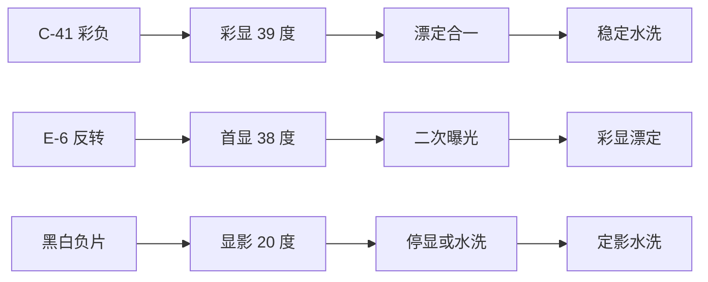

# 冲洗：送冲与自冲

> 冲洗是胶片链路里**最陌生的一环**，但拆开看只有两条路：把卷交给专业店家（省心），或黑白自冲（省钱且可控）。本文覆盖送冲避坑、自冲设备摊销与黑白全流程。冲扫价格随时波动，信息核对时点：2026-08。

## 工艺地图

三条主流彩色/黑白工艺线，先认清你的卷该走哪条：

| 工艺 | 对应胶卷 | 温度敏感度 | 新手友好度 |
| --- | --- | --- | --- |
| C-41 | 彩色负片 | 高（±0.3℃ 级） | 只送不冲 ★★★★★ |
| E-6 | 反转片 | 极高、步骤多 | 强烈建议只送 |
| 黑白 | 黑白负片 | 中（20℃，±1℃ 可容） | **唯一推荐自冲的工艺** |

为什么温度敏感度差这么多：彩色乳剂的成色染料对显影速率极其挑剔，39℃ 偏离半度，三层感光层的色彩平衡就系统性跑偏（整卷偏色）；黑白的显影产物只是金属银密度，温度偏一点无非是密度和反差的轻微浮动——**这就是"黑白可自冲、彩色建议送冲"的全部技术根源**。

## 送冲：怎么送不踩坑

服务黑话对照：

| 服务黑话 | 实际含义 | 注意 |
| --- | --- | --- |
| 只冲不扫 | 仅显影出底片条带 | 适合自己翻拍的玩家 |
| 冲扫一体 | 显影 + 标准分辨率扫描出图 | 新手默认项 |
| 精扫 / 高清扫 | 高分辨率细致扫描 | 好卷回补用，单价数倍 |
| 按张扫 / 按卷扫 | 计费方式差异，按卷通常划算 | 留意是否含废帧 |

分辨率档位心里有数：**标准扫**多为 1200–1800dpi 级别（135 全幅约合 400–800 万像素），社交分享完全够用；**高清扫** 3000–4000dpi（约 1500–2100 万像素），为打印和放大留余量。先用标准扫筛卷，满意的卷再回补精扫，是最省钱的路径。

**怎么判断一家冲扫店靠谱**：

1. **敢晒底片**：愿意把你的底片条带拍给你看的店，工艺状态通常经得起看；
2. **问工艺答得上来**：问"C-41 多久换药""电影卷收不收"，回答具体（有周期、有条件）比回答模糊（都能弄）可信得多；
3. **扫描件风格固定**：同一卷分两次扫颜色基本一致，说明流程标准化；忽冷忽暖说明靠人工随手校正；
4. **翻车了讲道理**：出问题愿意分析底片、按责任划分处理（操作问题自担、工艺问题重扫或免单）的店值得长期合作。

避坑四条：

1. **核对工艺再寄**：彩负 C-41、反转 E-6 写清楚；电影卷（ECN-2）务必提前确认店家收——remjet 会污染 C-41 药水，不少店直接拒收；
2. **交叉冲洗（XPR）想清楚再玩**：反转卷走 C-41 得到浓烈偏色风格，不可逆且属于"非标服务"，价格与翻车率都高；
3. **邮寄防压防热**：硬筒包装，夏天避开暴晒车厢——高温未冲洗的卷会继续变化；
4. **底片要回来**：勾选"整卷不剪"保留完整条带，既方便翻拍也方便日后重新扫描。

## 自冲：设备与摊销

以最经济的黑白自冲为例：

| 设备 | 参考价位档 | 说明 |
| --- | --- | --- |
| 显影罐 + 引片器 | 低 | 双卷罐更通用；引片器比手动上片友好得多 |
| 暗袋或全黑房间 | 低 / 零 | 上卷进罐的唯一避光环节；被窝是民间替代方案但不推荐夏天用 |
| 温度计 + 量杯 | 低 | 温度是黑白显影的生命线；玻璃棒式比电子式可靠 |
| 药水套装（显影/停显/定影） | 中 | 按次稀释摊销；浓缩型储存液性价比更高 |
| 水洗器 / 防渍液 | 低 | 可逐步补齐，首卷没有也能出片 |

采购顺序建议：第一卷只需要「罐+引片器+温度计+三瓶药」四样；水洗器、防渍液、暗袋升级等拍到第三五卷再按需补——先验证自己会不会坚持下去，再谈设备完整度。

**盈亏平衡账**：套装一次性投入约数百元，之后每卷变动成本只剩药水摊销（约十元内）；对比送冲黑白每卷二三十元级，**大约 20–30 卷回本**——如果你每月拍两三卷黑白，一年内就是纯赚，还多了一道手艺的乐趣。

## 彩色自冲可行吗

技术上可行，工程上劝退。家用 C-41 套件（粉剂/液剂小包装）确实存在，但要面对三个现实：

1. **温度墙**：彩显要求 39℃ ±0.3℃，家用恒温手段（恒温水浴、恒温棒）需要反复练习才能稳住；
2. **药水寿命短**：小容量套件开配后工作液寿命以周计，拍卷频率跟不上就是倒药水；
3. **省的钱有限**：套件按 4–8 卷设计，摊下来的冲洗成本与送冲差距不大，还要自己承担报废风险。

结论：**黑白是自冲的甜点区，彩色送冲更划算**。彩色自冲留给"每周固定出卷的重度玩家"或"就想搞明白原理的人"。

## 黑白自冲分步实战

全程室温 20℃ 为基准，步骤时间以所用显影液的官方表为准：

| 步骤 | 时间参考 | 动作要点 |
| --- | --- | --- |
| 预湿 | 1 分钟 | 注水轻晃倒掉，赶走气泡 |
| 显影 | 视药液 6–13 分钟 | 前 30 秒连续搅动，之后每分钟搅动 10 秒；温度波动控制在 ±1℃ |
| 停显 | 30 秒 | 专用停显液或清水代 |
| 定影 | 5–10 分钟 | 至"澄清时间 ×2"；定影不足是底片发灰的常见根因 |
| 水洗 | 10 分钟 | 流水或换水多次，残留定影液是 archival 大敌 |
| 防渍/晾干 | 数分钟 + 过夜 | 防渍液过一遍减少水痕；片夹垂直悬挂无尘处晾干 |

**温度控制的三种手段**（按投入排序）：①大水浴法——显影罐坐在比目标温度高 1~2℃ 的温水盆里，最廉价也最稳，适合 20℃ 的黑白；②恒温棒——鱼缸加热棒配保温桶，精度够黑白用，彩色勉强；③空调房整体控温——把整个操作环境的气温调到目标值，一劳永逸但费电。新手用水浴法足够。

**首卷失败三大原因**：温度漂移（显影时间对但温度错）、搅动不足（显影不均成条纹）、定影不足（底片乳白色不通透）。三件事盯住，第一卷成功率极高。

#### 显影液怎么选

| 药液 | 特点 | 适用 |
| --- | --- | --- |
| D-76 / ID-11 | 经典标准颗粒，1+1 稀释好用 | 万金油首选 |
| XTOL | 锐度与颗粒平衡好，溶解麻烦 | 进阶 |
| HC-110 | 浓缩液用量省、保存期长 | 低量玩家 |
| Rodinal | 超浓缩、极省、锐度高颗粒明显 | 慢速卷与风格化 |

各药液 × 各胶卷的具体时间查 Massive Dev Chart（社区维护的开发时间数据库），不要凭记忆猜。搭配逻辑与[种类篇的显影维度](胶片种类与选择.md)呼应：先用 D-76 打基准，看清自己卷子的原始性格，再决定往锐利还是细腻方向调整。

#### 迫冲的冲洗侧

迫冲不是只把 ISO 拨高：拍摄按 800 曝光的 HP5，需要显影侧同步延长（具体时间同样查开发表）。送冲时必须注明"按 800 迫冲"，否则店家按标准流程处理，整卷照样欠曝。

自冲迫冲的两个注意点：延长的显影时间会放大反差，暗部层次损失比送专业店手工补偿更大；迫两档以上（1600 级）建议换专用配方而非简单延时——查表时直接搜"卷名 + push 1600"的组合结果。

## 药水管理

| 药液状态 | 寿命参考 |
| --- | --- |
| 未开封原液 | 按瓶身保质期，普遍很长 |
| 开封浓缩储存液 | 数月至半年以上（满瓶避光） |
| 工作液（已稀释） | 当次至数天，D-76 1+1 即弃为佳 |

失效信号：显影力下降（同时间密度变薄）、药液变色浑浊、定影液测不出澄清。宁可早弃，不可将就——药水的钱省不出一卷重拍的时间。

两个低成本管理习惯：①所有开封药水瓶身贴标签写开封日期，用油性笔；②定期做"澄清测试"——一滴定影液滴在曝光过的废片头上一分钟内变透明则定影力合格，超过两分钟就该换了。这个测试同时用于判断[冲洗不足](常见故障诊断.md)的责任方。

#### 底片的归档

冲好的条带是唯一原件，归档规格：玻璃纸分卷袋逐卷装袋（避免 PVC 材质，析出物伤乳剂）、活页夹立放防压、袋面标签写**日期+机型+胶卷批次+迫冲标记**；长期存放进防潮箱并定期检查。这些标签同时是故障诊断里追溯问题批次的依据。

## 冲洗自查清单

- [ ] 温度计校准过（冰水混合物应读 0℃）？
- [ ] 显影时间查过官方表而非凭印象？
- [ ] 温控方案就位（水浴至少提前十分钟稳定）？
- [ ] 搅动节奏按规范执行？
- [ ] 定影做够澄清时间 ×2？
- [ ] 水洗充分、用了防渍液？
- [ ] 送冲的卷写明工艺、分辨率档位与迫冲要求？
- [ ] 底片已入无酸袋并贴好批次标签？
- [ ] 药液开封日期已标注？
