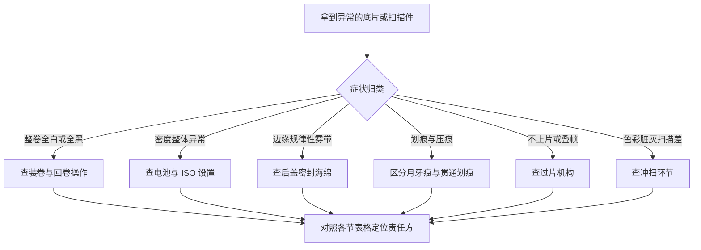

# 常见故障诊断

> 胶片的反馈是**延迟的**：装卷时的小失误，要到几周后拿到底片才暴露，而此时你往往已经拍了第二、三卷。本文的任务是把"发现异常"翻译成"该怪谁、怎么办"——归因四方只有四个：**操作 / 机身 / 胶卷 / 冲扫**。归因结论直接决定下一步动作：改操作、修机器、换卷，还是找店家。

## 归因框架
### 归因四象限

判定前先固定一个原则：**一次只怀疑一个变量**。换机、换卷、换店同时发生时，你永远学不到真正的原因。

第二个原则：**先便宜后昂贵**。怀疑顺序按成本排——先查电池（十几元）、再查操作习惯（免费）、然后是胶卷批次（几十元）、最后才是送修机身（数百元起）。多数问题在前两级就终结了。

## 曝光与密度异常
### 底片全白或全黑

最惨烈的两种整卷事故，先讲透：

| 症状 | 本质 | 最可能原因 | 责任方 |
| --- | --- | --- | --- |
| 整卷**透明全白**（彩负冲出为空白） | 胶片从未曝光 | 装卷失败（片头未咬合，空转过片）；快门实际未开启；镜头盖没摘（自动测光机身仍会正常过片） | 操作为主 |
| 整卷**不透明全黑**（彩负冲出为深黑） | 胶片被彻底二次曝光 | 回卷按钮没按就开后盖；后盖未关严整卷漏光雾化；相机长期故障卡帘 | 操作/机身 |

判别技巧：看齿孔边缘——全黑但齿孔清晰说明是"拍完的卷被暴光"，齿孔也发灰则更像开盖漏光。透明卷拿在灯下仔细找：如果连片头引片段都无曝光痕迹，基本锁定装卷失败。

事故后的心理建设：这两种事故几乎人人中过一次，损失的是一卷加一次冲扫钱（百元级），换来的是对装卷流程的终身警惕。拍完这卷，把[新手指南的装卷节](新手第一卷指南.md)重读一遍再上第二卷。

### 密度与曝光异常

| 症状 | 优先排查顺序 |
| --- | --- |
| 全卷系统性欠曝（底片薄而透） | 测光电池电压不足 → ISO 设定高于胶卷标称 → 曝光补偿残留负值 → 测光系统老化偏移 |
| 全卷系统性过曝（底片厚而密） | 补偿残留正值 → ISO 设定低于标称 → （反转片）强光环境未收档 |
| 忽好忽坏、无规律 | 混合原因：拍摄者对逆光场景的测光习惯 + 中央重点测光被大面积亮部带偏 |

电池是老胶片机的第一嫌疑人：电压不足时测光会悄悄失准而非罢工。校验方法见[曝光与拍摄逻辑](曝光与拍摄逻辑.md)。

**一个专业判别技巧——看片边字码**：底片边缘的批次字母数字（如 `5063 400KODAK`）是厂家印制、由**冲洗显影**显出来的。如果画面薄但片边字码黑实清晰，说明显影正常、问题在**曝光侧**（查测光/ISO/操作）；如果连字码都发淡，则是**显影不足**，责任在药水或冲扫环节。这一招能把"怪机器还是怪店家"之争一秒分清。

### 色彩异常诊断

彩负的色彩问题比密度问题更迷惑，按症状对照：

| 症状特征 | 最可能原因 | 责任方 | 对策 |
| --- | --- | --- | --- |
| 整卷偏青绿、灰蒙蒙 | 彩负过期衰减或高温存放变质 | 胶卷 | 换新批次；同批剩余卷降感光度救急 |
| 偏紫红 + 细麻点 | 电影卷 remjet 除碳不净 | 冲扫工艺 | 找支持 ECN-2 的店家重冲；污染药水的需交涉 |
| 大面积色块诡异地溢出成纯色 | 扫描端色罩校正过度 | 冲扫 | 要求重扫并指定标准校正 |
| 整体发闷像蒙纱 | 药水疲态或扫描玻璃脏污 | 冲扫 | 清洁重扫；连续多卷如此则换店 |
| 单张局部色斑 | 显影搅动气泡贴附 | 冲扫 | 重洗无效即接受，属低概率损耗 |

色彩类问题的证据要求更高：保留同批次其他正常卷做横向对照，比单卷申诉有力得多。

还有一个容易被误判成"故障"的情况：**扫描件的色彩本来就不是定论**。同一底片换个店家颜色就不同——先排除技术性异常（对照上表），剩下的差异属于审美与流程选择，处理思路见[数字化篇](数字化扫描与翻拍.md)的色彩管理部分，不是谁的责任问题。

## 机械与物理损伤
### 漏光的识别与定位

漏光的价值在于**位置即线索**：

- **规律性边缘雾带**（每张同侧、沿片边）：后盖密封海绵老化发粘掉渣——胶片机头号通病，几十元的海绵条 DIY 可换；
- **随机光斑/光条**：仓体变形、铰链缝隙、快门帘幕针孔（对着强光源从镜头筒内目视帘幕）；
- **定位实验**：装一卷废卷，在不同位置贴上不同颜色的胶带，对灯"烤"半天后冲洗——哪条胶带位置发黑，漏点就在哪。

海绵更换补充三点：拆旧海绵务必清理干净残胶（酒精棉片），残留胶质会粘到胶卷上形成新问题；新海绵厚度按原样（多为 1~2mm），太厚关不上后盖、太薄继续漏；更换后必做一次废卷烤灯验证，别拿真卷赌。

### 划痕、静电与异物

| 症状特征 | 成因 | 责任方 |
| --- | --- | --- |
| **月牙形浅痕** | 装卷/倒片时手指按压片身 | 操作（改用捏两侧边缘的手法） |
| **纵向贯通长划**（多帧同位置） | 压片板毛刺、仓内导轨积砂，或冲扫设备导轨 | 先自查机身压片板（放大镜摸检），排除后再找店家 |
| **横向短划/网纹** | 冲洗药水污染或刮片 | 冲扫店家 |
| 静电放电花枝纹 | 干燥环境快速过片/回卷 | 环境+操作（冬季尤其注意） |

责任判定直接影响钱包：机身问题自己修，冲扫问题凭证据索赔——这就是参数记录和保留样片的意义。

纵向划痕的自查顺序再细一步：把底片对着光源缓慢倾斜转动，观察划痕是否**始终在同一物理高度**——是则嫌疑集中在压片板/导轨（机身或冲扫），随帧漂移则更可能是乳剂损伤或静电。这一眼能省一轮扯皮。

### 卷片与叠帧问题

- **计数器走但底片空转**：片头未咬合收片轴（回看装卷步骤）——症状是回卷手感极轻、拍完冲洗发现只曝了片头几厘米；
- **叠帧/跳帧**：过片齿轮磨损或装卷松脱，画面部分重叠或间隔空白；偶发可接受，频发送修；
- **回卷卡死**：切勿蛮力硬拧——先按住倒卷钮确认状态，持续阻力多半是片尾断裂在舱内，暗袋或全黑房间开仓处理；
- **自动过片马达异响无力**：先换新电池排除供电，再判断齿轮组老化——老电子机的马达故障维修价常超机身残值，要有心理预期。

### 机身侧的"假故障"

有些状况看着吓人，其实不是底片级的问题：

| 现象 | 多半是 | 处理 |
| --- | --- | --- |
| 取景器里测光显示不亮 | 电池耗尽或触点氧化 | 换电池并用橡皮轻擦触点 |
| 测光数值乱跳 | 曝光补偿拨盘停在中间位接触不良 | 拨盘来回转几次清氧化物 |
| 快门按下无反应 | 自动机型在"对焦未合焦锁定"状态 | 属正常保护逻辑，非故障 |
| 日期后背显示残缺 | 纽扣电池没电 | 与主电池独立，单独更换 |
| 自拍按了不触发 | 机械自拍扳手未上满 | 上到底再按 |

这类问题的共同点：**不影响已拍底片**，属于使用层面的小障碍。分辨"假故障"的价值在于避免病急乱投医送去大拆大修——老机身最怕的就是不必要的开膛。

## 冲扫环节与预防
### 冲扫环节的问题

| 症状 | 特征 | 对策 |
| --- | --- | --- |
| 色罩校正过度 | 大面积色块出现诡异的纯色溢出 | 要求重扫并指定"标准校正" |
| 扫描件蒙灰 | 整体低对比像蒙了层纱 | 多为扫描仪玻璃/底片灰尘，清洁后重扫 |
| 药水过期症状 | 底片整体发浑、灰雾偏高、色彩发闷 | 换店并留样对比 |
| 边缘裁切错误 | 画面缺边或带入邻帧 | 重扫即可，属操作失误 |

索赔要点：**礼貌 + 证据**——提供同批次其他正常卷作对照、指出具体帧号与症状、明确诉求（重冲/重扫/退款）。绝大多数店家对有理有据的反馈会妥善处理。

沟通模板三句话结构："这卷是 X 日寄冲的 Y 型号，第 N 帧出现 Z 症状；同批次的另一卷正常，附图对照；希望按 A 方案处理。"信息完整、责任指向清晰、诉求明确，三方都体面。

### 预防性维护

诊断的最高境界是少诊断。老胶片机的维护清单很短但很有效：

1. **长期不用取出电池**：漏液腐蚀电池仓是电子胶片机第一大死因，仓内已见白霜立即断电清擦并送检；
2. **每两个月过一遍片**：哪怕空拍——快门机构、过片齿轮长期静止会发涩，定期运转是最好的保养；
3. **后盖海绵按年检查**：按压测试弹性，发粘掉渣立即更换（几十元 DIY）；
4. **存放环境**：防潮箱或干燥剂密闭盒，直立放置，远离暖气与窗边直晒；
5. **镜头卡口与触点**：换镜头时顺手检查触点氧化，电子触点是 AF 时代的命脉。

维护投入合计不过几十元和每月几分钟，换来的是机器稳定服役多年——这笔账比任何一次维修都划算。

### 诊断自查清单

- [ ] 异常已按四象限归类（操作/机身/胶卷/冲扫）？
- [ ] 排查遵循"先便宜后昂贵"顺序？
- [ ] 只改动了一个变量做验证？
- [ ] 电池电压已测或已更换？
- [ ] 用片边字码区分过曝光问题与显影问题？
- [ ] 问题帧的位置与物理损伤位置做过对应？
- [ ] 已排除"假故障"（取景器/后背类）？
- [ ] 参数记录与底片条带都已保留？
- [ ] 涉及店家的已备齐同批次对照证据？
