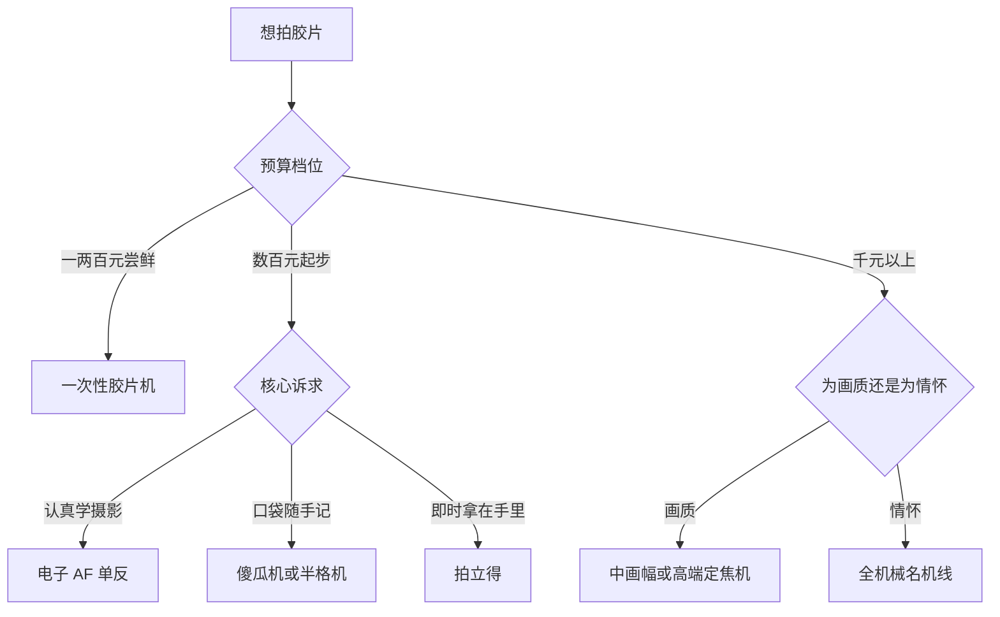

# 胶片机身怎么选

> 本文解决"用什么机器拍胶片"的**类型级决策**：单反、旁轴、傻瓜机、半格机、一次性、拍立得六大类的取舍地图。具体型号的深度档案在[设备 · 单品档案](../../设备与工具/设备/README.md)（如[尼康 F801](../../设备与工具/设备/单品档案/相机/NIKON-F801.md)、[美能达 α7700i](../../设备与工具/设备/单品档案/相机/MINOLTA-a7700i.md)）。二手行情随时波动，信息核对时点：2026-08。

## 六类机型地图

| 类型 | 代表形态 | 自动化 | 后期投入 | 价位档 | 一句话适合谁 |
| --- | --- | --- | --- | --- | --- |
| 电子 AF 单反 | F801 / α7700i | 测光·过片·对焦全自动 | 胶卷+冲扫 | 数百元起 | **新手默认答案** |
| 全机械单反/旁轴 | 尼康 FM2、佳能 AE-1、Canonet QL17 | 手动过片，部分无测光 | 胶卷+冲扫 | 数百至数千 | 想要机械手感与仪式感 |
| 傻瓜机 | 奥林巴斯 μ-II、康泰时 T2/T3 | 全自动定焦便携 | 胶卷+冲扫 | 百元至万元网红税 | 口袋随身记录党 |
| 半格机 | Kodak Ektar H35、奥林巴斯 Pen 系 | 多为自动 | 胶卷+冲扫（省一半） | 数百元 | 胶卷焦虑症患者 |
| 一次性胶片机 | 柯达 FunSaver、富士 QuickSnap | 全固定 | 整机即弃（含冲扫另计） | 数十至百元 | 派对、备用、零门槛尝鲜 |
| 拍立得 | Instax mini、宝丽来 SX-70 | 全自动 | **相纸持续消耗** | 机身几百起+相纸 | 即时分享、独一份纪念 |

读表的姿势：先看「后期投入」列——胶片机的真实成本是**持续成本**，机身只是一次性的；再对「一句话适合谁」做自我定位。六类不是优劣排序，是六种不同的成本结构与使用场景，下面逐类展开。

## 电子单反：新手默认答案

九十年代前后的电子 AF 单反是当下被低估最严重的品类：当年旗舰技术下放（F801 的 1/8000 快门、α7700i 的预测对焦），如今价格塌方到几百元，配套镜头同样是白菜价。更重要的是它把**过片、回卷、测光、对焦全部自动化**——你的学习带宽可以全部留给曝光和构图本身。

选购要点三条：

1. 优先大厂主流型号（尼康 F 系、美能达 i 系、佳能 EOS 胶片机），配件与电池好找；
2. 确认测光与过片工作正常——老电子机的**电池仓腐蚀是最大杀手**：收货先开仓看触点，绿色锈迹或白色粉霜直接pass；轻微氧化可用橡皮擦救，腐蚀到弹簧的机型不值得修；
3. 卡口决定镜头生态，入坑前先看对应卡口的存量镜头池深不深——这也是 F 卡口与 A 卡口至今吃香的原因。

一个常被忽略的优势：电子单反的镜头可以无缝转接到今天的索尼 E / 尼康 Z 微单上玩手动（F→E、A→E 转接环几十元）——同一套镜头喂两代机身，二手贬值风险进一步摊薄。

深度档案见[尼康 F801](../../设备与工具/设备/单品档案/相机/NIKON-F801.md) 与[美能达 α7700i](../../设备与工具/设备/单品档案/相机/MINOLTA-a7700i.md)，含逐项验机表。

## 机械机与旁轴的溢价

FM2、AE-1 这类机械机型的浪漫很真实：不用电池也能拍（部分型号）、快门声干脆、金属机身传代感。代价也要认清——多数没有自动过片，部分没有测光（需要估光兜底，见[阳光十六法](曝光与拍摄逻辑.md)），而且近年价格已被情怀推高，同价位能买到的自动化程度大幅缩水。旁轴测距仪机型（Canonet QL17 等）体积小巧、广角端取景有优势，但叠焦对焦需要练习，近摄精度不如单反所见即所得。

机械机特有的验机点：慢门档位逐档听（1s、1/2s 档最易发黏拖泥带水）、快门帘幕对光查针孔、自拍器是否走完全程。慢门机构保养是常见维修项目，收机器前把这几档都过一遍。

> 一句话：**机械感值得付钱，但不该在新手期付**——先用电动机型学会拍照，再为手感买单。

## 傻瓜机：便利与网红税

傻瓜机 = 自动曝光 + 自动过片 + 定焦或小变焦的口袋机，本质是把"拍到的能力"压缩到最小体积。这个市场目前最大的坑是**网红税**：

| 机型 | 定位 | 价位现实 |
| --- | --- | --- |
| 康泰时 T2 / T3 | 德系蔡司镜头网红机 | 被炒到数千甚至万元级，画质配不上价格 |
| 美能达 TC-1 / 尼康 35Ti | 高端定焦傻瓜机 | 同样严重溢价 |
| **奥林巴斯 μ[mju:]-II** | f/2.8 大光圈定焦防水 | **百元级的真香之王**，虚化能力越级 |
| 各品牌变焦傻瓜机 | 入门普及款 | 几十元随便买，练手无压力 |

务实路线：要么几十元的变焦机纯玩，要么直接锁定 μ-II 这类"性能未被炒作"的真值机型。

验机三查展开：①镜片起雾长霉——对着灯从前后两个方向看镜片内部，雾状反光或蛛网纹都是霉，傻瓜机镜组拆修基本不现实；②自动对焦犹豫——半按快门听对焦马达，反复拉风箱或干脆不动都说明测距组件老化；③机内 LCD 缺划——傻瓜机的曝光参数、张数全靠这块小液晶，缺划意味着你蒙着眼在拍。

变焦傻瓜机的预期管理：几十元机型的镜头素质就是"记录水平"，边缘画质松散是常态——买它的目的是随身率，别拿它跟单反比锐度。

## 半格机：一卷顶两卷

半格机把一张标准 135 底片切成两半，36 张的卷能拍 72 张——单张成本直接减半，专治"按快门肉疼"。现代代表 Kodak Ektar H35 数百元全新带闪灯；经典线是奥林巴斯 Pen 系列。代价同样明确：画幅减半意味着放大后颗粒更明显、构图横竖颠倒（取景器竖着看、底片横着排），画质上限让位于出片数量。它是好玩的第二台机，不建议作为唯一主机。

## 一次性机：零门槛尝鲜

结构极简：塑料镜头 + 固定快门光圈 + 预装 27 张彩负，拍完整机寄去冲扫。它的价值不在画质（塑料镜头边缘成像松散、闪光灯有效距离仅两三米），而在**决策成本为零**：

| 项目 | 数值 | 说明 |
| --- | --- | --- |
| 整机价 | 约 60–100 元 | 含 27 张预装卷 |
| 冲扫 | 约 20–35 元/卷 | 与常规彩负相同 |
| 折算单张 | **约 3–5 元/张** | 比自有机型贵约一倍 |

适用场景：派对婚礼人手一台、海边泳池带防水款、旅行时当主机的保险、以及"不确定要不要入坑"前的低成本试水。使用提示：它的固定曝光按晴天设计，暗处只能靠闪光灯硬打——室内距离超过三米就别指望闪光够到了。注意区分：一次性机拍完即弃，与市面上"复古 CCD 相机"是完全不同的两个东西。

## 拍立得：独一份的逻辑

拍立得与上述所有类型的本质区别：**没有底片，按下快门几分钟后的那张相纸就是唯一成品**。这决定了它的玩法完全不同——不能扫描重印（严格说可以翻拍但失去意义）、废片无法挽回、每按一次都在烧钱。

| 阵营 | 代表系统 | 相纸单张成本 | 特点 |
| --- | --- | --- | --- |
| 富士 Instax | mini / square / wide | 约 5–10 元 | 色彩明快稳定，相纸最便宜，入门首选 |
| 宝丽来 Polaroid | 600 / SX-70 / i-Type | 约 15–20 元 | 经典白框情怀，显影慢、对温度敏感 |

Instax mini 一盒 10 张的价格 ≈ 一整卷 Portra——所以拍立得的正确姿势是**少而准**：留给真正值得定格的瞬间。买前问自己三个问题：①我能接受每张 5–20 元吗？②我需要的是"拿到照片的仪式"还是"积累作品"？③附近买得到相纸吗（停产机型慎入）？

相纸的三条保存纪律：避光低温存放（但不要冷冻）、吐片后**不要甩**（显影是化学滚涂过程，甩动只会造成药液分布不均）、宝丽来系冬季低于 10℃ 显影会明显偏淡，揣怀里拍是正经操作技巧不是段子。

## 购买渠道与价格锚点

| 渠道 | 价格水平 | 风险与适配 |
| --- | --- | --- |
| 闲鱼等二手平台 | 最低 | 主流选择；看卖家历史与实拍样片，支持验货宝优先 |
| 本地胶片店/中古店 | 中高 | 能上手验机、有售后兜底，溢价买的是确定性 |
| 海外拍卖/代购 | 视汇率 | 冷门好货多，但运费+税费+无退路，适合熟手 |

三条砍价与避坑逻辑：

1. **用功能缺陷压价而不是放弃**：海绵老化、皮饰脱落这类可 DIY 修复项，是正当的议价理由（换海绵几十元）；快门故障则直接放弃——维修价不可控；
2. **警惕"全新库存机"溢价**：真库存机确实存在，但更多是翻新充新——看螺丝有无拆卸痕、饰皮接缝、铭牌磨损位置是否合理；
3. **成色与功能分开评估**：外观磕碰不影响成像，为"颜值税"多付的钱要自己认可；功能缺陷才是价格的决定因素。

下单前把目标机型的[单品档案验机表](../../设备与工具/设备/README.md)过一遍，逐项对照卖家描述——这张表本身就是你的议价清单。

## 选型决策树

组合策略也很常见且合理：**电子单反当主力 + 傻瓜机或半格机当口袋副机 + 一次性机留在抽屉应急**——三类覆盖三种场景，总投入可能还不如一支网红傻瓜机。

## 机身自查清单

- [ ] 明确了首要诉求：学技术 / 便携 / 即时分享？
- [ ] 电子机型已确认测光与过片正常、电池仓无腐蚀？
- [ ] 机械机已逐档听过慢门、查过帘幕针孔？
- [ ] 所选卡口/相纸渠道可持续获取？
- [ ] 傻瓜机避开了网红税型号，或为情怀明确买单？
- [ ] 已按"功能缺陷议价、成色分开评估"完成交易？
- [ ] 拍立得已按相纸单张成本核算过月预算？
- [ ] 具体型号的验机清单已在设备栏单品档案里过一遍？
