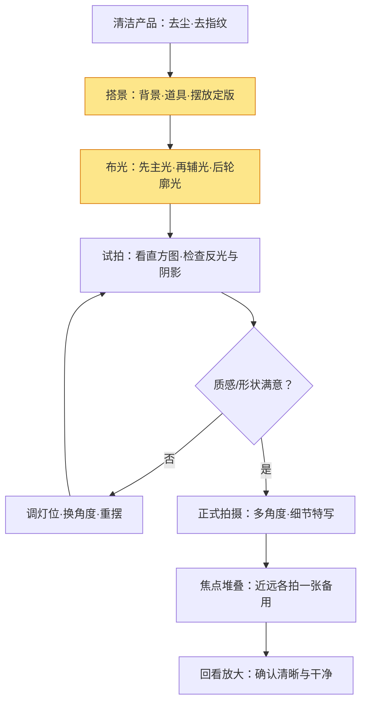

# 产品静物摄影实战

> 产品静物摄影的本质是**把一件东西拍得"让人想买"**——它服务于电商、展示与广告，目标是让观者看清质感、相信品质、产生欲望。它是最"可控"的题材：光、机位、道具、背景全由你安排，难点在于**把可控的事做精**。本文从布光到后期给出完整流程，并用三种材质案例讲透"光怎么打"。

它和人像、风光不同：主体不动、光线可控、场景封闭——所以**成败 90% 在布光和摆放**，而不是时机。学会产品静物，等于把"用光"练到最细。

## 定位与器材
### 产品静物在拍什么

拍的不是"物体"，而是**三个东西**：质感、形状、氛围。

| 目标 | 在解决什么 | 手段 |
| --- | --- | --- |
| 质感 | 让人"看得出手感"（皮、木、金属） | 侧光、硬光、反光板 |
| 形状 | 轮廓清晰、有立体感 | 主光 + 轮廓光 |
| 氛围 | 让人有"拥有它"的想象 | 背景、道具、色彩搭配 |

> 一句话：**产品照的最高境界是"质感看得见、形状立得住、氛围让人心动"**——三者缺一，照片就"平"。

### 器材基线

| 器材 | 作用 | 说明 |
| --- | --- | --- |
| 三脚架 | 稳定、小光圈慢快门 | 产品静物几乎必用 |
| 微距/标准镜头 | 细节与质感特写 | 50-100mm 微距最实用 |
| 柔光箱/反光板 | 柔化光线、补暗部 | 布光核心工具 |
| 小型灯（常亮/闪光） | 可控主光 | 或自然光 + 白纸板 |
| 背景纸/布 | 干净背景 | 黑白灰三色最百搭 |
| 静物台/小道具 | 摆放、营造场景 | 石头、木块、织物 |

> 提示：入门可以**一分钱不花**——窗边自然光 + 一张白纸当柔光屏 + 白纸板当反光板，就能拍出 80 分的产品照。

#### 预算分级方案

| 预算 | 配置 | 适用 |
| --- | --- | --- |
| 0 元 | 窗边自然光 + 白纸柔光屏 + 纸板反光 | 入门练手、非标品 |
| ~200 元 | 两盏 LED 补光灯 + 柔光罩 + 背景纸 | 小件商品、自媒体 |
| ~1000 元+ | 两盏闪光灯 + 柔光箱 + 静物台 | 正式电商、质感要求高 |

## 布光与构图
### 布光：产品静物的灵魂

布光的基础逻辑见《用光》，产品静物最常用的三灯思路：

- **主光**：照亮主体、定整体基调——通常 45° 侧前方、略高于产品。
- **辅光**：补暗部阴影，降低反差——反光板即可，亮面产品尤其需要。
- **轮廓光**：从背后/侧后方打光，勾出边缘——让深色产品从背景中"跳"出来。

> 提示：**先只开主光**，看明暗分布，再逐步加辅光和轮廓光。灯越多越容易乱，从一盏灯开始练。

#### 三种材质怎么打光（核心实战）

#### 材质 A · 玻璃/透明（威士忌瓶、香水瓶）

| 要点 | 做法 | 原理 |
| --- | --- | --- |
| 逆光为主 | 灯放在产品**正后方**，透过瓶子打亮内部 | 透明材质靠"透光"显质感 |
| 深色背景 | 用黑/深灰背景，逆光下瓶身自动"发光" | 亮瓶身 + 暗背景 = 高对比 |
| 边缘勾光 | 两侧各放一块黑卡纸，让瓶身边缘出现白线 | 黑卡挡光 → 边缘反光勾勒轮廓 |
| 细节 | 瓶内液体微晃会有气泡，提前静置 | 气泡上镜显廉价 |

> 效果：逆光 + 深背景 + 两侧黑卡，玻璃瓶立刻有"通透感 + 轮廓线"，这是产品摄影里最出效果的组合。

#### 材质 B · 金属/反光（保温杯、手表、不锈钢）

| 要点 | 做法 | 原理 |
| --- | --- | --- |
| 大面积柔光 | 用大柔光箱/白纸屏，**把光源面积做大** | 反光面越大越柔和，避免"灯泡印" |
| 柔光屏包裹 | 四周用白纸围一圈，只留镜头孔 | 反光材质会反射环境——环境越白越干净 |
| 反光板压光 | 两侧黑卡收边，压出"黑色分隔线" | 金属上的黑线 = 造型感 |
| 忌直射 | 裸灯直打金属 = 一片惨白过曝 | 柔光是金属摄影的生命线 |

> 效果：白棚 + 大柔光 + 黑卡收边，金属件呈现"亮-黑-亮"的节奏，质感立现。

#### 材质 C · 皮具/织物（包、鞋、衣服）

| 要点 | 做法 | 原理 |
| --- | --- | --- |
| 侧光塑形 | 主光 45°-60° 侧前方，略高于产品 | 侧光让皮革纹理和车线立体 |
| 中柔光 | 柔光箱或纱帘，别太硬 | 硬光会吃掉皮面细节 |
| 微距拍纹理 | 特写一张皮面毛孔/车线 | "看得出手感"靠特写 |
| 补光灯 | 暗部用白纸板轻补 | 保留暗部层次，不过暗 |

> 效果：侧光 + 柔光 + 纹理特写，皮具的"温度和身价"就出来了。

#### 布光避坑速查

| 现象 | 原因 | 解法 |
| --- | --- | --- |
| 高光过曝一片白 | 光源太近/太强 | 拉远灯、加柔光、降功率 |
| 多重杂乱阴影 | 灯太多、位置乱 | 回到单主光，逐个加灯 |
| 金属上出现"灯泡印" | 光源面积太小 | 换大柔光箱/加白纸屏 |
| 玻璃瓶一片黑 | 没用逆光 | 灯移到产品正后方 |
| 背景有影子 | 灯离背景太近 | 灯往前移，或加背景灯 |

### 构图与摆放

- **角度**：45° 俯视最常用（兼顾立体与辨识）；平视显庄重；俯视 90° 显设计感。多换角度拍几张选最佳。
- **留白**：主体周围留出空间，方便后期加文字/抠图，电商图尤其重要。
- **道具**：一两件就够了——过度道具会抢主体。
- **对齐**：瓶罐类产品注意垂直对齐、标签正对镜头，歪一点都显廉价。

> 提示：产品摄影的"细节魔鬼"是**清洁**——指纹、灰尘、胶痕，放大后全部现形。开拍前先擦干净，后期能少一半功夫。

#### 常见角度的选择

| 角度 | 观感 | 典型产品 |
| --- | --- | --- |
| 45° 俯视 | 立体 + 辨识度高，最百搭 | 大多数商品主图 |
| 平视 | 庄重、有"旗舰感" | 手表、香水、数码 |
| 俯视 90° | 平面设计感、适合排版 | 化妆品、食品、配件 |
| 微距特写 | 质感、细节、氛围 | 皮具纹理、首饰、镜头 |

## 参数与现场流程
### 参数：清晰优先

| 参数 | 建议 | 说明 |
| --- | --- | --- |
| 光圈 | f/8 – f/11 | 景深大、整件产品都清晰 |
| 快门 | 依光线而定（上三脚架可慢） | 有架不惧慢，无架保 1/125s |
| ISO | 尽量 100 | 产品图要干净，噪点最碍眼 |
| 对焦 | 单点、放大确认 | 对焦在主体关键面（如瓶身文字） |
| 焦点堆叠 | 近处/远处各拍一张后期合成 | 微距特写时景深不够的解法（见《对焦与景深》） |

> 一句话：**产品图优先"全清晰"**——宁可收光圈损失一点虚化，也要整件产品锐利。模糊的产品照 = 劝退买家。

#### 焦点堆叠怎么拍

微距拍大件产品时，f/11 也可能景深不够。解法：

1. 上三脚架，M 挡固定曝光；
2. 对焦最前端拍 1 张，逐步后移对焦点（或调焦环），拍到最远端；
3. 后期在 Lightroom/PS 中"堆叠合成"（自动对齐 + 景深合成）。

> 提示：堆叠张数 = 按景深重叠度来，**相邻两张的清晰区要留 1/3 重叠**，合成才不会出现"糊-清"断层。

### 现场拍摄流程

> 提示：产品静物是**唯一可以慢慢来的题材**——主体不会动、光线不变，多花时间调布光，远比多按快门有价值。

#### 实战案例：一张电商主图从零到成片

以"一个保温杯 + 白背景"为例，走完整流程：

| 步骤 | 做法 | 检查点 |
| --- | --- | --- |
| 1 清洁 | 擦指纹、灰尘，杯口内壁也检查 | 放大看无尘点 |
| 2 搭景 | 白背景纸，杯放静物台，标签正对镜头 | 垂直、居中、留白够 |
| 3 布光 | 主光 45° 前侧大柔光箱，两侧白卡反光 | 金属面无"灯泡印" |
| 4 试拍 | f/8、ISO100、点测光对准杯身 | 直方图不过曝、无死黑 |
| 5 正式拍 | 45° 俯视一张 + 平视一张 + 杯口特写一张 | 每张放大检查焦点 |
| 6 焦点堆叠 | 杯身前后端各一张（f/8 不够时） | 合成后全清晰 |
| 7 后期 | 去尘点、白平衡校准、抠图换纯白背景 | 颜色接近实物 |

> 一句话：**主图 = 干净 + 全清晰 + 颜色准**。这三点做到，点击率就赢了 80% 的同行。

## 后期与自查
### 后期方向

- **清洁瑕疵**：用修复画笔去灰尘、指纹、胶痕（比重新拍省事）。
- **抠图/换背景**：电商图常抠主体换纯色背景，思路见《修图基础》"蒙版"。
- **调性**：曝光归位、白平衡准确——产品图**色彩准确**优先，风格化其次。
- **多张合成**：焦点堆叠、HDR（高光暗部）合成，用《Lightroom 工作流》完成。

> 提示：产品图的后期铁律是**"还原真实"**——买家收到货发现颜色不对，就是最大的翻车。

### 自查清单

- [ ] 产品是否清洁（无指纹、灰尘、胶痕）？
- [ ] 是否用小光圈（f/8 以上）保证全清晰？
- [ ] 白平衡是否准确，颜色是否接近实物？
- [ ] 布光是否突出了质感（有立体感、不过曝无死黑）？
- [ ] 金属/玻璃等反光材质是否避免了"灯泡印/死黑"？
- [ ] 角度是否选对（45°/平视/俯视），有没有歪斜？
- [ ] 留白是否足够（后期加字、抠图方便）？
- [ ] 放大看焦点，主体关键面是否锐利？

### 常见误区

- **误区一：用大光圈拍产品。** 景深太浅，产品一半虚，买家看不清。
- **误区二：灯越多越好。** 乱加灯造成多重阴影、杂乱反光，一盏主光反而干净。
- **误区三：不清洁直接拍。** 指纹灰尘后期修到崩溃，前期擦一下的事。
- **误区四：无视白平衡。** 偏黄/偏蓝的产品图，买家怀疑你货不对板。
- **误区五：机位随手摆。** 产品歪斜、标签不正，显得廉价不专业。
- **误区六：所有材质一种打法。** 玻璃要逆光、金属要大柔光、皮具要侧光——材质不同，光路完全不同。

### 延伸

- [用光](/contents/摄影/拍摄技术/用光.md) —— 光位/软硬/光比，布光的底层原理
- [对焦与景深](/contents/摄影/拍摄技术/对焦与景深.md) —— 小光圈与焦点堆叠的原理
- [曝光三要素](/contents/摄影/器材/曝光三要素.md) —— 光圈优先时 ISO/快门的配合
- [修图基础](/contents/摄影/后期处理/修图基础.md) —— 蒙版/调性，产品后期的基础
- [Lightroom 工作流](/contents/摄影/后期处理/Lightroom工作流.md) —— 产品图的批量调性与合成
- [风光](风光.md) —— 同为"可控机位"，但一个等光、一个玩光的对照

