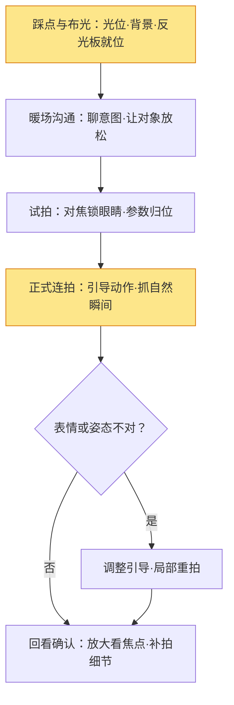

# 人像摄影实战

> 人像摄影的本质不是"拍好看的人"，而是**让任何一个普通人，在镜头前呈现出他最好看、最真实的状态**。它同时动用构图、用光、沟通与后期四门功夫。本文给出从准备到出片的完整流程，并标注每一步对应前面哪篇基础文章——这样你缺哪块知识，直接跳去补。

如果说《人像精修》讲的是"拍完怎么修"，这篇讲的是"站在取景器后面怎么拍"。**前期的引导、用光、机位决定了照片的 80%**，后期只是锦上添花——这句话值得反复读三遍。

## 一、人像在拍什么

人像摄影的难点在于：**对象会动、会紧张、会眨眼**。所以它和风光、静物的最大区别，是"人"本身不可控，你需要学会控制变量。

| 层面 | 在解决什么 | 主要手段 |
| --- | --- | --- |
| 技术层 | 拍清楚、曝光对、不歪 | 参数、对焦（见《对焦与景深》《曝光三要素》） |
| 审美层 | 好看、有氛围、有情绪 | 用光、构图、环境选择 |
| 沟通层 | 对象放松、自然、有表现 | 引导、暖场、节奏控制 |

> 提示：新手最容易掉进"换镜头、堆参数"的坑。但人像的第一瓶颈几乎永远是**沟通**——对象一紧张，肩膀耸起来、笑容僵住，再贵的镜头也救不回来。

## 二、器材与参数基线

人像没有"必须的器材"，但有"好用的基线"。按预算和风格选：

| 焦段 | 透视特点 | 适合 | 注意 |
| --- | --- | --- | --- |
| 85mm / 135mm | 压缩背景、脸型自然 | 半身、特写、糖水 | 需要拉开距离，空间要够 |
| 50mm | 接近人眼、全能 | 半身、环境人像 | 全开光圈背景仍偏实 |
| 35mm / 28mm | 有环境感、略夸张近大远小 | 全身、街拍风、环境叙事 | 靠近拍会显脸大，慎拍特写 |

> 一句话：**85mm 拍"人"，35mm 拍"人和环境"**。新手从 50mm 或 85mm 起步最稳。

参数基线（室内/弱光下微调）：

| 参数 | 建议 | 为什么 |
| --- | --- | --- |
| 光圈 | f/1.8 – f/2.8（半身） | 虚化背景、突出人；但注意别把眼睛拍虚 |
| 快门 | ≥ 1/125s（人像安全线） | 人轻微晃动+手持极限，再慢就糊 |
| 对焦 | 单点 AF-C，锁眼睛 | 眼部追焦是现代机身的神器（见《对焦与景深》） |
| ISO | 能低则低，必要时大胆提 | 现代相机 ISO 3200 可用，别为了虚化牺牲快门 |
| 测光 | 点测光对准脸部 | 人脸是整张照片的"锚"，脸对了就对了 |

## 三、用光：人像的一半是光

用光四要素（光位、软硬、色温、光比）的完整讲解见《用光》，这里只讲人像最实用的几条：

- **窗光是免费的柔光箱**：人物侧对窗户，脸会呈现柔和明暗过渡，这是新手最容易拍出"高级感"的场景。
- **逆光要配补光**：逆光发丝发亮很美，但脸会欠曝——用反光板或闪光灯补一下脸，别让整张脸黑掉。
- **眼神光是点睛之笔**：眼睛里有个小高光，人立刻"活"起来。正侧窗光、灯位略高于眼睛即可获得。
- **柔光拍皮肤、硬光拍轮廓**：柔光（阴天、窗纱、柔光箱）让皮肤干净；硬光（正午、裸灯）拍男性硬朗感。

> 提示：人像布光有一个万能的起点——**主光放人物前方 45°、略高于眼睛**。从这个位置开始调，比从正前方打"平板光"好得多。

### 光比：人像立体的关键

光比 = 亮面与暗面的亮度差，它决定照片"立体感"和"氛围"：

| 光比 | 亮暗差 | 观感 | 适合 |
| --- | --- | --- | --- |
| 1:1 | 无差别 | 平、干净 | 日系、证件照、少女风 |
| 1:2 | 亮面是暗面 2 倍 | 柔和立体 | 日常人像的默认值 |
| 1:4 | 差 2 档 | 明显立体、有戏剧感 | 商业肖像、男性硬朗风 |
| 1:8+ | 差 3 档以上 | 强烈、暗部接近死黑 | 电影感、低调光（low-key） |

**怎么测光比**（两步，用点测光或入射测光表）：

1. 点测光对准**亮面**（鼻梁/额头），记下快门值；
2. 再点测光对准**暗面**（颧骨下方/脸颊阴影），记下快门值；
3. 两值差 1 档 = 1:2，差 2 档 = 1:4，依此类推（每差 1 档，光比 ×2）。

> 提示：想让光比变大，就把主光**拉近**或**调强**（亮面更亮）；想让光比变小，就补辅光/反光板（暗面更亮）。改完再测一次，直到落在目标档位。

### 实战案例：三个最常见场景

#### 案例 A · 窗光人像（新手必练）

| 步骤 | 做法 | 原理 |
| --- | --- | --- |
| 1 找窗 | 选朝北的窗（全天柔光），或朝南但拉纱帘 | 柔光面积大、阴影柔和 |
| 2 摆位 | 人侧对窗 45°，脸转向窗方向一点 | 侧光出立体感，脸别正对窗（会平） |
| 3 补光 | 暗侧放白纸板/反光板 | 把光比从 1:4 收到 1:2，柔和自然 |
| 4 参数 | 光圈 f/2.8，快门 ≥1/125s，ISO 自动 | 眼睛清晰 + 手持不糊 |

> 效果：皮肤干净、眼神光来自窗、背景柔暗——这就是"高级感"最便宜的来源。

#### 案例 B · 逆光人像（下午 4-6 点）

| 步骤 | 做法 | 原理 |
| --- | --- | --- |
| 1 站位 | 太阳在人物**身后**，你朝太阳方向拍 | 逆光勾出头发/肩部轮廓光 |
| 2 补脸 | 反光板或闪光灯补脸部（+0.3~+0.7EV） | 脸不欠曝，轮廓光仍在 |
| 3 对焦 | 眼睛对焦后**锁定**再微调构图 | 逆光下对焦易拉风箱，先锁眼 |
| 4 白平衡 | 用"日光"或让肤色偏暖一点 | 逆光场景自动白平衡常偏蓝 |

> 效果：暖调发丝金边 + 脸部明亮——氛围感和层次感同时拉满。

#### 案例 C · 夜景人像（城市灯光）

| 步骤 | 做法 | 原理 |
| --- | --- | --- |
| 1 找背景 | 找有灯光的街道/橱窗，人站灯前 1-2 米 | 背景光斑 + 前景补光分离 |
| 2 打光 | 机顶闪或常亮灯补人脸，功率别过大 | 脸亮、背景不过曝 |
| 3 快门 | 1/60–1/125s（配防抖镜头） | 背景光斑有亮度，脸由灯照亮 |
| 4 白平衡 | 自动或偏暖 | 混合光下先保证肤色自然 |

> 提示：夜景大忌是"背景亮、脸黑"——**先测背景曝光，再开灯补脸**，这样背景不过曝、脸也不欠曝，两步分开控制。

## 四、沟通与引导

这是人像和风光最大的区别，也是最被低估的一步：

- **暖场**：先聊几句再举相机。被摄者知道"你要拍什么、为什么这么拍"，表情才会放松。
- **给指令要具体**：说"把肩膀沉下来"比"放松一点"有效；说"看那个方向，假装有人喊你"比"看左边"生动。
- **别数"一二三"**：让对象在动作里被抓住，比摆好姿势等快门自然得多。连拍抓瞬间。
- **节奏感**：拍几张就放下相机聊两句，避免对象越拍越僵。
- **夸是生产力**：真诚地反馈"这张好"，对象会越来越进入状态。

> 提示：如果对象紧张，最有效的办法是**让他动起来**——走路、转圈、撩头发、拿道具。人一动，表情就活。

### 摆姿的三个万能原则

摆姿不用背几百个姿势，记住三个原则就能自己设计：

1. **重心单脚**：重心放一只脚上，另一只脚放松点地，身体自然有曲线；双脚平均站立会"站桩"。
2. **手要有事做**：手插兜露拇指、搭衣领、捋头发、端咖啡——手一闲就僵，给手安排一个动作。
3. **肩膀斜向镜头**：双肩正对镜头会显宽显呆，微微侧身 + 转脸看镜头，脸型和身形都更好。

> 一句话：**姿势的底层是"不对称"**——重心偏、肩膀斜、头微侧，三个不对称叠加，人就像在"生活"而不是"站岗"。

## 五、构图与机位

构图原则详见《构图》，这里列人像高频场景：

| 场景 | 构图要点 | 常见坑 |
| --- | --- | --- |
| 特写/半身 | 眼睛放在上三分之一线；留出视线方向的空间 | 裁到关节（手腕、膝盖） |
| 全身 | 头顶留一点"呼吸"，脚下别裁 | 头顶顶天、脚被切 |
| 环境人像 | 人被放小、环境讲故事（35mm 主场） | 人被淹没，找不到主体 |
| 情侣/多人 | 找"互动"——对视、牵手，比并排站立好 | 各自站桩，像证件照 |

机位高度也很有讲究：**拍孩子蹲下来、拍全身降低机位、俯拍显脸小但慎用**。机位一变，气质立刻不同。

| 机位 | 效果 | 典型场景 |
| --- | --- | --- |
| 平视（人物眼睛高度） | 平等、自然、舒服 | 日常人像的默认 |
| 低机位（仰拍） | 显高、有气势、拉长腿 | 全身、时尚感 |
| 高机位（俯拍） | 显脸小、柔和、可爱 | 女生半身、特写 |
| 贴地（极低） | 戏剧感、前景夸张 | 创作、广角全身 |

## 六、现场实战流程

把前面所有步骤串成一条可执行的时间线：

> 一句话：**先布光，再沟通，然后连拍，最后回看**。顺序别反——对象状态最好的那十几分钟，应该留给"已经调好的相机"。

### 一次完整拍摄的时间分配（90 分钟参考）

| 阶段 | 时长 | 做什么 |
| --- | --- | --- |
| 踩点/布光 | 15 min | 机位、背景、灯位、反光板 |
| 暖场 | 10 min | 聊拍摄意图、试拍几张找状态 |
| 主拍（状态最好期） | 40 min | 半身→特写→全身，多个场景轮换 |
| 补拍/回看 | 15 min | 放大看焦点、补缺的角度 |
| 收尾确认 | 10 min | 现场回看，确认没有遗漏 |

> 提示：**状态最好的时间段只占全程一半不到**——布光没调好前别让对象站太久，把"废时间"留给布光，把"好状态"留给按快门。

## 七、后期方向

拍完回来，按《Lightroom 工作流》走完整流程；人像专项按《人像精修》处理。前期做得好，后期只需要：

- **全局调性**：白平衡校脸、曝光归位、轻微对比。
- **局部**：磨皮只磨皮肤、眼神光轻微提亮、背景压暗一点点。
- **别过度**：前期光线好，后期几乎不用"大手术"；前期光烂，后期也救不回眼神里的光。

## 八、自查清单

- [ ] 眼睛是否清晰（放大看）？还是对焦对到鼻子/头发上了？
- [ ] 快门是否足够（≥1/125s），有没有手抖糊片？
- [ ] 脸部曝光是否正确（不过曝、不欠曝）？
- [ ] 光比是否落在目标档位（日常 1:2 左右）？暗部还有细节吗？
- [ ] 裁切是否避开关节（手腕、膝盖、脚踝）？
- [ ] 对象表情是否自然放松，还是僵笑/紧张？
- [ ] 摆姿是否符合"不对称"原则（重心偏/肩膀斜/头微侧）？
- [ ] 眼神光是否存在？眼睛有没有"活"？
- [ ] 背景是否干净（有没有电线杆从头顶长出来）？

## 九、常见误区

- **误区一：光圈开到最大就是好。** f/1.2 全开会把眼睛拍虚（景深太浅），f/2.8 反而更稳。
- **误区二：让人"摆"好再按快门。** 摆拍容易僵，动起来抓拍才自然。
- **误区三：光不够就开高 ISO 硬拍。** 先想想能不能借窗光、开灯、用反光板，光的质量比噪点更影响观感。
- **误区四：裁切不在乎关节。** 从手腕/膝盖裁，观感像"截肢"，是新手最常犯的构图错误。
- **误区五：拍完全靠后期修。** 前期没光没情绪，后期只能修瑕疵，修不出感觉。
- **误区六：光比越大越高级。** 光比 1:8 的硬朗脸用在少女风上就是灾难——光比要配合风格，不是越大越好。

## 延伸

- [人像精修](../后期处理/人像精修.md) —— 本文第七步「后期方向」的详细做法
- [Lightroom 工作流](../后期处理/Lightroom工作流.md) —— 把本文的片子放进标准后期流程
- [用光](../拍摄技术/用光.md) —— 光位/软硬/色温/光比，人像的一半是光
- [对焦与景深](../拍摄技术/对焦与景深.md) —— 眼部对焦与景深控制的原理
- [构图](../拍摄技术/构图.md) —— 裁切、留白、机位高度的底层逻辑
- [风光](风光.md) —— 同组的另一种题材：等人的地方少，等光的地方多
