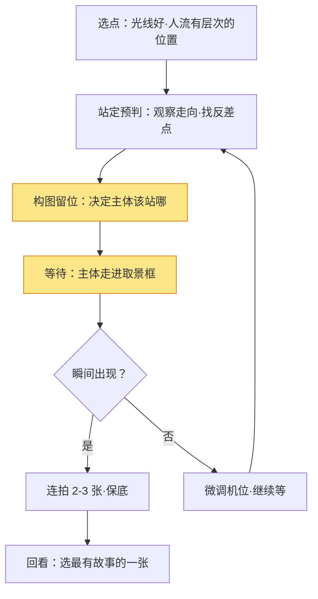

# 街拍摄影实战

> 街拍的本质是**在街头捕捉"真实生活里恰好发生的、有故事感的瞬间"**——它不是拍"好看的街道"，而是拍"街道上正在发生的事"。它不依赖昂贵的器材和复杂的布光，依赖的是**观察力、预判力和走近的勇气**。本文给出从设备到伦理的完整街拍指南，并把"区域对焦""蹲点等片"这些看家技巧讲成可照抄的实操。

《构图》《对焦与景深》讲的是通用技术，这篇讲的是**把相机带到街头的特殊规则**：怎么隐形、怎么等、怎么在不打扰的前提下拍到好照片。

## 一、街拍在拍什么

街拍的核心是**瞬间**：一个人、一个影子、一个巧合，恰好构成一张有故事的照片。它最迷人的地方在于——**你永远不知道下一秒会发生什么**。

| 维度 | 在解决什么 | 手段 |
| --- | --- | --- |
| 观察 | 发现街头可拍的画面 | 找光、找线条、找反差点 |
| 预判 | 提前猜到"即将发生" | 等待主体走进取景框 |
| 勇气 | 敢举相机、走近主体 | 心理建设 + 尊重边界 |
| 技术 | 拍清楚、不打扰 | 低调器材、快参数、区域对焦 |

> 提示：街拍第一课不是按快门，而是**"敢拍"**。很多新手不敢对陌生人举相机，错过好画面——但其实"举起相机到按快门"只有一两秒，大部分人是无感的。

## 二、器材基线

| 器材 | 推荐 | 为什么 |
| --- | --- | --- |
| 机身 | 轻便、对焦快的微单/卡片 | 轻才能随身带、随时举 |
| 镜头 | 35mm 或 50mm 定焦 | 视角接近人眼，光圈大，低调 |
| 变焦 | 24-70mm 也够用 | 灵活，但体积大、更显眼 |
| 备选 | 手机 | 最隐形，人人都有 |

> 一句话：**街拍的最佳器材是"你愿意天天带的那台"**。画质其次，便携和反应速度第一。

### 低调法则：别让器材抢戏

- **黑色机身**比银色显眼度低一档；**无肩带**或细肩带比粗红带低调。
- 镜头**遮光罩别装**（显得更"专业"），用镜头盖或裸镜头。
- 提前设好"静音快门/电子快门"——**咔哒声会提醒所有人你按了快门**。
- 相机挂**手腕带**而非颈带：举起的动作幅度更小、更隐蔽。

> 提示：低调不是为了"偷拍"，而是**降低对现场的干扰**——你越不显眼，人们越自然，你拍到的就越真实。

## 三、参数：先拍到，再拍好

街拍瞬间即逝，参数必须"预设好"而不是现场调：

| 参数 | 建议 | 说明 |
| --- | --- | --- |
| 快门 | ≥ 1/250s | 抓拍运动的行人、骑行者 |
| 光圈 | f/4 – f/8 | 稍收光圈，景深更稳（对焦失误的容错） |
| ISO | 自动，上限 3200-6400 | 宁可噪点，不可糊片 |
| 对焦 | 区域对焦/连续对焦 | 锁定主体，或"泛焦"拍大景 |
| 测光 | 评价测光 / 点测兼顾 | 环境光变化快，优先保曝光 |

> 提示：街拍有个"泛焦"技巧（zone focusing）——**光圈收小、对焦预设在几米处**，让人走进这个距离就能直接拍，不必等合焦，这是老牌街拍手的看家本领（原理见《对焦与景深》）。

### 区域对焦速查表

把"对焦预设距离 + 光圈"组合好，街头直接举机就拍：

| 光圈 | 焦距 | 对焦预设 | 清晰范围（约） | 适合 |
| --- | --- | --- | --- | --- |
| f/8 | 28mm | 2m | 1.1m ~ 7m | 迎面走过的人 |
| f/8 | 35mm | 3m | 1.5m ~ 12m | 街对面/中景主体 |
| f/11 | 35mm | 2.5m | 1.3m ~ 20m+ | 想连背景都清楚 |
| f/8 | 50mm | 5m | 3.3m ~ 10m | 中等距离主体 |

> 一句话：**f/8 + 35mm + 预设 3m**是街拍最通用的泛焦组合——2m 到 10 多米内抬手就清晰，几乎不用对焦。

### 快门优先 vs 光圈优先怎么选

| 场景 | 模式 | 理由 |
| --- | --- | --- |
| 行人/车流（动） | 快门优先 1/250s | 先保清晰，光圈自动 |
| 静景/等待主体入画 | 光圈优先 f/5.6 | 控制景深与泛焦范围 |
| 明暗切换快（树荫/烈日） | 自动 ISO + 快门优先 | 曝光跟手，不手忙脚乱 |

## 四、观察与预判：核心功夫

- **找"光的形状"**：一束光打在地面、墙面，等一个人走进光里。
- **找"线的引导"**：栏杆、台阶、路缘——让主体的位置"被线安排好"。
- **找"反差点"**：一静一动、一明一暗、大人与小孩，故事藏在对比里。
- **预判**：看到有人准备过马路、有人要转身——提前构图，等他"走进画面"。

> 提示：街拍高手不是"抓得快"，而是**"等得准"**。他先看到画面缺一个主体，然后站在那儿等——主体是自己走进来的。

### 蹲点练习：一站一拍的"三问"

站着不动拍，比满街乱走更容易出片。到一个点先问自己三件事：

1. **光在哪**？哪个位置的光最适合当背景/侧光？
2. **人会怎么走**？人流方向、速度、可能停留的点？
3. **缺什么**？画面现在差一个"人"——等什么样的主体（快走/停留/带道具）最配这个场景？

> 提示：想好"缺什么"再等，就不会随便乱按——这是"扫射"和"狙击"的区别。

## 五、构图：给偶然一个结构

瞬间是偶然的，但**构图必须是预谋的**。常用套路：

- **框架构图**：门框、窗户、栏杆围出主体，画面立刻有层次。
- **前景遮挡**：让虚化的人/物当前景，增加纵深和"窥视感"。
- **留白与极简**：大块干净背景 + 一个小主体，故事感拉满。
- **影子与倒影**：雨天、玻璃幕墙，影子本身就能成片。

> 一句话：**街拍的构图是"留好位置等主体"**——先决定画面里"人该站在哪"，然后等他来。

## 六、伦理与边界

街拍自由，但**尊重优先**：

- **公共场合可以拍**，但别偷拍私密行为、别蹲守骚扰。
- **拍儿童**要格外谨慎，最好征得家长同意。
- **有人明确拒绝**（挥手、捂脸）——放下相机，尊重对方。
- **发图前想一下**：这张照片是否会让被拍者难堪？涉及隐私场合谨慎发布。
- **商业用途**（广告、配图销售）涉及肖像权，需要授权（各国法律不同）。

> 提示：**"礼貌的街拍者"几乎不会被拒绝**。微笑、点头、拍完道谢，多数人不在意；反而鬼鬼祟祟最容易引发反感。

## 七、现场拍摄流程

> 提示：街拍不是"边走边拍"，而是**"站定等片"**。选一个点站住，比满街乱走拍到好照片的概率高得多。

### 实战案例：地铁口蹲点 30 分钟

| 阶段 | 做法 | 收获 |
| --- | --- | --- |
| 0-5min 选点 | 找有侧光 + 人流方向固定 + 有栏杆/柱子当框架的出口 | 光、线、框架齐备 |
| 5-10min 设参 | f/8 + 35mm + 预设 3m，快门 1/250s，静音快门 | 泛焦范围覆盖出口 |
| 10-25min 等待 | 站定不动，等"走进光里的人" | 出片 2-3 张 |
| 25-30min 换位 | 换到对面/斜侧，角度一变又是新画面 | 补 1-2 张不同视角 |

> 一句话：**30 分钟蹲点 ≥ 2 小时乱逛**——固定机位 + 泛焦 + 等待，收获的是"设计过的偶然"。

## 八、后期方向

街拍后期讲求**克制**，别把真实感修没了：

- **调性**：曝光归位、黑白或轻调色，让"现场的空气感"保留。
- **裁切**：街拍常靠二次裁切救构图，别怕裁。
- **别过度**：降噪、锐化点到为止，颗粒感有时反而是街拍的质感。

> 提示：黑白是街拍的好朋友——**彩色抢戏时，转黑白能让构图和故事浮出来**。但别"黑白滤镜万能论"，先看彩色是否已成立。

## 九、自查清单

- [ ] 快门够快（≥1/250s），主体是否清晰？
- [ ] 对焦是否在主体上，还是对到背景了？
- [ ] 构图是否有"预谋"（框架/留白/反差点），还是随手乱拍？
- [ ] 照片是否有故事感（一个人在做一件有意味的事）？
- [ ] 是否尊重了被拍者的边界（拒绝即停）？
- [ ] 后期是否克制，没有把真实感修掉？

## 十、常见误区

- **误区一：把街拍当抓拍比赛。** 一直连拍"扫射"，不如站定等一个有故事的瞬间。
- **误区二：不敢走近。** 好照片需要一定的距离感——"走近一步"往往就是好片与废片的区别。
- **误区三：参数现场现调。** 瞬间即逝，必须预设好参数，举起就拍。
- **误区四：忽略伦理。** 偷拍私密、骚扰蹲守，既违德也可能违法。
- **误区五：后期过度。** 把街头修成影棚，真实感全没了。
- **误区六：光圈全开拍街拍。** f/1.4 景深太浅，人一晃就糊——f/4-f/8 才是街拍主场。

## 延伸

- [构图](../拍摄技术/构图.md) —— 框架、留白、引导线的完整讲解
- [对焦与景深](../拍摄技术/对焦与景深.md) —— 区域对焦/泛焦技巧的原理
- [用光](../拍摄技术/用光.md) —— 找"光的形状"判断哪里值得站
- [曝光三要素](../器材/曝光三要素.md) —— 快门优先时 ISO/光圈怎么配合
- [修图基础](../后期处理/修图基础.md) —— 街拍后期"克制"的调性思路
- [人像](人像.md) —— 同为"拍人"，但主动引导 vs 街头抓拍的对照
