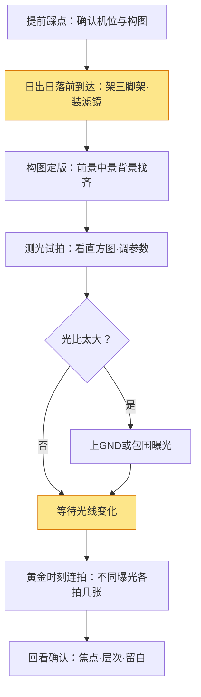

# 风光摄影实战

> 风光的本质不是"拍风景"，而是**在正确的时间、正确的位置，把"光线最好的几分钟"捕捉下来**。同一个机位，正午拍是"到此一游"，日出前半小时拍是作品——差别不在相机，在于你愿不愿意等光。本文按「准备 → 蹲守 → 拍摄 → 后期」给出完整流程，并把曝光计算、滤镜用法讲成可照抄的算例。

《构图》《用光》教的是"看见光、安排画面"，这篇教的是**如何让风光片从"风景照"变成"作品"**——核心是三个词：**时机、机位、等待**。

## 定位与器材
### 风光在拍什么

风光摄影和别的题材最大的不同：**主体（山、海、建筑）不会动，会动的是光**。所以风光的核心竞争力不是按快门，而是"预测光"。

| 要素 | 在解决什么 | 怎么获得 |
| --- | --- | --- |
| 时机 | 光线最好的几分钟 | 日出日落前后、蓝调时刻、恶劣天气转好 |
| 机位 | 前景中景远景的层次 | 提前踩点、地图卫星、实地多走几步 |
| 等待 | 云、雾、光恰好配合 | 耐心 + 运气 + 多次往返 |
| 技术 | 曝光正确、清晰、不抖 | 三脚架、滤镜、包围曝光 |

> 提示：风光摄影是"最不依赖运气、又最需要运气"的题材——**准备做得越足，运气越容易降临**。很多"神作"机位，摄影师去过十几次。

### 器材基线

| 器材 | 作用 | 说明 |
| --- | --- | --- |
| 三脚架 | 长曝、延时、构图稳定 | 风光片 90% 靠它，别省 |
| 广角镜头（16-35mm） | 收纳大场景、夸张前景 | 风光主力焦段 |
| 中长焦（70-200mm） | 压缩层叠的山、海、建筑 | 拍"远近压缩"的层次感 |
| 快门线/遥控 | 避免按快门震动 | 长曝必备 |
| 渐变灰镜 GND | 压暗天空、平衡光比 | 日落大光比神器 |
| 偏振镜 CPL | 去反光、增饱和 | 拍水面、树叶、天空 |
| ND 镜 | 长曝拉丝云、雾化水面 | 白天长曝必备 |

> 一句话：**新手优先添置"三脚架 + 广角"，比换机身更提升风光片**。光比大的场景再补 GND/ND。

#### 滤镜档位速查

| 滤镜 | 档位（档） | 快门变慢倍率 | 典型用途 |
| --- | --- | --- | --- |
| ND8 | 3 档 | ×8 | 白天轻微拉丝瀑布 |
| ND64 | 6 档 | ×64 | 白天把水流拍成雾 |
| ND1000 | 10 档 | ×1000 | 白天几十秒长曝、雾化海面 |
| GND0.9 | 3 档（硬/软过渡） | 压天空 | 日落时天空比地面亮 3 档 |

> 提示：买 ND 镜**优先单档位大倍数**（如 ND1000），再配一个 ND64 就够用；渐变镜选"软过渡"更通用（硬过渡只适合海平面、地平线极平的情况）。

## 时机、机位与构图
### 时机：光线黄金窗口

| 时间段 | 光线特点 | 适合 |
| --- | --- | --- |
| 日出前 30min（蓝调） | 天蓝、光柔和、城市亮灯 | 城市天际线、海面倒影 |
| 日出后 1h（黄金） | 暖色调、长影、低角度 | 山体、沙漠、人小景大 |
| 日落前 1h（黄金） | 暖色、逆光剪影 | 逆光、剪影、暖调风光 |
| 日落后 30min（蓝调） | 天空由暖转冷、地面灯光 | 城市、星空前奏 |
| 正午 | 顶光、对比硬、阴影难看 | 基本不建议，除非拍森林/瀑布 |

> 提示：很多"大片感"来自**拍摄前半小时的等待**。提前到机位、架好三脚架、构好图，然后等光变化——光是从"够看"变"惊艳"的，你得在惊艳那几分钟按下快门。

#### 怎么查"今天有没有戏"

出门前花 2 分钟查三件事（手机天气 App / 专业摄影 App）：

1. **日出/日落时刻**：确定到达时间（日出至少提前 30 分钟到）。
2. **云量**：20%-60% 的云最出片——完全无云的天太干净，全阴天没光。
3. **风向/湿度**：雨后天晴、雪后初晴，往往是"天光最炸"的时刻。

> 提示：**恶劣天气转好的瞬间最值钱**——雨停云开、雾散光现，这种"光正在回来"的窗口一年也遇不上几次，遇到了别收器材。

### 机位与构图

构图原则见《构图》，风光最常用的是**三层结构**：

- **前景**：石头、花、栏杆——增加纵深感，让画面"有得看"。
- **中景**：主体（山、建筑、树）——吸引视线。
- **背景**：天空、远山——提供氛围和留白。

> 一句话：**没有前景的风光片，往往像"隔着车窗拍"**。蹲下来，找一块石头或草当前景，画面立刻有层次。

#### 超焦距：让近景远景都清晰

超焦距 = 对焦在某个距离上，从"该距离的一半"到无穷远都清晰。**光圈越小、焦距越短，超焦距越近**。

速查参考（全画幅，焦距/光圈近似值，实际以镜头为准）：

| 焦距 | 光圈 | 超焦距对焦点 | 清晰范围（约） |
| --- | --- | --- | --- |
| 16mm | f/8 | 1.7m | 0.85m ~ ∞ |
| 16mm | f/11 | 1.2m | 0.6m ~ ∞ |
| 24mm | f/8 | 3.7m | 1.85m ~ ∞ |
| 35mm | f/11 | 5.6m | 2.8m ~ ∞ |

> 提示：**手机摄影 App / 景深计算器**能按你的机身和镜头精确算出超焦距。实操时：对焦到近处 1/3 处（而非无穷远），然后回看放大确认近景远景都清晰。

## 曝光与现场流程
### 曝光：风光的三大难

- **大光比**：天空亮、地面暗。解决：GND 压天空，或包围曝光后期合成（见《Lightroom 工作流》"HDR 合并"）。
- **长曝**：想让云拉丝、水雾化，需要 ND 镜 + 长曝光。公式：无 ND 时快门 1/60s，加 10 档 ND → 约 16 秒。
- **对焦**：风光常用**超焦距**——对焦在画面 1/3 处，让近景远景都清晰（原理见《对焦与景深》）。

> 提示：曝光铁律是 **"向右曝光"（ETTR）**——让直方图贴近右侧但不溢出，保留暗部细节，后期再压回来。宁可亮一点，不要黑一片。

#### ND 长曝算例：从"测到的快门"到"目标快门"

步骤（一步步照做）：

1. 不装 ND 镜，M 挡测出基准曝光。例：`f/11 · 1/125s · ISO100`。
2. 确定要装几档 ND：想拉丝云 → ND64（6 档）。
3. 把快门按档位变慢：1/125 → 1/60(1档) → 1/30(2) → 1/15(3) → 1/8(4) → 1/4(5) → 1/2(6) → **1 秒**。

> 结果：1/125s + ND64 = 1s。若想要 8s，就再降 3 档（加 3 档 ND 或缩小光圈）。

| 基准快门 | ND64（6档） | ND1000（10档） |
| --- | --- | --- |
| 1/125s | 2s | 128s（约 2 分钟） |
| 1/60s | 4s | 256s（约 4 分钟） |
| 1/30s | 8s | 512s（约 8 分钟） |

> 提示：**长曝时用"光圈优先 + 曝光补偿"容易出错**——直接切 M 挡手动算快门，最稳。长曝超过 30s 记得开启相机"长曝降噪"或后期堆栈。

#### 大光比算例：什么时候必须上 GND/包围曝光

测光判断（用点测光分别测天空和地面）：

| 天空 vs 地面亮度差 | 处理方式 |
| --- | --- |
| ≤ 2 档 | 直接拍，后期拉一点阴影即可 |
| 3 档 | 上 GND0.9 压天空，或包围曝光 |
| ≥ 4 档 | 必用包围曝光（±2EV 各一张）+ 后期 HDR 合并 |

> 一句话：**3 档是分水岭**——小于它单张能救，大于它别硬扛，交给滤镜或 HDR。

### 现场拍摄流程

> 提示：把"等待"设计进流程——到达后先完成构图与测光，光一变好直接按快门，而不是手忙脚乱现场调。

#### 实战案例：海边日落（完整走一遍）

| 步骤 | 时间 | 做什么 |
| --- | --- | --- |
| 1 到达 | 日落前 40min | 架三脚架，找前景礁石，构图定版 |
| 2 测光 | 日落前 30min | 点测天空 + 地面，判断光比 |
| 3 决策 | 光比 3 档 | 上 GND0.9，或准备 ±2EV 包围曝光 |
| 4 等光 | 日落前 20-5min | 保持构图不动，太阳贴海面时开拍 |
| 5 连拍 | 日落前后 10min | 每 30s 拍一组，含不同曝光档 |
| 6 收尾 | 日落后 20min | 蓝调时刻再补 2-3 张，然后收器材 |

> 一句话：**日落的 30 分钟是一场"光的渐变"**——提前把构图和参数锁死，剩下就是每隔一会儿按一张，你会收获一组"从暖到蓝"的完整序列。

## 后期与自查
### 后期方向

- **HDR 合并**：大光比场景，用 Lightroom 把包围曝光的几张合成，恢复天空与地面细节。
- **局部调性**：渐变滤镜压天空、径向提亮主体，思路见《修图基础》。
- **色彩**：风光容易"饱和度拉满"——先还原现场，再微调倾向（暖日落/冷蓝调）。
- **锐化**：风光需要"从近到远都清晰"，适度锐化中景主体即可，别整张拉。

> 提示：风光后期最常见的"廉价感"来自**过度饱和 + 过度锐化**——先问自己"现场真有这么艳吗"，再动手。

### 自查清单

- [ ] 机位是否提前踩点？构图有没有前景？
- [ ] 是否在"黄金时间/蓝调时间"拍摄，而不是正午硬拍？
- [ ] 三脚架是否稳、快门线是否用上（无手震）？
- [ ] 直方图是否贴近右侧但不溢出（ETTR）？
- [ ] 大光比是否用了 GND 或包围曝光？
- [ ] ND 长曝是否用 M 挡手动算快门（而不是光圈优先+补偿）？
- [ ] 超焦距是否用上，近景远景都清晰？
- [ ] 后期是否只做"还原+微调"，没有过度饱和/锐化？

### 常见误区

- **误区一：正午去拍山。** 顶光 + 大光比，怎么拍都像"游客照"，还浪费了最好的光线窗口。
- **误区二：没有前景。** 画面只有中景天空，平、空、无层次。
- **误区三：光比硬扛。** 天空过曝或地面死黑，后期也救不回（欠曝死黑尤其无解）。
- **误区四：手持长曝。** 快门一慢就抖，再好的构图也白搭。
- **误区五：饱和度拉满。** 风光后期第一要义是"还原真实"，不是"更鲜艳"。
- **误区六：长曝还开着光圈优先。** 曝光补偿和滤镜组合容易算错——M 挡手动算快门，长曝才可控。

### 延伸

- [用光](/contents/摄影/拍摄技术/用光.md) —— 光位/软硬/色温/光比，判断"什么时候值得拍"
- [构图](/contents/摄影/拍摄技术/构图.md) —— 三层结构、引导线、留白的完整讲解
- [对焦与景深](/contents/摄影/拍摄技术/对焦与景深.md) —— 超焦距与"近景远景都清晰"的原理
- [曝光三要素](/contents/摄影/器材/曝光三要素.md) —— 光圈/快门/ISO 的 trade-off 与长曝基础
- [修图基础](/contents/摄影/后期处理/修图基础.md) —— 全局调性与直方图，风光后期的地基
- [Lightroom 工作流](/contents/摄影/后期处理/Lightroom工作流.md) —— HDR 合并、渐变滤镜的实际操作
- [人像](人像.md) —— 同组的另一种题材：等人的地方少，等光的地方多

