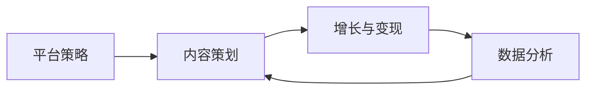

# 自媒体运营 · 总览

> 自媒体运营，是让「内容被对的人看到、并产生价值」的一层能力。它和 [摄影](contents/摄影)（出图）、[摄像](contents/摄像/README.md)（出片）互补：前两者解决「内容怎么生产」，本板块解决「内容怎么被看见、被记住、被转化」。

## 一、板块定位

很多人会拍会剪，但内容发出去没水花——缺的是运营。本板块覆盖从「选平台」到「做内容」到「涨粉变现」到「看数据」的完整链路，外加跨形态的「方法论」心法。

> 提示：摄影/摄像是「生产侧」，自媒体运营是「分发与变现侧」。两者结合，内容才完成从「做出来」到「有价值」的闭环。

## 二、形态速览

| 分组 | 核心问题 | 文章 |
| --- | --- | --- |
| 运营实践 | 平台/内容/增长/数据 | [平台策略](contents/自媒体运营/平台策略.md) [内容策划](contents/自媒体运营/内容策划.md) [增长与变现](contents/自媒体运营/增长与变现.md) [数据分析](contents/自媒体运营/数据分析.md) |
| 方法论 | 跨形态通用心法 | [故事叙事](contents/自媒体运营/方法论/故事叙事.md) [色彩理论](contents/自媒体运营/方法论/色彩理论.md) [选题框架](contents/自媒体运营/方法论/选题框架.md) |

## 三、文章索引

| 文章 | 一句话 |
| --- | --- |
| [平台策略](contents/自媒体运营/平台策略.md) | 在正确的地方，对正确的人，说正确的话 |
| [内容策划](contents/自媒体运营/内容策划.md) | 用系统替代灵感，可持续生产 |
| [增长与变现](contents/自媒体运营/增长与变现.md) | 涨粉与变现的路径、算例、避坑 |
| [数据分析](contents/自媒体运营/数据分析.md) | 用数字代替感觉做决策 |
| [方法论 · 总览](contents/自媒体运营/方法论/README.md) | 跨形态三心法的入口 |
| [故事叙事](contents/自媒体运营/方法论/故事叙事.md) | 内容怎么被记住 |
| [色彩理论](contents/自媒体运营/方法论/色彩理论.md) | 画面怎么有情绪 |
| [选题框架](contents/自媒体运营/方法论/选题框架.md) | 今天发什么 |

## 四、相邻板块关系

- [摄影](contents/摄影)：生产图文内容，本板块教它怎么被看见。
- [摄像](contents/摄像/README.md)：生产视频内容，本板块教分发与变现。
- [设备](contents/设备)：生产工具，本板块不重复。
- [学习资源](contents/学习资源)：外部教程，本板块是站内的体系化补充。

## 五、运营链路一览

从想法到变现，本板块文章的阅读顺序建议：

方法论三篇（[故事叙事](contents/自媒体运营/方法论/故事叙事.md)、[色彩理论](contents/自媒体运营/方法论/色彩理论.md)、[选题框架](contents/自媒体运营/方法论/选题框架.md)）横穿全程，随时回看。

## 六、栏目状态

自媒体运营 9 篇（运营实践 4 + 方法论 3 + 两个总览）已全部完成，与摄影/摄像/设备/学习资源的交叉链接已建立。

## 七、新手路线图

| 阶段 | 动作 | 目标 |
| --- | --- | --- |
| 第 1 月 | 定平台+定位，日更试错 | 找方向 |
| 第 2–3 月 | 固栏目，过原创 | 起量 |
| 第 4–6 月 | 接分成/小单 | 变现起步 |
| 半年+ | 多源+私域 | 稳定 |

路线不是死规定，但「先定位、再固栏、后变现」的顺序别反——反过来大多做不起来。

## 八、运营误区总览

| 误区 | 表现 | 正确做法 |
| --- | --- | --- |
| 不选平台 | 错配渠道 | 先看 [平台策略](contents/自媒体运营/平台策略.md) |
| 凭灵感更 | 断更漂移 | 用 [内容策划](contents/自媒体运营/内容策划.md) |
| 涨粉即变现 | 一变就掉粉 | 先信任后转化，见 [增长与变现](contents/自媒体运营/增长与变现.md) |
| 凭感觉判 | 被错觉带偏 | 用 [数据分析](contents/自媒体运营/数据分析.md) |

## 九、能力成长路径

运营不是天赋，是可拆的能力：平台感（选对台）、内容感（持续产）、数据感（看反馈）、变现感（转价值）。四感按顺序长，前面不稳后面虚。新人先练平台感和内容感，跑出稳定更新再说数据感和变现感，别一上来就盯着赚钱。

## 十、阅读建议

新手按「平台策略 → 内容策划 → 数据分析」主线走，变现篇等有了粉丝再看；方法论三篇（[故事叙事](contents/自媒体运营/方法论/故事叙事.md)、[色彩理论](contents/自媒体运营/方法论/色彩理论.md)、[选题框架](contents/自媒体运营/方法论/选题框架.md)）随时回看，横穿全程。每读完一篇，回到你正在做的账号上落一条动作，比收藏十篇有用。

## 十一、检查清单

每月自检一次：定位清不清、平台对不对、栏目固没固、数据看没看、私域接没接。五项里缺两项，优先补那两项，别平均用力。检查不是走过场，是发现「木桶最短的那块板」——它决定了你整体天花板。

## 十二、指标速查

完播率看内容节奏、互动率看价值感、转粉率看人设、转化率看信任。四个指标各管一段，对照 [数据分析](contents/自媒体运营/数据分析.md) 的基准表自查。指标异常时，顺着「漏斗」往上找漏点，别只看最末端的数字。速查表的用处是让你一眼定位问题在哪个环节，而不是对着一堆数发懵。

## 十三、运营常见问答

几个被反复问到的问题，集中答在这里。Q：先涨粉还是先变现？A：先打磨内容到「有人愿意看」，再谈变现，没粉丝基础硬变现只剩割韭菜。Q：一天发几条好？A：新手稳定一条比一天三条然后断更强，节奏比数量重要。Q：要不要买量？A：起号期可以小预算测试，但别依赖，买来的粉不互动反而拉低权重。Q：数据差要不要换号？A：先诊断是定位、内容还是分发的问题，多数情况调内容比换号有用。Q：一个人能做好吗？A：能，先单人跑通最小闭环（选题—制作—发布—看数—迭代），再考虑扩人。Q：多久能看到效果？A：多数账号 3 到 6 个月才过冷启动，前两个月别被「没反馈」劝退。这些答案的共性就一句：把基本功做扎实，时间会替你放大。

## 十四、与摄影摄像协同

运营不是脱离生产的「另一件事」，它和 [摄影](contents/摄影)、[摄像](contents/摄像) 是同一链路的两端。生产侧产出好内容（图、视频），运营侧决定它被谁看见、怎么变现——两者缺一不可：生产好但运营弱，内容沉在底部没人看；运营强但内容差，来得快走得也快。协同的具体动作：拍摄前就用 [平台策略](contents/自媒体运营/平台策略.md) 想清楚发哪、竖屏还是横屏；剪辑时用 [故事叙事](contents/自媒体运营/方法论/故事叙事.md) 定结构；调色时用 [色彩理论](contents/自媒体运营/方法论/色彩理论.md) 定调性；发布后用 [数据分析](contents/自媒体运营/数据分析.md) 看反馈，反哺下一轮拍摄。这条链路跑顺了，你不再是「拍完再想怎么发」，而是「为发布而生产」，每一步都带着运营目标。本板块的定位，就是帮你在生产之外，把「被看见、被记住、被转化」这三件事做对。
