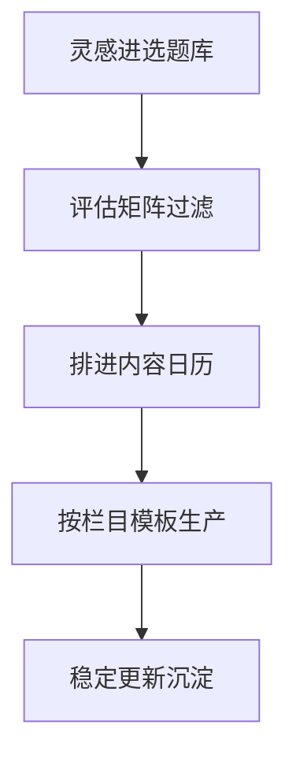

# 内容策划

> 内容策划，是把「想做什么」变成「可持续做什么」的桥梁。它解决三件事：做什么（定位）、怎么做（选题与日历）、怎么持续（栏目化）。本文属于 [自媒体运营 · 总览](contents/自媒体运营/README.md)，承接 [平台策略](contents/自媒体运营/平台策略.md)，是运营链路第二步。

## 策划基础
### 策划解决什么

很多人「灵感来了更一篇、没灵感就断更」，做出来的内容东一榔头西一棒槌，粉丝不知道你到底是干嘛的。内容策划的本质是用系统替代灵感——把内容生产从「靠心情」变成「靠机制」。

它回答三个问题：

- **做什么**：你的账号定位和人设是什么，粉丝为什么关注你？
- **怎么做**：选题从哪来，怎么排期，保证不断更？
- **怎么持续**：内容怎么栏目化，让生产可复制而不是每次从零开始？

> 提示：定位越清楚，内容策划越简单。如果一句话说不清「你是谁、给谁看、看什么」，先回去补 [平台策略](contents/自媒体运营/平台策略.md) 里的定位，再谈策划。

### 定位与人设

定位不是「分享美好生活」这种大词，而是具体到「一个程序员的一人食」「一个妈妈的省钱收纳」。人设不是装，是你本来就有的那一面被放大。

| 维度 | 模糊定位 | 清晰定位 |
| --- | --- | --- |
| 人群 | 所有人 | 一二线独居青年 |
| 场景 | 生活 | 下班后 30 分钟快手菜 |
| 价值 | 陪伴 | 教你少吃外卖、省钱 |
| 人设 | 亲切 | 「和你一样懒但讲究的打工人」 |

清晰定位带来三个好处：选题有边界（不相关的不做）、粉丝有预期（关注你知道看什么）、变现有路径（广告主知道找你投什么）。

## 选题体系
### 选题库

灵感是随机的，生产是定时的，中间的缓冲就是选题库。任何时刻冒出的点子，先记进库，生产时从库里挑，而不是临时想。

| 选题来源 | 例子 | 怎么积累 |
| --- | --- | --- |
| 评论区 | 粉丝常问「这个怎么保存」 | 定期翻评论，摘高频问题 |
| 搜索词 | 小红书下拉「一人食 快手」 | 看平台搜索框联想 |
| 自身痛点 | 「我又忘买葱了」 | 记录生活里的真实卡点 |
| 热点 | 某食材突然火 | 建热点监测清单 |
| 竞品 | 同赛道爆款角度 | 拆解后换自己的视角 |

> 提示：选题库最低要保持「蓄水量 ≥ 2 周更新量」。一旦库空了才找选题，内容质量必然下滑。

### 选题评估矩阵

库里的选题要过滤。用「价值 × 可执行 × 可持续 × 差异」四维打分（各 1–5 分），低于阈值的不做。

| 维度 | 高分特征 | 低分特征 |
| --- | --- | --- |
| 价值 | 解决真实问题/强情绪 | 自嗨、无共鸣 |
| 可执行 | 今天就能拍、有素材 | 要等大成本 |
| 可持续 | 能做成系列 | 一次性 |
| 差异 | 你有独特视角 | 千篇一律 |

> 注意：评估不是删创意，是排优先级。低分选题先放着，等你有产能或新角度再启。

### 爆款拆解

爆款不是玄学，是可拆解的结构。拆一条同赛道爆款，看四件事：

1. **钩子**：前 3 秒用什么留住人？（冲突/利益/悬念）
2. **结构**：信息怎么排布，哪里转折？
3. **情绪**：全程情绪曲线怎么走？
4. **落点**：结尾给人什么（收藏/转发/关注）？

拆完把可复用的结构写成你自己的模板，下条内容套用。叙事结构的方法参考 [方法论 · 故事叙事](contents/自媒体运营/方法论/故事叙事.md)，标题方法参考 [方法论 · 选题框架](contents/自媒体运营/方法论/选题框架.md)。

## 排期与生产
### 日历与栏目化

内容日历把「什么时候发什么」固定下来，栏目化把「每篇长什么样」固定下来，二者结合，生产从创作变成填空。

| 栏目 | 频次 | 作用 | 示例 |
| --- | --- | --- | --- |
| 主栏目 | 每周 2–3 | 立人设、扛流量 | 「一人食周更」 |
| 互动栏目 | 每周 1 | 拉互动、攒粉 | 「评论区点菜」 |
| 节点栏目 | 不定期 | 蹭热点、破圈 | 节日特辑 |
| 人设栏目 | 每月 1 | 加深信任 | 「我这个月踩的坑」 |

栏目化的好处：粉丝形成「周三看你的菜」的心智；你生产时只需往栏目模板里填内容，不复每次重新构思结构。整体生产链路如下：

### 更新节奏

算法偏爱稳定更新的账号。与其一个月憋一条大制作，不如每周稳定两条中等质量。断更超过 2 周，权重和粉丝心智都会掉。

| 阶段 | 建议频次 | 重点 |
| --- | --- | --- |
| 起号期（0–1k） | 日更或隔日更 | 快速试错、找爆款方向 |
| 成长期（1k–1w） | 周更 3–4 | 固化栏目、提质量 |
| 稳定期（1w+） | 周更 2–3 + 直播 | 深耕人设、做变现 |

### 内容生产 SOP

栏目化解决「发什么」，SOP 解决「怎么稳定做出来」。把生产流程标准化，每次决策成本降到最低：

| 步骤 | 动作 | 产出 |
| --- | --- | --- |
| 选题 | 从选题库挑，过评估矩阵 | 本周选题 |
| 提纲 | 写 3 点骨架 + 钩子 | 轻提纲 |
| 拍摄 | 按栏目模板拍，多拍 3 秒余量 | 素材 |
| 剪辑 | 粗剪删废 → 精剪调节奏 | 成片 |
| 封面标题 | 按平台适配做 2 版 | 待 A/B |
| 发布 | 按日历时间发，加互动引导 | 上线 |
| 复盘 | 记爆款共性、凉款原因 | 迭代模板 |

SOP 不是束缚创意，是保护创意——把重复动作固化，你才有精力在「选题和钩子」上花心思。叙事和标题的模板可以复用 [方法论 · 故事叙事](contents/自媒体运营/方法论/故事叙事.md) 与 [方法论 · 选题框架](contents/自媒体运营/方法论/选题框架.md) 的结论。

### 协作分工

一个人忙不过来（或想提速），就要分工。最小可行团队四个角色：

| 角色 | 职责 | 关键能力 |
| --- | --- | --- |
| 选题/脚本 | 找题、写纲、定钩子 | 网感、拆解力 |
| 拍摄 | 执行画面、收声 | 设备、稳定 |
| 剪辑 | 粗剪精剪、调色字幕 | 节奏感 |
| 运营 | 发版、互动、数据 | 复盘、沟通 |

外包注意：核心（选题/人设）自己抓，可执行（剪辑/运营）可外包；给外包方固定模板，别每次重新讲风格，否则质量漂移。

### 精力管理

日更很累，保护精力才能持久：

| 安排 | 做法 | 作用 |
| --- | --- | --- |
| 批量拍摄 | 一天拍一周素材 | 减少切换成本 |
| 模板生产 | 栏目套模板 | 降决策负担 |
| 轻内容日 | 允许清单/互动类 | 不断更但省力 |

> 提示：断更不是罪，低质量硬更才是。状态差就发「轻内容」，保住更新习惯比保住质量下限重要。很多头部账号也非日更，他们的秘诀是把好内容攒着、把轻内容当填充，张弛有度才能跑三年以上；把精力管理当成和选题同等重要的生产环节，账号才活得久。

## 案例与复盘
### 案例：美食号月历

以「独居青年快手菜」为例，某月内容日历：

| 周 | 主栏目 | 互动栏目 | 节点/人设 |
| --- | --- | --- | --- |
| 第 1 周 | 10 分钟 3 菜备餐 | 评论点菜：最想学的 | — |
| 第 2 周 | 冰箱清空料理 | 评论点菜 | 人设：我这个月花了多少 |
| 第 3 周 | 网红菜平替版 | 评论点菜 | 节点：节气食谱 |
| 第 4 周 | 月复盘 + 避坑 | 评论点菜 | 人设：翻车合集 |

这套日历保证：每周有主内容立人设、有互动栏目拉粉、有人设/节点内容破圈，且全部来自「一人食」这个定位，不跑题。

### 复盘模板

每周复盘用固定模板，避免凭印象：

| 复盘维度 | 记什么 |
| --- | --- |
| 爆款共性 | 选题/结构/封面哪点起作用 |
| 凉款原因 | 钩子弱/节奏拖/货不对板 |
| 下周动作 | 复用什么、避开什么 |

> 提示：复盘写进文档，不是脑子过。一个月后回看，你会看清自己的进化曲线，也能给 [数据分析](contents/自媒体运营/数据分析.md) 提供对照样本。复盘频率建议每周一次小复盘、每月一次大复盘：小的只看数据涨跌和一条结论，大的回看定位与栏目是否还成立。

## 合规与自查
### 合规与版权

版权是新手最容易忽略的雷：音乐、字体、素材、肖像，随便用就可能收到下架或投诉。

| 易侵权项 | 风险 | 合规做法 |
| --- | --- | --- |
| 背景音乐 | 商用曲库需授权 | 用平台曲库/无版权站 |
| 字体 | 商用字体收费 | 用开源/授权字体 |
| 图片素材 | 网图有版权 | 自己拍或 CC0 |
| 肖像 | 路人入镜 | 出镜需授权/打码 |

> 注意：以为「标了出处就没事」是误区，很多素材需明确授权而非仅署名。合规是账号的「保险」，平时不显，出事要命。把版权检查放进 [内容生产 SOP](#九、内容生产-sop) 的发布前一步，每次发前过一遍，成本极低。

### 自查清单

- [ ] 我能否用一句话说清账号定位和人设？
- [ ] 我有没有维护选题库，蓄水量 ≥ 2 周？
- [ ] 我是否做了内容日历，固定更新频次？
- [ ] 我的内容是否栏目化，可复制生产？
- [ ] 选题是否经过价值/可执行/可持续/差异评估？
- [ ] 我是否定期拆解同赛道爆款，沉淀模板？

### 常见误区

1. **凭灵感更新**：断更反复，粉丝心智建立不起来。
2. **定位漂移**：今天美食明天数码，粉丝不知道关注你干嘛。
3. **只追爆款不沉淀**：热闹一阵没积累，账号没有资产。
4. **轻视更新稳定**：断更超 2 周，权重明显下滑。

### 延伸阅读

- 选平台看 [平台策略](contents/自媒体运营/平台策略.md)
- 用数据优化更新节奏，看 [数据分析](contents/自媒体运营/数据分析.md)
- 叙事与标题方法，看 [方法论 · 故事叙事](contents/自媒体运营/方法论/故事叙事.md) 与 [方法论 · 选题框架](contents/自媒体运营/方法论/选题框架.md)
- 实际拍摄生产，参考 [摄像 · 总览](contents/摄像/README.md)
- 工具与设备，看 [设备](contents/设备)
