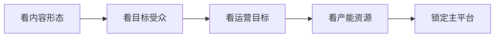

# 平台策略

> 平台策略，是自媒体运营的第一步：在正确的地方，对正确的人，说正确的话。它决定了你的内容被谁看到、以什么形式被消费。本文属于 [自媒体运营 · 总览](contents/自媒体运营/README.md)，与 [内容策划](contents/自媒体运营/内容策划.md)、[增长与变现](contents/自媒体运营/增长与变现.md) 共同构成「先选台、再选题、后变现」的运营链路。

## 一、平台策略优先

很多新手一上来就埋头做内容，做完才发现平台不对——在小红书发长视频、在抖音发深度图文，流量天然起不来。平台本质上是「分发渠道」，渠道错了，内容再好也触达不到对的人。

选平台的代价和收益极不对称：同样一条内容，放在匹配的平台可能轻松破万播放，放在错配的平台可能只有两位数。平台策略不是「哪个火做哪个」，而是「我的内容形态、我的受众、我的目标，哪个平台最匹配」。

> 提示：把平台策略想成「开店选址」——内容是你卖的货，平台是商场。在写字楼楼下卖奶茶和在夜市卖奶茶，受众和转化完全不同。先选址，再进货。

## 二、平台横向对比

下面把六个常见平台按「调性 / 受众 / 主内容形态 / 分发逻辑 / 适合内容」拉平对比，方便一眼判断匹配度。

| 平台 | 核心调性 | 主力受众 | 主内容形态 | 分发逻辑 | 适合的内容类型 |
| --- | --- | --- | --- | --- | --- |
| 抖音 | 快节奏、情绪强、泛娱乐 | 全龄、下沉广 | 短视频 15–60s | 算法推荐，完播率与互动率为王 | 反转、才艺、种草、热点、剧情 |
| 小红书 | 种草、生活方式、女性向 | 一二线年轻女性为主 | 图文 + 短视频 | 搜索 + 推荐，标签和封面权重高 | 美妆、穿搭、攻略、测评、探店 |
| B站 | 中长视频、圈层文化 | Z 世代、学生党 | 中长视频 5–30min | 关注 + 推荐，互动（三连）权重高 | 知识科普、测评、鬼畜、Vlog、二创 |
| 视频号 | 社交分发、私域沉淀 | 微信生态全龄 | 短视频 + 直播 | 社交推荐（朋友在看/点赞） | 资讯、美食、情感、知识、本地 |
| 公众号 | 深度、私域沉淀 | 订阅用户 | 图文长文 | 订阅 + 朋友圈转发 | 深度观点、行业分析、系列专栏 |
| YouTube | 全球化、搜索长尾 | 全球用户 | 中长视频 | 搜索 + 推荐，长尾流量强 | 教程、评测、Vlog、开箱 |

> 提示：没有「最好的平台」，只有「最匹配你内容形态和受众的平台」。判断错配最简单的信号：你精心做的内容，完播率低于同赛道均值、互动几乎为零——很可能不是内容差，是平台错。

## 三、四步选平台

不要凭感觉选，用下面四步把选择变成可执行的判断。

| 步骤 | 要回答的问题 | 输出 |
| --- | --- | --- |
| 第一步 看形态 | 你的内容主要是图文还是视频？视频是 1 分钟以内还是 10 分钟以上？ | 锁定「视频型平台」或「图文型平台」 |
| 第二步 看受众 | 你想影响谁？年龄、城市、兴趣、消费力？ | 锁定受众重合度高的平台 |
| 第三步 看目标 | 你要涨粉、变现、还是品牌曝光？ | 锁定转化路径短的平台 |
| 第四步 看资源 | 你一天能投入几小时？会剪辑吗？有设备吗？ | 锁定产能匹配的平台 |

举个例子：你是一个会做饭、喜欢写步骤的人，目标是在一二线城市女性里建立「家常菜」人设——形态偏图文、受众在小红书、目标涨粉+带货，资源是每天 1 小时。四步指向小红书，而不是抖音。决策流程如下：

> 提示：新手最容易犯的错是「全平台铺满」。一个人同时运营 3 个以上平台，很快就会因为产能不足而每个都做不好。建议先打透 1 个主平台，再考虑分发。

## 四、跨平台分发

内容做出来后，分发到多个平台能放大收益，但「直接搬运」往往效果差。不同平台的用户习惯、封面审美、标题风格不同，需要针对性适配。

| 适配项 | 抖音做法 | 小红书做法 | B站做法 |
| --- | --- | --- | --- |
| 标题 | 短、有冲突感 | 长、带关键词、像搜索词 | 中长、强调「干货/盘点」 |
| 封面 | 高对比、单人脸/大字 | 精致、统一风格、留白 | 信息量高、可放章节 |
| 节奏 | 前 3 秒必出钩子 | 前 5 秒铺垫也可 | 前 30 秒可铺垫 |
| 发布时间 | 晚 18–22 点 | 早 8–9、午 12、晚 20–22 | 周末、晚 20 后 |

> 注意：跨平台分发不是「复制粘贴」，而是「重新包装」。同一段烹饪视频，在抖音是「30 秒搞定一道菜」的爽感剪辑，在小红书是「附步骤图的图文+短视频」，在 B站是「10 分钟家常菜合集」。核还是那个核，壳要换。

## 五、推荐逻辑入门

所有平台的目标一致——让用户多停留。所以推荐逻辑围绕「用户喜不喜欢这条内容」展开，用可观测的行为信号估算。

| 信号 | 含义 | 对推荐的影响 |
| --- | --- | --- |
| 完播率 | 看完整条的比例 | 短视频最核心，决定能否进入下一级流量池 |
| 互动率 | 点赞/评论/收藏/转发 | 代表内容有共鸣或价值 |
| 转粉率 | 看完关注的比例 | 代表账号有持续价值 |
| 停留时长 | 单用户在平台的总时长 | 影响整体权重 |

理解了这套逻辑，运营动作就清楚了：与其天天研究「算法秘籍」，不如把每条内容的完播率和互动率做上去。具体做法参考 [数据分析](contents/自媒体运营/数据分析.md) 的指标诊断，以及 [内容策划](contents/自媒体运营/内容策划.md) 里的钩子设计。

## 六、案例：三平台差异

选题：「一个人住，如何把一日三餐吃好」。

| 维度 | 抖音版本 | 小红书版本 | B站版本 |
| --- | --- | --- | --- |
| 标题 | 「独居青年的三餐，看完破防了」 | 「独居女生的一周备餐｜附采购清单」 | 「独居一年，我把吃饭这件事想明白了」 |
| 形态 | 30 秒混剪，3 餐快切 | 图文 9 图 + 1 分钟短视频 | 12 分钟 Vlog + 观点 |
| 钩子 | 开头「你一个人住也这样吗」 | 封面「备餐清单」直接有用 | 开头抛问题「吃饭是为了活着吗」 |
| 节奏 | 每 3 秒一切 | 图文逐张看、视频慢 | 前 2 分钟铺垫观点 |
| 目标 | 情绪共鸣涨粉 | 收藏+搜流量 | 深度认同+三连 |

同一个人的真实生活，因为平台不同，呈现方式完全不同——这正是平台策略的价值：让你的内容在「对的场」里说「对的话」。

## 七、账号矩阵协同

当你在一个平台站稳，自然会想「放大」——这时才考虑矩阵，而不是一开始就铺。矩阵的本质是用多个账号覆盖不同角度或不同平台，把流量互相导、把风险分散。

| 类型 | 作用 | 何时做 | 风险 |
| --- | --- | --- | --- |
| 主号 | 立人设、扛主要流量 | 起号就有 | — |
| 细分辅号 | 覆盖主号不便做的子话题 | 主号跑通后 | 稀释精力 |
| 跨平台号 | 同内容换壳分发 | 主号稳定后 | 产能压力 |

> 提示：矩阵的前提是主号已跑通。主号没起来就开 3 个号，结果是 3 个半死不活的号，不如 1 个做深。

更稳妥的是「公域涨粉、私域承接」：把平台粉丝导到微信/社群，沉淀成可反复触达的资产。为什么重要——平台算法随时变、抽成持续在，私域是你自己能控制的。做法是在主页/结尾放钩子（如「加群领清单」），用价值换联系方式，再用社群做留存和复购。这部分承接动作，和 [增长与变现](contents/自媒体运营/增长与变现.md) 的私域路径直接相连。

## 八、平台红线规则

很多内容被限流不是算法问题，是踩了平台规则。各平台细则不同，但共通红线这几条：

| 违规类型 | 表现 | 后果 | 规避 |
| --- | --- | --- | --- |
| 搬运 | 直接转别人视频 | 下架/降权 | 原创或获授权 |
| 低质 | 模糊、凑时长 | 不推荐 | 提质量 |
| 诱导 | 关注抽奖、站外引流 | 限流 | 用平台合规组件 |
| 违规词 | 敏感/绝对化用词 | 拦截 | 过一遍词表 |

> 提示：先读平台社区规范再发，比事后申诉省事十倍。规则是「地板」，踩了前面全白做。建议每月花半小时过一遍平台规则的更新公告，重点盯「限流条款」和「违规词表」的变化；被误判限流时先自查再申诉，附上原始素材，通过率会高不少。

## 自查清单

- [ ] 我有没有先选平台，再定内容形态？
- [ ] 我的主平台是否匹配内容的「形态 / 受众 / 目标 / 资源」？
- [ ] 我是否只主攻 1 个平台，而不是全平台铺满？
- [ ] 跨平台分发时，标题/封面/节奏是否做了针对性适配？
- [ ] 我是否理解平台的核心推荐信号（完播/互动/转粉）？
- [ ] 我是否定期用 [数据分析](contents/自媒体运营/数据分析.md) 复盘平台表现？

## 常见误区

1. **哪个火做哪个**：追热点平台但内容不匹配，流量来了也留不住。
2. **全平台同步搬运**：不换壳直接发，各平台都表现平庸。
3. **过度研究算法**：把精力花在「秘籍」上，而不是内容本身的完播和互动。
4. **频繁换平台**：一个月换一个主战场，永远在冷启动，积累不起来。

## 延伸阅读

- 选好平台后怎么排内容，看 [内容策划](contents/自媒体运营/内容策划.md)
- 涨粉和变现的路径，看 [增长与变现](contents/自媒体运营/增长与变现.md)
- 用数据诊断平台表现，看 [数据分析](contents/自媒体运营/数据分析.md)
- 跨形态的内容生产，参考 [摄像 · 总览](contents/摄像/README.md) 与 [摄影 · 总览](contents/摄影)
- 设备与剪辑工具，看 [设备与工具](contents/设备与工具)
