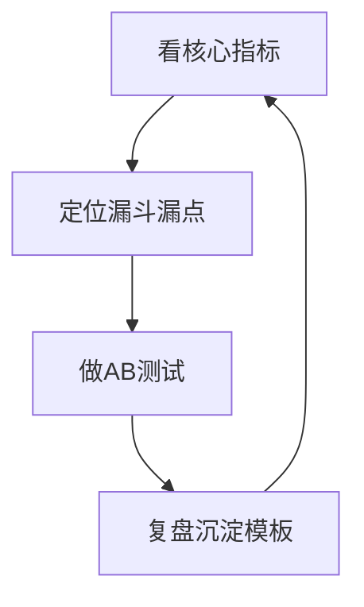

# 数据分析

> 数据分析，是自媒体运营的「仪表盘」：用数字代替感觉做决策。它贯穿 [内容策划](内容策划.md) 的选题、[平台策略](平台策略.md) 的分发、[增长与变现](增长与变现.md) 的转化。本文属于 [自媒体运营 · 总览](README.md)。

## 数据思维
### 用数据代感觉

「我觉得这条好」是最贵的错觉。数据不是目的，是反馈——告诉你哪类内容被喜欢、哪个环节漏人。不看数据的运营，像闭眼开车：你以为在直行，其实早偏了。

> 提示：数据不否定你的审美，只纠正你的判断。一条你很得意的视频如果完播低，不是你错了，是观众用脚投票了——接受它，改下一条。

### 核心指标与基准

| 指标 | 含义 | 新手参考基准 |
| --- | --- | --- |
| 播放量 | 曝光规模 | 起号期几百–几千正常 |
| 完播率 | 看完比例 | 短视频 ≥30% 良好 |
| 互动率 | （赞+评+藏）/播放 | ≥3% 良好 |
| 转粉率 | 关注/播放 | ≥1% 良好 |
| 转化率 | 下单/进店 | 带货 1–3% 正常 |

> 提示：基准是「参考」不是「及格线」。不同赛道差异大，和自己历史比、和同赛道中位比更有意义。

### 常见指标陷阱

| 陷阱 | 表现 | 正确看法 |
| --- | --- | --- |
| 虚荣指标 | 播放高但零转化 | 看有效流量，非总曝光 |
| 幸存者偏差 | 只学爆款、不学凉款 | 凉款更能告诉你边界 |
| 归因错误 | 把自然增长当投流效果 | 做对照、控变量 |
| 短期噪声 | 一条波动就改方向 | 看 10 条的趋势，非 1 条 |

> 注意：数据要「对比着看」——和自己上周比（趋势）、和同赛道中位比（位置）、和自己的爆款比（共性）。单看一个绝对值，要么盲目乐观，要么无谓焦虑。

## 漏斗与实验
### 漏斗模型

曝光 → 点击（封面标题）→ 观看（前 3 秒）→ 互动（价值）→ 转化（信任）。每一步都有流失，找到流失最大的环节发力，性价比最高。

| 环节 | 流失信号 | 优化动作 |
| --- | --- | --- |
| 封面标题 | 点击率低 | 换封面/标题钩子 |
| 前 3 秒 | 完播低 | 加强开头钩子 |
| 中段 | 中途流失 | 提节奏/信息密度 |
| 结尾 | 不互动不转粉 | 加互动引导 |

> 注意：不要平均用力。漏斗最窄的那一节才是瓶颈——把点击率从 5% 提到 8% 的增益，远大于把已经 90% 的完播再提 2%。

### AB 测试

同一条视频，做两个封面/两个标题，小流量测试哪个好，再放量。测试变量一次只改一个，否则不知道谁起作用。

| 测试项 | 做法 | 看什么 |
| --- | --- | --- |
| 封面 | 同内容两张图 | 点击率 |
| 标题 | 同视频两种文案 | 点击率+完播 |
| 开头 | 前 3 秒两种剪法 | 完播率 |

### AB 测试细节

A/B 测试说起来简单，做错等于没测。第一，一次只改一个变量。同时换封面和标题，不知道谁起作用，白测。第二，样本要够。一条视频 200 播放就下结论，噪声大于信号；至少等 1000 播放或 24 小时再判。第三，看相对不是绝对。新封面点击率从 5% 到 7% 是实打实提升，别因为绝对值「才 7%」就否定。第四，测完要沉淀。把胜出版本的特征写进模板库（如「疑问式标题加人脸封面」），下次直接复用，测试才积累成能力。测试频率：稳定期每周测 1 到 2 个变量足够，起号期可以测更密，因为方向未定。记住：A/B 是手段，沉淀模板才是目的，别陷入「永远在测、从不固化」。

## 看板与复盘
### 数据看板与复盘

固定每周复盘：哪条爆、哪条凉、为什么。用模板记录，把偶然变成规律。

| 维度 | 记录什么 |
| --- | --- |
| 爆款共性 | 选题/结构/封面 |
| 凉款原因 | 钩子弱/节奏拖 |
| 下周动作 | 复用爆款结构 |

复盘不是为了写报告，是为了下条内容直接用上结论。叙事和结构的优化方法参考 [方法论 · 故事叙事](/contents/自媒体运营/方法论/故事叙事.md) 与 [方法论 · 选题框架](/contents/自媒体运营/方法论/选题框架.md)。

### 看板搭建实例

用一张表搭最小看板，列=周，行=指标，配公式自动算环比：

| 字段 | 含义 |
| --- | --- |
| 日期/周 | 时间轴 |
| 播放/完播/互动/转粉 | 核心指标 |
| 环比% | 自动算（本周-上周）/上周 |

看板不用复杂，能看出「哪周掉了、为什么」就够了。

### 数据基线

记录自己历史均值作为「正常线」，波动才看得出来。新手起号前 2 周数据不稳，基线从第 3 周开始算。

| 基线指标 | 你的均值 | 用途 |
| --- | --- | --- |
| 完播率 | __% | 低于则优化开头 |
| 互动率 | __% | 低于则加互动引导 |
| 转粉率 | __% | 低于则强化人设 |

没有基线，你永远在「和别人的爆款比」，越比越焦虑；有基线，你只和「昨天的自己」比，进步看得见。

### 数据内容日历

每周看板出来后，下一周日历据此调整：爆款方向加更、凉款方向减、钩子公式复用高点击的。这就把 [数据分析](数据分析.md) 和 [内容策划](内容策划.md) 连成闭环——数据不是终点，是下一周选题的起点。

> 提示：最好的运营节奏是「生产→发→看数→改→再生产」。断了任何一环，都是盲人摸象。

### 报告写法

每周写一份一页数据报告，比看十次后台有用。报告只记三件事：本周核心指标及环比、一条最值得复用的结论、下周一个动作。格式固定，5 分钟写完。报告的价值不在「记」，在「逼你看趋势」——日常刷后台容易被单条带情绪，落到纸面才能冷静。报告积累一个月，你就有自己的数据档案，复盘时有据可查，也能给合作方看（[增长与变现](增长与变现.md) 谈单时用得上）。写报告的另一个好处：它让「数据驱动」从口号变成习惯，你不再凭心情决定下条发什么，而是凭上周的数字。

## 案例与自查
### 案例：低完播诊断

视频：3 分钟教程，播放 5000，完播率 12%（偏低）。时间轴诊断：

| 时间 | 事件 | 问题 |
| --- | --- | --- |
| 0–10s | 自我介绍 | 钩子弱，流失 40% |
| 10–60s | 铺垫背景 | 信息密度低 |
| 60s+ | 进入正题 | 人已走 |

改进：删自我介绍、前 5 秒直接给结论、背景后置。重发完播率升至 35%。同样的内容，只改结构，完播近 3 倍——这就是数据的价值。

分析闭环是「看数→定位→测试→沉淀」持续转：

### 自查清单

- [ ] 我是否建立了核心指标基准（完播/互动/转粉）？
- [ ] 我是否用漏斗模型找流失最大的环节？
- [ ] 我是否做 AB 测试，一次只改一个变量？
- [ ] 我是否每周复盘，记录爆款共性？
- [ ] 我是否用数据反哺 [内容策划](内容策划.md) 的选题？
- [ ] 我是否避免「唯播放量」，看有效转化？

### 常见误区

1. **凭感觉判断**：用「我喜欢」代替「数据说」。
2. **只看总量**：不看完播/转化，被播放量骗。
3. **平均优化**：不分瓶颈环节，哪都改一点哪都没用。
4. **不复盘**：爆了不知道为什么，凉了也不总结。

### 延伸阅读

- 用数据反哺选题，看 [内容策划](内容策划.md)
- 数据指导变现，看 [增长与变现](增长与变现.md)
- 叙事与标题优化，看 [方法论 · 故事叙事](/contents/自媒体运营/方法论/故事叙事.md)、[方法论 · 选题框架](/contents/自媒体运营/方法论/选题框架.md)
- 生产侧参考 [摄像 · 总览](/contents/摄像/README.md)
- 工具看 [设备](/contents/设备)
## 工具与驱动
### 数据工具

各平台自带后台（创作者中心）是起点，第三方工具能横向对比和找爆款：

| 工具 | 用途 | 适合 |
| --- | --- | --- |
| 平台后台 | 看自己账号数据 | 所有人 |
| 新榜/蝉妈妈 | 找同赛道爆款、监测 | 选题参考 |
| 飞瓜/灰豚 | 直播与带货数据 | 带货号 |
| 飞书/Notion 表 | 自搭看板 | 多平台运营 |

自动化思路：用表格把每周核心指标（播放/完播/互动/转粉）固定记录，配公式自动算环比，省去每次手算；爆款拆解沉淀成模板库，新选题直接对照。工具是杠杆，但别陷进去——看数据是为了改内容，不是为了做漂亮报表。

### 数据驱动迭代

爆款→复用结构，凉款→记避坑，漏斗漏点→针对性优化，形成「数据→动作」闭环。例：发现「标题党」带来高点击但低完播，说明钩子货不对板，下条改「钩子=正文真价值」。

> 注意：迭代要快但别急。一条波动可能是噪声，连续 3 条同趋势才是信号。用 [内容策划](内容策划.md) 的复盘模板把结论固化，下条直接用。

### 定性反馈

数据告诉你「发生了什么」，但常常说不清「为什么」。这时候要靠定性信号补位。第一是评论区：高赞评论往往点出观众最在意的点，是下一期选题的金矿，比后台任何指标都直白。第二是私信与收藏：有人私信问「怎么做的」说明你展示了真方法，被收藏说明内容有长期价值——这类「沉默的认可」播放量未必高，但含金量高。第三是「截屏传播」：有人把你的图截去发朋友圈，说明内容有社交货币属性，这是涨粉的暗线。把定量和定性合起来看，你才不会误读数据：一条播放平平但评论区全是「收藏了」的视频，远比一条高播放零互动的「水视频」值钱。建议每周复盘时，除了看数字，也扫一遍评论高频词和私信主题，把它当成免费的用户调研。定性反馈慢、但准，是数据盲区里的灯。

### 数据心理建设

数据会波动，别被单条绑架：

| 心态陷阱 | 表现 | 正确动作 |
| --- | --- | --- |
| 低时不慌 | 一条凉就自我怀疑 | 看 10 条趋势 |
| 高时不飘 | 一条爆就以为稳了 | 拆可复制点 |
| 对比焦虑 | 老看别人爆款 | 只看自己基线 |

> 提示：数据是「反馈」不是「审判」。一条低不代表你差，一条高不代表你神——连续趋势才有意义。把心态稳住，动作才不变形。

