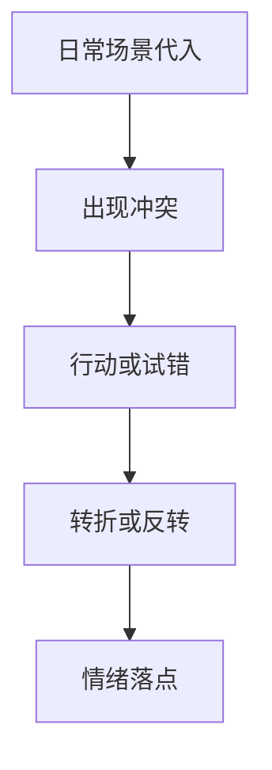

# 故事叙事

> 故事叙事，是让内容「被记住」的底层能力。它不只属于影视，短视频、自媒体、甚至一条图文都要讲清楚「谁、遇到什么、怎么变」。本文属于 [方法论 · 总览](README.md)，与 [色彩理论](色彩理论.md)、[选题框架](选题框架.md) 并称跨形态三心法，承接 [内容策划](/contents/自媒体运营/内容策划.md) 的选题。

## 为何与结构
### 为何要讲故事

信息不缺，注意力缺。同样讲「一个人住」，干巴巴列步骤没人看，讲成「下班回家发现冰箱空了，于是用边角料做了一锅」就有画面、有共鸣。故事给信息一个「容器」，让人愿意看下去、记得住、想转发。

> 提示：故事不是虚构，是「真实事件的叙事化呈现」。你本来的生活就有起伏，只是没当故事讲。

### 起承转合

| 阶段 | 作用 | 自媒体里的落点 |
| --- | --- | --- |
| 起 | 建立场景、代入 | 开头 3 秒给可共鸣的日常 |
| 承 | 铺展过程 | 展示行动、细节 |
| 转 | 冲突/反转 | 意外、失败、发现 |
| 合 | 收束、落点 | 结论、感受、行动指引 |

短视频里「起承转合」被压缩：起=钩子，承=铺垫，转=高潮/反转，合=金句/引导。不必全，但要有「转」——没有转折的内容是流水账。

### 三幕式结构

中长视频/文章可用三幕：建置（人物与世界）→ 对抗（冲突升级）→ 解决（新平衡）。英雄之旅是更细的版本（普通世界→召唤→试炼→归来），适合人物成长类。

| 模型 | 适合 | 时长 |
| --- | --- | --- |
| 起承转合 | 短视频/图文 | 1 分钟内 |
| 三幕式 | 中长视频 | 5–15 分 |
| 英雄之旅 | 人物纪录片/Vlog | 长 |

## 情绪与人物
### 情绪曲线

好内容的情绪不是平的，而是有波峰波谷。设计情绪曲线：开头轻度好奇→中段紧张/投入→高潮释放→结尾余韵。

> 提示：情绪曲线不需要大起大落，但要「动」。一条全程平淡的内容，看完什么也没留下。

### 人物弧光

观众代入的是「人」，不是「信息」。让主角有弧光（开头某种状态→结尾变了），哪怕只是「从手忙脚乱到游刃有余」。平实主角比完美主角更可信——你也会翻车，观众才觉得是你。

### 钩子与反转

钩子在开头（冲突/利益/悬念），决定前 3 秒留不留人；反转在中段或结尾，决定完播和转发。常见钩子类型参考 [选题框架](选题框架.md)。

| 位置 | 作用 | 例子 |
| --- | --- | --- |
| 开头钩子 | 留住 | 「我差点放弃」 |
| 中段反转 | 完播 | 「结果完全相反」 |
| 结尾落点 | 转发 | 「所以这件事告诉我…」 |

## 视听与类型
### 视听讲故事

| 手段 | 叙事功能 | 例子 |
| --- | --- | --- |
| 镜头 | 交代视角 | 主观镜头=代入 |
| 剪辑节奏 | 控制情绪 | 紧张段快切 |
| 音乐 | 渲染情绪 | 反转处静音→爆发 |

具体拍摄与剪辑方法看 [摄像 · 影视制作 · 剪辑与调色](/contents/摄像/影视制作/剪辑与调色.md) 与 [摄影 · 拍摄技术](/contents/摄影/拍摄技术)。

### 类型叙事侧重

叙事比重随形态变，但「有转折」是共性：

| 类型 | 叙事重心 | 例子 |
| --- | --- | --- |
| 短视频 | 钩子+反转，极快 | 15s 反转剧情 |
| 中长视频 | 起承转合完整 | 教程带故事线 |
| Vlog | 情绪弧，轻 | 一天的心情变化 |
| 图文 | 画面序列讲故事 | 组图对比Before/After |

> 提示：别拿长视频的节奏做短视频。短视频的「转」要在前 5 秒就出现，长视频可以铺垫 2 分钟。

### 体裁叙事落地

叙事不是一套模板套所有体裁，要按载体微调。口播类（抖音/视频号干货）：开头 3 秒必须上钩子或反常识，中段给「一个具体人 + 一个具体麻烦 + 一个具体解法」，结尾落一句可转发的观点；结构是「论点—故事—结论」，故事是用来撑论点的，别本末倒置。图文类（小红书/公众号）：用「标题钩子 + 前三行抛出冲突 + 中间步骤 + 结尾金句」，图片顺序本身也要有起承转合，第一张抓眼、中间给价值、最后一张留余韵。Vlog 类：天然有「时间线」，别按时间平铺，要按「情绪线」重排——把最精彩的片段提前当钩子，中间穿插平淡但必要的信息，结尾回到开头的情绪做个呼应。直播类：叙事弱化为「人设连续剧」，每场是一个小章节，长期看观众在追你的日常。记住：体裁决定叙事的「壳」，但「让人想继续看」的内核不变。挑一种你主做的体裁，把上面的对应结构背下来，下次直接套。

## 案例与自查
### 案例：60 秒叙事

以「独居青年做顿好的」为例：

| 时间 | 画面 | 叙事功能 |
| --- | --- | --- |
| 0–3s | 「又只有我一个人」字幕+空镜头 | 起：代入孤独 |
| 3–15s | 翻冰箱、凑食材 | 承：行动 |
| 15–25s | 差点炒糊、手忙脚乱 | 转：冲突 |
| 25–45s | 出锅、摆盘、开吃 | 高潮：治愈 |
| 45–60s | 「一个人也要好好吃」金句 | 合：落点 |

这条视频的完播和转发，靠的不是菜多好吃，而是「孤独→治愈」的情绪弧——故事在兜底。

### 自查清单

- [ ] 我的内容有没有「转」（转折/反转），而不是流水账？
- [ ] 开头 3 秒是否给了可共鸣的场景或钩子？
- [ ] 我是否设计了情绪曲线，而非平铺直叙？
- [ ] 主角是否有弧光（状态变化），是否平实可信？
- [ ] 结尾是否有落点（金句/行动），引导转发关注？
- [ ] 我是否用 [选题框架](选题框架.md) 先定了好选题？

### 常见误区

1. **只有信息没有故事**：列步骤不代入，看完即忘。
2. **没有转折**：平铺直叙，完播率低。
3. **主角完美**：不可信，难共鸣。
4. **为反转而反转**：转折生硬，反而出戏。

### 延伸阅读

- 标题与钩子方法，看 [选题框架](选题框架.md)
- 画面情绪与配色，看 [色彩理论](色彩理论.md)
- 怎么排叙事内容，看 [内容策划](/contents/自媒体运营/内容策划.md)
- 拍摄与剪辑落地，看 [摄像 · 总览](/contents/摄像/README.md) 与 [摄影 · 总览](/contents/摄影)
- 工具看 [设备](/contents/设备)
## 模板与练习
### 结构模板

可直接套的四种模板：

| 模板 | 结构 | 适用 | 钩子位置 |
| --- | --- | --- | --- |
| Before-After | 改变前后对比 | 测评/教程 | 开头抛「之前多糟」 |
| 问题-解决 | 抛问题给方案 | 知识 | 开头点痛点 |
| 过程记录 | 跟拍全程 | Vlog/幕后 | 开头定预期 |
| 观点-论证 | 立观点给证据 | 评论 | 开头亮观点 |

模板是骨架，填的是你的真实素材。套模板但别套话——观众要的是「你的版本」，不是通用结构。

### 怎么练叙事

叙事是肌肉，练出来的：

- **拆解爆款**：看它的转折在哪、情绪曲线怎么走（配合 [数据分析](/contents/自媒体运营/数据分析.md) 找高完播样本）。
- **改写结局**：同一素材写 3 个结尾，选最有力那个，训练「落点感」。
- **日记练笔**：每天写 100 字小故事，强制自己有「起转合」，哪怕写「今天咖啡洒了」。

练一个月，你会发现自己开口讲话都开始有结构——这是内容创作者的底层红利。

### 叙事病与药方

内容创作里，叙事翻车有几种典型病。第一种是「没有转折」，把过程平铺直叙，观众看完不知道重点，完播率自然低。药方是在中段人为制造一个冲突或意外——哪怕是「本来想做 A 结果做成 B」，也能把平淡记录变成有弧光的小故事。第二种是「钩子货不对板」，开头喊「震惊」，正文平平，观众点进来秒划走，伤害账号权重。药方是钩子必须等于正文第一个真价值，不夸张。第三种是「主角模糊」，通篇在讲事，没人记得是谁。药方是让「人」贯穿始终，哪怕是一个人做饭，也交代他的状态（累、馋、穷），观众代入的是人不是菜。这三种病改掉，叙事及格线就过了。更进一步的做法是把情绪曲线画出来：开头轻度好奇、中段投入、高潮释放、结尾余韵，每段对应一个画面任务，而不是想到哪拍到哪。叙事练好了，同样素材你能讲出别人讲不出的味道。

### 情绪指挥剪辑

学叙事最好的落脚点，是回到剪辑台。很多人写脚本时想得天花乱坠，一坐到剪辑软件前就忘了结构。解决办法是把情绪曲线画在纸上再剪：横轴时间，纵轴情绪强度，标出你想要的波峰波谷，然后每个片段对号入座。开头那段如果情绪平，就补一个强钩子镜头；中段如果一直平，就人为制造一个小冲突（比如「差点翻车」）把曲线顶起来；结尾让情绪缓缓落下而非戛然而止，观众才觉得「完整」。这条曲线不只服务短视频，中长视频更要用——没有曲线的长视频，观众中途就划走。配合 [摄像 · 剪辑与调色](/contents/摄像/影视制作/剪辑与调色.md) 的节奏方法，叙事和剪辑就接上了。剪辑不是「把拍的接起来」，是「按情绪重新排布」，叙事能力最终在剪辑台兑现。

### 留白与密度

另一个常见误区是「信息堆满」——怕观众不懂，前因后果全讲一遍，结果没有留白、没有悬念。好叙事要敢留白，敢让观众自己补，敢在关键处停一下。留白不是没内容，是给情绪呼吸的空间。你越想讲全，观众越不想看；你越敢收，观众越想追。实操上，每条内容只讲一个核心点，其余做背景，结尾留一个开放问题或余韵，让观众在评论区接话。信息密度高是好事，但密度要放在「价值」上，不是「字数」上——一句戳心的话，胜过十句解释。叙事的功力，往往体现在「没说出来的部分」。

