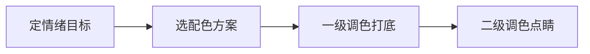

# 色彩理论

> 色彩理论，是让画面「有情绪」的底层能力。它不只服务摄影后期，也直接决定短视频封面、直播背景、品牌视觉的调性。本文属于 [方法论 · 总览](README.md)，与 [故事叙事](故事叙事.md)、[选题框架](选题框架.md) 并称跨形态三心法。

## 基础认知
### 为何要懂色彩

用户刷到你，0.1 秒先看到颜色，再读文字。色彩决定「第一眼情绪」：暖色亲近、冷色专业、高饱和热闹、低饱和高级。封面和画面的配色，是在开口前就定好的调性。

> 提示：色彩是「免费的叙事」。同样一张图，暖调讲治愈、冷调讲孤独，不用改内容，只改配色。

### 色彩三属性

| 属性 | 含义 | 对内容的影响 |
| --- | --- | --- |
| 色相 | 什么颜色（红/蓝/绿） | 决定情绪基调 |
| 明度 | 明暗 | 影响清晰度和高级感 |
| 纯度 | 鲜艳度 | 高=热闹，低=克制 |

三属性是调色的「坐标轴」——你想调情绪，先想动哪个轴。想更专业，降纯度；想更温暖，动色相偏橙；想更清楚，提明度。

### 配色与情绪

| 方案 | 做法 | 情绪 | 适合 |
| --- | --- | --- | --- |
| 单色 | 同色相深浅 | 统一、安静 | 高级感、知识 |
| 类比 | 相邻色 | 和谐、自然 | 生活、美食 |
| 互补 | 对立色 | 冲击、活力 | 种草、搞笑 |
| 三角 | 三等分 | 丰富、平衡 | 多元内容 |

> 提示：新手先用「单色或类比」求稳，避免互补色翻车成「红配绿」。等熟练了再用互补制造冲击。

### 平台调性

| 平台 | 常见调性 | 配色倾向 |
| --- | --- | --- |
| 小红书 | 精致、生活方式 | 低饱和莫兰迪、奶油色 |
| 抖音 | 快节奏、冲击 | 高饱和、强对比 |
| B站 | 圈层、个性 | 多样、可暗调 |
| 公众号 | 深度、专业 | 克制、品牌色 |

## 调色与案例
### 调色思路

| 层级 | 做什么 | 工具 |
| --- | --- | --- |
| 一级调色 | 曝光、白平衡、对比 | 基础上浮 |
| 二级调色 | 局部色相/蒙版 | 局部调整 |
| LUT | 统一风格 | 预设 |

具体调色操作看 [摄像 · 影视制作 · 剪辑与调色](/contents/摄像/影视制作/剪辑与调色.md) 与 [摄影 · 后期处理](/contents/摄影/后期处理)。

### 案例：三种配色

场景：一杯咖啡在窗边。

| 配色 | 情绪 | 观感 |
| --- | --- | --- |
| 冷调（蓝灰） | 安静、孤独 | 文艺、疏离 |
| 暖调（橙黄） | 温暖、治愈 | 生活、舒服 |
| 高饱和（原色） | 活力、刺激 | 商业、吸睛 |

同一个物体，配色不同，讲的故事完全不同——这就是色彩叙事。调色链路是「定情绪→选方案→打底→点睛」：

### 常见翻车与规避

| 翻车 | 原因 | 规避 |
| --- | --- | --- |
| 偏色 | 白平衡错 | 拍前自定义白平衡 |
| 脏 | 饱和过高 | 降纯保明 |
| 乱 | 颜色太多 | 主色+点缀≤3 |

## 资产与自查
### 色彩品牌资产

长期用一个配色体系，粉丝看一眼颜色就知道是你。做法：定 1 个主色 + 1–2 个点缀色，封面、封面字、片头片尾统一，形成视觉指纹。这与 [内容策划](/contents/自媒体运营/内容策划.md) 的定位一脉相承——定位是「说给谁听」，配色是「长什么样」。

### 自查清单

- [ ] 我是否先定了「这条内容要什么情绪」再配色？
- [ ] 我是否控制主色+点缀色 ≤ 3，避免乱？
- [ ] 我的配色是否符合平台调性（小红书低饱和、抖音高对比）？
- [ ] 我是否用一级调色先打底（曝光/白平衡）？
- [ ] 我是否有统一的品牌配色，形成视觉指纹？
- [ ] 我是否避免高饱和导致的「脏」？

### 常见误区

1. **只调饱和度**：一味拉纯，画面脏。
2. **颜色太多**：红黄蓝绿全上，杂乱无重点。
3. **忽视白平衡**：偏色严重，显业余。
4. **不考虑平台**：小红书用高对比抖音风，违和。

### 延伸阅读

- 叙事与情绪配合，看 [故事叙事](故事叙事.md)
- 选题与标题，看 [选题框架](选题框架.md)
- 调色实操，看 [摄像 · 影视制作 · 剪辑与调色](/contents/摄像/影视制作/剪辑与调色.md) 与 [摄影 · 后期处理](/contents/摄影/后期处理)
- 拍摄基础，看 [摄影 · 拍摄技术](/contents/摄影/拍摄技术)
- 工具看 [设备](/contents/设备)
## 人像与光影
### 肤色与人物配色

人像最易翻车的是肤色。原则：肤色调往暖、降饱和，避免发绿/发灰。

| 常见问题 | 原因 | 调法 |
| --- | --- | --- |
| 发绿 | 白平衡偏冷 | 色温往暖拉 |
| 发灰 | 饱和太低 | 轻微提纯 |
| 不均 | 局部光差大 | 蒙版分区调 |

> 提示：肤色是「第一信任感」，歪了观众本能觉得假。人物内容先保肤色，再谈风格。

### 光影与色彩

光决定色：暖光（夕阳）画面偏橙，冷光（阴天）偏蓝。拍前认光，调色才省事。

| 光型 | 色彩倾向 | 适用 |
| --- | --- | --- |
| 黄金时刻 | 暖橙 | 人像、治愈 |
| 阴天散射 | 冷蓝灰 | 情绪、高级 |
| 硬光正午 | 高对比 | 清爽、商业 |

想好「要什么光」，比后期硬拉色相更自然。拍摄端的事看 [摄影 · 拍摄技术](/contents/摄影/拍摄技术)。

## 实战流程
### 配色实战流程

从原片到成片：

| 步骤 | 动作 | 工具 |
| --- | --- | --- |
| 1 定主色 | 这张要什么情绪 | 脑子里先定 |
| 2 一级调色 | 曝光/白平衡打底 | 基础面板 |
| 3 二级调色 | 局部：肤色/天空/主体 | 蒙版 |
| 4 统一 | LUT 或手动统一 | 预设 |

具体落地看 [摄像 · 影视制作 · 剪辑与调色](/contents/摄像/影视制作/剪辑与调色.md) 与 [摄影 · 后期处理](/contents/摄影/后期处理)。色彩理论是「为什么」，那两篇是「怎么做」。

### 配色错误修正

新手调色最常犯三个错。一是饱和拉满，以为鲜艳等于好看，结果是「脏」——高饱和挤在一起互相打架，画面浮躁。修正办法是降纯度保明度，让颜色「透气」。二是白平衡随手，室内暖光不校正，人物脸色发橘或发绿，第一眼就廉价。修正办法是拍前自定义白平衡，或后期用吸管定灰点。三是颜色太多，红黄蓝绿全上，没有主色，观众视线无处落。修正办法是定 1 个主色加 1 到 2 个点缀色，其余压成中性。这三条做到，画面立刻有「专业感」。再往上是风格化：用 LUT 或手动把整组内容统一到同一套配色，形成品牌指纹——观众看一眼颜色就知道是你。这一步和定位绑定，逻辑见 [内容策划](/contents/自媒体运营/内容策划.md)。调色不是炫技，是让情绪准确传达，别让颜色抢了内容的戏。

### 配色一致性

配色的最高阶段不是「单张好看」，是「一组统一」。同一账号的所有封面、片头、字幕，用同一套配色，观众扫一眼就知道是你——这是视觉指纹。做法：定 1 个主色（如你的品牌色），所有内容的主色不变；点缀色可以随内容微调，但不超过 2 个；明度纯度区间固定，别今天高饱明天低饱。统一不是单调，是「变中有不变」。新手常犯的错是每条追热点换风格，结果账号视觉碎片化，粉丝记不住。固定配色体系后，你甚至可以把调色存成预设，每条一键套用，省时且稳。这和 [内容策划](/contents/自媒体运营/内容策划.md) 的定位一脉相承——定位是「说给谁」，配色是「长什么样」，两者一起构成识别度。

### 低饱和高级感

很多人想要「高级感」但不知道从哪来，答案往往是「低饱和加高明度加中性背景」。高饱和容易热闹廉价，低饱和克制耐看；高明度清爽不闷；中性背景（灰、米白）让主体跳出来。具体到操作：降整体饱和百分之十到二十，提明度一点，背景用中性色而非鲜艳色，主体用你的主色点睛。小红书那种「奶油风」就是这个逻辑——低饱、暖调、干净背景。但低饱和不是「灰扑扑」，是「有控制地淡」，主体该亮的地方仍要亮。练习方法：找 10 张你觉得高级的图，吸管吸主色，你会发现它们饱和都不高、明度都不低。配色审美是看出来的，先大量看好的，手才跟得上眼。

### 配色排版协同

配色不只是画面，也管字。很多封面图「颜色对、字一上就乱」，问题出在文字和底色没协调。原则一：文字颜色要么用主色、要么用中性色（白/黑/深灰），别用和背景同明度的彩色字，糊成一团。原则二：大字用纯色，小字用中性色，主次靠颜色对比拉开，不只靠字号。原则三：背景复杂时，给文字垫一块半透明中性色块（深底浅字或浅底深字），保证可读性——这是「功能性配色」，牺牲一点美观换信息传达。原则四：字体的「气质」要和配色一致，圆润字体配低饱暖调显温柔，硬朗无衬线配高对比冷调显专业，别让字体气质和配色打架。一句话：配色管「美不美」，文字管「看得清」，两者协同才是一张能传信息的封面。做封面时先定配色，再按配色选字色，顺序别反。

### 配色工具色板

别每次凭记忆调色，把配色「存下来」才能稳定。工具层面：取色用系统吸管或浏览器插件（如 ColorPick），看到好图一键吸主色；搭色板用在线工具（如 Coolors、Adobe Color），输入主色自动给协调方案；落地到剪辑/设计软件，把你的品牌色存成「色板预设」，每条一键套用。管理层面：建一个「品牌色板」文档，写清主色色值（HEX/RGB）、点缀色、禁用色，所有平台共用，避免今天红明天绿。进阶：给不同栏目配不同「子色板」（如干货栏目蓝、生活栏目暖），既统一又区分。色板管理的最大好处是「省决策」——你不再每条纠结配什么色，打开预设就干，把精力留给内容本身。建议今天就建一个三色品牌色板（1 主 + 2 点缀），它比你想象中更能统一账号观感。

