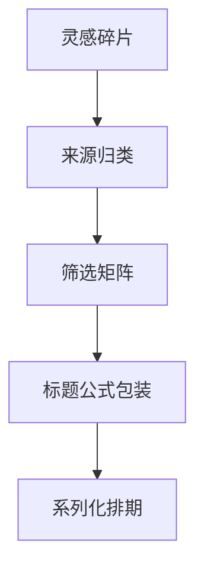

# 选题框架

> 选题框架，是解决「今天发什么」的底层方法。它让选题从灵感变成可复制的系统，是所有内容生产的起点。本文属于 [方法论 · 总览](README.md)，与 [故事叙事](故事叙事.md)、[色彩理论](色彩理论.md) 并称跨形态三心法，直接服务 [内容策划](/contents/自媒体运营/内容策划.md) 的选题库。

## 框架基础
### 为何要框架

「随便想一个」的结果就是断更和漂移。框架把选题拆成「来源 → 筛选 → 包装」三步，每一步都有方法，不再靠灵光一现。没有框架的账号，越做越累；有框架的账号，选题从「焦虑」变成「选择题」。

### 选题来源分类

| 来源 | 例子 | 持续性 |
| --- | --- | --- |
| 热点 | 突发话题 | 短 |
| 痛点 | 粉丝常问 | 长 |
| 盲区 | 没人讲清的 | 长 |
| 对比 | A vs B | 中 |
| 清单 | 合集/盘点 | 长 |
| 争议 | 观点对立 | 中 |

> 提示：痛点/盲区/清单是「常青选题」，可持续产出；热点/争议是「流量选题」，借势但不依赖。两者搭配，账号既稳又有爆发。

### 选题筛选矩阵

| 维度 | 高分 | 低分 |
| --- | --- | --- |
| 价值 | 真解决问题 | 自嗨 |
| 可执行 | 今天能拍 | 要大成本 |
| 可持续 | 能系列化 | 一次性 |
| 差异 | 独特视角 | 千篇一律 |

四维打分，低于阈值不做，和 [内容策划](/contents/自媒体运营/内容策划.md) 的评估矩阵一致。低分不是删掉，是「暂存」——等你有产能或新角度再启。

### 标题公式

| 公式 | 结构 | 例子 |
| --- | --- | --- |
| 数字式 | 数字+利益 | 「3 个习惯拯救烂片」 |
| 悬念式 | 疑问/反差 | 「为什么你拍的糊」 |
| 利益式 | 你能得到 | 「一周搞定调色」 |
| 身份式 | 圈定人群 | 「独居青年必看」 |

标题是选题的「外包装」——同样内容，标题定好不好，点击率能差几倍。钩子的更深层写法参考 [故事叙事](故事叙事.md) 的「钩子 placement」。

## 系列化与节奏
### 可持续与系列化

单篇选题容易断，系列化能持续：把大主题拆成 N 篇（如「调色入门 1/2/3」），既减轻选题压力，又培养追更。系列化还带来「预期」——粉丝知道下周还有，关注动机更强。

### 选题的节奏感

不同栏目承担不同选题节奏，搭配着来，账号不累、观众也不腻：

| 栏目 | 选题节奏 | 例子 |
| --- | --- | --- |
| 主栏目 | 做深、重价值 | 系统教程 |
| 互动栏目 | 做轻、快回应 | 评论区点菜 |
| 节点栏目 | 做快、蹭势 | 节日/热点 |
| 人设栏目 | 做真、慢炖 | 踩坑复盘 |

节奏感解决「每天发什么类型」——不是随机，而是按栏目排。这正好是 [内容策划](/contents/自媒体运营/内容策划.md) 内容日历要落地的部分。

### 系列化实例

系列化听着抽象，给个实例。假设你是「职场 Excel」号，大主题「函数」可以拆成：入门（最常用的 5 个函数）、进阶（查找匹配三件套）、实战（用函数做工资表）、避坑（新人常错的 4 个）。四篇自成系列，每篇独立能看、连起来是体系。好处：选题压力骤减（一个大主题养活一个月），粉丝追更习惯养成，算法也更容易把同系列互相推荐。拆解公式：大主题 → 按「难度梯度」或「场景梯度」切片 → 每片定一个明确钩子。难度梯度适合知识（入门到精通），场景梯度适合生活（周一焦虑到周末治愈）。拆完排进 [内容策划](/contents/自媒体运营/内容策划.md) 的日历，你就不再是「每天想发什么」，而是「按表发第几篇」。

### 节点日历

热点和节点是选题的「外部燃料」，用好了不费力。节点分两类：固定节点（节日、季节、开学、双十一）和可预测事件（大赛、发布会、影视上映）。做法是提前建一张「节点日历」，把未来三个月的节点列出来，每个节点提前两周排选题——比如中秋前两周发「中秋拍照/送礼」相关，蹭的是确定性流量，不用赌运气。热点的玩法不同：热点是「突发」，拼的是反应速度，原则是「快、准、贴定位」，别硬蹭无关热点（伤粉）。节点和热点合起来，构成你选题库的「外环」；日常痛点、盲区构成「内环」。内外环结合，你既有稳定基本盘，又有流量脉冲。提醒：节点选题也要过 [选题筛选矩阵](选题框架.md) 的价值关，别因为「应景」就发低质内容。节点日历建好，你提前两周就知道下个月发什么，焦虑感直接减半。

## 案例与自查
### 案例：选题演变

灵感碎片：「我调色总脏」。

| 阶段 | 形态 | 标题 |
| --- | --- | --- |
| 原始 | 一句话吐槽 | 「调色好难」 |
| 筛选 | 过矩阵：痛点+可执行 | 保留 |
| 包装 | 数字式+身份 | 「独居新手 3 步调出不脏的色」 |
| 系列 | 拆成 3 篇 | 入门/进阶/避坑 |

选题从碎片到成片，靠的是框架而非灵感：

### 常见坑

| 坑 | 表现 | 规避 |
| --- | --- | --- |
| 追热点忘定位 | 啥火做啥 | 热点也要贴合人设 |
| 标题党 | 货不对板 | 标题承诺正文给 |
| 一次耗尽 | 一个选题写完没后续 | 系列化 |

### 自查清单

- [ ] 我的选题是否来自固定来源（痛点/盲区/清单），而非临时想？
- [ ] 选题是否过了价值/可执行/可持续/差异四维筛选？
- [ ] 标题是否用了明确公式（数字/悬念/利益/身份）？
- [ ] 我是否把大主题系列化，避免一次耗尽？
- [ ] 我的栏目是否承担了不同选题节奏？
- [ ] 我是否用 [数据分析](/contents/自媒体运营/数据分析.md) 反推下批选题？

### 常见误区

1. **凭灵感更新**：断更反复，无系统。
2. **追热点忘定位**：流量来了留不住。
3. **标题党**：点击高但完播低，货不对板。
4. **不系列化**：一个选题写完，下次重新焦虑。

### 延伸阅读

- 叙事与钩子，看 [故事叙事](故事叙事.md)
- 画面情绪，看 [色彩理论](色彩理论.md)
- 用数据反推，看 [数据分析](/contents/自媒体运营/数据分析.md)
- 排进日历落地，看 [内容策划](/contents/自媒体运营/内容策划.md)
- 生产侧参考 [摄像 · 总览](/contents/摄像/README.md) 与 [摄影 · 总览](/contents/摄影)
- 工具看 [设备](/contents/设备)
## 数据与方法
### 从数据反推选题

[数据分析](/contents/自媒体运营/数据分析.md) 告诉你什么受欢迎，反过来指导选题：高完播的选题方向=下批重点；低互动=加讨论点；高转粉=强化人设类。建立「数据 → 选题」回路，让选题不再是猜，而是被验证过方向的延续。

| 数据信号 | 选题动作 |
| --- | --- |
| 某方向完播高 | 同方向出系列 |
| 某标题点击高 | 复用该标题公式 |
| 互动低 | 结尾加提问/争议点 |

> 提示：最好的选题库，是「自己历史爆款」的拆解合集。别人爆的未必适合你，你爆过的一定适合你。

### 迭代闭环

选题不是一锤子买卖，是闭环。发出去 → 看 [数据分析](/contents/自媒体运营/数据分析.md) 的完播和互动 → 爆的方向加更、凉的方向减 → 下批选题据此调。这个闭环跑起来，你越做越准，不再靠猜。闭环里最关键的动作是「记」：每条发完，花 5 分钟记一句「为什么这条成或败」，积累成自己的选题字典。很多人发了就忘，下次又从零猜，等于每次重启。闭环的另一半是「敢砍」：数据证明不行的方向，果断停，别因为「我都拍了一半」硬发，半成品凑数比不发更伤账号。迭代不是否定过去，是把过去的反馈变成未来的准星。

### 跨界迁移

一个好选题不该只用在一条内容里，要会「一鱼多吃」地迁移。迁移一：跨平台改编。同一主题，小红书写成「清单体」，抖音改成「口播+演示」，B 站长成「深度教程」，形态变、内核不变，覆盖不同人群。迁移二：跨栏目复用。一个「职场沟通」的大主题，既能做干货文，也能做故事文（讲一个沟通翻车的真实经历），还能做互动文（评论区征集翻车故事），一个素材养活三个栏目。迁移三：跨时间重发。老选题过半年换个角度重发，老粉当复习、新粉当新知，流量常能再起一波（注意别原样搬运，要加新信息）。迁移的关键是「抓内核、换外壳」——先想清楚这条内容的「核心洞察」是什么，再决定用哪种外壳包它。习惯迁移之后，你的选题库会从「一次性」变成「可复利」的资产，越做越轻松。这也是 [内容策划](/contents/自媒体运营/内容策划.md) 里栏目化思路的延伸。

## 落地与维护
### 选题库维护

收集不难，维护才难——库不维护就成垃圾堆。

| 频率 | 动作 | 产出 |
| --- | --- | --- |
| 每天 | 记 1–3 个灵感碎片 | 库增量 |
| 每周 | 筛选、排进日历 | 下周选题 |
| 每月 | 复盘，淘汰低分 | 干净库 |

维护比收集重要：宁可少记，也要每周清。 stale 的选题放着占地方，真到用时不记得为什么存。

### 跨平台适配

同选题不同平台角度不同（详见 [平台策略](/contents/自媒体运营/平台策略.md) 适配表）：

| 平台 | 同一选题的角度 |
| --- | --- |
| 抖音 | 冲突/反转，快 |
| 小红书 | 实用/清单，藏得住 |
| B站 | 深度/观点，讲得透 |

选题框架下先定「核心选题」，再按平台换壳——核不变，角度变。

### 合规边界

不是什么都能做：

| 风险类型 | 处理 |
| --- | --- |
| 敏感话题 | 不碰底线 |
| 争议话题 | 平衡呈现，不站队引战 |
| 医疗/财经 | 需资质，标注「非专业建议」 |
| 他人隐私 | 打码/授权 |

> 注意：蹭争议流量快但脆，一次翻车账号归零。长期主义见 [增长与变现](/contents/自媒体运营/增长与变现.md)。

### 冷启动技巧

新号没粉丝、没数据，怎么定选题？不能等数据，要靠「借」。借热点：平台热榜前 20 条，挑和定位沾边的角度切，蹭自然流量。借对标：找 3 个同赛道、粉丝量你十倍的号，拆他们近 30 条爆款的选题结构，不是抄内容而是抄「选题方向」——他们验证过的方向，你用自己视角重做，成功率远高于原创盲猜。借自身：你过去的真实经历、专业、踩过的坑，都是别人没有的独家选题源。冷启动期别追求完美，先每条都带「明确钩子加明确价值」，跑两周看哪类完播高，再用数据反推（见 [数据分析](/contents/自媒体运营/数据分析.md)）固化方向。等有了 1 条自然跑起来的爆款，账号才算找到脉，之后选题就有锚了，不再天天焦虑「发什么」。

