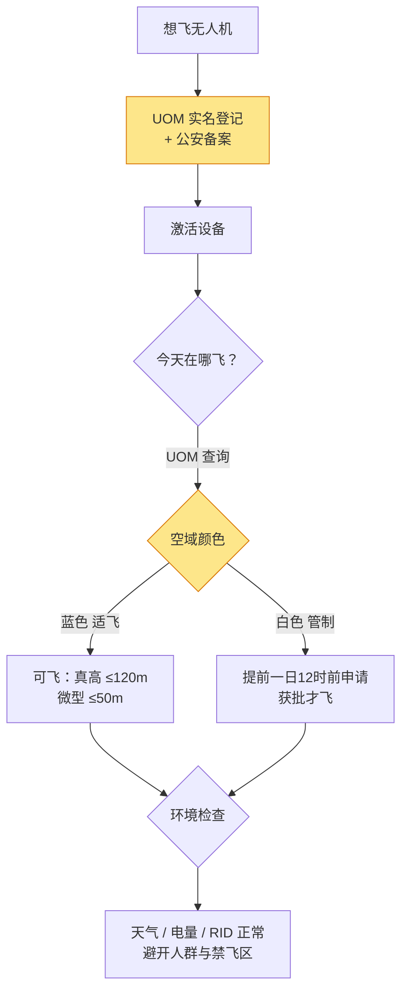
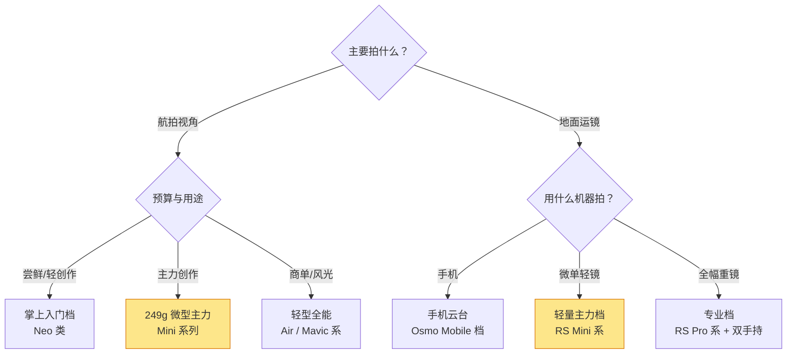

# 无人机与稳定器

> 本文为「设备」栏目的**型号层参考**：覆盖消费级无人机的档位划分、**2026 年现行飞行合规要求**，以及相机/手机稳定器的负载选型。价格与法规均有时效性，信息核对时点：2026-08；飞行前请以民航局 UOM 平台最新指引为准。

这两类设备解决同一个问题——**让机器替你完成"人做不到的运镜"**：无人机负责把机位搬到天上，稳定器负责让人手持也能走出丝滑轨迹。它们都是"买了就回不去"的生产力设备，但也都有一条底线要先讲清楚。

## 无人机：先合规，再性能

无人机不是"买来就能随便飞"的玩具。2024 年《无人驾驶航空器飞行管理暂行条例》施行，2026 年起配套规则进一步收紧（新修订《治安管理处罚法》将"黑飞"列为妨碍公共安全行为；实名登记与激活的两项强制性国标于 2026-05-01 落地）。**先看懂规则，再决定买什么、怎么飞。**

#### 分类：你的机器属于哪一类

| 类别 | 空机重量 | 限高（真高） | 典型代表 |
| --- | --- | --- | --- |
| 微型 | < 250g | **50 米** | DJI Mini 系列（249g 设计）、Neo |
| 轻型 | 250g – 4kg（起飞 ≤7kg） | 120 米 | DJI Air 系、Mavic 系 |
| 小型及以上 | 更大 | 审批管理 | 行业机，消费用户基本不涉及 |

> 提示：**"249g"的设计目标就是贴着微型线走**，但按现行解读，具备超视距图传能力的机型同样建议完成实名登记。别纠结"能不能钻空子"，登记免费且是激活前提，直接办。

#### 必办手续（2026 现行）

| 手续 | 渠道 | 要点 |
| --- | --- | --- |
| 民航实名登记 | UOM 平台（uom.caac.gov.cn / APP） | 登记二维码贴机身；2026-05 起**不登记无法激活、不激活无法起飞** |
| 公安备案 | 「无人驾驶航空器公安管理平台」小程序 | 民航 + 公安双流程办结才算合规 |
| RID 远程识别 | 出厂内置 / 存量机升级模块 | 飞行中自动广播位置与身份；篡改重罚 |
| 存量机补登记 | UOM 平台 | 2026-05 前购买的存量机须在 **2027-06-01 前**完成补登记激活 |
| 二手交易变更 | 原机主注销 → 新机主重新登记激活 | 收二手无人机必查此环节 |

#### 空域与处罚红线

| 规则 | 内容 |
| --- | --- |
| 适飞空域 | 真高 120 米以下、非管制区域；微型机再降一档至 50 米 |
| 管制空域 | 真高 120m 以上空域、机场净空区、军事禁区、党政机关、交通枢纽等 8 类区域上方 |
| 飞前查询 | UOM 平台查空域：蓝色适飞、白色管制；管制空域须提前一日 12 时前申请 |
| 未实名登记飞行 | 责令改正，可处 200 元以下罚款；情节严重 2000–20000 元 |
| 黑飞管制空域 | 500 元以下罚款；2026-01 起情节较重可处 **5–10 日行政拘留** |
| 无执照操控小型以上 | 5000–50000 元罚款 |

微、轻型在适飞空域内飞行**无需操控员执照**，但应掌握操作方法、了解风险提示——这条"豁免"不等于免责，出事照样追责。

## 无人机怎么选：三档定位

| 档位 | 价位段 | 代表方向 | 适合 |
| --- | --- | --- | --- |
| 掌上入门 | 1500–3000 元 | DJI Neo 及同类：掌上起降、自拍跟拍 | 尝鲜、Vlog 素材、室内演示 |
| 主力航拍（微型） | 3500–5500 元 | Mini 系列：249g、全向避障、4K HDR | 绝大多数创作者的最优解：便携 + 合规友好 |
| 进阶全能（轻型） | 6000–14000 元 | Air 系（双焦段）、Mavic 系（旗舰画质） | 商单、风光航拍、需要更长续航与更强图传 |

量化指标看四个：**续航**（主流 25–45 分钟，标称值打七折）、**图传距离**（10–20km 标称，市区实测大打折扣）、**避障级别**（全向 > 仅下视）、**传感器尺寸**（1/1.3 英寸起步，旗舰 1 英寸或 4/3）。

#### 在售代表画像（2026-08，型号迭代快，下单前以官网在售为准）

| 系列 | 档位 | 关键词画像 |
| --- | --- | --- |
| Neo 类掌上机 | 入门 | 无手柄起飞、跟拍自拍、室内可用；画质是"记录级"，胜在零门槛 |
| Mini 系（249g） | 微型主力 | 全向避障下放、4K HDR、竖拍模式；个人创作者性价比甜点 |
| Air 系 | 轻型全能 | 双焦段相机（广角+中长焦）、更长续航；商单与风光航拍的常用解 |
| Mavic 系旗舰 | 轻型顶配 | 更大传感器、更强图传与避障；预算充足时的"一步到位" |
| Avata / FPV 类 | 穿越特化 | 第一视角穿越动感强；学习成本与炸机风险都高一档，非刚需不推荐首发 |

> 提示：**配件按"畅飞套装"思路算总账**——备用电池×3、收纳包、备用桨叶通常比单机贵 1000–2000 元，但这才是能连续拍一个下午的真实成本。

#### 配件与养护速查

| 配件 | 要点 |
| --- | --- |
| 备用电池 | 至少 3 块；低温环境电量衰减明显，冬季贴身保暖存放 |
| ND 滤镜 | 视频党刚需：白天压快门到 1/50s 左右获得自然动态模糊 |
| 备用桨叶 | 炸机后第一时间更换；轻微缺口就会引发高频抖动 |
| 收纳与运输 | 锂电池不可托运（民航规定），随身携带且单块不超过 100Wh |

> 一句话：**第一台无人机闭眼选 249g 微型主力档——性能对个人创作足够溢出，合规与便携成本最低。**

## 稳定器：先负载，再型号

稳定器的全部使命是抵消手抖与走路颠簸，选购只有一个第一问题：**你要挂多重的机器？**

#### 负载档位表

| 档位 | 承重范围 | 挂什么 | 代表方向 | 价位段 |
| --- | --- | --- | --- | --- |
| 手机云台 | ~250g | 手机、运动相机 | DJI Osmo Mobile 系 | 500–1000 元 |
| 入门微单单反 | 1.5–2kg | A6400 + 小定焦、全幅 + 饼干头 | 大厂入门系（RSC 系列前身款二手） | 800–1300 元 |
| 轻量主力 | 2–3kg | A7C/A7 IV + 中型镜头 | RS3 Mini / RS4 Mini 档 | 1500–2300 元 |
| 专业级 | 4–5kg+ | 全幅 + 70-200 F2.8 | RS4 Pro 档 | 3500 元+ |

#### 关键参数怎么看

| 参数 | 为什么重要 |
| --- | --- |
| 负载（kg） | **留 30% 余量**：机身+镜头总重 × 1.3 ≤ 标称负载，电机才不发烫 |
| 自重 | 加上相机后是你手臂要举的总重量；超过 1.5kg 单手持握撑不过十分钟 |
| 续航 | 8–12 小时为主流，多数支持给相机反向供电 |
| 快拆结构 | 决定"装拆一次"的成本，拍完收摊频率高的必看 |
| 跟焦电机 | 需要变焦/跟焦运镜时的扩展件，Pro 档常自带 |

> 提示：**稳定器修的是"抖"，修不了"晃"**——步频、构图、运镜语言仍是基本功，参考[影视制作 · 拍摄](../../摄像/影视制作/拍摄.md)。设备只能放大能力，不能替代练习。

#### 调平与校准：开拍前的五步流程

稳定器八成的新手问题出在"没调平就开机"，电机强行硬拉不平衡的负载，结果就是发热、报警、续航腰斩：

| 步骤 | 做法 | 判定 |
| --- | --- | --- |
| 1. 装机调平（关机状态） | 先后俯仰、再横滚、最后垂直轴，逐轴调到"松手能停在任意角度" | 三轴都能悬停静止才算平衡 |
| 2. 卡紧锁扣 | 确认快拆板螺丝拧到位 | 晃动机身无异响位移 |
| 3. 开机自检 | 放在平面上开机，等待自检通过 | 无"电机过载"报警 |
| 4. 校准 | 出现轻微漂移时执行六面校准或水平校准 | 静置时画面水平线不缓慢旋转 |
| 5. 试走 10 米 | 录一段正常步速素材回放 | 无高频抖动与"马达嗡嗡"声 |

> 提示：**每次换镜头、换电池都要重新调平**——重心变了，原来的平衡全部作废。

## 选型决策流程

## 自查清单

- [ ] 我已完成 UOM 实名登记 + 公安备案，二维码已贴机身？
- [ ] 我知道常用拍摄点的空域类型（蓝/白）吗？
- [ ] 我的飞行高度计划是否低于真高 120 米（微型 50 米）？
- [ ] 无人机档位匹配我的用途，而不是参数焦虑？
- [ ] 电池健康度与数量支撑当天的拍摄计划？
- [ ] 稳定器负载留了 30% 余量？
- [ ] 收纳后整机重量是我愿意背出门的水平？
- [ ] 二手无人机交易确认过原机主已注销登记？

## 常见误区

- **"249g 就完全不用管规则"** —— 重量只影响分类和执照要求，登记、限高、空域规则依然适用。
- **"图传 20 公里 = 能飞 20 公里"** —— 标称值是无遮挡理想环境；市区高楼间几公里就会衰减，且必须全程目视范围内飞行。
- **"避障有了就不用看环境"** —— 避障对细小障碍（树枝、电线）不可靠，返航路径也可能撞上新增建筑物。
- **"稳定器越贵画面越电影感"** —— 电影感来自运镜设计与剪辑节奏，稳定器只是消除抖动的工具。
- **"买无人机是为了近距离炫技"** —— 近距离穿越属于专业穿越机领域，消费级航拍机的价值在高机位与广角叙事。

> **延伸**
> - 收音设备怎么配：[麦克风与收音设备](麦克风与收音设备.md)
> - 运镜与拍摄基本功：[影视制作 · 拍摄](../../摄像/影视制作/拍摄.md)
> - 声音设计的整体思路：[影视制作 · 声音设计](../../摄像/影视制作/声音设计.md)
> - 机身的选型逻辑：[相机机身型号](相机机身型号.md)
