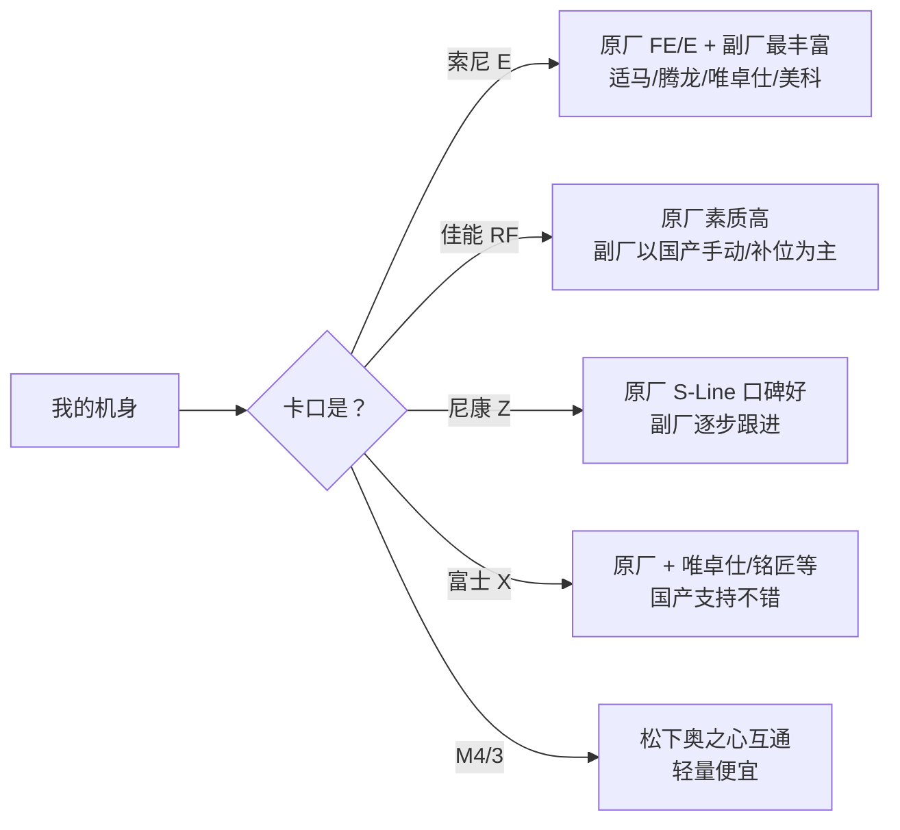
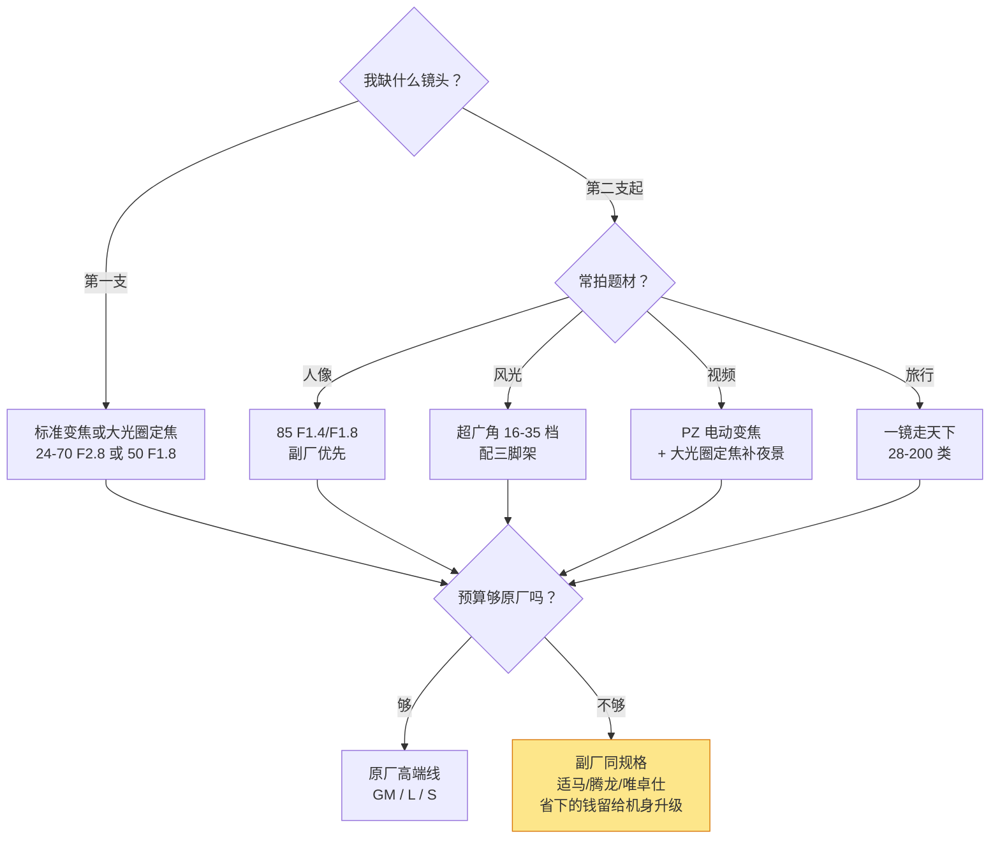

# 镜头型号与卡口

> 本文为「设备」栏目的**型号层参考**：教你读懂镜头名称里的卡口、焦距、光圈与档位缩写，以及副厂生态与二手验镜。焦距、光圈对画面的影响等原理见[镜头（原理篇）](../../摄影/器材/镜头.md)。价格随行情波动，信息核对时点：2026-08。

镜头的名字看起来像乱码——`FE 24-70mm F2.8 GM II`、`NIKKOR Z 24-70mm f/2.8 S`、`AF 75mm F1.2 Pro`。但拆开看，每一节都是一个参数声明：**会读名字，就不会买错卡口、买错用途、买错档位**。

| 名字里的信息 | 回答什么问题 | 例子片段 |
| --- | --- | --- |
| 卡口前缀 | 能不能装在我的机身上 | FE / RF / Z / XF |
| 焦距数字 | 拍多广或多远 | 24-70mm / 50mm |
| 最大光圈 | 虚化与暗光能力 | F2.8 / F1.8 |
| 档位字母 | 是入门线还是高端线 | GM / G / S-Line / Art |
| 功能缩写 | 有没有防抖、内变焦等 | OSS / IS / VR / PZ |

> 一句话：**读镜头名的顺序 = 买镜头的决策顺序：先卡口，再焦段，再光圈，最后看档位缩写定预算。**

## 卡口：第一个要锁死的词

卡口是物理+通信接口，装不上就是装不上。**买任何镜头之前，第一个确认的永远是前缀**：

| 卡口 | 所属系统 | 画幅说明 | 备注 |
| --- | --- | --- | --- |
| FE（E） | 索尼 | FE 为全画幅，E 为 APS-C 专用 | 同一 E 卡口物理通用，FE 头装 APS-C 机身可用（等效裁切） |
| RF / RF-S | 佳能微单 | RF 全幅，RF-S 为 APS-C | RF-S 头装全幅机身会自动裁切；EF 单反头可转接 |
| Z | 尼康微单 | FX 全幅，DX 为 APS-C | F 单反卡口需 FTZ 转接 |
| F | 尼康单反 | DX/FX | 存量庞大且二手便宜，新机身需转接 |
| X | 富士 APS-C | — | GFX 中画幅是另一个 G 卡口，别混 |
| M4/3 | 松下 / 奥之心 | 统一标准跨品牌互换 | M4/3 内互通是它独有的优势 |
| L | 松下 / 适马 / 徕卡 | 全画幅为主 | 联盟卡口，适马 DN 头可直接用 |
| EF / EF-S | 佳能单反 | EF 全幅，EF-S 半幅 | 通过转接环上 RF 机身，对焦基本可用 |

> 提示：**"同品牌不同画幅，卡口可能同名但语义不同"**——索尼 E 与 FE 物理同口，佳能 RF 与 RF-S 同口但定位不同。下单前把"卡口全名 + 我的机型"一起搜索验证一次。

## 原厂命名：一厂一方言

### 索尼

格式：`FE 24-70mm F2.8 GM II`。

| 缩写 | 含义 |
| --- | --- |
| FE / E | 全画幅 / APS-C 电子卡口 |
| G | 高端线（G Master 之下的专业级） |
| GM | G Master 大师线，光学天花板 |
| ZA | 蔡司合作款（Sonnar/Planar T*） |
| OSS | 光学防抖 |
| PZ | 电动变焦（视频向） |

数字规则：单一焦距为定焦（`FE 50mm F1.8`），区间为变焦；F 后数字越小光圈越大。

### 佳能

格式：`RF 24-70mm F2.8 L IS USM`。

| 缩写 | 含义 |
| --- | --- |
| RF / RF-S | 全幅 / APS-C 微单卡口 |
| L | 高端红圈线 |
| IS | 光学防抖 |
| USM / STM | 环形超声波马达（快而静）/ 步进马达（视频安静） |
| MACRO | 微距能力 |

### 尼康

微单格式：`NIKKOR Z 24-70mm f/2.8 S`。

| 缩写 | 含义 |
| --- | --- |
| Z | Z 卡口微单镜头 |
| S | S-Line 高端线（尼康的"红圈"） |
| VR | 光学防抖（单反时代延续） |
| AF-S / AF-P | 单反时代：超声波马达 / 步进马达（转接后兼容性注意） |
| ED | 低色散玻璃 |

### 富士

格式最"啰嗦"也最诚实：`XF 16-55mm F2.8 R LM WR`。

| 缩写 | 含义 |
| --- | --- |
| XF / XC | 高端线 / 廉价塑料线 |
| R | 带光圈环 |
| LM | 线性马达对焦 |
| OIS | 光学防抖 |
| WR | 防尘防滴（Weather Resistant） |

> 一句话：**每家的"高端线标识"只有一两个词——GM、L、S、XF——记住这一个词，就能把货架上的镜头分成两堆。**

## 副厂命名：适马腾龙国产

副厂是预算的杠杆，命名同样有规律：

| 品牌 | 格式示例 | 关键缩写 | 特点 |
| --- | --- | --- | --- |
| 适马 Sigma | `18-50mm F2.8 DC DN` | DG=全幅单反系，DN=无反专用户外，DC=APS-C；Art/Contemporary/Sport 三档 | Art 档光学激进，性价比高 |
| 腾龙 Tamron | `28-75mm F2.8 Di III VXD G2` | Di=全幅，Di III=微单用；VXD/RXD=马达；A/B/C 开头的内部档位码；G2=二代 | 变焦副厂王，轻量化见长 |
| 唯卓仕 Viltrox | `AF 75mm F1.2 Pro` | AF=自动对焦，Pro=高端线 | 国产自动对焦主力，定焦性价比极高 |
| 美科 Meike | `85mm F1.4 Pro` | Pro 线逐步补齐焦段 | 价格屠夫，做工在进步 |
| 铭匠 / 七工匠 | 手动定焦为主 | — | 手动练手与视频手动跟焦的好玩具 |

> 提示：**E 卡口副厂选择最多**（这也是选索尼系统的核心理由之一）；RF 卡口受协议限制，自动对焦副厂长期缺位，选佳能系统基本等于承诺"多花原厂钱"。

## 焦段 × 光圈：速查对照

原理详见[镜头（原理篇）](../../摄影/器材/镜头.md)，这里只留两张速查表。

#### 常用焦段速查（按 APS-C ×1.5 自行换算）

| 焦段（全幅等效） | 用途 | 典型代表 |
| --- | --- | --- |
| 16–35mm | 风光、室内、Vlog 广角自拍 | 16-55 F2.8、14 F1.8 |
| 35mm | 人文扫街、环境人像 | 35 F1.8 / F1.4 |
| 50mm | 标准视角、"所见即所得" | 50 F1.8（性价比之王） |
| 85mm | 人像特写 | 85 F1.4 / F1.8 |
| 100mm+ | 微距、长焦压缩 | 90 F2.8 Macro、70-200 |
| 18-150mm 类 | 一镜走天下（画质妥协） | 旅游备用 |

#### 光圈档位速查

| 最大光圈 | 档位含义 | 典型代价 |
| --- | --- | --- |
| F1.2–F1.4 | 夜景/极浅景深，定焦专属 | 价格陡增、体积大 |
| F1.8 | 入门定焦甜点位，虚化够用 | 几乎没有，强烈推荐起步 |
| F2.8 | 变焦牛头标准（大三元） | 重、贵（原厂 1w+，副厂减半） |
| F4–F5.6 | 套头/轻量变焦 | 白天够用，暗光吃力 |

> 一句话：**定焦买 F1.8 练手几乎不亏，变焦认准 F2.8 再掏钱，F4 变焦只推荐给明确要轻的人。**

## 典型组合配方

| 目标 | 组合思路 | 参考（以索尼 E 为例） |
| --- | --- | --- |
| 极简挂机 | 一支定焦走天下 | A7C + 40mm F2.5 G |
| 人像起步 | 定焦双拼 | 50 F1.8 + 85 F1.8（合计约一支套头价） |
| 视频干活 | 电动变焦 + 大光圈定焦 | FE PZ 16-35 F4 G + 唯卓仕 75 F1.2 |
| 旅游全能 | 标准变焦 + 轻长焦 | 腾龙 28-200 + 50 F1.8 街拍补位 |

## 二手验镜清单

镜头比机身更"长寿"，二手是主流玩法。当面验货按这张表走：

| 步骤 | 做法 | 判定 |
| --- | --- | --- |
| 1. 通光检查 | 卸下前后盖，小光圈对着强光看内部 | 无霉丝、无雾、无脱胶；灰尘少量可接受 |
| 2. 变焦/对焦环 | 全程转动 | 顺滑无异响、无松旷卡顿 |
| 3. 自动对焦实测 | 装机远近对焦切换 | 干脆利落无拉风箱 |
| 4. 防抖实测 | 长焦端半按快门听/看 | 启动平稳，取景器内画面"吸住" |
| 5. 光圈叶片 | 设最小光圈按景深预览 | 收放正常、无油渍（叶片渗油=维修史） |
| 6. 外观细节 | 查卡口磨损、螺丝划痕 | 螺丝有拆动痕迹 → 直接砍价或放弃 |
| 7. 编号核对 | 保修卡/包装与镜身序列号 | 不一致则按裸头行情谈 |

> 提示：**霉菌是不可逆的**——前镜片表面点状霉斑尚可议价，内部丝状霉斑直接放弃，别信"擦擦就好"。

## 选型决策流程

## 自查清单

- [ ] 镜头前缀卡口与我机身完全匹配（不是"看着像"）？
- [ ] 焦段与我常拍的题材对应，而不是"以后可能用到"？
- [ ] 光圈档位与我的暗光/虚化需求匹配？
- [ ] 我知道它在原厂体系里的档位（GM/L/S/XF 还是入门线）吗？
- [ ] 若买副厂：对焦兼容性搜过"型号 + 我的机身"吗？
- [ ] 若买二手：通光、对焦、防抖、叶片四项都验了吗？
- [ ] 总预算里镜头占比是否 ≥ 机身？（镜头才是成像主力）
- [ ] 这支镜头解决的是我现在的问题，还是想象中的问题？

## 常见误区

- **"焦距数字越大越专业"** —— 焦距只是视角，70-300 入门狗头和 70-200 F2.8 是两个世界。
- **"副厂毁卡口/伤机身"** —— 正规大牌副厂（适马/腾龙/唯卓仕）不存在这种问题，那是十年前的老黄历。
- **"套头一无是处"** —— 套头白天记录完全可用，真正的错误是"只用套头拍一年还不换"。
- **"F 数字越大光圈越大"** —— 恰恰相反；F2.8 > F4 > F5.6。
- **"转接等于原生"** —— 画质大多保留，但对焦速度与连拍性能通常打折，重度依赖追焦的场景慎用。
- **"一支镜头走天下"** —— "一镜走天下"牺牲的是两端画质与大光圈；它是"没得选"方案而非"最优解"。

> **延伸**
> - 焦距、光圈、画质的原理与取舍：[镜头（原理篇）](../../摄影/器材/镜头.md)
> - 机身怎么配镜头：[相机机身型号](相机机身型号.md)
> - 实际机身的镜头搭配案例：[单品档案总览](../README.md)
> - 滤镜、存储卡等配件：[附件](../../摄影/器材/附件.md)
