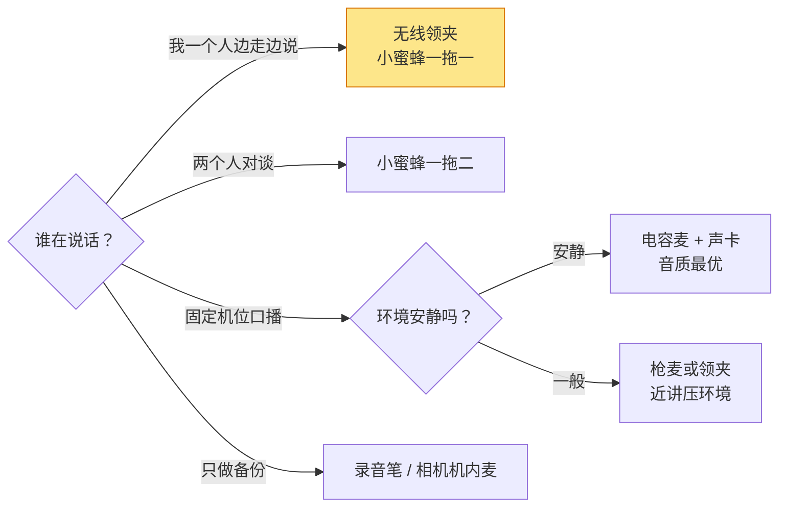
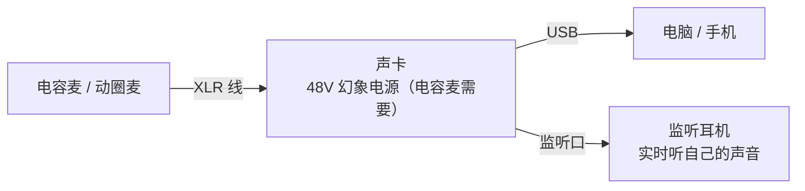
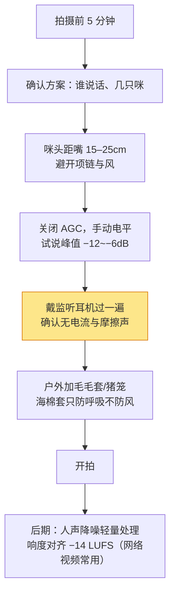

# 麦克风与收音设备

> 本文为「设备」栏目的**型号层参考**：覆盖五种主流收音方案的选型、决定音质的量化指标、场景配置矩阵与连接避坑。声音设计的整体方法论（层次、混音、情绪）见[影视制作 · 声音设计](/contents/摄像/影视制作/声音设计.md)。价格随行情波动，信息核对时点：2026-08。

观众可以原谅轻微的画质妥协，但**听不清人声会立刻划走**。收音设备的选购逻辑和相机完全不同：它不追求"越贵越好"，而是**先选对类型，类型错了再贵也救不回来**。

| 决策层级 | 回答什么问题 |
| --- | --- |
| 方案类型 | 枪麦？领夹？无线小蜜蜂还是电容麦？ |
| 量化指标 | 指向性、信噪比、自噪声够不够用？ |
| 连接方式 | 接相机、接手机还是接电脑？TRS 还是 TRRS？ |
| 场景矩阵 | 我的拍摄场景对应哪套组合？ |

> 一句话：**先定"谁在哪儿说话"，再挑设备——室内口播、街拍 Vlog 和直播带货的最优解完全不同。**

## 方案与音质基础

| 方案 | 工作方式 | 强项 | 弱项 | 价位段（可用级起） |
| --- | --- | --- | --- | --- |
| 枪式麦克风 | 机顶指向性拾音 | 方向性强、即装即用 | 户外怕风、离嘴远 | 400–2000 元 |
| 有线领夹麦 | 小咪头夹衣领、线连设备 | 稳定零延迟、便宜 | 有线穿帮、束缚动作 | 100–500 元 |
| 无线小蜜蜂 | 发射器+接收器无线传输 | 行动自由、双人对谈 | 需充电、有断频风险 | 600–2500 元（一拖二） |
| 电容/动圈话筒 | 室内固定接声卡或电脑 | 音质天花板、可控 | 只适合安静室内、笨重 | 300–3000 元 |
| 录音笔 / 机内麦 | 独立记录或直接机内收 | 备份、极简 | 音质与操控上限低 | 0–1000 元 |

##### 指向性：麦克风"看"向哪里

| 指向图形 | 拾音范围 | 适用 |
| --- | --- | --- |
| 全向 | 360° 均匀 | 领夹咪贴身使用（距离近，不怕环境声） |
| 心形 | 正前方 120° 左右 | 口播、直播的默认选择 |
| 超心 / 枪式 | 更窄的正前方 | 远距离定向拾音、户外采访 |

##### 信噪比与自噪声：底噪从哪来

- **自噪声（自噪音）**：麦克风自身电路产生的底噪，单位 dBA，**越小越好**；14 dBA 以下属优秀档，20 dBA 以上在安静场景能听到"沙沙"声。
- **信噪比（SNR）**：信号与噪声的比值，单位 dB，**越大越好**；74 dB 以上优秀，64 dB 及格。
- 经验法则：**室内安静口播看自噪声，户外嘈杂环境看指向性和近讲距离**——嘈杂环境里"把咪头凑近"永远比换贵麦克风有效。

##### 增益与电平：录多大声音

| 要点 | 数值参考 |
| --- | --- |
| 录制电平峰值 | 保持在 **−12dB 至 −6dB** 之间，留足动态余量防爆音 |
| 增益设置顺序 | 先定人与咪的距离（15–25cm），再调增益，不要靠增益硬拉远距离 |
| 监听 | **必须戴监听耳机录制**，耳机里没听到的杂音后期都在 |
| 采样规格基线 | 视频 48kHz / 24bit；低于此规格后期处理空间骤减 |

> 提示：**自动增益（AGC）是双刃剑**——环境突然安静时它会疯狂拉高底噪。相机菜单里能关就关，改用手动电平。

## 场景与型号

| 场景 | 推荐方案 | 代表方向 | 预算参考 |
| --- | --- | --- | --- |
| 街拍 Vlog 单人 | 一拖一无线领夹 | DJI Mic Mini / 猛犸 Lark M2 档 | 600–1200 元 |
| 双人对谈 / 访谈 | 一拖二无线领夹 | DJI Mic 2 / Rode Wireless GO III 档 | 1500–2500 元 |
| 室内口播 / 旁白配音 | 心形电容麦 + 声卡 | USB 电容麦入门，XLR+声卡进阶 | 300–2000 元 |
| 直播带货 / 秀场 | 动圈麦或心形电容 + 声卡 + 监听 | SM7B 类动圈（吵闹环境）/ USB 电容（安静房间） | 700–3000 元 |
| 运动跟拍 / 综艺感 | 枪麦 + 无线领夹双保险 | VideoMicro 类枪麦 + 小蜜蜂 | 1000–2000 元 |
| 会议 / 课程记录 | 全向会议咪或录音笔 | — | 200–800 元 |

| 会议 / 课程记录 | 全向会议咪或录音笔 | — | 200–800 元 |

##### 预算递进路线（总投入参考）

| 阶段 | 总预算 | 配置思路 |
| --- | --- | --- |
| 起步 | 500–800 元 | 有线领夹麦 + 毛毛套 + 监听耳机；先解决"听得清" |
| 进阶 | 1500–2500 元 | 一拖一/一拖二无线麦（带内置备份录音）+ 枪麦一支；覆盖 Vlog 与访谈 |
| 成熟 | 3000 元+ | 无线双通道 + USB/XLR 电容麦与声卡分工：外出一套、室内一套 |

> 一句话：**收音设备的升级路径是"先无线、后电容"——户外与走动场景的收益远大于室内堆料。**

按"混合模式"给出各方案的市场代表（在售情况随时变动，下单前核对）：

| 类型 | 代表 | 大致价位 | 一句话画像 |
| --- | --- | --- | --- |
| 枪麦 | Rode VideoMicro II | ~500 元 | 无需供电、超轻，相机 Vlog 标配起点 |
| 枪麦进阶 | Rode VideoMic Pro+ / 索尼 ECM-B10 | 1500–2200 元 | 可换电池、更精细的电平控制或波束成形 |
| 无线一拖二 | DJI Mic 2 | ~2300 元 | 内置录音备份、32bit 浮点，防削顶神器 |
| 无线轻量 | DJI Mic Mini / 猛犸 Lark M2 | 400–900 元 | 体积小到忽略不计，手机相机通吃 |
| USB 电容 | 罗德 NT-USB Mini / Blue Yeti 类 | 400–900 元 | 即插即用，口播起步 |
| XLR 动圈 | Shure MV7X / SM7B 类 | 1300–3000 元 | 直播间标准答案，吃声卡增益 |
| 录音备份 | 索尼 / 飞利浦录音笔中端款 | 500–1000 元 | 双机录音保险，剪辑时对齐即可 |

> 提示：**32bit 浮点录音是近年最实用的技术升级**——增益设错也不削顶，对新手容错极高；买无线麦时优先考虑带此特性的型号。

##### 直播链路的完整接法

直播与录播的差别在于**链路要长期稳定运行**，典型接法：

要点只有三个：**电容麦记得开 48V 幻象电源**（动圈麦不要开）；**用声卡的直通监听而不是软件延迟监听**（软件监听有百毫秒级延迟，会让你"说不出口"）；增益宁低勿高，直播平台普遍再做一次自动压缩。

## 实战与避坑

正式项目（访谈、口播成片）的标准做法是**双轨录音**：

| 层 | 设备 | 作用 |
| --- | --- | --- |
| 主轨 | 无线领夹 / 电容麦进录音设备 | 质量最好的一版声音 |
| 备份轨 | 相机机内麦 / 录音笔放桌上 | 防止主轨翻车（断频、没电、忘开） |

对齐方式从简到繁：**拍手两下**（波形上找尖峰，免费可靠）→ **打板器**（多人协作规范流程）→ **时码器**（多机位专业现场，单人不必要）。剪辑时以备份轨为基准铺时间线，再把主轨对齐替换即可。

> 一句话：**备份轨的成本几乎为零，但它救过每一个老手的命——养成"开机先录一段环境音 + 拍手"的肌肉记忆。**

| 坑 | 说明 | 解法 |
| --- | --- | --- |
| TRS / TRRS 混插 | 相机口是 TRS（三节），手机口是 TRRS（四节），直插要么无声要么单声道 | 认准包装标注"camera/phone"双模式，或备转接线 |
| 手机没有 3.5mm 口 | 新手机普遍取消耳机孔 | 选 Type-C 直连型号或官方转接头 |
| 相机供电问题 | 部分枪麦需相机提供插件供电（Plug-in power） | 确认机身 MIC 口支持；不支持则选自供电型号 |
| 数字热靴混淆 | 索尼 MI 热靴数字麦不能插普通热靴 | 认准协议匹配，通用热靴走 3.5mm 线材 |
| 电平不匹配 | 专业线路电平（Line/Mic）接错导致极小声或爆音 | 接口旁标注看清 Mic / Line，声卡切对挡位 |

> 一句话：**收音质量的排序是"咪的位置 > 环境 > 设备档次"——前两者免费，最后一样才花钱。**

## 自查与误区

- [ ] 我按场景选对了方案类型（而不是按价格）？
- [ ] 咪头到嘴的距离稳定在 15–25cm？
- [ ] AGC 已关、手动电平试录过峰值？
- [ ] 戴监听耳机完整听过一段试录？
- [ ] 户外拍摄备了毛毛套或猪笼？
- [ ] 接口类型（TRS/TRRS/Type-C/MI 热靴）与设备逐一对应？
- [ ] 无线麦充满电、频段干净、有内置备份录音？
- [ ] 重要项目做了双机录音（机内 + 领夹/录音笔）？
- [ ] 后期流程里有响度归一这一步？

- **"贵的麦克风 = 好的声音"** —— 不合适的类型（如嘈杂街头用大振膜电容）再贵也输给一支贴近嘴边的百元领夹。
- **"后期可以把音频修好"** —— 降噪能救底噪，救不了削顶破音与远距混响；前期电平才是根本。
- **"海棉套能防风"** —— 海棉只挡呼吸声，真正的户外防风靠毛毛套（Deadcat）或猪笼。
- **"无线麦永远比有线好"** —— 无线引入电池管理与断频风险；固定机位下，一根有线领夹反而更稳更便宜。
- **"机内麦只是应急"** —— 它同时是最好的"备份轨"；专业做法是机内照录，后期以外部音轨为主、机内轨对齐兜底。

> **延伸**
> - 从素材到成片的声音设计方法：[影视制作 · 声音设计](/contents/摄像/影视制作/声音设计.md)
> - 无人机航拍的收音与降噪思路：[无人机与稳定器](无人机与稳定器.md)
> - 拍摄环节的整体流程：[影视制作 · 拍摄](/contents/摄像/影视制作/拍摄.md)
