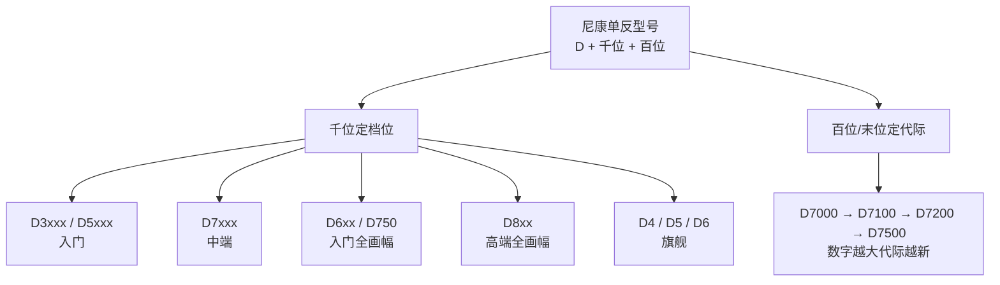
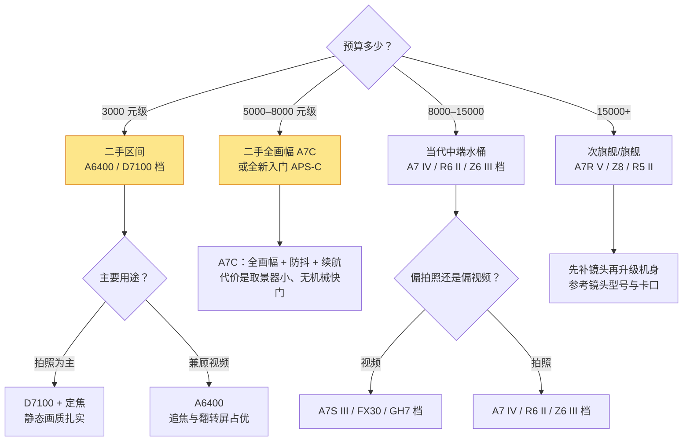

# 相机机身型号

> 本文为「设备」栏目的**型号层参考**：教你读懂各品牌机身的命名规则，从型号一眼判断画幅、定位与代际。曝光、画质等原理性内容不在本文展开，请配合[相机机身（原理篇）](../../../摄影/器材/相机机身.md)阅读。文中价格与在售情况随市场波动，信息核对时点：2026-08。

型号是厂商写给用户的"身份证"。不会读型号的人挑相机靠口碑和带货话术；会读型号的人扫一眼就知道这台机器是什么画幅、哪一档、哪一年——**读型号是最便宜的选购知识**。

| 你想判断什么 | 看型号哪里 | 例子 |
| --- | --- | --- |
| 画幅 | 系列/字辈 | A6400 = APS-C；A7C = 全画幅 |
| 产品定位 | 字母后缀 | A7R 高像素、A7S 视频、A7C 紧凑 |
| 新旧程度 | 代际数字 | Mark IV > Mark III；D7100 < D7200 |
| 价格档位 | 定位 × 代际 | 旗舰上一代 ≈ 当代中端价 |

> 一句话：**先读系列定画幅，再看字母定用途，最后看数字定新旧。**

## 索尼：后缀即产品线

索尼是目前命名体系最"自解释"的品牌，全画幅 α7 系用字母区分产品方向：

| 系列 | 后缀含义 | 定位 | 代表型号（代际） |
| --- | --- | --- | --- |
| α7（基础款） | 无后缀 = 均衡水桶 | 全画幅基准线 | A7 III → A7 IV → A7 V |
| α7R | R = Resolution | 高像素画质向 | A7R IV / A7R V（6100 万） |
| α7S | S = Sensitivity | 视频与高感向（低像素） | A7S III |
| α7C | C = Compact | 紧凑轻量全画幅 | A7C → A7C II（3300 万）/ A7CR（高像素变体） |
| α9 | 速度旗舰 | 体育野生 | A9 III（全局快门） |
| α1 | 全能旗舰 | 顶配水桶 | A1 / A1 II |

APS-C 则是 α6000 系数字编号：**数字越大定位越高、越新**——A6100 入门、A6400 中端、A6600 曾是旗舰（带机身防抖与大电池）、A6700 为现役（AI 对焦芯片、10bit 视频）。另有 ZV 系专攻 Vlog（ZV-E10 / ZV-E10 II）。电影线为 FX 系（FX30 / FX3）。

> 提示：**A6400 比 A6100 发布更早却定位更高**，APS-C 这条线的"数字大小 = 定位高低"依然成立，但"数字大小 = 年份新旧"不完全成立，购买前查一下发布年份。

## 佳能：数字越小越高端

佳能 RF 系统的命名逻辑和索尼相反——**全画幅里数字越小越专业**：

| 型号 | 画幅 | 定位 |
| --- | --- | --- |
| EOS R1 | 全画幅 | 旗舰（体育/新闻） |
| EOS R3 / R5 / R5 II | 全画幅 | 专业速度 / 4500 万高像素水桶 |
| EOS R6 Mark II | 全画幅 | 中端水桶主力 |
| EOS R8 / RP | 全画幅 | 轻量入门（R8 无机身防抖） |
| EOS R7 / R10 / R50 / R100 | APS-C | 由高到低 |

规律：**一位数 = 全画幅，数字越小越高端；两位数 = APS-C，数字越大越入门**。代际用 Mark II 表示。注意旧的 EOS M 卡口已停止发展，二手 M 系便宜但别当长期系统买入。

## 尼康：Z 系与 D 系命名

微单 Z 系回归了"数字越大越入门"的传统：

| 型号 | 画幅 | 定位 |
| --- | --- | --- |
| Z9 / Z8 | 全画幅 | 旗舰 / 次旗舰（Z8 ≈ 缩小版 Z9） |
| Z6 III / Z6 II | 全画幅 | 视频混合主力线 |
| Z7 II | 全画幅 | 高像素线 |
| Z5 II / Z5 / Zf | 全画幅 | 入门 / 复古全画幅 |
| Z50 II / Z30 / Zfc | APS-C | 由全到底，Z30 无取景器偏 Vlog |

单反则是另一套"D + 四位数"逻辑，理解它对捡二手很有用：

所以 **D7100 = 中端档位（7 千位）+ 第三代（1）**，它的继任者是 D7200、D7500。这套逻辑同样适用于 D3500（入门）、D850（高端全画幅）、D500（APS-C 专业旗舰，特例命名）。

## 富士：系列字母看形态

富士没有统一的"后缀语义表"，更像**每个字母开头是一条独立产品线**：

| 系列 | 形态与定位 | 现役例子 |
| --- | --- | --- |
| X-H | 性能与视频旗舰 | X-H2S（堆栈式速度机）/ X-H2（4000 万高像素） |
| X-T | 传统转盘经典造型，中坚 | X-T50 / X-T5 |
| X-S | 轻量混合入门 | X-S20 |
| X-E / X-Pro | 旁轴造型 | X-E4 / X-Pro3 |
| X-M | 入门 Vlog 化 | X-M5 |
| X100 | 固定镜头便携（不可换镜头） | X100VI |
| GFX | 中画幅 | GFX100 II |

规律：**同一系列内数字越大越新**（X-T30 → X-T50 是换代跳号，不必纠结缺号）；X-H 与 X-T 是两条并行的高端线，前者偏视频性能、后者偏摄影操控。

> 提示：松下（Lumix S 全画幅 / GH 视频旗舰）与奥之心（OM 系，M4/3）体量较小，记住"S = 全画幅，GH = 视频，OM = 便携防抖"即可覆盖大多数场景。

## 后缀与代际速查

各家通用的"小尾巴"汇总成一张表，遇到陌生型号直接对照：

| 后缀 | 含义 | 出现在 |
| --- | --- | --- |
| Mark II / II / III / IV | 第几代 | 佳能、索尼、尼康 |
| R | 高像素 Resolution | 索尼 A7R、A7CR |
| S | 高感视频 Sensitivity / S-Line 高端镜头 | 索尼 A7S、尼康 Z S-Line |
| C | 紧凑 Compact | 索尼 A7C |
| CR | 紧凑 + 高像素 | 索尼 A7CR |
| f / fc | 复古造型 | 尼康 Zf / Zfc |
| V | Vlog 向 | 索尼 ZV 系 |
| H | 高性能 High performance | 富士 X-H |
| L / Kit / 套机 | 附带镜头销售 | 各家套装命名 |

> 一句话：**代际数字管"新旧"，字母后缀管"分工"，两者组合起来才是完整的型号语义。**

## 画幅与核心参数速查

画幅如何影响画质、等效焦距怎么换算、像素与连拍的取舍——这些原理性内容已在[相机机身（原理篇）](../../../摄影/器材/相机机身.md)讲透，此处只留一张最小速查表供读型号时对照：

| 画幅 | 常见所在系列 | 等效系数 |
| --- | --- | --- |
| 全画幅 | 索尼 α7/α9/α1、佳能 R 一位数、尼康 Z5–Z9、富士 GFX 更大 | ×1.0 |
| APS-C | 索尼 α6xxx/ZV、佳能 R7/R10/R50/R100、尼康 Z30/Z50/Zfc、富士 X 系 | 约 ×1.5（佳能 ×1.6） |
| M4/3 | 松下 GH/G、奥之心 OM | ×2.0 |

## 按用途对号入座：典型画像

读懂型号之后，反过来"从需求找型号"就简单了：

| 你的画像 | 型号特征 | 典型例子 |
| --- | --- | --- |
| Vlog / 单人创作 | 翻转屏 + 快速眼部追焦 + 轻便 | A6400、ZV-E10 II、Z30 |
| 视频生产力 | 10bit + Log + 4K60 + 散热 | A6700、A7S III、X-H2S |
| 摄影进阶（人像/风光） | 高像素或高感全画幅 | A7R 系、R6 II、Z6 III |
| 便携全画幅扫街 | C 系紧凑机身 | A7C / A7C II、R8 |
| 极致性价比捡漏 | 上代中端 / 老旗舰 | A7 III、D7100、A6400 二手 |

其中 A6400、A7C、D7100 三台正是本站[单品档案](../README.md)首批收录机型，各自的详细表现、优缺点与验机要点见对应档案页。

## 选型决策流程

> 一句话：**决策顺序永远是"系统（卡口）→ 用途 → 预算"，型号只是在最后一公里帮你锁定具体那台。**

## 当前行情下的预算落位

原理篇讲的是分层思路，这里给出**具体机型的落位参考**（行情随时波动，核对时点 2026-08；详细依据见单品档案）：

| 预算（仅机身） | 全新思路 | 二手思路 | 备注 |
| --- | --- | --- | --- |
| 1000–2000 元 | 不建议全新 | D7100（约 1k–2k，视快门数） | 单反存量镜头极便宜，适合纯拍照练手 |
| 2800–4000 元 | 大底固定镜头卡片 | A6400（约 2.8k–3.5k） | 追焦至今能打，视频够用但只有 8bit |
| 4500–7000 元 | A7C 全新国补价已探至 6k 出头 | A7C 二手约 4.5k–5.5k | 新旧差价缩小后，二手优势在缩小 |
| 9000–13000 元 | A7C II / A6700 / Z6 III 档 | 上代旗舰（A7R III/A9） | 加钱买当代对焦与 10bit |

> 提示：**当"全新国补价 − 二手价"小于 1500 元时，通常直接买新的更划算**——省去验机成本还带保修。这条经验适用于所有品牌。

## 自查清单

- [ ] 我能说出候选型号的画幅、定位、代际吗？
- [ ] 我确定它的卡口有我想要的镜头群（含副厂）吗？
- [ ] 我的用途（照片/视频/Vlog）与该型号的产品方向一致吗？
- [ ] 视频 8bit 还是 10bit？有没有 Log？我需要调色空间吗？
- [ ] 有无机身防抖？我的镜头群能否补上？
- [ ] 电池续航是否支撑我的单日拍摄量？备电多少钱？
- [ ] 若买二手：快门数、外观成色、功能项都验过吗？（对照单品档案验机节）
- [ ] 全新促销价与二手价的差值是否小于 1500 元？
- [ ] 镜头预算是否已经预留至少一半？

## 常见误区

- **"数字越大越高级"** —— 只在同系列内成立；佳能 RF 恰恰相反（R1 > R8），跨系列比较毫无意义。
- **"上一代旗舰吊打当代中端"** —— 对焦算法与视频规格迭代很快，老旗舰输在追焦与编码，不只是"少几个功能"。
- **"型号新 = 适合我"** —— A7S 系列代际再新也是低像素视频特化机，拿去拍风光是方向性错误。
- **"套机标识（L/Kit）是不同机型"** —— 只是包装内容不同，机身一致；但套头价值低，预算应尽量买单机身 + 好镜头。
- **"停产 = 没价值"** —— 单反线停产后 D7100 这类机型二手价触底，反而是低成本练习期的好选择，前提是接受视频短板。

> **延伸**
> - 曝光、画幅与机身参数背后的原理：[相机机身（原理篇）](../../../摄影/器材/相机机身.md)
> - 镜头的命名与卡口体系：[镜头型号与卡口](镜头型号与卡口.md)
> - 本文提到的三台机器的深度档案：[索尼 A6400](../单品档案/SONY-A6400.md) / [索尼 A7C](../单品档案/SONY-A7C.md) / [尼康 D7100](../单品档案/NIKON-D7100.md)
> - 存储卡、电池等配件怎么配：[附件（原理与选购）](../../../摄影/器材/附件.md)
